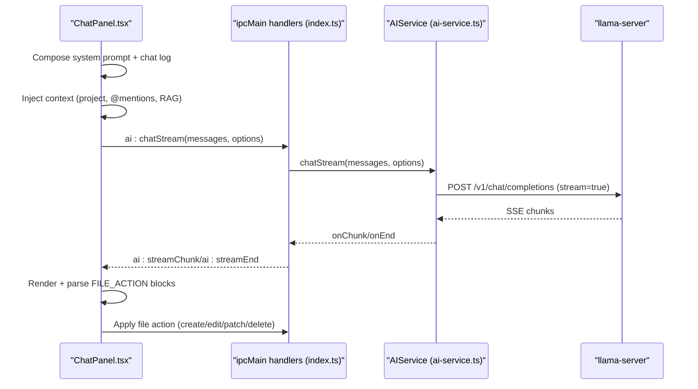
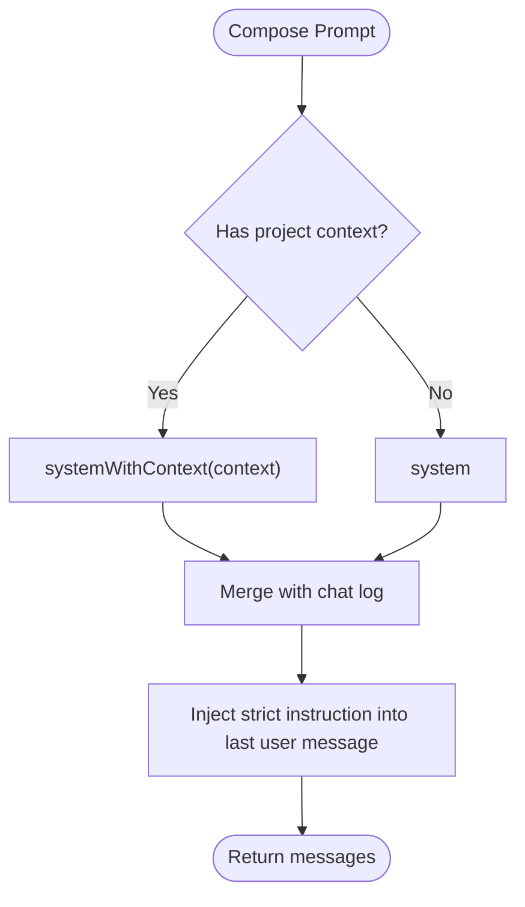
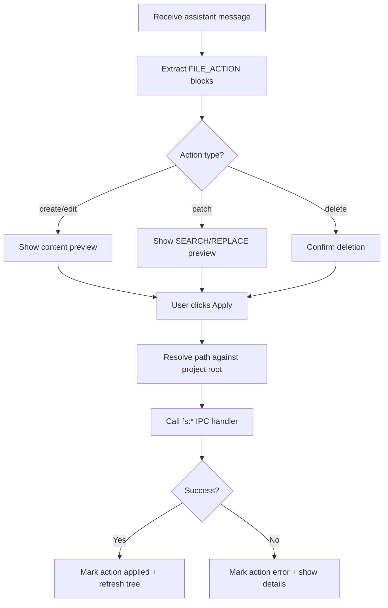
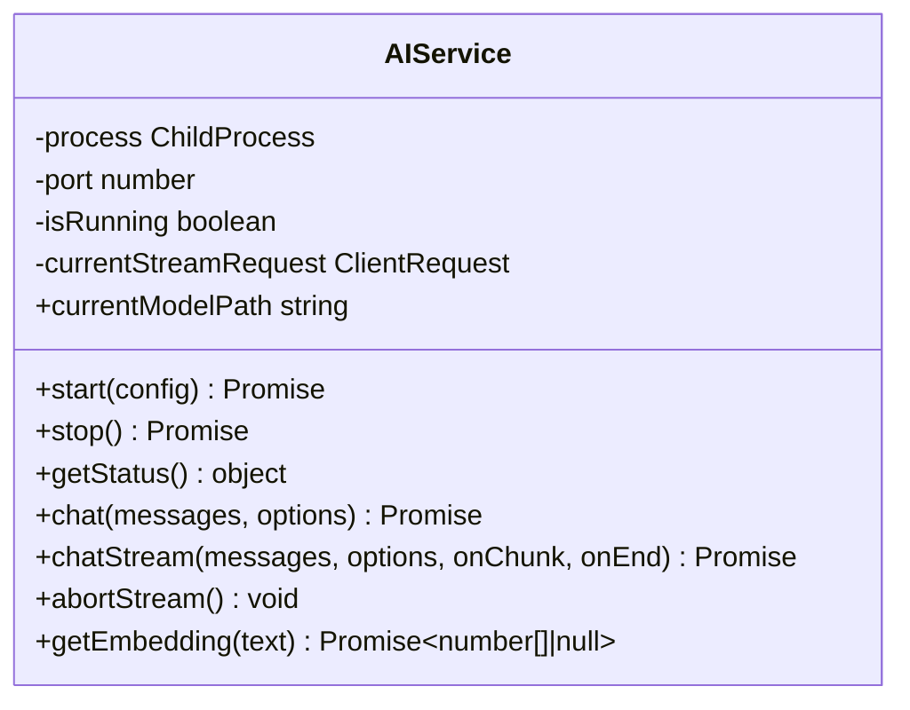
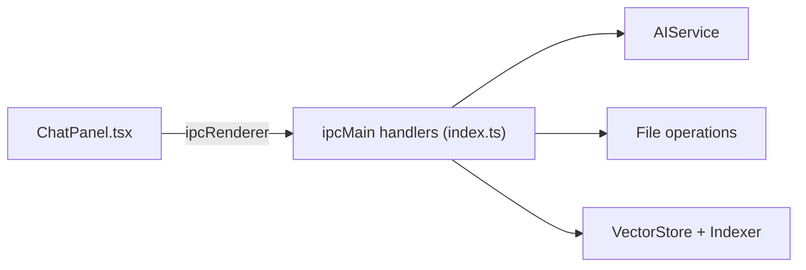
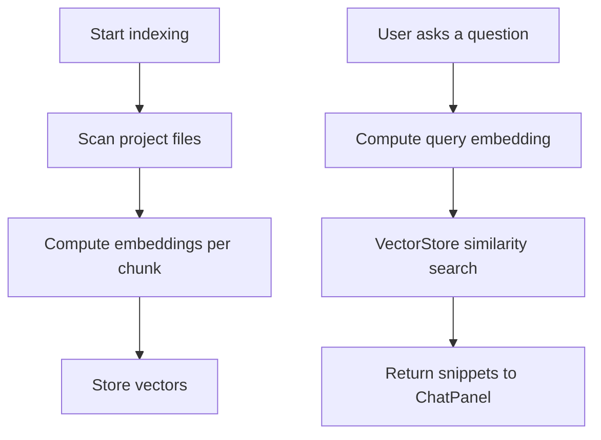
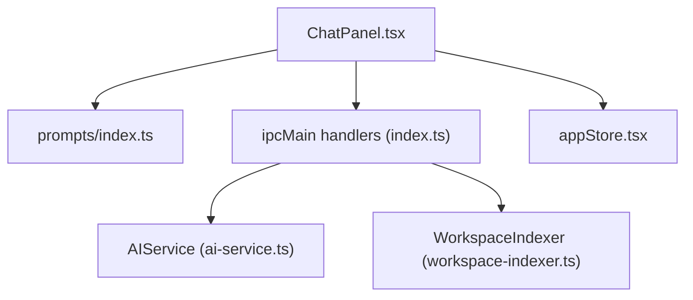

# AI Agent System

<cite>
**Referenced Files in This Document**
- [README.md](file://README.md)
- [src/main/ai-service.ts](file://src/main/ai-service.ts)
- [src/main/index.ts](file://src/main/index.ts)
- [src/renderer/prompts/index.ts](file://src/renderer/prompts/index.ts)
- [src/renderer/components/ChatPanel.tsx](file://src/renderer/components/ChatPanel.tsx)
- [src/renderer/store/appStore.tsx](file://src/renderer/store/appStore.tsx)
- [src/main/rag/workspace-indexer.ts](file://src/main/rag/workspace-indexer.ts)
</cite>

## Table of Contents
1. [Introduction](#introduction)
2. [Project Structure](#project-structure)
3. [Core Components](#core-components)
4. [Architecture Overview](#architecture-overview)
5. [Detailed Component Analysis](#detailed-component-analysis)
6. [Dependency Analysis](#dependency-analysis)
7. [Performance Considerations](#performance-considerations)
8. [Troubleshooting Guide](#troubleshooting-guide)
9. [Conclusion](#conclusion)
10. [Appendices](#appendices)

## Introduction
This document explains BitNet IDE’s AI agent system and automated code assistance capabilities. It focuses on how the system orchestrates AI interactions, parses structured file operations, and safely applies changes to your project. It also documents the prompt engineering approach, the agent execution workflow, and how to extend the system with new capabilities.

BitNet IDE runs a local AI server and exposes a secure IPC surface to the renderer. The AI assistant can explain, refactor, and generate code, and can propose automated file edits using a strict, parseable format. The system emphasizes privacy and safety by keeping all processing local and requiring explicit, structured actions for file modifications.

## Project Structure
The AI agent system spans the main process (Electron), the renderer (React), and shared prompt templates. The main process manages the AI server lifecycle and IPC handlers. The renderer composes prompts, streams responses, parses structured file actions, and applies safe changes to the project.

```mermaid
graph TB
subgraph "Main Process"
A["src/main/index.ts<br/>IPC handlers"]
B["src/main/ai-service.ts<br/>llama-server client"]
C["src/main/rag/workspace-indexer.ts<br/>codebase indexing"]
end
subgraph "Renderer"
D["src/renderer/components/ChatPanel.tsx<br/>UI + streaming + parsing"]
E["src/renderer/prompts/index.ts<br/>prompt templates"]
F["src/renderer/store/appStore.tsx<br/>state"]
end
A <- --> B
A <- --> C
D --> A
D --> E
D --> F
```

**Diagram sources**
- [src/main/index.ts](file://src/main/index.ts#L116-L519)
- [src/main/ai-service.ts](file://src/main/ai-service.ts#L12-L323)
- [src/main/rag/workspace-indexer.ts](file://src/main/rag/workspace-indexer.ts#L1-L35)
- [src/renderer/components/ChatPanel.tsx](file://src/renderer/components/ChatPanel.tsx#L1-L120)
- [src/renderer/prompts/index.ts](file://src/renderer/prompts/index.ts#L1-L106)
- [src/renderer/store/appStore.tsx](file://src/renderer/store/appStore.tsx#L1-L120)

**Section sources**
- [README.md](file://README.md#L59-L87)
- [src/main/index.ts](file://src/main/index.ts#L116-L519)
- [src/renderer/components/ChatPanel.tsx](file://src/renderer/components/ChatPanel.tsx#L1-L120)

## Core Components
- AI service: Manages the llama-server subprocess, health checks, chat completions (streaming and non-streaming), and embeddings.
- IPC layer: Exposes AI operations and file system actions to the renderer.
- Prompt templates: Define system instructions and reusable user prompts for explain/refactor/generate/edit/analyze.
- Chat panel: Streams AI responses, injects context (project, mentions, RAG), parses structured file actions, and applies safe changes.
- State management: Centralized app state for UI, settings, and chat history.

**Section sources**
- [src/main/ai-service.ts](file://src/main/ai-service.ts#L12-L323)
- [src/main/index.ts](file://src/main/index.ts#L273-L323)
- [src/renderer/prompts/index.ts](file://src/renderer/prompts/index.ts#L1-L106)
- [src/renderer/components/ChatPanel.tsx](file://src/renderer/components/ChatPanel.tsx#L196-L295)
- [src/renderer/store/appStore.tsx](file://src/renderer/store/appStore.tsx#L52-L89)

## Architecture Overview
The AI agent system follows a clear pipeline:
- Renderer composes a system prompt and chat log.
- Optional context augmentation: project path, mentioned files, and RAG snippets.
- Renderer sends a streaming chat request to the main process.
- Main process forwards the request to the local AI server and streams tokens back to the renderer.
- Renderer renders the assistant’s message, extracts structured file actions, and offers safe application.



**Diagram sources**
- [src/renderer/components/ChatPanel.tsx](file://src/renderer/components/ChatPanel.tsx#L196-L295)
- [src/main/index.ts](file://src/main/index.ts#L304-L323)
- [src/main/ai-service.ts](file://src/main/ai-service.ts#L240-L321)

## Detailed Component Analysis

### Prompt Engineering and Templates
The prompt module defines:
- System instructions for local-only, precise, and safe behavior.
- Context-aware system instructions that include project context.
- Task-specific prompts for explain, refactor, generate, edit, and project analysis.

Key behaviors:
- Strict file operation format using FILE_ACTION blocks.
- Guidance to prefer small, incremental changes and avoid cloud services.
- Injection of project context and RAG snippets into the system prompt.



**Diagram sources**
- [src/renderer/prompts/index.ts](file://src/renderer/prompts/index.ts#L17-L102)
- [src/renderer/components/ChatPanel.tsx](file://src/renderer/components/ChatPanel.tsx#L265-L279)

**Section sources**
- [src/renderer/prompts/index.ts](file://src/renderer/prompts/index.ts#L1-L106)
- [src/renderer/components/ChatPanel.tsx](file://src/renderer/components/ChatPanel.tsx#L265-L279)

### Agent Execution Workflow and Structured Actions
The renderer:
- Builds a chat log and optional context.
- Sends a streaming chat request.
- Renders assistant responses and parses FILE_ACTION blocks.
- Presents file action cards with previews and allows applying or rejecting changes.

Supported actions:
- Create/Edit: Full rewrite of a file.
- Patch: Precise text replacement using SEARCH/REPLACE blocks.
- Delete: Remove a file.

Safety mechanisms:
- Paths are resolved against the project root.
- Only absolute paths are accepted for file operations.
- Edits require exact SEARCH text to prevent accidental replacements.
- Users must explicitly approve each action.



**Diagram sources**
- [src/renderer/components/ChatPanel.tsx](file://src/renderer/components/ChatPanel.tsx#L524-L578)
- [src/renderer/components/ChatPanel.tsx](file://src/renderer/components/ChatPanel.tsx#L874-L911)

**Section sources**
- [src/renderer/components/ChatPanel.tsx](file://src/renderer/components/ChatPanel.tsx#L524-L578)
- [src/renderer/components/ChatPanel.tsx](file://src/renderer/components/ChatPanel.tsx#L874-L911)

### AI Service and Local Server Management
The AI service:
- Spawns the llama-server with configurable model, context size, threads, and port.
- Provides health checks, chat completions (streaming/non-streaming), and embeddings.
- Supports aborting long-running streams.



**Diagram sources**
- [src/main/ai-service.ts](file://src/main/ai-service.ts#L12-L323)

**Section sources**
- [src/main/ai-service.ts](file://src/main/ai-service.ts#L19-L89)
- [src/main/ai-service.ts](file://src/main/ai-service.ts#L117-L145)
- [src/main/ai-service.ts](file://src/main/ai-service.ts#L190-L238)
- [src/main/ai-service.ts](file://src/main/ai-service.ts#L240-L321)

### IPC Layer and Settings
The main process:
- Exposes AI lifecycle and chat operations.
- Provides file system operations (read, write, patch, create, delete, rename, search).
- Manages model downloads and binary downloads.
- Integrates RAG indexing and retrieval.



**Diagram sources**
- [src/main/index.ts](file://src/main/index.ts#L116-L519)

**Section sources**
- [src/main/index.ts](file://src/main/index.ts#L273-L323)
- [src/main/index.ts](file://src/main/index.ts#L144-L229)
- [src/main/index.ts](file://src/main/index.ts#L497-L518)

### RAG and Codebase Context
The system can index your workspace and retrieve relevant snippets to augment prompts:
- WorkspaceIndexer scans files and ignores common directories.
- Embeddings are computed via the AI service and used to search the vector store.



**Diagram sources**
- [src/main/rag/workspace-indexer.ts](file://src/main/rag/workspace-indexer.ts#L12-L35)
- [src/main/index.ts](file://src/main/index.ts#L501-L518)

**Section sources**
- [src/main/rag/workspace-indexer.ts](file://src/main/rag/workspace-indexer.ts#L12-L35)
- [src/main/index.ts](file://src/main/index.ts#L501-L518)

## Dependency Analysis
- Renderer depends on:
  - Prompt templates for system and task-specific prompts.
  - IPC handlers for AI chat, file operations, and RAG.
  - State management for UI and chat history.
- Main process depends on:
  - AIService for local AI inference.
  - File-service abstractions for filesystem operations.
  - RAG components for codebase indexing and retrieval.



**Diagram sources**
- [src/renderer/components/ChatPanel.tsx](file://src/renderer/components/ChatPanel.tsx#L1-L120)
- [src/renderer/prompts/index.ts](file://src/renderer/prompts/index.ts#L1-L106)
- [src/renderer/store/appStore.tsx](file://src/renderer/store/appStore.tsx#L1-L120)
- [src/main/index.ts](file://src/main/index.ts#L116-L519)
- [src/main/ai-service.ts](file://src/main/ai-service.ts#L12-L323)
- [src/main/rag/workspace-indexer.ts](file://src/main/rag/workspace-indexer.ts#L1-L35)

**Section sources**
- [src/renderer/components/ChatPanel.tsx](file://src/renderer/components/ChatPanel.tsx#L1-L120)
- [src/main/index.ts](file://src/main/index.ts#L116-L519)

## Performance Considerations
- Model and server configuration:
  - Context size affects memory usage and latency.
  - Threads impact throughput on multi-core systems.
  - Max tokens and temperature influence response length and creativity.
- Streaming:
  - Use streaming chat to reduce perceived latency and enable early cancellation.
- RAG:
  - Embedding computation and vector search add overhead; use judiciously.
- File operations:
  - Prefer patching over full edits for smaller diffs and faster writes.

[No sources needed since this section provides general guidance]

## Troubleshooting Guide
Common issues and remedies:
- AI server fails to start:
  - Verify binary and model paths in settings.
  - Check health endpoint and logs during startup.
- Streaming stops unexpectedly:
  - Use the stop button to cancel and retry.
  - Reduce max tokens or temperature to stabilize responses.
- File action not applied:
  - Ensure the path is absolute or resolves under the project root.
  - For patches, confirm the SEARCH text matches exactly (including whitespace).
- RAG retrieval fails:
  - Confirm embeddings are enabled and the vector store is populated.

**Section sources**
- [src/main/ai-service.ts](file://src/main/ai-service.ts#L19-L89)
- [src/main/ai-service.ts](file://src/main/ai-service.ts#L117-L145)
- [src/renderer/components/ChatPanel.tsx](file://src/renderer/components/ChatPanel.tsx#L524-L578)

## Conclusion
BitNet IDE’s AI agent system is designed for privacy, safety, and productivity. It combines strong prompt engineering, structured file actions, and local inference to deliver reliable automated assistance. By following the patterns documented here, you can extend the system with new capabilities, integrate external AI services (via compatible endpoints), and build robust agent-driven workflows.

[No sources needed since this section summarizes without analyzing specific files]

## Appendices

### How to Create Custom Agents and Skills
- Define a prompt template in the prompt module for your scenario.
- Extend the renderer to:
  - Compose a system prompt augmented with context (project path, @mentions, RAG).
  - Send a streaming chat request via IPC.
  - Parse and present structured file actions for approval.
- Add IPC handlers for any required backend operations (e.g., specialized code analysis).
- Enforce safety:
  - Always require explicit user approval for file actions.
  - Validate paths and use exact SEARCH text for patches.

[No sources needed since this section provides general guidance]

### Agent Configuration Options
- Model path, context size, max tokens, temperature, threads.
- Server binary path and port.
- Theme and UI preferences.

**Section sources**
- [src/main/index.ts](file://src/main/index.ts#L22-L52)
- [src/main/index.ts](file://src/main/index.ts#L273-L323)
- [src/renderer/components/SettingsPanel.tsx](file://src/renderer/components/SettingsPanel.tsx#L366-L426)