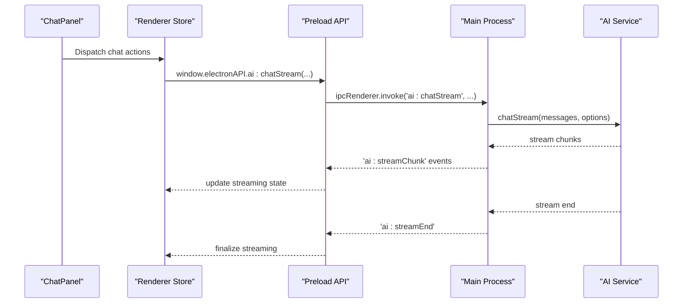
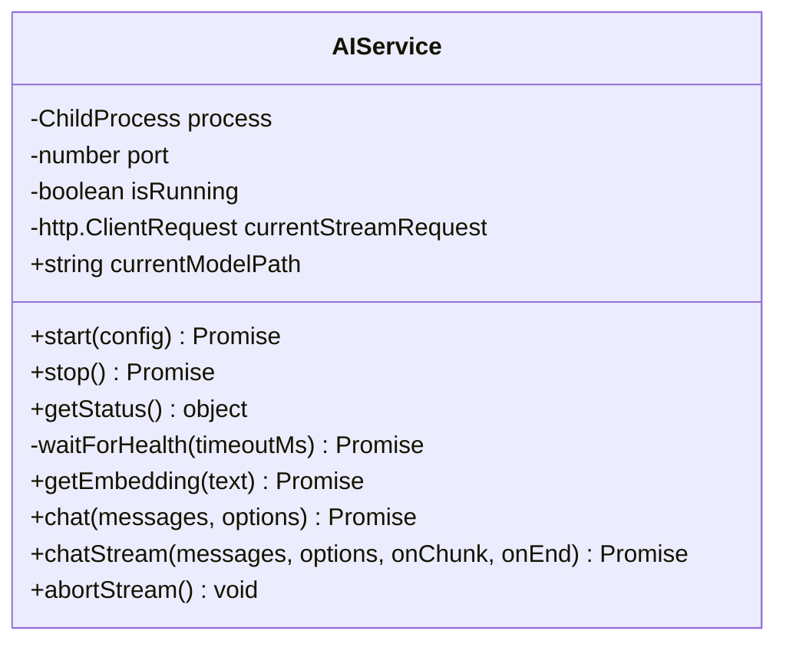
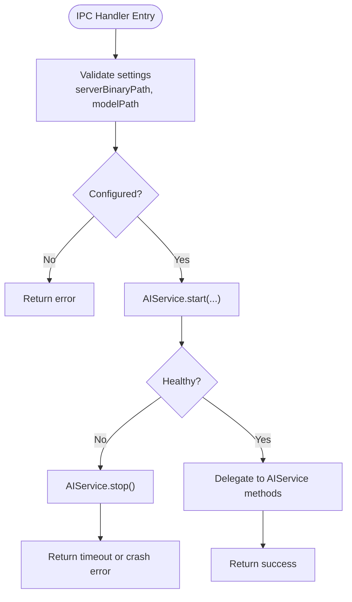
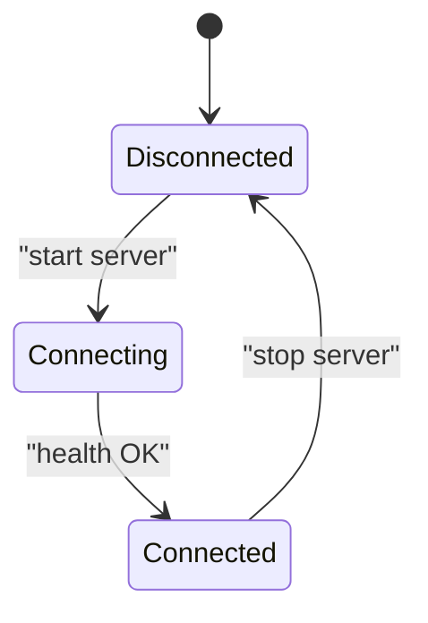
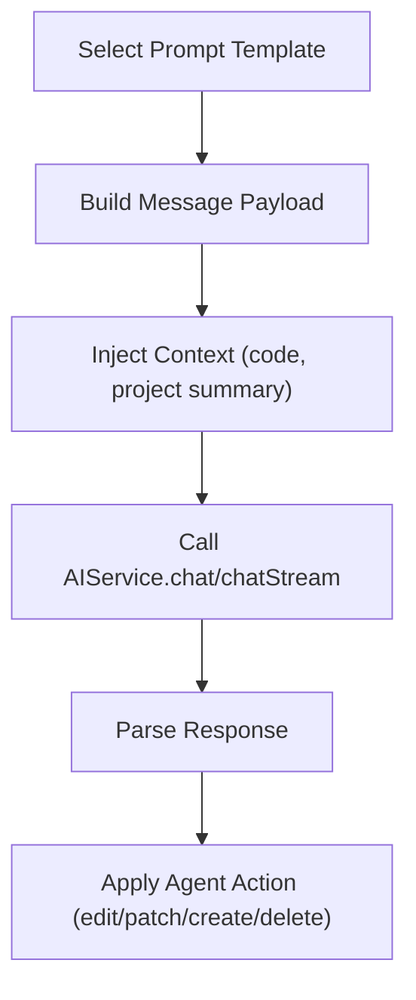
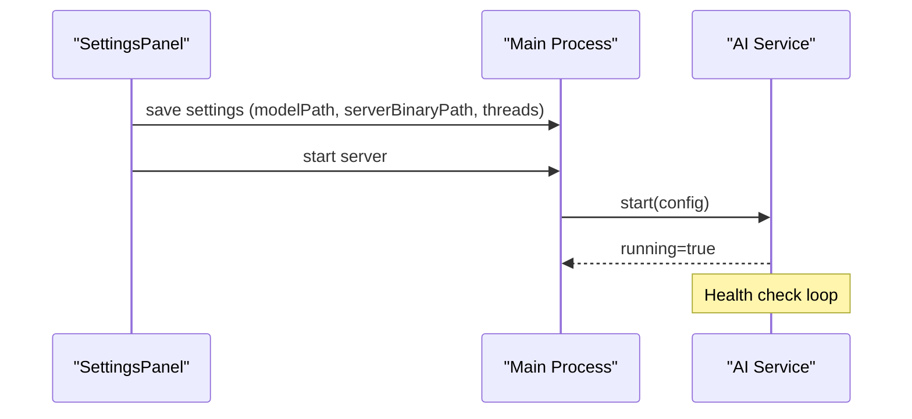
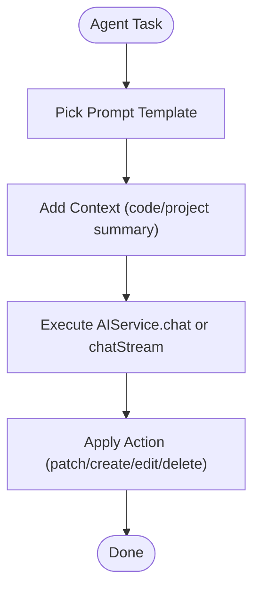

# Agent Definitions

<cite>
**Referenced Files in This Document**
- [index.ts](file://src/main/index.ts)
- [ai-service.ts](file://src/main/ai-service.ts)
- [index.ts](file://src/renderer/prompts/index.ts)
- [index.ts](file://src/preload/index.ts)
- [appStore.tsx](file://src/renderer/store/appStore.tsx)
- [ChatPanel.tsx](file://src/renderer/components/ChatPanel.tsx)
- [SettingsPanel.tsx](file://src/renderer/components/SettingsPanel.tsx)
</cite>

## Table of Contents
1. [Introduction](#introduction)
2. [Project Structure](#project-structure)
3. [Core Components](#core-components)
4. [Architecture Overview](#architecture-overview)
5. [Detailed Component Analysis](#detailed-component-analysis)
6. [Dependency Analysis](#dependency-analysis)
7. [Performance Considerations](#performance-considerations)
8. [Troubleshooting Guide](#troubleshooting-guide)
9. [Conclusion](#conclusion)
10. [Appendices](#appendices)

## Introduction
This document explains how AI agent definitions and configuration are structured in BitNet IDE. It focuses on the agent runtime model, configuration surface, and behavioral patterns implemented in the codebase. It also details how agents interact with the AI service, how prompts are organized, and how lifecycle, permissions, and execution contexts are managed. Guidance is provided for building custom agents tailored to specific coding workflows.

## Project Structure
BitNet IDE organizes agent-related concerns across three layers:
- Main process: AI server lifecycle, IPC handlers, and RAG orchestration
- Renderer: UI state, chat panel, settings, and prompt templates
- Preload: Exposed APIs bridged to the renderer

```mermaid
graph TB
subgraph "Main Process"
MAIN["src/main/index.ts"]
AISVC["src/main/ai-service.ts"]
end
subgraph "Preload"
PRELOAD["src/preload/index.ts"]
end
subgraph "Renderer"
STORE["src/renderer/store/appStore.tsx"]
CHAT["src/renderer/components/ChatPanel.tsx"]
SETTINGS["src/renderer/components/SettingsPanel.tsx"]
PROMPTS["src/renderer/prompts/index.ts"]
end
MAIN --> AISVC
MAIN <- --> PRELOAD
PRELOAD --> STORE
STORE --> CHAT
STORE --> SETTINGS
CHAT --> PROMPTS
```

**Diagram sources**
- [index.ts](file://src/main/index.ts#L116-L519)
- [ai-service.ts](file://src/main/ai-service.ts#L12-L323)
- [index.ts](file://src/preload/index.ts#L67-L119)
- [appStore.tsx](file://src/renderer/store/appStore.tsx#L1-L357)
- [ChatPanel.tsx](file://src/renderer/components/ChatPanel.tsx#L144-L223)
- [SettingsPanel.tsx](file://src/renderer/components/SettingsPanel.tsx#L189-L426)
- [index.ts](file://src/renderer/prompts/index.ts#L1-L106)

**Section sources**
- [index.ts](file://src/main/index.ts#L1-L542)
- [ai-service.ts](file://src/main/ai-service.ts#L1-L323)
- [index.ts](file://src/preload/index.ts#L67-L119)
- [appStore.tsx](file://src/renderer/store/appStore.tsx#L1-L357)
- [ChatPanel.tsx](file://src/renderer/components/ChatPanel.tsx#L144-L223)
- [SettingsPanel.tsx](file://src/renderer/components/SettingsPanel.tsx#L189-L426)
- [index.ts](file://src/renderer/prompts/index.ts#L1-L106)

## Core Components
- AI Service: Manages the local LLM server lifecycle, health checks, embeddings, and chat endpoints. It exposes synchronous and streaming chat APIs and supports cancellation.
- Main Process IPC: Exposes handlers for starting/stopping the server, chat, streaming, and RAG operations. It persists and retrieves user settings and orchestrates file operations.
- Renderer Store: Centralizes UI state for chat, settings, downloads, and editor context. It integrates with the AI service via preload APIs.
- Prompts: Provides a registry of prompt templates for common tasks such as explanation, refactoring, generation, editing, and project analysis. System-level prompts define agent behavior and file operation rules.
- Preload Bridge: Exposes typed APIs to the renderer for model downloads, terminal operations, RAG indexing, and AI interactions.

Key agent configuration surfaces:
- Settings: model path, server binary path, context size, max tokens, temperature, threads, and theme.
- Streaming vs non-streaming chat: configurable via handler options.
- Embeddings: used for RAG retrieval and codebase indexing.

**Section sources**
- [ai-service.ts](file://src/main/ai-service.ts#L12-L323)
- [index.ts](file://src/main/index.ts#L273-L323)
- [appStore.tsx](file://src/renderer/store/appStore.tsx#L35-L89)
- [index.ts](file://src/renderer/prompts/index.ts#L1-L106)
- [index.ts](file://src/preload/index.ts#L67-L119)

## Architecture Overview
The agent runtime is a thin orchestration layer over a local LLM server. Agents are conceptual roles that consume prompts and execute actions through the AI service and renderer store.



**Diagram sources**
- [ChatPanel.tsx](file://src/renderer/components/ChatPanel.tsx#L196-L223)
- [appStore.tsx](file://src/renderer/store/appStore.tsx#L248-L249)
- [index.ts](file://src/preload/index.ts#L67-L119)
- [index.ts](file://src/main/index.ts#L304-L323)
- [ai-service.ts](file://src/main/ai-service.ts#L240-L314)

## Detailed Component Analysis

### AI Service: Agent Runtime Engine
The AI Service encapsulates the LLM server lifecycle and inference APIs. It:
- Starts/stops the server with configured parameters (model, context size, threads, port).
- Performs health checks and graceful shutdown with SIGTERM/SIGKILL fallback.
- Provides synchronous chat completion and streaming chat completion.
- Supports embedding generation for RAG.
- Aborts long-running streams.



**Diagram sources**
- [ai-service.ts](file://src/main/ai-service.ts#L12-L323)

**Section sources**
- [ai-service.ts](file://src/main/ai-service.ts#L19-L89)
- [ai-service.ts](file://src/main/ai-service.ts#L117-L145)
- [ai-service.ts](file://src/main/ai-service.ts#L147-L188)
- [ai-service.ts](file://src/main/ai-service.ts#L190-L238)
- [ai-service.ts](file://src/main/ai-service.ts#L240-L321)

### Main Process: Agent Control Plane
The main process exposes IPC handlers that act as agent control plane:
- Server lifecycle: start/stop/getStatus
- Chat: sync and streaming variants
- RAG: index codebase, retrieve embeddings, progress callbacks
- File operations: read, write, patch, create, rename, delete
- Diagnostics and terminal operations



**Diagram sources**
- [index.ts](file://src/main/index.ts#L273-L286)
- [ai-service.ts](file://src/main/ai-service.ts#L19-L89)

**Section sources**
- [index.ts](file://src/main/index.ts#L273-L323)
- [index.ts](file://src/main/index.ts#L497-L518)

### Renderer Store: Agent State and Execution Context
The renderer store maintains:
- Chat messages and streaming state
- Selected code and file mentions for context
- Settings that influence agent behavior (max tokens, temperature, threads)
- Download and RAG progress



**Diagram sources**
- [appStore.tsx](file://src/renderer/store/appStore.tsx#L107-L107)
- [ai-service.ts](file://src/main/ai-service.ts#L113-L115)

**Section sources**
- [appStore.tsx](file://src/renderer/store/appStore.tsx#L52-L89)
- [appStore.tsx](file://src/renderer/store/appStore.tsx#L248-L249)

### Prompts: Agent Behavior Templates
Prompt templates define agent behavior and capabilities:
- explain: concise explanation of code
- refactor: minimal behavior-preserving refactors
- generate: requirement-to-code generation
- edit: apply instruction to code and return modified code
- analyzeProject: high-level project analysis
- system: strict rules for local file operations and behavior
- systemWithContext: same as system with injected project context

Agents can be seen as roles that select and compose these templates to achieve tasks.



**Diagram sources**
- [index.ts](file://src/renderer/prompts/index.ts#L1-L106)
- [ai-service.ts](file://src/main/ai-service.ts#L190-L238)

**Section sources**
- [index.ts](file://src/renderer/prompts/index.ts#L1-L106)

### Agent Lifecycle Management
- Initialization: load settings, start server if configured
- Running: maintain health, stream responses, persist messages
- Shutdown: stop server gracefully, cleanup streams



**Diagram sources**
- [SettingsPanel.tsx](file://src/renderer/components/SettingsPanel.tsx#L189-L426)
- [index.ts](file://src/main/index.ts#L273-L286)
- [ai-service.ts](file://src/main/ai-service.ts#L19-L89)

**Section sources**
- [SettingsPanel.tsx](file://src/renderer/components/SettingsPanel.tsx#L189-L426)
- [index.ts](file://src/main/index.ts#L273-L286)
- [ai-service.ts](file://src/main/ai-service.ts#L117-L145)

### Agent Execution Context and Permissions
- File operations: agents can create, edit, patch, and delete files using strict FILE_ACTION blocks. The system enforces absolute paths and exact SEARCH blocks for patching.
- Network: agents operate locally; no external network access is assumed.
- Permissions: agents act within the user’s project directory and file system.

These rules are encoded in the system prompt templates.

**Section sources**
- [index.ts](file://src/renderer/prompts/index.ts#L17-L55)
- [index.ts](file://src/renderer/prompts/index.ts#L57-L102)

### Agent Examples and Workflows
Below are conceptual agent configurations mapped to prompt templates and flows. These illustrate how agents are “defined” by selecting and composing prompts and execution options.

- Code Explanation Agent
  - Prompt: explain(code)
  - Options: moderate max tokens, balanced temperature
  - Flow: build message → send to AIService → render concise explanation

- Refactoring Agent
  - Prompt: refactor(code, instruction?)
  - Options: minimal changes, preserve behavior
  - Flow: inject code and instruction → stream response → apply patch

- Generation Agent
  - Prompt: generate(description)
  - Options: concise and precise output
  - Flow: build description → chat completion → insert generated code

- Editing Agent
  - Prompt: edit(code, instruction)
  - Options: return only modified code
  - Flow: inject code and instruction → stream response → replace selection

- Project Analysis Agent
  - Prompt: analyzeProject(summary)
  - Context: project metadata, dependencies, structure
  - Flow: summarize project → chat completion → present suggestions



**Diagram sources**
- [index.ts](file://src/renderer/prompts/index.ts#L1-L106)
- [ai-service.ts](file://src/main/ai-service.ts#L190-L238)

**Section sources**
- [index.ts](file://src/renderer/prompts/index.ts#L1-L106)
- [ai-service.ts](file://src/main/ai-service.ts#L190-L238)

### Agent Security Considerations
- Local-only execution: agents do not access the internet; all processing occurs locally.
- Strict file operation rules: FILE_ACTION blocks enforce safe, explicit edits with exact SEARCH blocks for patching.
- Absolute paths: all file operations use absolute paths to avoid ambiguity.
- No cloud services: system prompts explicitly forbid suggesting cloud services.

**Section sources**
- [index.ts](file://src/renderer/prompts/index.ts#L17-L55)
- [index.ts](file://src/renderer/prompts/index.ts#L57-L102)

### Agent Resource Limitations and Monitoring
- Context size: configured via settings; impacts memory and latency.
- Threads: CPU parallelism setting; affects throughput and responsiveness.
- Max tokens: limits output length to manage cost and latency.
- Temperature: controls randomness; lower values yield deterministic outputs.
- Streaming: reduces perceived latency and enables cancellation.

Renderer store tracks streaming state and progress for downloads and RAG indexing.

**Section sources**
- [index.ts](file://src/main/index.ts#L22-L35)
- [appStore.tsx](file://src/renderer/store/appStore.tsx#L62-L89)
- [SettingsPanel.tsx](file://src/renderer/components/SettingsPanel.tsx#L392-L399)

## Dependency Analysis
The agent runtime depends on:
- AIService for inference and embeddings
- Main process IPC for lifecycle and file operations
- Renderer store for state and UI feedback
- Preload bridge for typed renderer APIs
- Prompt templates for behavior definition


**Diagram sources**
- [index.ts](file://src/renderer/prompts/index.ts#L1-L106)
- [ChatPanel.tsx](file://src/renderer/components/ChatPanel.tsx#L196-L223)
- [appStore.tsx](file://src/renderer/store/appStore.tsx#L248-L249)
- [index.ts](file://src/preload/index.ts#L67-L119)
- [index.ts](file://src/main/index.ts#L273-L323)
- [ai-service.ts](file://src/main/ai-service.ts#L12-L323)

**Section sources**
- [index.ts](file://src/main/index.ts#L116-L519)
- [ai-service.ts](file://src/main/ai-service.ts#L12-L323)
- [index.ts](file://src/preload/index.ts#L67-L119)
- [appStore.tsx](file://src/renderer/store/appStore.tsx#L1-L357)
- [index.ts](file://src/renderer/prompts/index.ts#L1-L106)

## Performance Considerations
- Use streaming for responsive UX; cancel streams when switching tasks.
- Tune context size and threads for your hardware; larger values increase latency.
- Limit max tokens for shorter tasks to reduce latency.
- Prefer patch operations over full rewrites when editing files.
- Monitor embedding retrieval and RAG indexing progress to avoid blocking the UI.

[No sources needed since this section provides general guidance]

## Troubleshooting Guide
Common issues and remedies:
- Server fails to start: verify binary and model paths; check stderr output; ensure port is free.
- Health timeout: increase context size or reduce threads; confirm model compatibility.
- Streaming stalls: abort stream and retry; ensure network stability.
- File operation failures: confirm absolute paths and SEARCH block exactness.

**Section sources**
- [ai-service.ts](file://src/main/ai-service.ts#L72-L84)
- [ai-service.ts](file://src/main/ai-service.ts#L316-L321)
- [index.ts](file://src/main/index.ts#L273-L286)

## Conclusion
BitNet IDE defines agents conceptually through prompt templates and execution options, orchestrated by the AI Service and Main Process. Agents operate securely and locally, with strict file operation rules and configurable resource parameters. The renderer store provides a cohesive execution context for chat, streaming, and RAG workflows. Custom agents can be built by selecting appropriate prompts, injecting context, and tuning inference parameters.

[No sources needed since this section summarizes without analyzing specific files]

## Appendices

### Agent Configuration Checklist
- Set model path and server binary path
- Configure context size, threads, max tokens, temperature
- Choose prompt template for the task
- Enable streaming for responsive UX
- Use patch operations for minimal edits
- Monitor RAG indexing progress

**Section sources**
- [index.ts](file://src/main/index.ts#L22-L35)
- [SettingsPanel.tsx](file://src/renderer/components/SettingsPanel.tsx#L189-L426)
- [index.ts](file://src/renderer/prompts/index.ts#L1-L106)
- [ai-service.ts](file://src/main/ai-service.ts#L240-L314)