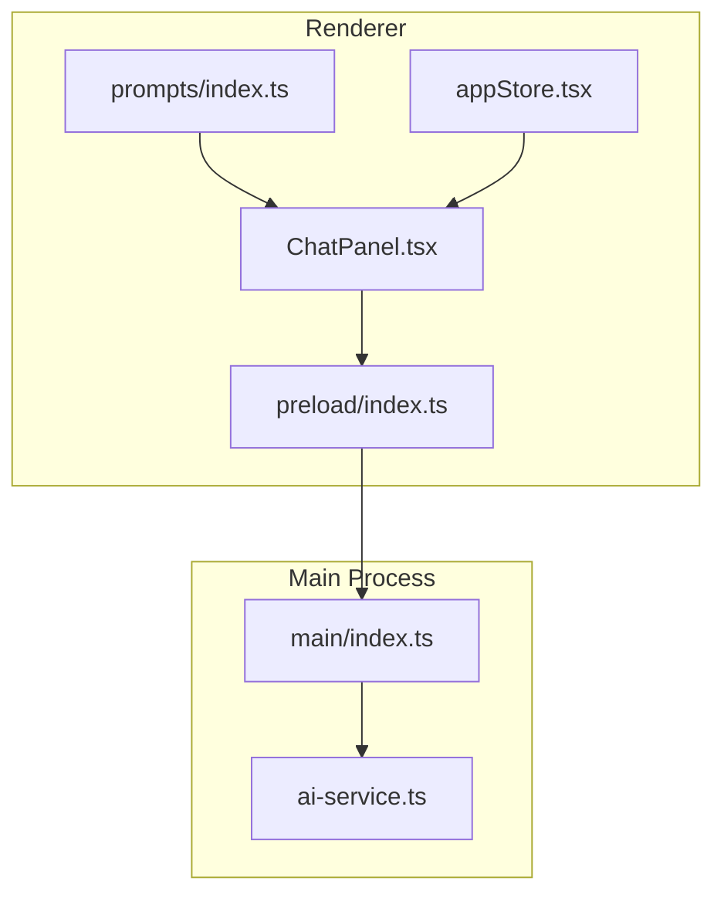
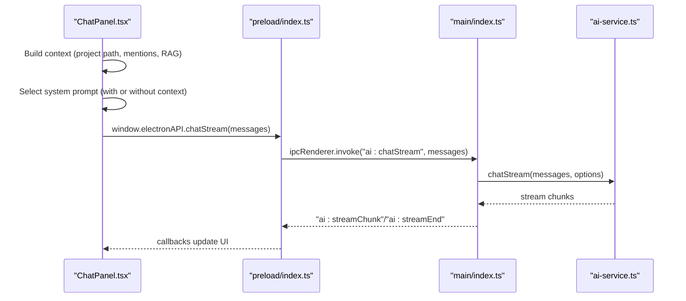
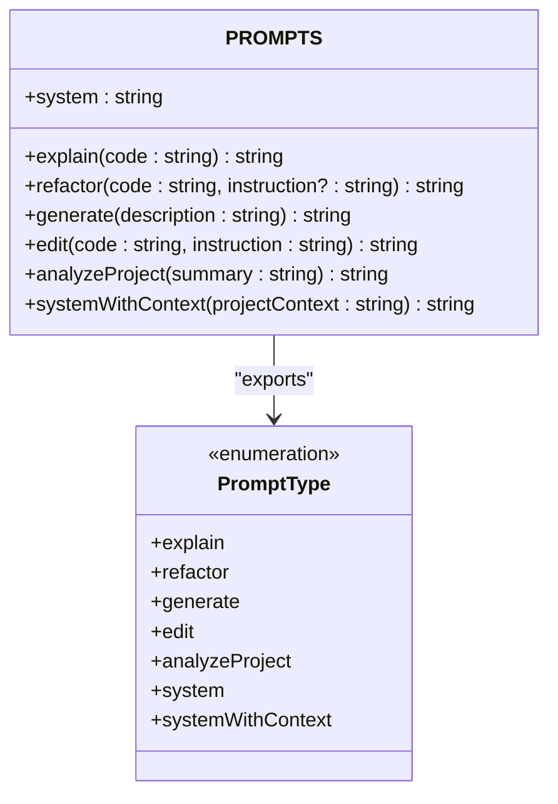
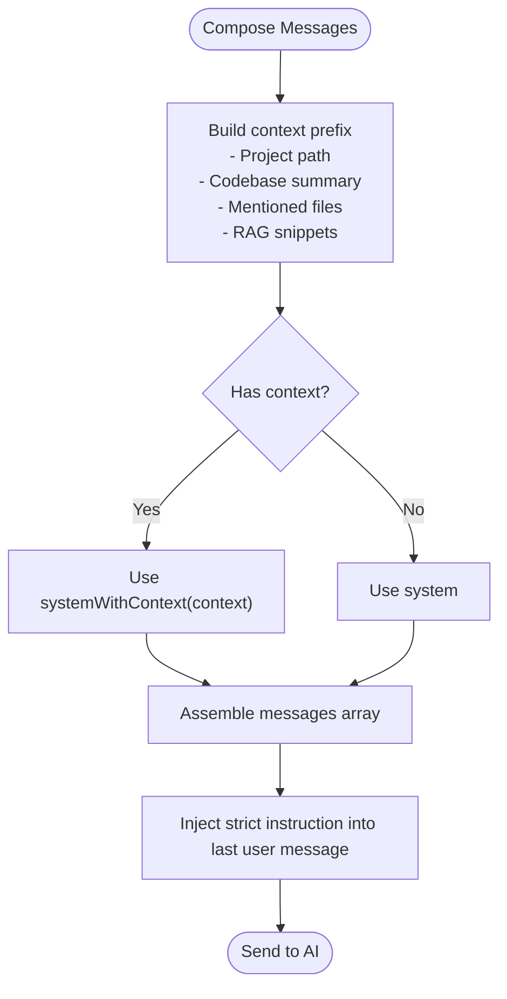
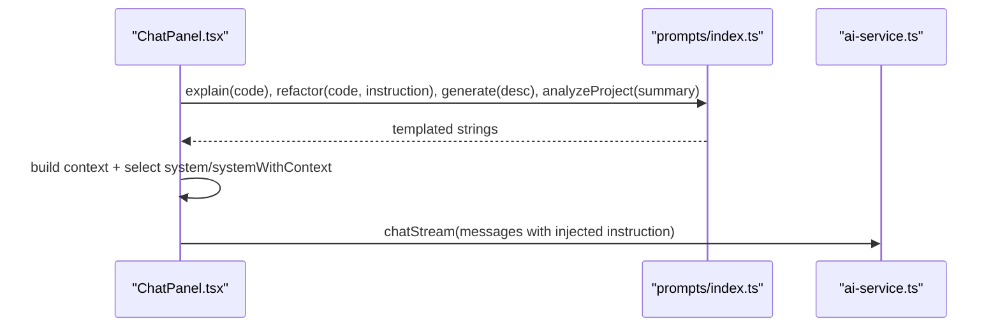
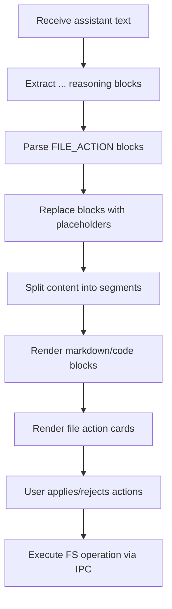
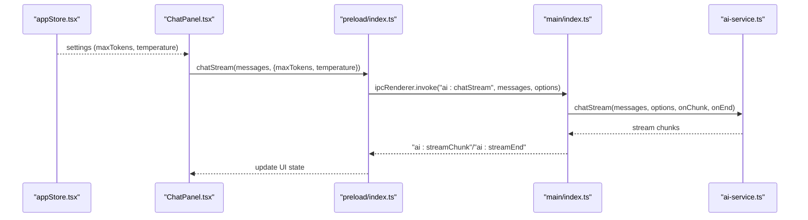
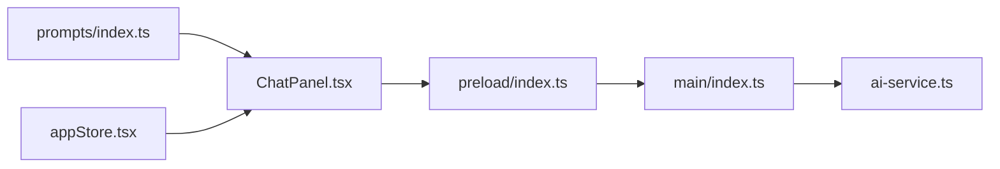

# Prompt Engineering

<cite>
**Referenced Files in This Document**
- [prompts/index.ts](file://src/renderer/prompts/index.ts)
- [ChatPanel.tsx](file://src/renderer/components/ChatPanel.tsx)
- [ai-service.ts](file://src/main/ai-service.ts)
- [index.ts (main)](file://src/main/index.ts)
- [index.ts (preload)](file://src/preload/index.ts)
- [appStore.tsx](file://src/renderer/store/appStore.tsx)
</cite>

## Table of Contents
1. [Introduction](#introduction)
2. [Project Structure](#project-structure)
3. [Core Components](#core-components)
4. [Architecture Overview](#architecture-overview)
5. [Detailed Component Analysis](#detailed-component-analysis)
6. [Dependency Analysis](#dependency-analysis)
7. [Performance Considerations](#performance-considerations)
8. [Troubleshooting Guide](#troubleshooting-guide)
9. [Conclusion](#conclusion)
10. [Appendices](#appendices)

## Introduction
This document explains the prompt engineering and template management system in BitNet IDE’s AI agent. It focuses on how prompts are structured, composed, and injected into AI interactions, how different prompt types serve distinct coding scenarios (explanation, refactoring, generation, editing, and project analysis), and how context is dynamically integrated. It also covers integration with agent configurations, streaming behavior, file action parsing, and practical guidance for creating and maintaining high-quality prompts.

## Project Structure
The prompt system centers around a dedicated template module and integrates with the renderer chat panel, IPC bridge, and main-process AI service.

**Diagram sources**
- [prompts/index.ts](file://src/renderer/prompts/index.ts#L1-L106)
- [ChatPanel.tsx](file://src/renderer/components/ChatPanel.tsx#L1-L120)
- [index.ts (preload)](file://src/preload/index.ts#L1-L128)
- [index.ts (main)](file://src/main/index.ts#L118-L335)
- [ai-service.ts](file://src/main/ai-service.ts#L12-L323)

**Section sources**
- [prompts/index.ts](file://src/renderer/prompts/index.ts#L1-L106)
- [ChatPanel.tsx](file://src/renderer/components/ChatPanel.tsx#L1-L120)
- [index.ts (preload)](file://src/preload/index.ts#L1-L128)
- [index.ts (main)](file://src/main/index.ts#L118-L335)
- [ai-service.ts](file://src/main/ai-service.ts#L12-L323)

## Core Components
- Prompt templates: A centralized registry defines reusable prompt factories for common tasks and system roles.
- Context injection: The chat panel builds a contextual prefix from project metadata, mentioned files, and RAG snippets.
- Message composition: System prompt and user/assistant history are assembled into a messages array passed to the AI service.
- Streaming and rendering: The UI streams tokens, renders markdown, and parses file actions for safe application.

**Section sources**
- [prompts/index.ts](file://src/renderer/prompts/index.ts#L1-L106)
- [ChatPanel.tsx](file://src/renderer/components/ChatPanel.tsx#L196-L295)
- [ai-service.ts](file://src/main/ai-service.ts#L190-L323)

## Architecture Overview
The prompt pipeline connects UI interactions to the AI backend via IPC, with dynamic context augmentation and strict output formatting for file operations.

**Diagram sources**
- [ChatPanel.tsx](file://src/renderer/components/ChatPanel.tsx#L265-L295)
- [index.ts (preload)](file://src/preload/index.ts#L33-L50)
- [index.ts (main)](file://src/main/index.ts#L307-L322)
- [ai-service.ts](file://src/main/ai-service.ts#L240-L314)

## Detailed Component Analysis

### Prompt Template Registry
- Purpose: Provide strongly typed prompt factories for explain/refactor/generate/edit/analyzeProject and system/systemWithContext roles.
- Composition: Templates are either plain strings (system/systemWithContext) or factory functions accepting parameters (explain/refactor/generate/edit/analyzeProject).
- Type safety: A union type enumerates all prompt keys for compile-time checks.

**Diagram sources**
- [prompts/index.ts](file://src/renderer/prompts/index.ts#L1-L106)

**Section sources**
- [prompts/index.ts](file://src/renderer/prompts/index.ts#L1-L106)

### Context Injection Patterns
- Project context: The chat panel prepends project root and optional codebase summary.
- Mentioned files: Detects @-mentions, resolves absolute paths, reads file contents, and appends them into context.
- RAG retrieval: Queries embeddings and adds relevant snippets to context.
- System prompt selection: Chooses system versus systemWithContext depending on whether context exists.

**Diagram sources**
- [ChatPanel.tsx](file://src/renderer/components/ChatPanel.tsx#L211-L279)

**Section sources**
- [ChatPanel.tsx](file://src/renderer/components/ChatPanel.tsx#L211-L279)

### Prompt Composition Strategies
- Parameter binding: Factory templates accept parameters (code, description, instruction) and embed them into structured prompts.
- Dynamic content generation: Context snippets are concatenated into a single prefix before the chat log.
- Strict instruction injection: Adds explicit guidance to the last user message to enforce FILE_ACTION format for safe file edits.

**Diagram sources**
- [ChatPanel.tsx](file://src/renderer/components/ChatPanel.tsx#L453-L476)
- [prompts/index.ts](file://src/renderer/prompts/index.ts#L2-L15)
- [ai-service.ts](file://src/main/ai-service.ts#L240-L314)

**Section sources**
- [ChatPanel.tsx](file://src/renderer/components/ChatPanel.tsx#L453-L476)
- [prompts/index.ts](file://src/renderer/prompts/index.ts#L2-L15)

### File Action Parsing and Rendering
- Pattern: Agent responses can include FILE_ACTION blocks. The UI extracts these, replaces them with interactive cards, and supports create/edit/delete/patch operations.
- Patch parsing: Multi-patch updates are supported via SEARCH/REPLACE markers.
- Preview and approval: Users can review proposed changes and apply or reject them.

**Diagram sources**
- [ChatPanel.tsx](file://src/renderer/components/ChatPanel.tsx#L874-L911)
- [ChatPanel.tsx](file://src/renderer/components/ChatPanel.tsx#L913-L1021)

**Section sources**
- [ChatPanel.tsx](file://src/renderer/components/ChatPanel.tsx#L874-L911)
- [ChatPanel.tsx](file://src/renderer/components/ChatPanel.tsx#L913-L1021)

### Agent Configurations and Skill Implementations
- Settings-driven behavior: The main process reads settings (model path, context size, threads, max tokens, temperature) and forwards them to the AI service.
- IPC exposure: Renderer invokes AI endpoints via preload, which relays to main, which calls the AI service.
- Streaming lifecycle: The UI listens for stream chunks and end events, updating state accordingly.

**Diagram sources**
- [appStore.tsx](file://src/renderer/store/appStore.tsx#L35-L48)
- [index.ts (main)](file://src/main/index.ts#L307-L322)
- [ai-service.ts](file://src/main/ai-service.ts#L240-L314)
- [index.ts (preload)](file://src/preload/index.ts#L33-L50)

**Section sources**
- [appStore.tsx](file://src/renderer/store/appStore.tsx#L35-L48)
- [index.ts (main)](file://src/main/index.ts#L307-L322)
- [ai-service.ts](file://src/main/ai-service.ts#L240-L314)
- [index.ts (preload)](file://src/preload/index.ts#L33-L50)

## Dependency Analysis
- Centralized prompt registry: Used by the chat panel to construct user messages for explain/refactor/generate/analyzeProject.
- Context builder: Depends on file tree, project path, and RAG retrieval to augment prompts.
- IPC chain: Preload exposes AI endpoints; main process orchestrates AI service; AI service handles HTTP requests to the local server.
- UI rendering: Parses and renders assistant responses, including reasoning and file actions.

**Diagram sources**
- [prompts/index.ts](file://src/renderer/prompts/index.ts#L1-L106)
- [ChatPanel.tsx](file://src/renderer/components/ChatPanel.tsx#L1-L120)
- [index.ts (preload)](file://src/preload/index.ts#L1-L128)
- [index.ts (main)](file://src/main/index.ts#L118-L335)
- [ai-service.ts](file://src/main/ai-service.ts#L12-L323)
- [appStore.tsx](file://src/renderer/store/appStore.tsx#L1-L90)

**Section sources**
- [prompts/index.ts](file://src/renderer/prompts/index.ts#L1-L106)
- [ChatPanel.tsx](file://src/renderer/components/ChatPanel.tsx#L1-L120)
- [index.ts (preload)](file://src/preload/index.ts#L1-L128)
- [index.ts (main)](file://src/main/index.ts#L118-L335)
- [ai-service.ts](file://src/main/ai-service.ts#L12-L323)
- [appStore.tsx](file://src/renderer/store/appStore.tsx#L1-L90)

## Performance Considerations
- Context length: Long contexts increase latency and token usage. Prefer concise project summaries and targeted RAG snippets.
- Streaming: Use streaming to reduce perceived latency; ensure UI buffers and renders incrementally.
- Token limits: Respect maxTokens and temperature settings to balance quality and cost/latency.
- File operations: Prefer patch over full rewrite when possible to minimize diffs and improve reliability.

[No sources needed since this section provides general guidance]

## Troubleshooting Guide
- Server startup failures: The AI service reports detailed errors if the server crashes or fails to start within the timeout.
- Invalid responses: The AI service validates JSON responses and surfaces errors for malformed replies.
- Streaming interruptions: The UI stops streaming gracefully and clears state on stream end or abort.
- File action errors: UI marks actions with error state and displays underlying error messages.

**Section sources**
- [ai-service.ts](file://src/main/ai-service.ts#L19-L89)
- [ai-service.ts](file://src/main/ai-service.ts#L190-L238)
- [ChatPanel.tsx](file://src/renderer/components/ChatPanel.tsx#L524-L578)

## Conclusion
BitNet IDE’s prompt engineering system combines a modular template registry, dynamic context injection, and robust streaming to deliver reliable AI-assisted coding experiences. By structuring prompts per task, enforcing strict output formats for file operations, and integrating tightly with settings and IPC, the system balances flexibility and safety. Following the guidelines below will help maintain high-quality prompts and consistent performance.

## Appendices

### Prompt Types and Use Cases
- explain: Summarize code behavior and intent.
- refactor: Transform code with minimal changes guided by optional instructions.
- generate: Produce concise code from natural language descriptions.
- edit: Apply precise modifications to code based on instructions.
- analyzeProject: Provide high-level project insights from a codebase summary.
- system/systemWithContext: Define agent behavior and constraints; include project context when available.

**Section sources**
- [prompts/index.ts](file://src/renderer/prompts/index.ts#L2-L15)

### Prompt Composition Checklist
- Identify the scenario and select the appropriate template.
- Bind parameters precisely (code, description, instruction).
- Inject context (project path, mentioned files, RAG snippets).
- Add strict instructions for file operations in the last user message.
- Validate message structure before sending to AI.

**Section sources**
- [ChatPanel.tsx](file://src/renderer/components/ChatPanel.tsx#L265-L279)
- [prompts/index.ts](file://src/renderer/prompts/index.ts#L2-L15)

### Integration Notes
- Settings propagation: Ensure maxTokens and temperature are aligned with model capabilities and user preferences.
- IPC reliability: Handle stream chunk delivery and termination to keep UI responsive.
- File action safety: Always use FILE_ACTION blocks; verify SEARCH/REPLACE text matches file content exactly.

**Section sources**
- [index.ts (main)](file://src/main/index.ts#L299-L322)
- [ai-service.ts](file://src/main/ai-service.ts#L240-L314)
- [ChatPanel.tsx](file://src/renderer/components/ChatPanel.tsx#L874-L911)