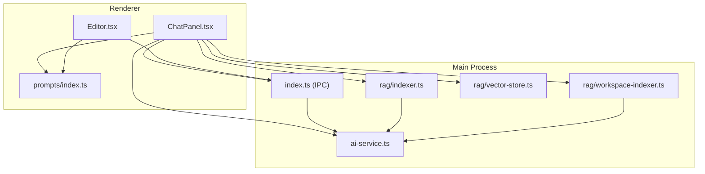
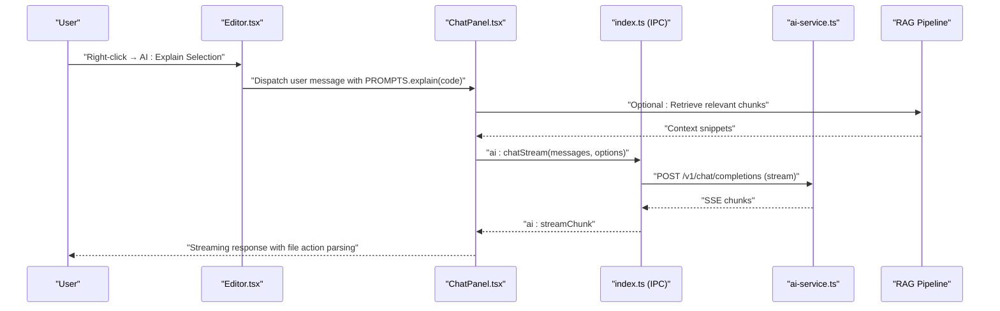
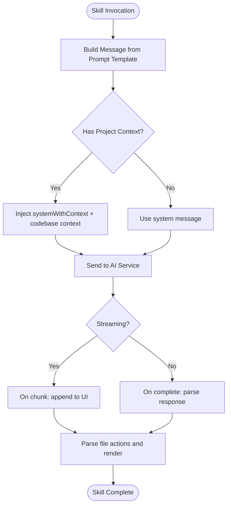
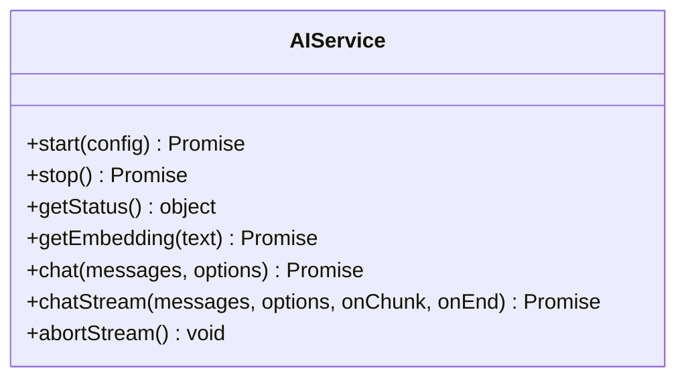
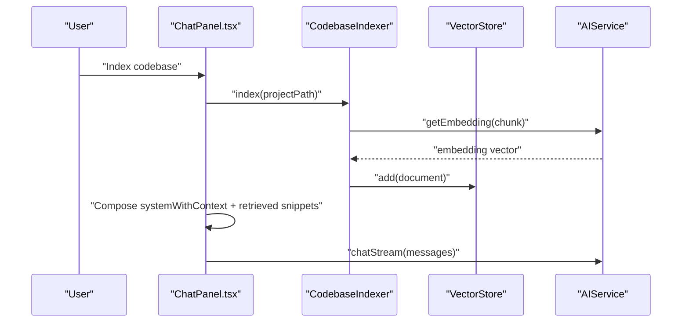
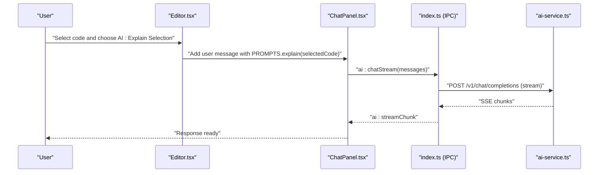
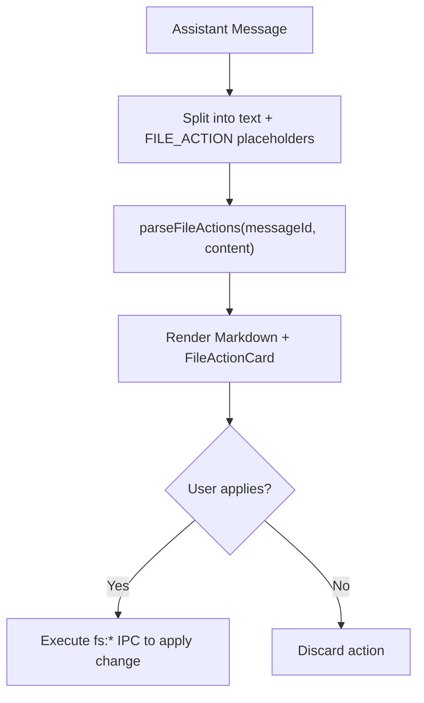
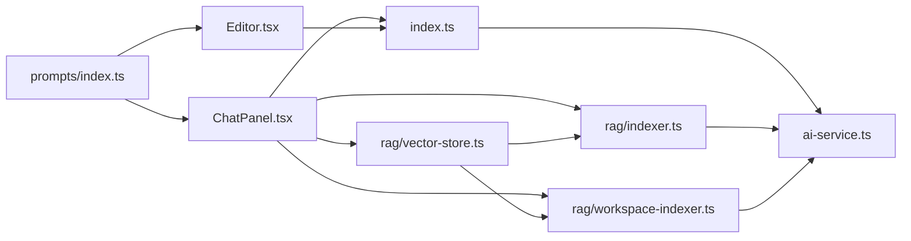

# Skill Implementations

<cite>
**Referenced Files in This Document**
- [README.md](file://README.md)
- [src/main/ai-service.ts](file://src/main/ai-service.ts)
- [src/main/index.ts](file://src/main/index.ts)
- [src/main/rag/indexer.ts](file://src/main/rag/indexer.ts)
- [src/main/rag/vector-store.ts](file://src/main/rag/vector-store.ts)
- [src/main/rag/workspace-indexer.ts](file://src/main/rag/workspace-indexer.ts)
- [src/renderer/components/ChatPanel.tsx](file://src/renderer/components/ChatPanel.tsx)
- [src/renderer/components/Editor.tsx](file://src/renderer/components/Editor.tsx)
- [src/renderer/prompts/index.ts](file://src/renderer/prompts/index.ts)
- [src/renderer/types/global.d.ts](file://src/renderer/types/global.d.ts)
</cite>

## Table of Contents
1. [Introduction](#introduction)
2. [Project Structure](#project-structure)
3. [Core Components](#core-components)
4. [Architecture Overview](#architecture-overview)
5. [Detailed Component Analysis](#detailed-component-analysis)
6. [Dependency Analysis](#dependency-analysis)
7. [Performance Considerations](#performance-considerations)
8. [Troubleshooting Guide](#troubleshooting-guide)
9. [Conclusion](#conclusion)
10. [Appendices](#appendices)

## Introduction
This document explains the AI skill implementations in BitNet IDE’s automated code assistance system. It focuses on how skills are designed to perform specific coding tasks such as code analysis, transformation, and generation, and how they integrate with the agent ecosystem. The system leverages a local BitNet.cpp inference engine exposed via an HTTP API, prompt templates for context injection, and optional retrieval-augmented generation (RAG) to enhance code understanding and editing capabilities.

The repository snapshot does not include a dedicated .qoder/skills/ directory. Instead, skills are implemented as prompt-driven workflows orchestrated by the renderer components and backed by the main-process AI service. Skills can be composed to form complex workflows, and the system supports streaming responses, file operations, and optional indexing for broader context.

## Project Structure
The BitNet IDE is organized into:
- Main process (Electron) with IPC handlers for AI, file system, RAG, and model management
- Renderer (React) with UI components for chat, editor actions, and settings
- Prompt templates that define the skill interface contracts and context injection points
- Optional RAG pipeline for semantic indexing and retrieval

**Diagram sources**
- [src/renderer/components/ChatPanel.tsx](file://src/renderer/components/ChatPanel.tsx#L178-L490)
- [src/renderer/components/Editor.tsx](file://src/renderer/components/Editor.tsx#L33-L92)
- [src/renderer/prompts/index.ts](file://src/renderer/prompts/index.ts#L1-L106)
- [src/main/index.ts](file://src/main/index.ts#L116-L519)
- [src/main/ai-service.ts](file://src/main/ai-service.ts#L12-L323)
- [src/main/rag/indexer.ts](file://src/main/rag/indexer.ts#L7-L127)
- [src/main/rag/vector-store.ts](file://src/main/rag/vector-store.ts#L13-L84)
- [src/main/rag/workspace-indexer.ts](file://src/main/rag/workspace-indexer.ts#L12-L149)

**Section sources**
- [README.md](file://README.md#L59-L87)
- [src/main/index.ts](file://src/main/index.ts#L116-L519)
- [src/renderer/components/ChatPanel.tsx](file://src/renderer/components/ChatPanel.tsx#L178-L490)
- [src/renderer/components/Editor.tsx](file://src/renderer/components/Editor.tsx#L33-L92)
- [src/renderer/prompts/index.ts](file://src/renderer/prompts/index.ts#L1-L106)

## Core Components
- AI Service: Manages the BitNet.cpp server lifecycle, health checks, embeddings, and chat completions (streaming and non-streaming).
- Prompt Templates: Define the skill interface contracts and inject context for explain/refactor/generate/edit/analyze workflows.
- Renderer Components: Trigger skills via editor actions and chat panel quick actions; parse and apply file operations.
- RAG Pipeline: Indexes codebases and retrieves semantically similar chunks to augment prompts.

Key responsibilities:
- Skill orchestration: Editor actions and chat panel quick actions assemble messages using prompt templates.
- Execution patterns: Skills call the AI service for chat completions and optionally use RAG to enrich context.
- Result processing: Renderer parses assistant responses and applies file operations safely.

**Section sources**
- [src/main/ai-service.ts](file://src/main/ai-service.ts#L12-L323)
- [src/renderer/prompts/index.ts](file://src/renderer/prompts/index.ts#L1-L106)
- [src/renderer/components/Editor.tsx](file://src/renderer/components/Editor.tsx#L33-L92)
- [src/renderer/components/ChatPanel.tsx](file://src/renderer/components/ChatPanel.tsx#L453-L490)
- [src/main/rag/indexer.ts](file://src/main/rag/indexer.ts#L7-L127)
- [src/main/rag/vector-store.ts](file://src/main/rag/vector-store.ts#L13-L84)
- [src/main/rag/workspace-indexer.ts](file://src/main/rag/workspace-indexer.ts#L12-L149)

## Architecture Overview
The skill architecture is prompt-centric and agent-like:
- Skills are implemented as prompt compositions and message sequences.
- The AI service exposes a unified chat API and streaming API.
- Renderer components act as agents, assembling context and invoking skills.
- Optional RAG augments prompts with relevant codebase fragments.

**Diagram sources**
- [src/renderer/components/Editor.tsx](file://src/renderer/components/Editor.tsx#L33-L92)
- [src/renderer/components/ChatPanel.tsx](file://src/renderer/components/ChatPanel.tsx#L178-L490)
- [src/renderer/prompts/index.ts](file://src/renderer/prompts/index.ts#L1-L106)
- [src/main/index.ts](file://src/main/index.ts#L273-L323)
- [src/main/ai-service.ts](file://src/main/ai-service.ts#L190-L321)
- [src/main/rag/indexer.ts](file://src/main/rag/indexer.ts#L18-L73)

## Detailed Component Analysis

### Prompt Templates and Skill Contracts
Prompt templates define the skill interface contracts:
- explain(code): Returns a concise explanation prompt for selected code.
- refactor(code, instruction?): Requests refactoring with optional instruction; expects minimal changes preserving behavior.
- generate(description): Generates code for a given description.
- edit(code, instruction): Applies a specific edit to code and returns modified code.
- analyzeProject(summary): Summarizes a project for high-level insights.
- system/systemWithContext: System messages that constrain assistant behavior and enforce FILE_ACTION format for safe edits.

Skill contract characteristics:
- Parameter handling: Skill parameters are injected into template functions; optional parameters are supported where applicable.
- Result processing: The assistant is constrained to return only the modified code or structured FILE_ACTION blocks for file operations.

**Diagram sources**
- [src/renderer/prompts/index.ts](file://src/renderer/prompts/index.ts#L1-L106)
- [src/main/ai-service.ts](file://src/main/ai-service.ts#L190-L321)
- [src/renderer/components/ChatPanel.tsx](file://src/renderer/components/ChatPanel.tsx#L178-L490)

**Section sources**
- [src/renderer/prompts/index.ts](file://src/renderer/prompts/index.ts#L1-L106)

### AI Service and Execution Patterns
The AI Service encapsulates:
- Server lifecycle: start/stop with health checks and error reporting.
- Embeddings: getEmbedding for RAG.
- Chat: chat and chatStream with streaming SSE handling.
- Abort: stop ongoing streams.

Execution patterns:
- Non-streaming chat: suitable for short, deterministic tasks.
- Streaming chat: ideal for long-form explanations and iterative editing.
- Embeddings: used by RAG to convert queries and chunks into vectors.

**Diagram sources**
- [src/main/ai-service.ts](file://src/main/ai-service.ts#L12-L323)

**Section sources**
- [src/main/ai-service.ts](file://src/main/ai-service.ts#L12-L323)

### RAG Pipeline and Context Injection
The RAG pipeline supports two modes:
- CodebaseIndexer: Scans and chunks files, computes embeddings, and stores them in a vector store.
- WorkspaceIndexer: Alternative chunking and indexing with progress callbacks.

Context injection:
- ChatPanel composes a context string from project path and retrieved snippets, then wraps it in systemWithContext before sending messages.

**Diagram sources**
- [src/main/rag/indexer.ts](file://src/main/rag/indexer.ts#L18-L73)
- [src/main/rag/vector-store.ts](file://src/main/rag/vector-store.ts#L23-L38)
- [src/main/rag/workspace-indexer.ts](file://src/main/rag/workspace-indexer.ts#L47-L125)
- [src/main/ai-service.ts](file://src/main/ai-service.ts#L147-L188)
- [src/renderer/components/ChatPanel.tsx](file://src/renderer/components/ChatPanel.tsx#L211-L218)

**Section sources**
- [src/main/rag/indexer.ts](file://src/main/rag/indexer.ts#L7-L127)
- [src/main/rag/vector-store.ts](file://src/main/rag/vector-store.ts#L13-L84)
- [src/main/rag/workspace-indexer.ts](file://src/main/rag/workspace-indexer.ts#L12-L149)
- [src/renderer/components/ChatPanel.tsx](file://src/renderer/components/ChatPanel.tsx#L211-L218)

### Editor Actions and Quick Actions
Editor actions trigger skills directly:
- AI: Explain Selection → PROMPTS.explain
- AI: Refactor Selection → PROMPTS.refactor
- AI: Edit Selection → PROMPTS.edit

Quick actions in the chat panel:
- Explain/Refactor/Generate → assemble user messages using prompt templates.

These actions demonstrate chaining patterns:
- Explain → Refactor → Edit → Generate can be combined across selections and chat history.

**Diagram sources**
- [src/renderer/components/Editor.tsx](file://src/renderer/components/Editor.tsx#L33-L92)
- [src/renderer/components/ChatPanel.tsx](file://src/renderer/components/ChatPanel.tsx#L453-L490)
- [src/main/index.ts](file://src/main/index.ts#L273-L323)
- [src/main/ai-service.ts](file://src/main/ai-service.ts#L240-L321)

**Section sources**
- [src/renderer/components/Editor.tsx](file://src/renderer/components/Editor.tsx#L33-L92)
- [src/renderer/components/ChatPanel.tsx](file://src/renderer/components/ChatPanel.tsx#L453-L490)

### File Operation Parsing and Safety
Assistant responses may include FILE_ACTION blocks. The renderer parses these and renders interactive cards for applying or rejecting changes. This ensures safe, controlled edits to the user’s project.

**Diagram sources**
- [src/renderer/components/ChatPanel.tsx](file://src/renderer/components/ChatPanel.tsx#L956-L991)

**Section sources**
- [src/renderer/components/ChatPanel.tsx](file://src/renderer/components/ChatPanel.tsx#L956-L991)

## Dependency Analysis
High-level dependencies:
- Renderer components depend on prompt templates and IPC handlers.
- IPC handlers depend on AI Service and RAG components.
- RAG components depend on AI Service for embeddings and on VectorStore for persistence.

**Diagram sources**
- [src/renderer/prompts/index.ts](file://src/renderer/prompts/index.ts#L1-L106)
- [src/renderer/components/ChatPanel.tsx](file://src/renderer/components/ChatPanel.tsx#L178-L490)
- [src/renderer/components/Editor.tsx](file://src/renderer/components/Editor.tsx#L33-L92)
- [src/main/index.ts](file://src/main/index.ts#L116-L519)
- [src/main/ai-service.ts](file://src/main/ai-service.ts#L12-L323)
- [src/main/rag/indexer.ts](file://src/main/rag/indexer.ts#L7-L127)
- [src/main/rag/vector-store.ts](file://src/main/rag/vector-store.ts#L13-L84)
- [src/main/rag/workspace-indexer.ts](file://src/main/rag/workspace-indexer.ts#L12-L149)

**Section sources**
- [src/main/index.ts](file://src/main/index.ts#L116-L519)
- [src/main/ai-service.ts](file://src/main/ai-service.ts#L12-L323)
- [src/main/rag/indexer.ts](file://src/main/rag/indexer.ts#L7-L127)
- [src/main/rag/vector-store.ts](file://src/main/rag/vector-store.ts#L13-L84)
- [src/main/rag/workspace-indexer.ts](file://src/main/rag/workspace-indexer.ts#L12-L149)

## Performance Considerations
- Streaming vs. non-streaming: Use streaming for long outputs to improve perceived latency and responsiveness.
- Embedding costs: RAG indexing and retrieval compute embeddings; batch and persist results to reduce repeated work.
- Chunking strategy: Smaller chunks improve precision but increase embedding cost; tune chunk size and overlap for your workload.
- Resource limits: Control context size, max tokens, and threads to balance quality and performance.
- Caching: Persist VectorStore to disk to avoid re-indexing between sessions.
- Concurrency: Limit concurrent streams and file operations to prevent contention.

[No sources needed since this section provides general guidance]

## Troubleshooting Guide
Common issues and resolutions:
- AI server not running: Ensure the BitNet.cpp server is started and healthy before invoking chat or embeddings.
- Streaming failures: Verify SSE handling and abort on demand via the stop handler.
- RAG indexing errors: Confirm AI engine is running and embeddings endpoint is available.
- File operation safety: Only apply actions after user confirmation; validate paths and content diffs.

**Section sources**
- [src/main/ai-service.ts](file://src/main/ai-service.ts#L117-L145)
- [src/main/ai-service.ts](file://src/main/ai-service.ts#L316-L321)
- [src/main/index.ts](file://src/main/index.ts#L497-L518)

## Conclusion
BitNet IDE’s skill implementations are prompt-driven and agent-like, orchestrated by renderer components and executed through a unified AI service. Skills such as explain, refactor, edit, and generate are expressed as template-driven workflows, optionally augmented by RAG for broader context. The system emphasizes safety (FILE_ACTION format), performance (streaming, caching), and composability (chaining skills across editor actions and chat).

[No sources needed since this section summarizes without analyzing specific files]

## Appendices

### Built-in Skills and Examples
- Explain Selection: Assemble a message using PROMPTS.explain and stream the response.
- Refactor Selection: Use PROMPTS.refactor with optional instruction; preserve behavior and minimize changes.
- Edit Selection: Apply a specific instruction via PROMPTS.edit and receive modified code.
- Generate: Prompt with PROMPTS.generate and stream the generated code.
- Analyze Project: Compose a summary using PROMPTS.analyzeProject and optionally include RAG context.

**Section sources**
- [src/renderer/components/Editor.tsx](file://src/renderer/components/Editor.tsx#L33-L92)
- [src/renderer/components/ChatPanel.tsx](file://src/renderer/components/ChatPanel.tsx#L453-L490)
- [src/renderer/prompts/index.ts](file://src/renderer/prompts/index.ts#L1-L106)

### Configuration Options
- AI Service settings: contextSize, maxTokens, temperature, threads, port.
- IPC handlers expose these via settings and per-call overrides.
- RAG indexing: chunk sizes and overlaps can be tuned for accuracy and performance.

**Section sources**
- [src/main/index.ts](file://src/main/index.ts#L22-L52)
- [src/main/index.ts](file://src/main/index.ts#L296-L302)
- [src/main/rag/indexer.ts](file://src/main/rag/indexer.ts#L110-L125)
- [src/main/rag/workspace-indexer.ts](file://src/main/rag/workspace-indexer.ts#L133-L147)

### Guidelines for Developing Custom Skills
- Define a new prompt template in the prompt registry with clear parameter contracts.
- Create a renderer action or chat panel quick action that builds the message payload.
- Integrate with the AI service via IPC handlers for chat or streaming.
- If the skill requires broader context, incorporate RAG retrieval and compose systemWithContext.
- Enforce safe file operations using FILE_ACTION format and parse them in the renderer.
- Test streaming behavior and error handling; provide fallbacks when AI or RAG is unavailable.

**Section sources**
- [src/renderer/prompts/index.ts](file://src/renderer/prompts/index.ts#L1-L106)
- [src/renderer/components/ChatPanel.tsx](file://src/renderer/components/ChatPanel.tsx#L178-L490)
- [src/main/index.ts](file://src/main/index.ts#L273-L323)
- [src/main/ai-service.ts](file://src/main/ai-service.ts#L190-L321)
- [src/main/rag/indexer.ts](file://src/main/rag/indexer.ts#L18-L73)