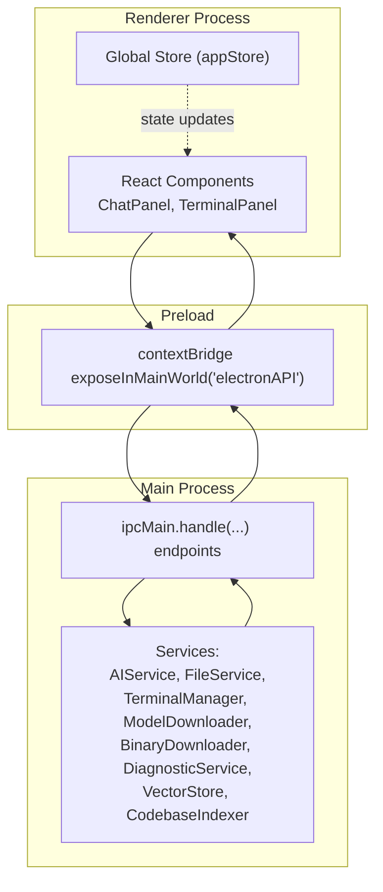
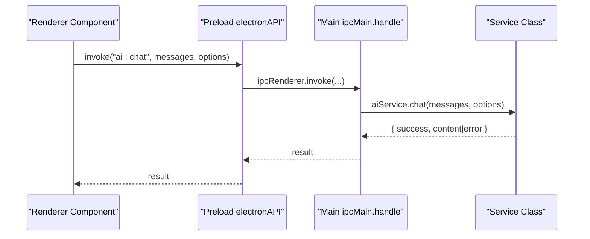
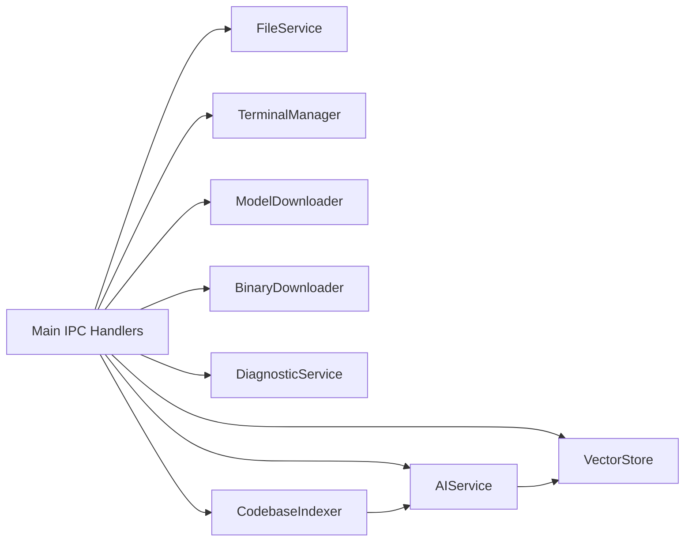

# API Reference

<cite>
**Referenced Files in This Document**
- [src/main/index.ts](file://src/main/index.ts)
- [src/preload/index.ts](file://src/preload/index.ts)
- [src/main/ai-service.ts](file://src/main/ai-service.ts)
- [src/main/file-service.ts](file://src/main/file-service.ts)
- [src/main/terminal-manager.ts](file://src/main/terminal-manager.ts)
- [src/main/model-downloader.ts](file://src/main/model-downloader.ts)
- [src/main/binary-downloader.ts](file://src/main/binary-downloader.ts)
- [src/main/diagnostic-service.ts](file://src/main/diagnostic-service.ts)
- [src/main/rag/vector-store.ts](file://src/main/rag/vector-store.ts)
- [src/main/rag/indexer.ts](file://src/main/rag/indexer.ts)
- [src/renderer/store/appStore.tsx](file://src/renderer/store/appStore.tsx)
- [src/renderer/components/ChatPanel.tsx](file://src/renderer/components/ChatPanel.tsx)
- [src/renderer/components/TerminalPanel.tsx](file://src/renderer/components/TerminalPanel.tsx)
- [package.json](file://package.json)
</cite>

## Table of Contents
1. [Introduction](#introduction)
2. [Project Structure](#project-structure)
3. [Core Components](#core-components)
4. [Architecture Overview](#architecture-overview)
5. [Detailed Component Analysis](#detailed-component-analysis)
6. [Dependency Analysis](#dependency-analysis)
7. [Performance Considerations](#performance-considerations)
8. [Troubleshooting Guide](#troubleshooting-guide)
9. [Conclusion](#conclusion)
10. [Appendices](#appendices)

## Introduction
This document provides a comprehensive API reference for BitNet IDE’s inter-process communication (IPC) between the Electron main process and the renderer process. It covers:
- IPC endpoints exposed by the main process and their signatures
- Preload contextBridge implementations and secure communication patterns
- Service method documentation for AI, file system, terminal, model downloads, binaries, diagnostics, and RAG
- Event handling patterns, error propagation, and asynchronous operation management
- Practical usage examples from React components with error handling and loading state management
- Security considerations, data validation, and permission handling
- API versioning, backward compatibility notes, and migration guidance
- Debugging tools and techniques for IPC communication issues

## Project Structure
The project follows an Electron + React architecture with a clear separation of concerns:
- Main process: Hosts IPC handlers, services, and native integrations
- Preload: Exposes a controlled subset of IPC to the renderer via contextBridge
- Renderer: React components consume the exposed API and manage UI state

**Diagram sources**
- [src/main/index.ts](file://src/main/index.ts#L116-L519)
- [src/preload/index.ts](file://src/preload/index.ts#L1-L120)

**Section sources**
- [src/main/index.ts](file://src/main/index.ts#L1-L542)
- [src/preload/index.ts](file://src/preload/index.ts#L1-L120)

## Core Components
This section enumerates the primary IPC endpoints grouped by domain, along with their function signatures, parameter types, and return values. All endpoints are invoked from the renderer using the preload-exposed electronAPI.

- Window Controls
  - minimize(): Promise<void>
  - maximize(): Promise<void>
  - close(): Promise<void>
  - isMaximized(): Promise<boolean>
  - onMaximizeChange(callback): () => void (unsubscribe)

- Settings
  - getSettings(): Promise<AppSettings>
  - saveSettings(settings: Partial<AppSettings>): Promise<AppSettings>

- File System
  - selectFile(): Promise<string | null>
  - openFolder(): Promise<{ path: string; tree: FileTreeNode[] }>
  - readFile(path: string): Promise<{ success: boolean; content?: string; error?: string }>
  - writeFile(path: string, content: string): Promise<{ success: boolean; error?: string }>
  - patchFile(path: string, patches: { search: string; replace: string }[]): Promise<{ success: boolean; error?: string }>
  - lintCodebase(projectPath: string): Promise<{ success: boolean; problems?: CodeProblem[]; error?: string }>
  - getFileTree(path: string): Promise<FileTreeNode[]>
  - createFile(path: string): Promise<{ success: boolean; error?: string }>
  - createFolder(path: string): Promise<{ success: boolean; error?: string }>
  - rename(oldPath: string, newPath: string): Promise<{ success: boolean; error?: string }>
  - delete(path: string): Promise<{ success: boolean; error?: string }>
  - searchInFiles(dir: string, query: string): Promise<Array<{ file: string; line: number; content: string }>>

- AI Service
  - startAIServer(): Promise<{ success: boolean; error?: string }>
  - stopAIServer(): Promise<void>
  - getAIStatus(): Promise<{ running: boolean; port: number }>
  - chat(messages: Array<{ role: string; content: string }>, options?: { maxTokens?: number; temperature?: number }): Promise<{ success: boolean; content?: string; error?: string }>
  - chatStream(messages: Array<{ role: string; content: string }>, options?: { maxTokens?: number; temperature?: number }): Promise<{ success: boolean; error?: string }>
  - stopStream(): Promise<void>
  - analyzeCodebase(projectPath: string): Promise<{ success: boolean; summary?: string; error?: string }>
  - onStreamChunk(callback): () => void (unsubscribe)
  - onStreamEnd(callback): () => void (unsubscribe)

- Model Downloader
  - getAvailableModels(): Promise<ModelInfo[]>
  - selectDirectory(): Promise<string | null>
  - downloadModel(modelId: string, targetDir: string): Promise<{ success: boolean; path?: string; error?: string }>
  - cancelDownload(): Promise<void>
  - scanLocalModels(directory: string): Promise<Array<{ name: string; path: string; size: string }>>
  - deleteModel(path: string): Promise<{ success: boolean; error?: string }>
  - onDownloadProgress(callback): () => void (unsubscribe)
  - onDownloadComplete(callback): () => void (unsubscribe)
  - onDownloadError(callback): () => void (unsubscribe)

- Binary Downloader
  - downloadBinary(targetDir: string): Promise<{ success: boolean; path?: string; error?: string }>
  - cancelBinaryDownload(): Promise<void>
  - onBinaryDownloadProgress(callback): () => void (unsubscribe)

- Shell / Terminal
  - executeCommand(command: string, cwd?: string): Promise<{ stdout: string; stderr: string; code: number }>
  - openExternal(url: string): Promise<void>

  - Persistent Terminal
    - createTerminal(id: string, shell: string, cwd: string): Promise<{ success: boolean; error?: string }>
    - writeTerminal(id: string, data: string): Promise<void>
    - resizeTerminal(id: string, cols: number, rows: number): Promise<void>
    - killTerminal(id: string): Promise<void>
    - getShells(): Promise<string[]>
    - onTerminalData(callback): () => void (unsubscribe)
    - onTerminalExit(callback): () => void (unsubscribe)

- RAG
  - indexCodebase(projectPath: string): Promise<{ success: boolean }>
  - getRagStatus(): Promise<{ count: number; path: string }>
  - ragRetrieve(query: string): Promise<Array<{ id: string; content: string; score?: number }>>
  - onRagProgress(callback): () => void (unsubscribe)

Notes:
- All endpoints return either a typed result or a discriminated union with success/error fields for error propagation.
- Streaming endpoints emit events to the renderer via ipcRenderer.on(...).

**Section sources**
- [src/main/index.ts](file://src/main/index.ts#L116-L519)
- [src/preload/index.ts](file://src/preload/index.ts#L1-L120)

## Architecture Overview
The IPC architecture is centered around a single preload bridge exposing a typed API surface to renderer components. The main process registers ipcMain.handle handlers that delegate to cohesive service classes.

**Diagram sources**
- [src/preload/index.ts](file://src/preload/index.ts#L33-L40)
- [src/main/index.ts](file://src/main/index.ts#L296-L302)
- [src/main/ai-service.ts](file://src/main/ai-service.ts#L190-L238)

**Section sources**
- [src/main/index.ts](file://src/main/index.ts#L116-L519)
- [src/preload/index.ts](file://src/preload/index.ts#L1-L120)

## Detailed Component Analysis

### Preload Script and Secure Communication Patterns
- The preload script uses contextBridge.exposeInMainWorld to publish a strongly-typed electronAPI object.
- All renderer-side calls are wrapped with ipcRenderer.invoke for request/response semantics.
- Event-driven streaming uses ipcRenderer.on(...) with returned unsubscribe functions.
- The preload enforces a strict contract: only declared methods are exposed; unknown keys are inaccessible.

Security highlights:
- Node integration is disabled in BrowserWindow webPreferences.
- Context isolation is enabled.
- No direct access to Node/Electron internals is exposed to renderer scripts.

**Section sources**
- [src/preload/index.ts](file://src/preload/index.ts#L1-L120)
- [src/main/index.ts](file://src/main/index.ts#L77-L91)

### AI Service API
Responsibilities:
- Spawn and manage a local AI server process
- Provide chat completions and streaming
- Compute embeddings for RAG
- Graceful shutdown and health checks

Key methods and behaviors:
- start(config): Spawns the server with provided arguments and waits for health endpoint. Returns success or detailed error.
- stop(): Terminates the process gracefully with SIGTERM and fallback SIGKILL after timeout.
- getStatus(): Reports running state and port.
- chat(messages, options): Non-streaming chat completion via HTTP POST to /v1/chat/completions.
- chatStream(messages, options, onChunk, onEnd): Streaming chat; emits ai:streamChunk and ai:streamEnd events.
- stopStream(): Aborts an ongoing stream request.
- getEmbedding(text): Computes embedding via /embedding endpoint.

Error handling:
- Health check failures return a descriptive error.
- Network errors during chat/stream are propagated via error field.
- Embedding computation failure returns null or empty array depending on context.

**Section sources**
- [src/main/ai-service.ts](file://src/main/ai-service.ts#L12-L322)

### File System Service API
Responsibilities:
- File operations (read/write/patch)
- Directory traversal with git status enrichment
- Code linting via TypeScript compiler
- Search across files with filtering

Key methods and behaviors:
- getFileTree(dirPath, depth?, maxDepth?): Returns hierarchical tree with git status markers.
- readFile(path), writeFile(path, content), patchFile(path, patches): Return discriminated unions with success/error.
- lintCodebase(projectPath): Executes tsc and parses structured errors into CodeProblem[].
- searchInFiles(dir, query): Searches text files with case-insensitive substring match and capped results.

Validation and safety:
- Ignores hidden/system directories and common binary files.
- Uses safe file operations with try/catch and returns structured errors.

**Section sources**
- [src/main/file-service.ts](file://src/main/file-service.ts#L27-L161)
- [src/main/index.ts](file://src/main/index.ts#L167-L271)
- [src/main/diagnostic-service.ts](file://src/main/diagnostic-service.ts#L16-L64)

### Terminal Management API
Responsibilities:
- Manage persistent terminal sessions backed by child processes
- Stream output to xterm instances
- Handle shell detection and PTY-like behavior

Key methods and behaviors:
- createSession(id, shell, cwd): Spawns a shell process and wires stdout/stderr to renderer via terminal:data and terminal:exit events.
- write(id, data), resize(id, cols, rows), kill(id): Control the underlying process.
- detectShells(): Returns platform-specific shell candidates.

Renderer integration:
- TerminalPanel initializes xterm instances, fits them, and forwards keystrokes to the backend.
- Supports multiple sessions and split mode.

**Section sources**
- [src/main/terminal-manager.ts](file://src/main/terminal-manager.ts#L12-L110)
- [src/main/index.ts](file://src/main/index.ts#L462-L496)
- [src/renderer/components/TerminalPanel.tsx](file://src/renderer/components/TerminalPanel.tsx#L1-L312)

### Model Downloader API
Responsibilities:
- Manage model discovery, download, cancellation, scanning, and deletion
- Emit progress and completion/error events

Key methods and behaviors:
- getAvailableModels(): Returns curated list of downloadable models.
- downloadModel(modelId, targetDir, onProgress): Streams progress and emits models:downloadProgress, models:downloadComplete, models:downloadError.
- cancelDownload(): Cancels an in-progress download.
- scanLocalModels(directory): Lists .gguf files with sizes.
- deleteModel(path): Removes model file; if active model is being deleted, stops AI server first.

Resume and robustness:
- Uses HTTP Range requests and .part files for resumable downloads.
- Handles redirects and partial content.

**Section sources**
- [src/main/model-downloader.ts](file://src/main/model-downloader.ts#L267-L483)
- [src/main/index.ts](file://src/main/index.ts#L392-L439)

### Binary Downloader API
Responsibilities:
- Fetch latest llama.cpp release and extract platform-specific binary
- Provide progress and cancellation

Key methods and behaviors:
- downloadBinary(targetDir, onProgress): Downloads zip, extracts to bin subdirectory, verifies presence of executable, and reports progress.
- cancel(): Aborts download via AbortController.
- getDownloadUrl(): Attempts multiple release endpoints and selects compatible asset.

**Section sources**
- [src/main/binary-downloader.ts](file://src/main/binary-downloader.ts#L7-L161)
- [src/main/index.ts](file://src/main/index.ts#L441-L455)

### RAG System API
Responsibilities:
- Index codebase into semantic chunks and store embeddings
- Retrieve relevant snippets for queries

Key methods and behaviors:
- indexCodebase(projectPath): Background indexing pipeline emitting rag:progress events.
- getRagStatus(): Returns vector store statistics.
- ragRetrieve(query): Computes embedding and performs similarity search.

Integration:
- Uses AIService for embeddings and VectorStore for persistence.

**Section sources**
- [src/main/rag/indexer.ts](file://src/main/rag/indexer.ts#L7-L126)
- [src/main/rag/vector-store.ts](file://src/main/rag/vector-store.ts#L13-L83)
- [src/main/index.ts](file://src/main/index.ts#L497-L518)

### Example Usage from React Components

#### ChatPanel
- Streaming chat:
  - Registers onStreamChunk/onStreamEnd listeners on mount.
  - On new user message, builds context (project path, mentioned files, RAG snippets), then invokes chatStream.
  - Updates UI state via dispatch; handles errors and clears streaming flag.
- Model switching:
  - Saves settings, stops AI server, restarts server with new model, and updates UI state.
- Codebase analysis:
  - Calls analyzeCodebase and injects summary into chat context.

Loading and error handling patterns:
- Maintains isStreaming flag and last-assistant message content incrementally.
- Displays error messages in assistant message content when chat fails.
- Uses progress indicators and completion alerts for indexing.

**Section sources**
- [src/renderer/components/ChatPanel.tsx](file://src/renderer/components/ChatPanel.tsx#L89-L105)
- [src/renderer/components/ChatPanel.tsx](file://src/renderer/components/ChatPanel.tsx#L196-L295)
- [src/renderer/components/ChatPanel.tsx](file://src/renderer/components/ChatPanel.tsx#L132-L170)
- [src/renderer/components/ChatPanel.tsx](file://src/renderer/components/ChatPanel.tsx#L181-L194)

#### TerminalPanel
- Session lifecycle:
  - Detects available shells, creates xterm instances, and initializes backend terminals.
  - Forwards keystrokes to writeTerminal and handles backspace/delete sequences.
- Events:
  - Subscribes to terminal:data and terminal:exit to render output and process exit codes.
- Selection integration:
  - Allows copying terminal selection into chat panel content.

**Section sources**
- [src/renderer/components/TerminalPanel.tsx](file://src/renderer/components/TerminalPanel.tsx#L30-L72)
- [src/renderer/components/TerminalPanel.tsx](file://src/renderer/components/TerminalPanel.tsx#L116-L216)

## Dependency Analysis
High-level dependencies among services and IPC endpoints:

**Diagram sources**
- [src/main/index.ts](file://src/main/index.ts#L116-L519)
- [src/main/ai-service.ts](file://src/main/ai-service.ts#L12-L322)
- [src/main/file-service.ts](file://src/main/file-service.ts#L27-L161)
- [src/main/terminal-manager.ts](file://src/main/terminal-manager.ts#L12-L110)
- [src/main/model-downloader.ts](file://src/main/model-downloader.ts#L267-L483)
- [src/main/binary-downloader.ts](file://src/main/binary-downloader.ts#L7-L161)
- [src/main/diagnostic-service.ts](file://src/main/diagnostic-service.ts#L16-L64)
- [src/main/rag/vector-store.ts](file://src/main/rag/vector-store.ts#L13-L83)
- [src/main/rag/indexer.ts](file://src/main/rag/indexer.ts#L7-L126)

**Section sources**
- [src/main/index.ts](file://src/main/index.ts#L116-L519)

## Performance Considerations
- Streaming: Prefer chatStream for long-form generation to reduce latency and improve UX.
- File operations: Use getFileTree with appropriate maxDepth; avoid scanning large repositories unnecessarily.
- Model downloads: Resume downloads where supported; monitor progress to avoid repeated transfers.
- Terminal: Fit addon recalculations are throttled via requestAnimationFrame; still keep the number of sessions manageable.
- RAG: Persist VectorStore to disk to avoid re-indexing frequently; clear only when necessary.

## Troubleshooting Guide
Common issues and resolutions:
- AI server not starting:
  - Verify serverBinaryPath and modelPath in settings.
  - Check health endpoint availability and logs captured from stderr.
- Streaming stops unexpectedly:
  - Call stopStream to abort and retry.
  - Ensure onStreamChunk/onStreamEnd listeners are registered.
- File operations fail:
  - Confirm paths exist and permissions allow read/write.
  - Use readFile/writeFile/patchFile error fields for diagnostics.
- Terminal output garbled:
  - Ensure line ending normalization and proper fit sizing.
  - Verify shell availability via getShells.
- Model download stuck:
  - Use cancelDownload to abort and retry.
  - Check network connectivity and resume capability.
- RAG indexing slow:
  - Reduce max file size and allowed extensions.
  - Monitor progress events and persist periodically.

Debugging techniques:
- Inspect main process logs for stderr captures and health check timeouts.
- Use onRagProgress, onDownloadProgress, onBinaryDownloadProgress to observe progress.
- Validate settings via getSettings/saveSettings and confirm paths.

**Section sources**
- [src/main/ai-service.ts](file://src/main/ai-service.ts#L48-L84)
- [src/main/index.ts](file://src/main/index.ts#L312-L318)
- [src/main/model-downloader.ts](file://src/main/model-downloader.ts#L356-L472)
- [src/main/rag/indexer.ts](file://src/main/rag/indexer.ts#L18-L73)

## Conclusion
BitNet IDE’s IPC layer provides a secure, typed, and event-driven interface between the renderer and main process. The preload bridge ensures minimal exposure of Node/Electron internals, while service classes encapsulate complex operations such as AI server management, file system manipulation, terminal orchestration, model downloads, and RAG indexing. Following the documented patterns for error handling, streaming, and state management enables robust React components and a responsive user experience.

## Appendices

### API Versioning and Compatibility
- Current application version: 1.0.0
- No explicit API versioning headers are present in IPC endpoints.
- Backward compatibility:
  - New optional fields in settings are merged with defaults.
  - Streaming endpoints maintain stable event names and payloads.
  - File operation results use discriminated unions to aid migration.

Migration guidance:
- When adding new settings, always merge with defaults to avoid breaking older configurations.
- When extending message schemas, preserve existing fields and mark new ones optional.
- For streaming, ensure both onStreamChunk and onStreamEnd are handled to prevent hanging UI states.

**Section sources**
- [package.json](file://package.json#L1-L35)
- [src/main/index.ts](file://src/main/index.ts#L54-L74)
- [src/main/index.ts](file://src/main/index.ts#L137-L142)

### Security Considerations
- Context isolation and disabled Node integration protect the renderer from direct system access.
- Preload exposes only explicitly declared methods; unknown keys are inaccessible.
- Data validation:
  - Validate paths and options before invoking services.
  - Sanitize user-provided commands and file names.
- Permission handling:
  - Restrict file operations to project directories where applicable.
  - Avoid executing untrusted commands; prefer whitelisted shell commands.

**Section sources**
- [src/main/index.ts](file://src/main/index.ts#L77-L91)
- [src/preload/index.ts](file://src/preload/index.ts#L1-L120)