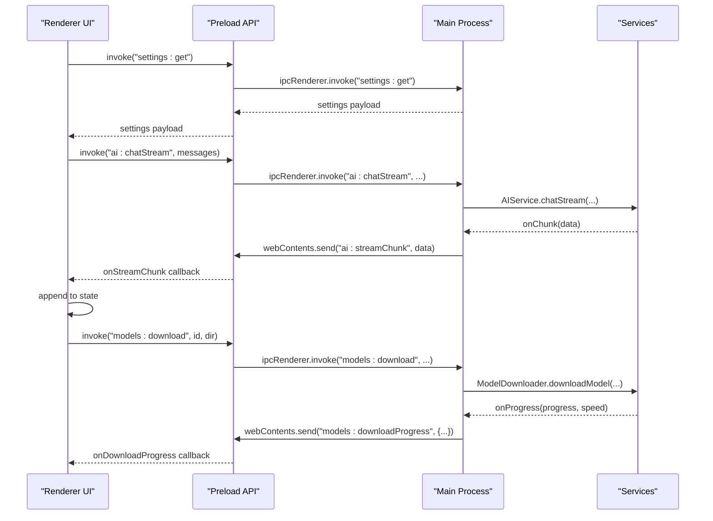
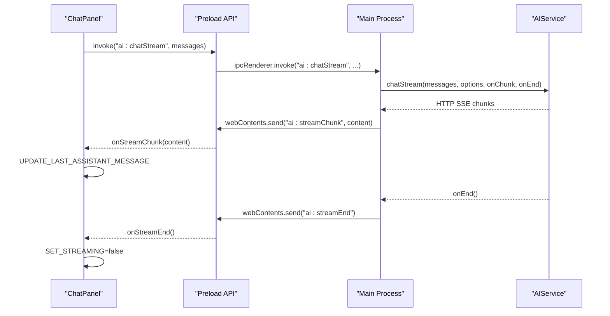
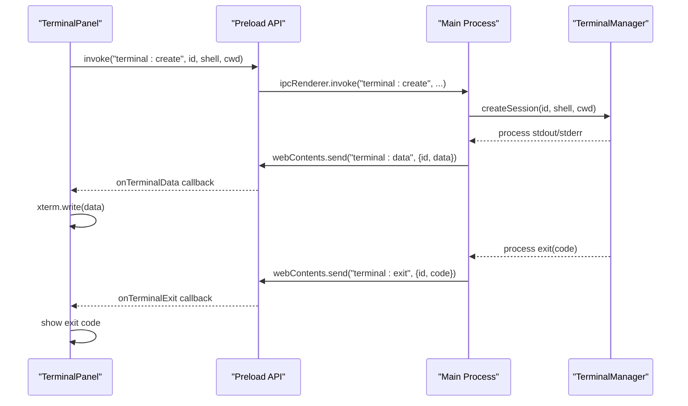
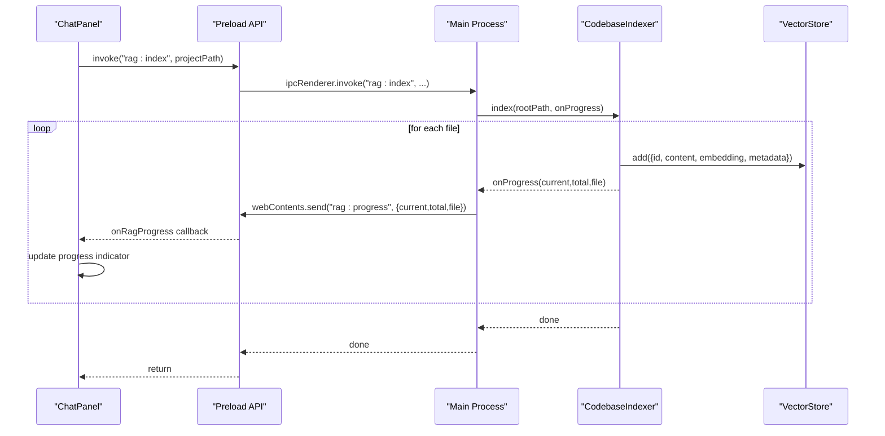
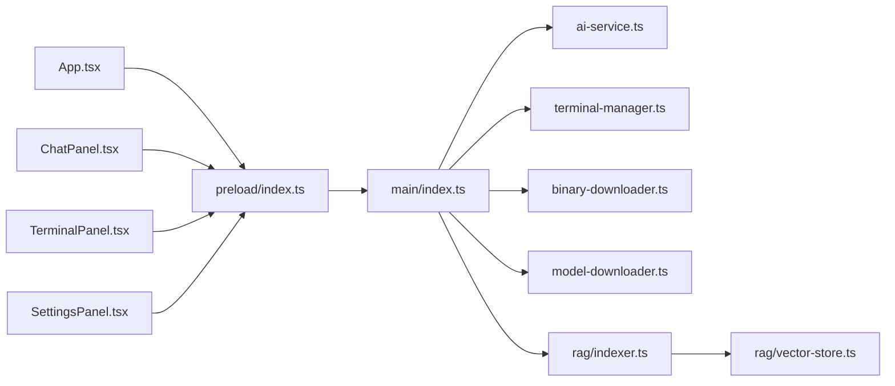

# Event Handling

<cite>
**Referenced Files in This Document**
- [src/main/index.ts](file://src/main/index.ts)
- [src/preload/index.ts](file://src/preload/index.ts)
- [src/renderer/App.tsx](file://src/renderer/App.tsx)
- [src/renderer/store/appStore.tsx](file://src/renderer/store/appStore.tsx)
- [src/renderer/components/ChatPanel.tsx](file://src/renderer/components/ChatPanel.tsx)
- [src/renderer/components/TerminalPanel.tsx](file://src/renderer/components/TerminalPanel.tsx)
- [src/renderer/components/SettingsPanel.tsx](file://src/renderer/components/SettingsPanel.tsx)
- [src/main/ai-service.ts](file://src/main/ai-service.ts)
- [src/main/terminal-manager.ts](file://src/main/terminal-manager.ts)
- [src/main/binary-downloader.ts](file://src/main/binary-downloader.ts)
- [src/main/model-downloader.ts](file://src/main/model-downloader.ts)
- [src/main/rag/vector-store.ts](file://src/main/rag/vector-store.ts)
- [src/main/rag/workspace-indexer.ts](file://src/main/rag/workspace-indexer.ts)
- [src/main/rag/indexer.ts](file://src/main/rag/indexer.ts)
</cite>

## Table of Contents
1. [Introduction](#introduction)
2. [Project Structure](#project-structure)
3. [Core Components](#core-components)
4. [Architecture Overview](#architecture-overview)
5. [Detailed Component Analysis](#detailed-component-analysis)
6. [Dependency Analysis](#dependency-analysis)
7. [Performance Considerations](#performance-considerations)
8. [Troubleshooting Guide](#troubleshooting-guide)
9. [Conclusion](#conclusion)

## Introduction
This document explains BitNet IDE’s event handling patterns across both the Electron main process and renderer process. It covers:
- Renderer-to-main IPC events for window state, settings, and user interactions
- Main-to-renderer events for streaming AI responses, downloads, terminal output, and RAG indexing updates
- Event-driven architecture, subscription mechanisms, and cleanup procedures
- Examples of event handling in React components, state synchronization, and real-time updates
- Event ordering, buffering strategies, and performance optimizations
- Error propagation, retries, and fallback strategies
- Debugging and monitoring approaches for event flow

## Project Structure
BitNet IDE follows a classic Electron architecture:
- Main process orchestrates long-running services (AI server, downloads, terminal, RAG)
- Preload exposes a typed API surface to the renderer
- Renderer renders UI, manages state, and subscribes to asynchronous events

```mermaid
graph TB
subgraph "Renderer"
APP["App.tsx"]
STORE["appStore.tsx"]
CHAT["ChatPanel.tsx"]
TERM["TerminalPanel.tsx"]
SETT["SettingsPanel.tsx"]
PRELOAD["preload/index.ts"]
end
subgraph "Main"
MAINIDX["main/index.ts"]
AISVC["ai-service.ts"]
TERMMGR["terminal-manager.ts"]
BINDL["binary-downloader.ts"]
MODDL["model-downloader.ts"]
VSTORE["rag/vector-store.ts"]
IDX["rag/indexer.ts"]
end
PRELOAD <- --> MAINIDX
APP --> PRELOAD
CHAT --> PRELOAD
TERM --> PRELOAD
SETT --> PRELOAD
MAINIDX --> AISVC
MAINIDX --> TERMMGR
MAINIDX --> BINDL
MAINIDX --> MODDL
MAINIDX --> IDX
IDX --> VSTORE
```

**Diagram sources**
- [src/main/index.ts](file://src/main/index.ts#L118-L535)
- [src/preload/index.ts](file://src/preload/index.ts#L1-L128)
- [src/renderer/App.tsx](file://src/renderer/App.tsx#L1-L302)
- [src/renderer/store/appStore.tsx](file://src/renderer/store/appStore.tsx#L1-L357)
- [src/renderer/components/ChatPanel.tsx](file://src/renderer/components/ChatPanel.tsx#L1-L1021)
- [src/renderer/components/TerminalPanel.tsx](file://src/renderer/components/TerminalPanel.tsx#L1-L312)
- [src/renderer/components/SettingsPanel.tsx](file://src/renderer/components/SettingsPanel.tsx#L1-L427)
- [src/main/ai-service.ts](file://src/main/ai-service.ts#L1-L323)
- [src/main/terminal-manager.ts](file://src/main/terminal-manager.ts#L1-L111)
- [src/main/binary-downloader.ts](file://src/main/binary-downloader.ts#L1-L162)
- [src/main/model-downloader.ts](file://src/main/model-downloader.ts#L1-L483)
- [src/main/rag/vector-store.ts](file://src/main/rag/vector-store.ts#L1-L84)
- [src/main/rag/indexer.ts](file://src/main/rag/indexer.ts#L1-L127)

**Section sources**
- [src/main/index.ts](file://src/main/index.ts#L1-L558)
- [src/preload/index.ts](file://src/preload/index.ts#L1-L128)

## Core Components
- Main process IPC handlers: centralized in the main entry, exposing window controls, settings, filesystem, AI, downloads, terminal, RAG, and LSP APIs
- Preload bridge: wraps ipcRenderer with typed invoke/on methods and returns removal functions for cleanup
- Renderer state and subscriptions: useApp/useReducer for state, useEffect hooks to subscribe/unsubscribe to events
- AI streaming: streamed chunks delivered via HTTP streaming to the main process, which forwards to renderer
- Downloads: progress callbacks invoked from main to renderer
- Terminal: PTY spawned per session; output and exit events forwarded to renderer
- RAG: periodic progress callbacks during indexing; results stored in a vector store

**Section sources**
- [src/main/index.ts](file://src/main/index.ts#L118-L535)
- [src/preload/index.ts](file://src/preload/index.ts#L1-L128)
- [src/renderer/App.tsx](file://src/renderer/App.tsx#L139-L156)
- [src/renderer/store/appStore.tsx](file://src/renderer/store/appStore.tsx#L1-L357)

## Architecture Overview
The event flow is unidirectional from main to renderer for long-running operations, and bidirectional for user-triggered actions.



**Diagram sources**
- [src/main/index.ts](file://src/main/index.ts#L276-L326)
- [src/main/ai-service.ts](file://src/main/ai-service.ts#L240-L314)
- [src/preload/index.ts](file://src/preload/index.ts#L33-L50)
- [src/renderer/components/ChatPanel.tsx](file://src/renderer/components/ChatPanel.tsx#L89-L105)

## Detailed Component Analysis

### Renderer-to-Main Events (User Interactions and Window State)
- Window controls: minimize, maximize, close, isMaximized; main emits window:maximizeChanged on state change
- Settings: get/save; main persists to disk and merges changes
- Filesystem: open folder, read/write/patch/delete, search, lint
- AI: start/stop server, get status, chat, chatStream, stopStream, analyze codebase
- Models: list available, select directory, download/cancel/scan/delete
- Binary: download/cancel
- Terminal: create/write/resize/kill, get shells, execute commands
- RAG: index, status, retrieve
- LSP: definition, hover, document symbols

Cleanup:
- Preload on* methods return removal functions; components should unsubscribe in useEffect return

**Section sources**
- [src/main/index.ts](file://src/main/index.ts#L118-L535)
- [src/preload/index.ts](file://src/preload/index.ts#L1-L128)
- [src/renderer/App.tsx](file://src/renderer/App.tsx#L44-L96)

### Main-to-Renderer Events (Streaming and Notifications)
- AI streaming: ai:streamChunk and ai:streamEnd emitted during AIService chatStream
- Models: models:downloadProgress, models:downloadComplete, models:downloadError
- Binary: binary:progress
- Terminal: terminal:data and terminal:exit
- RAG: rag:progress during indexing

Ordering and buffering:
- Streaming chunks are forwarded as they arrive; main buffers via http request streaming
- Progress events are throttled by service callbacks; UI updates incrementally

**Section sources**
- [src/main/index.ts](file://src/main/index.ts#L307-L322)
- [src/main/index.ts](file://src/main/index.ts#L409-L425)
- [src/main/index.ts](file://src/main/index.ts#L447-L458)
- [src/main/index.ts](file://src/main/index.ts#L465-L499)
- [src/main/index.ts](file://src/main/index.ts#L504-L510)
- [src/main/ai-service.ts](file://src/main/ai-service.ts#L240-L314)
- [src/main/model-downloader.ts](file://src/main/model-downloader.ts#L275-L303)
- [src/main/binary-downloader.ts](file://src/main/binary-downloader.ts#L17-L76)
- [src/main/terminal-manager.ts](file://src/main/terminal-manager.ts#L49-L62)
- [src/main/rag/indexer.ts](file://src/main/rag/indexer.ts#L18-L73)

### Event Subscription Mechanisms and Cleanup
- Preload exposes on* methods that register ipcRenderer listeners and return a removal function
- Components subscribe in useEffect and unsubscribe in the return cleanup function
- Typical pattern:
  - const unsub = window.electronAPI.onDownloadProgress((data) => {...})
  - return () => unsub()

Examples:
- App.tsx subscribes to download progress/error/complete
- ChatPanel subscribes to streamChunk/streamEnd and RAG progress
- TerminalPanel subscribes to terminal:data and terminal:exit

**Section sources**
- [src/preload/index.ts](file://src/preload/index.ts#L39-L50)
- [src/preload/index.ts](file://src/preload/index.ts#L59-L73)
- [src/preload/index.ts](file://src/preload/index.ts#L78-L82)
- [src/preload/index.ts](file://src/preload/index.ts#L94-L103)
- [src/preload/index.ts](file://src/preload/index.ts#L109-L113)
- [src/renderer/App.tsx](file://src/renderer/App.tsx#L139-L156)
- [src/renderer/components/ChatPanel.tsx](file://src/renderer/components/ChatPanel.tsx#L89-L105)
- [src/renderer/components/TerminalPanel.tsx](file://src/renderer/components/TerminalPanel.tsx#L48-L72)

### State Synchronization Patterns
- Centralized state via useReducer in appStore.tsx
- Actions dispatched on event callbacks to keep UI in sync
- Example: DOWNLOAD_PROGRESS action updates downloadStatus; SettingsPanel reads from state to render progress bars

**Section sources**
- [src/renderer/store/appStore.tsx](file://src/renderer/store/appStore.tsx#L176-L335)
- [src/renderer/components/SettingsPanel.tsx](file://src/renderer/components/SettingsPanel.tsx#L25-L45)

### Real-Time Update Mechanisms
- Streaming: streamChunk updates the last assistant message content incrementally
- Terminal: terminal:data writes incremental output to xterm instances
- Progress: periodic callbacks update progress bars and status indicators

**Section sources**
- [src/renderer/components/ChatPanel.tsx](file://src/renderer/components/ChatPanel.tsx#L89-L105)
- [src/renderer/components/TerminalPanel.tsx](file://src/renderer/components/TerminalPanel.tsx#L48-L72)
- [src/renderer/components/SettingsPanel.tsx](file://src/renderer/components/SettingsPanel.tsx#L250-L281)

### AI Streaming Flow


**Diagram sources**
- [src/main/index.ts](file://src/main/index.ts#L307-L322)
- [src/main/ai-service.ts](file://src/main/ai-service.ts#L240-L314)
- [src/preload/index.ts](file://src/preload/index.ts#L41-L50)
- [src/renderer/components/ChatPanel.tsx](file://src/renderer/components/ChatPanel.tsx#L89-L105)

### Terminal Output Flow


**Diagram sources**
- [src/main/index.ts](file://src/main/index.ts#L465-L499)
- [src/main/terminal-manager.ts](file://src/main/terminal-manager.ts#L24-L75)
- [src/preload/index.ts](file://src/preload/index.ts#L94-L103)
- [src/renderer/components/TerminalPanel.tsx](file://src/renderer/components/TerminalPanel.tsx#L48-L72)

### RAG Indexing Updates


**Diagram sources**
- [src/main/index.ts](file://src/main/index.ts#L504-L510)
- [src/main/rag/indexer.ts](file://src/main/rag/indexer.ts#L18-L73)
- [src/preload/index.ts](file://src/preload/index.ts#L109-L113)
- [src/renderer/components/ChatPanel.tsx](file://src/renderer/components/ChatPanel.tsx#L174-L179)

### Settings and Session Persistence
- Renderer loads settings on mount and restores session (project tree, open files, active file)
- On changes, saves settings to main; main persists to disk
- Theme applied via DOM attribute

**Section sources**
- [src/renderer/App.tsx](file://src/renderer/App.tsx#L44-L118)
- [src/main/index.ts](file://src/main/index.ts#L56-L76)

### Error Propagation and Fallback Strategies
- AI server start failure reported to UI; state set to disconnected
- AIService returns structured errors; main forwards to renderer
- Model download cancellation handled via AbortController; UI shows “Cancelled”
- Terminal errors are colorized and surfaced via stderr channel
- RAG indexing stops gracefully on request; UI reflects progress until completion

**Section sources**
- [src/renderer/App.tsx](file://src/renderer/App.tsx#L120-L137)
- [src/main/ai-service.ts](file://src/main/ai-service.ts#L85-L88)
- [src/main/model-downloader.ts](file://src/main/model-downloader.ts#L305-L311)
- [src/main/terminal-manager.ts](file://src/main/terminal-manager.ts#L53-L57)
- [src/main/rag/indexer.ts](file://src/main/rag/indexer.ts#L75-L79)

## Dependency Analysis


**Diagram sources**
- [src/main/index.ts](file://src/main/index.ts#L1-L558)
- [src/main/ai-service.ts](file://src/main/ai-service.ts#L1-L323)
- [src/main/terminal-manager.ts](file://src/main/terminal-manager.ts#L1-L111)
- [src/main/binary-downloader.ts](file://src/main/binary-downloader.ts#L1-L162)
- [src/main/model-downloader.ts](file://src/main/model-downloader.ts#L1-L483)
- [src/main/rag/indexer.ts](file://src/main/rag/indexer.ts#L1-L127)
- [src/main/rag/vector-store.ts](file://src/main/rag/vector-store.ts#L1-L84)
- [src/preload/index.ts](file://src/preload/index.ts#L1-L128)
- [src/renderer/App.tsx](file://src/renderer/App.tsx#L1-L302)
- [src/renderer/components/ChatPanel.tsx](file://src/renderer/components/ChatPanel.tsx#L1-L1021)
- [src/renderer/components/TerminalPanel.tsx](file://src/renderer/components/TerminalPanel.tsx#L1-L312)
- [src/renderer/components/SettingsPanel.tsx](file://src/renderer/components/SettingsPanel.tsx#L1-L427)

**Section sources**
- [src/main/index.ts](file://src/main/index.ts#L1-L558)
- [src/preload/index.ts](file://src/preload/index.ts#L1-L128)

## Performance Considerations
- Streaming: minimal buffering in AIService; renderer composes content incrementally
- Terminal: xterm FitAddon and ResizeObserver used to avoid layout thrashing
- Downloads: resume support and throttled progress updates reduce overhead
- RAG: periodic saves and chunked embedding creation prevent memory spikes
- Debouncing: project-wide linting runs once on initial project load

[No sources needed since this section provides general guidance]

## Troubleshooting Guide
- AI server not starting:
  - Check server binary path and model path in settings
  - Inspect stderr captured by AIService; UI shows disconnected state
- Streaming not received:
  - Confirm onStreamChunk subscription in ChatPanel
  - Verify main forwards ai:streamChunk and ai:streamEnd
- Terminal output missing:
  - Ensure terminal:create succeeded and onTerminalData subscribed
  - Check terminal:data normalization and xterm.write calls
- Download stuck:
  - Use cancelDownload; verify AbortController usage
  - Check progress mapping and UI state transitions
- RAG progress not visible:
  - Confirm onRagProgress subscription and periodic onProgress calls
  - Ensure VectorStore.save is called periodically

**Section sources**
- [src/renderer/App.tsx](file://src/renderer/App.tsx#L120-L137)
- [src/renderer/components/ChatPanel.tsx](file://src/renderer/components/ChatPanel.tsx#L89-L105)
- [src/renderer/components/TerminalPanel.tsx](file://src/renderer/components/TerminalPanel.tsx#L48-L72)
- [src/renderer/components/SettingsPanel.tsx](file://src/renderer/components/SettingsPanel.tsx#L276-L281)
- [src/main/ai-service.ts](file://src/main/ai-service.ts#L48-L88)
- [src/main/terminal-manager.ts](file://src/main/terminal-manager.ts#L49-L62)
- [src/main/model-downloader.ts](file://src/main/model-downloader.ts#L305-L311)
- [src/main/rag/indexer.ts](file://src/main/rag/indexer.ts#L63-L73)

## Conclusion
BitNet IDE employs a robust event-driven architecture:
- Main-to-renderer events deliver real-time updates for AI streaming, downloads, terminal output, and RAG progress
- Preload provides a typed, cleanup-friendly API for IPC
- Renderer state remains synchronized via reducers and targeted actions
- Services encapsulate long-running tasks with structured error handling and progress reporting
- The design supports scalability, maintainability, and responsive UX through careful event ordering and buffering