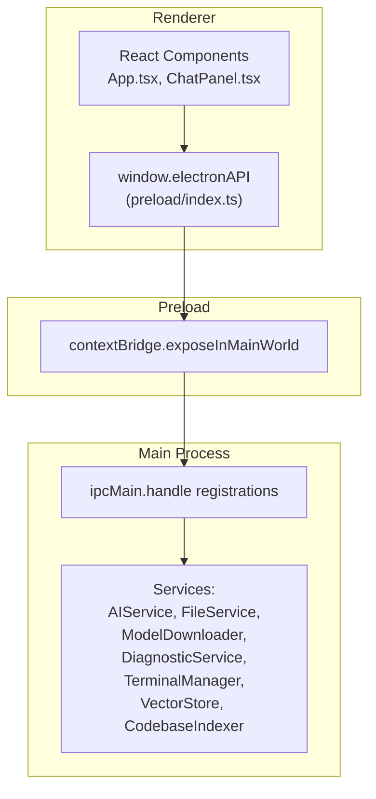
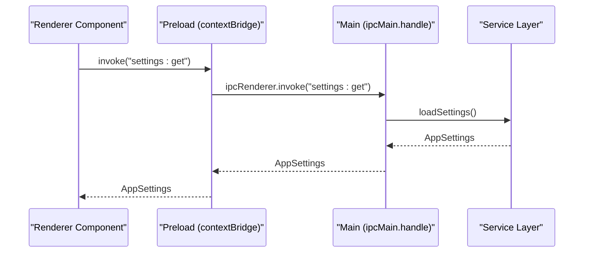
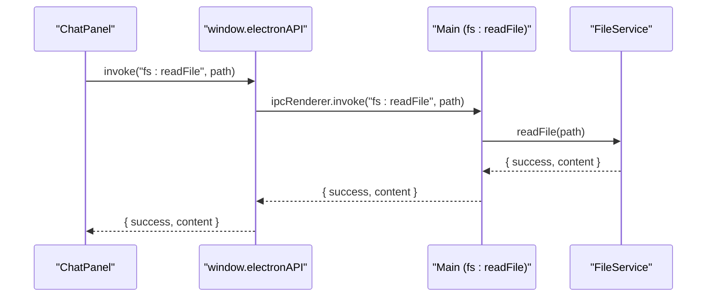
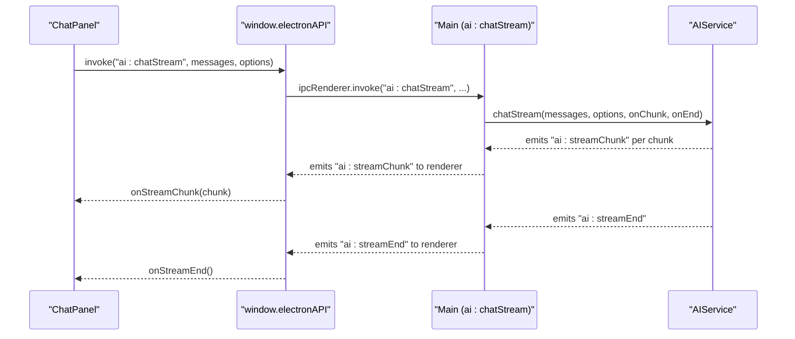
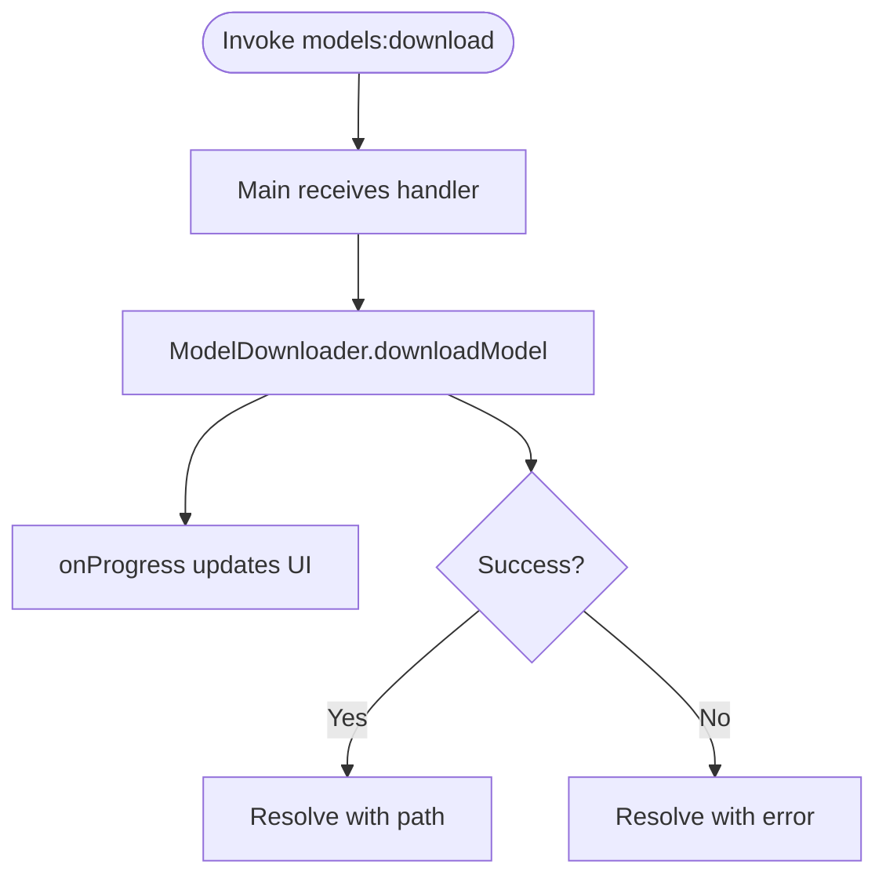
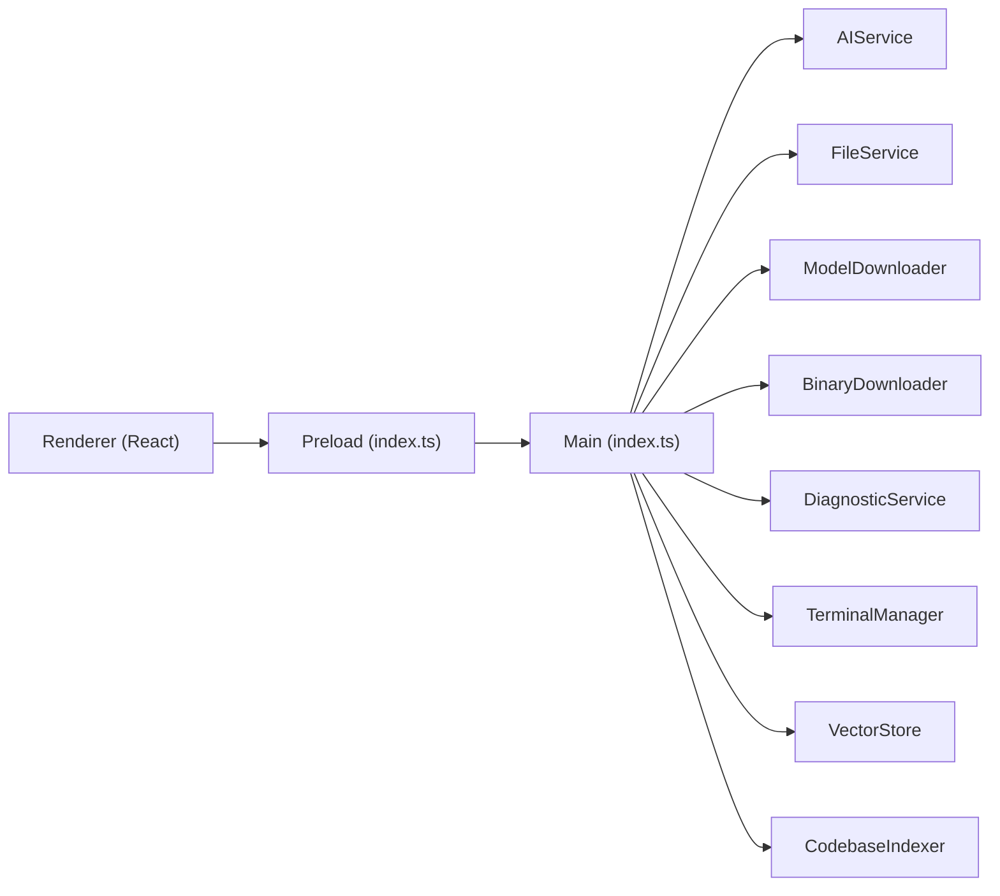

# IPC Handlers

<cite>
**Referenced Files in This Document**
- [src/main/index.ts](file://src/main/index.ts)
- [src/preload/index.ts](file://src/preload/index.ts)
- [src/main/ai-service.ts](file://src/main/ai-service.ts)
- [src/main/model-downloader.ts](file://src/main/model-downloader.ts)
- [src/main/file-service.ts](file://src/main/file-service.ts)
- [src/main/diagnostic-service.ts](file://src/main/diagnostic-service.ts)
- [src/main/terminal-manager.ts](file://src/main/terminal-manager.ts)
- [src/main/binary-downloader.ts](file://src/main/binary-downloader.ts)
- [src/main/rag/vector-store.ts](file://src/main/rag/vector-store.ts)
- [src/main/rag/indexer.ts](file://src/main/rag/indexer.ts)
- [src/renderer/App.tsx](file://src/renderer/App.tsx)
- [src/renderer/components/ChatPanel.tsx](file://src/renderer/components/ChatPanel.tsx)
</cite>

## Table of Contents
1. [Introduction](#introduction)
2. [Project Structure](#project-structure)
3. [Core Components](#core-components)
4. [Architecture Overview](#architecture-overview)
5. [Detailed Component Analysis](#detailed-component-analysis)
6. [Dependency Analysis](#dependency-analysis)
7. [Performance Considerations](#performance-considerations)
8. [Troubleshooting Guide](#troubleshooting-guide)
9. [Conclusion](#conclusion)

## Introduction
This document explains BitNet IDE’s Inter-Process Communication (IPC) handlers that connect Electron’s main process and renderer process. It covers all ipcMain.handle registrations, the preload contextBridge surface, and how renderer components call these handlers using ipcRenderer.invoke. It also documents asynchronous patterns, promise-based returns, streaming data handling, security considerations, and debugging techniques.

## Project Structure
The IPC layer is implemented across three areas:
- Main process: registers handlers for window controls, settings, file system, AI service, model downloads, binaries, terminals, and RAG.
- Preload: exposes a typed ElectronAPI surface via contextBridge for renderer-safe calls.
- Renderer: invokes handlers to perform operations and subscribe to events.

**Diagram sources**
- [src/main/index.ts](file://src/main/index.ts#L116-L519)
- [src/preload/index.ts](file://src/preload/index.ts#L1-L120)

**Section sources**
- [src/main/index.ts](file://src/main/index.ts#L116-L519)
- [src/preload/index.ts](file://src/preload/index.ts#L1-L120)

## Core Components
This section enumerates all ipcMain.handle registrations grouped by domain, with function signatures, parameter types, return value specifications, and error handling patterns. It also lists the corresponding preload exposure and typical renderer usage patterns.

- Window Controls
  - window:minimize: () => void
  - window:maximize: () => void
  - window:close: () => void
  - window:isMaximized: () => boolean
  - Preload: expose minimize, maximize, close, isMaximized; register onMaximizeChange listener
  - Renderer usage: invoke and listen for maximize change

- Settings
  - settings:get: () => AppSettings
  - settings:save: (newSettings: Partial<AppSettings>) => AppSettings
  - Preload: expose getSettings, saveSettings
  - Renderer usage: load/save settings and react to changes

- File System
  - fs:selectFile: () => string | null
  - fs:openFolder: () => { path: string; tree: FileTreeNode[] } | null
  - fs:readFile: (path: string) => { success: boolean; content?: string; error?: string }
  - fs:writeFile: (path: string, content: string) => { success: boolean; error?: string }
  - fs:patchFile: (path: string, patches: { search: string; replace: string }[]) => { success: boolean; error?: string }
  - fs:lintCodebase: (projectPath: string) => Promise<{ success: boolean; problems?: CodeProblem[]; error?: string }>
  - fs:getFileTree: (folderPath: string) => FileTreeNode[]
  - fs:createFile: (filePath: string) => { success: boolean; error?: string }
  - fs:createFolder: (folderPath: string) => { success: boolean; error?: string }
  - fs:rename: (oldPath: string, newPath: string) => { success: boolean; error?: string }
  - fs:delete: (filePath: string) => { success: boolean; error?: string }
  - fs:searchInFiles: (dir: string, query: string) => { file: string; line: number; content: string }[]
  - Preload: expose selectFile, openFolder, readFile, writeFile, patchFile, lintCodebase, getFileTree, createFile, createFolder, rename, delete, searchInFiles
  - Renderer usage: invoke for CRUD and search; openFolder returns tree

- AI Service
  - ai:startServer: () => Promise<{ success: boolean; error?: string }>
  - ai:stopServer: () => Promise<void>
  - ai:getStatus: () => { running: boolean; port: number }
  - ai:chat: (messages: Array<{ role: string; content: string }>, options?: { maxTokens?: number; temperature?: number }) => Promise<{ success: boolean; content?: string; error?: string }>
  - ai:chatStream: (messages: Array<{ role: string; content: string }>, options?: { maxTokens?: number; temperature?: number }) => Promise<{ success: boolean; error?: string }>
  - ai:stopStream: () => void
  - ai:analyzeCodebase: (projectPath: string) => Promise<{ success: boolean; summary?: string; error?: string }>
  - Events: ai:streamChunk, ai:streamEnd
  - Preload: expose startAIServer, stopAIServer, getAIStatus, chat, chatStream, stopStream, analyzeCodebase; register onStreamChunk/onStreamEnd listeners
  - Renderer usage: invoke chat/chatStream; subscribe to streaming events

- Model Downloader
  - models:getAvailable: () => ModelInfo[]
  - models:selectDirectory: () => string | null
  - models:download: (modelId: string, targetDir: string) => Promise<{ success: boolean; path?: string; error?: string }>
  - models:cancelDownload: () => void
  - models:scanLocal: (directory: string) => Array<{ name: string; path: string; size: string }>
  - models:delete: (filePath: string) => Promise<{ success: boolean; error?: string }>
  - Events: models:downloadProgress, models:downloadComplete, models:downloadError
  - Preload: expose getAvailableModels, selectDirectory, downloadModel, cancelDownload, scanLocalModels, deleteModel; register onDownloadProgress/onDownloadComplete/onDownloadError listeners
  - Renderer usage: invoke download/cancel; subscribe to progress and completion

- Binary Downloader
  - binary:download: (targetDir: string) => Promise<{ success: boolean; path?: string; error?: string }>
  - binary:cancel: () => void
  - Events: binary:progress
  - Preload: expose downloadBinary, cancelBinaryDownload; register onBinaryDownloadProgress listener
  - Renderer usage: invoke download/cancel; subscribe to progress

- Shell and Terminal
  - shell:openExternal: (url: string) => void
  - terminal:create: (id: string, shell: string, cwd: string) => Promise<{ success: boolean; error?: string }>
  - terminal:write: (id: string, data: string) => void
  - terminal:resize: (id: string, cols: number, rows: number) => void
  - terminal:kill: (id: string) => void
  - terminal:getShells: () => string[]
  - terminal:execute: (command: string, cwd?: string) => Promise<{ stdout: string; stderr: string; code: number }>
  - Events: terminal:data, terminal:exit
  - Preload: expose executeCommand, openExternal; createTerminal/writeTerminal/resizeTerminal/killTerminal/getShells; register onTerminalData/onTerminalExit listeners
  - Renderer usage: invoke commands; subscribe to terminal output

- RAG System
  - rag:index: (projectPath: string) => Promise<{ success: boolean }>
  - rag:status: () => { count: number; path: string }
  - rag:retrieve: (query: string) => Promise<(Document & { score: number })[]>
  - Events: rag:progress
  - Preload: expose indexCodebase, getRagStatus, ragRetrieve; register onRagProgress listener
  - Renderer usage: invoke index/status/retrieve; subscribe to progress

**Section sources**
- [src/main/index.ts](file://src/main/index.ts#L116-L519)
- [src/preload/index.ts](file://src/preload/index.ts#L1-L120)

## Architecture Overview
The IPC architecture follows a clear separation:
- Main process: centralizes all heavy operations (spawning servers, file IO, network downloads, terminal spawning).
- Preload: exposes a safe, typed API surface to renderer via contextBridge.
- Renderer: orchestrates UI interactions and delegates to preload, which invokes main.

**Diagram sources**
- [src/main/index.ts](file://src/main/index.ts#L135-L142)
- [src/preload/index.ts](file://src/preload/index.ts#L15-L17)

**Section sources**
- [src/main/index.ts](file://src/main/index.ts#L116-L519)
- [src/preload/index.ts](file://src/preload/index.ts#L1-L120)

## Detailed Component Analysis

### Window Controls
- Handlers
  - window:minimize, window:maximize, window:close, window:isMaximized
- Preload
  - Exposes minimize, maximize, close, isMaximized
  - Registers onMaximizeChange listener to notify renderer of maximize state changes
- Renderer usage
  - Components call minimize/maximize/close
  - Subscribe to onMaximizeChange to update UI state

**Section sources**
- [src/main/index.ts](file://src/main/index.ts#L123-L134)
- [src/preload/index.ts](file://src/preload/index.ts#L4-L13)

### Settings Management
- Handlers
  - settings:get: returns current AppSettings
  - settings:save: merges incoming partial settings and persists
- Preload
  - Exposes getSettings, saveSettings
- Renderer usage
  - Load settings on startup and save on changes
  - Example usage in App.tsx initializes UI and restores session

**Section sources**
- [src/main/index.ts](file://src/main/index.ts#L135-L142)
- [src/preload/index.ts](file://src/preload/index.ts#L15-L17)
- [src/renderer/App.tsx](file://src/renderer/App.tsx#L44-L96)

### File System Operations
- Handlers
  - fs:selectFile, fs:openFolder (returns tree), fs:getFileTree
  - fs:readFile, fs:writeFile, fs:patchFile
  - fs:lintCodebase (delegates to DiagnosticService)
  - fs:createFile, fs:createFolder, fs:rename, fs:delete
  - fs:searchInFiles (bounded results)
- Preload
  - Exposes all fs:* methods
- Renderer usage
  - App.tsx uses openFolder, getFileTree, readFile, writeFile, lintCodebase
  - ChatPanel.tsx uses readFile for file mentions

**Diagram sources**
- [src/main/index.ts](file://src/main/index.ts#L167-L173)
- [src/main/file-service.ts](file://src/main/file-service.ts#L101-L108)
- [src/preload/index.ts](file://src/preload/index.ts#L19-L26)
- [src/renderer/components/ChatPanel.tsx](file://src/renderer/components/ChatPanel.tsx#L234-L240)

**Section sources**
- [src/main/index.ts](file://src/main/index.ts#L144-L271)
- [src/main/file-service.ts](file://src/main/file-service.ts#L1-L162)
- [src/main/diagnostic-service.ts](file://src/main/diagnostic-service.ts#L1-L65)
- [src/preload/index.ts](file://src/preload/index.ts#L19-L31)
- [src/renderer/App.tsx](file://src/renderer/App.tsx#L28-L41)
- [src/renderer/components/ChatPanel.tsx](file://src/renderer/components/ChatPanel.tsx#L222-L242)

### AI Service APIs
- Handlers
  - ai:startServer, ai:stopServer, ai:getStatus
  - ai:chat (non-streaming)
  - ai:chatStream (streaming chunks and end)
  - ai:stopStream
  - ai:analyzeCodebase
- Preload
  - Exposes startAIServer, stopAIServer, getAIStatus, chat, chatStream, stopStream, analyzeCodebase
  - Registers onStreamChunk/onStreamEnd listeners
- Renderer usage
  - App.tsx auto-starts server when entering IDE
  - ChatPanel.tsx uses chatStream and subscribes to streaming events

**Diagram sources**
- [src/main/index.ts](file://src/main/index.ts#L296-L323)
- [src/main/ai-service.ts](file://src/main/ai-service.ts#L240-L314)
- [src/preload/index.ts](file://src/preload/index.ts#L33-L50)
- [src/renderer/components/ChatPanel.tsx](file://src/renderer/components/ChatPanel.tsx#L89-L105)

**Section sources**
- [src/main/index.ts](file://src/main/index.ts#L273-L323)
- [src/main/ai-service.ts](file://src/main/ai-service.ts#L1-L323)
- [src/preload/index.ts](file://src/preload/index.ts#L33-L50)
- [src/renderer/App.tsx](file://src/renderer/App.tsx#L120-L137)
- [src/renderer/components/ChatPanel.tsx](file://src/renderer/components/ChatPanel.tsx#L196-L295)

### Model Downloading
- Handlers
  - models:getAvailable, models:selectDirectory
  - models:download (with progress callbacks)
  - models:cancelDownload
  - models:scanLocal, models:delete
- Preload
  - Exposes getAvailableModels, selectDirectory, downloadModel, cancelDownload, scanLocalModels, deleteModel
  - Registers onDownloadProgress/onDownloadComplete/onDownloadError listeners
- Renderer usage
  - ChatPanel.tsx loads local models and switches models; subscribes to download events

**Diagram sources**
- [src/main/index.ts](file://src/main/index.ts#L406-L422)
- [src/main/model-downloader.ts](file://src/main/model-downloader.ts#L275-L303)
- [src/preload/index.ts](file://src/preload/index.ts#L52-L73)
- [src/renderer/components/ChatPanel.tsx](file://src/renderer/components/ChatPanel.tsx#L132-L141)

**Section sources**
- [src/main/index.ts](file://src/main/index.ts#L392-L439)
- [src/main/model-downloader.ts](file://src/main/model-downloader.ts#L1-L483)
- [src/preload/index.ts](file://src/preload/index.ts#L52-L73)
- [src/renderer/components/ChatPanel.tsx](file://src/renderer/components/ChatPanel.tsx#L132-L141)

### Binary Downloader
- Handler
  - binary:download (with progress)
  - binary:cancel
- Preload
  - Exposes downloadBinary, cancelBinaryDownload
  - Registers onBinaryDownloadProgress listener
- Renderer usage
  - Subscribes to progress during binary acquisition

**Section sources**
- [src/main/index.ts](file://src/main/index.ts#L441-L455)
- [src/main/binary-downloader.ts](file://src/main/binary-downloader.ts#L1-L162)
- [src/preload/index.ts](file://src/preload/index.ts#L75-L82)

### Terminal Management
- Handlers
  - terminal:create, terminal:write, terminal:resize, terminal:kill, terminal:getShells
  - terminal:execute (spawns shell, returns stdout/stderr/code)
- Preload
  - Exposes createTerminal, writeTerminal, resizeTerminal, killTerminal, getShells
  - Registers onTerminalData/onTerminalExit listeners
- Renderer usage
  - ChatPanel.tsx demonstrates invoking terminal commands and subscribing to output

**Section sources**
- [src/main/index.ts](file://src/main/index.ts#L462-L496)
- [src/main/terminal-manager.ts](file://src/main/terminal-manager.ts#L1-L111)
- [src/preload/index.ts](file://src/preload/index.ts#L84-L103)
- [src/renderer/components/ChatPanel.tsx](file://src/renderer/components/ChatPanel.tsx#L447-L451)

### RAG System Endpoints
- Handlers
  - rag:index (background indexing with progress)
  - rag:status
  - rag:retrieve
- Preload
  - Exposes indexCodebase, getRagStatus, ragRetrieve
  - Registers onRagProgress listener
- Renderer usage
  - ChatPanel.tsx subscribes to progress and retrieves snippets

**Section sources**
- [src/main/index.ts](file://src/main/index.ts#L497-L518)
- [src/main/rag/vector-store.ts](file://src/main/rag/vector-store.ts#L1-L84)
- [src/main/rag/indexer.ts](file://src/main/rag/indexer.ts#L1-L127)
- [src/preload/index.ts](file://src/preload/index.ts#L105-L113)
- [src/renderer/components/ChatPanel.tsx](file://src/renderer/components/ChatPanel.tsx#L174-L194)

## Dependency Analysis
The main process composes several service classes that encapsulate domain logic. Handlers delegate to these services and emit events back to renderer via BrowserWindow.webContents.send or service callbacks.

**Diagram sources**
- [src/main/index.ts](file://src/main/index.ts#L5-L12)
- [src/preload/index.ts](file://src/preload/index.ts#L1-L120)

**Section sources**
- [src/main/index.ts](file://src/main/index.ts#L116-L519)

## Performance Considerations
- Streaming: ai:chatStream splits responses into chunks and emits ai:streamChunk and ai:streamEnd. This avoids blocking the UI and reduces perceived latency.
- Background work: rag:index runs asynchronously and reports progress via rag:progress. This prevents UI stalls during long indexing.
- Buffered IO: fs:searchInFiles caps results and skips non-text files to keep memory usage bounded.
- Terminal output normalization: terminal-manager normalizes line endings for xterm compatibility.
- Model scanning: models:scanLocal filters .gguf files and computes sizes efficiently.

[No sources needed since this section provides general guidance]

## Troubleshooting Guide
Common issues and resolutions:
- AI server does not start
  - Verify serverBinaryPath and modelPath are configured; ai:startServer returns an error message when missing.
  - Check logs from AIService health checks and stderr capture.
- Streaming stops unexpectedly
  - Call ai:stopStream to abort current request; ensure onStreamEnd is handled to reset UI state.
- File operations fail
  - Many fs:* handlers return { success, error } objects; inspect error messages and ensure paths exist.
- Model download interruptions
  - Use models:cancelDownload; resume downloads leverage .part files and Range requests.
- Terminal output not visible
  - Ensure terminal:create succeeded and onTerminalData is subscribed; confirm shell path and cwd are valid.
- RAG progress not reported
  - Confirm rag:index was invoked and onRagProgress listener is registered.

**Section sources**
- [src/main/index.ts](file://src/main/index.ts#L274-L286)
- [src/main/ai-service.ts](file://src/main/ai-service.ts#L85-L88)
- [src/main/model-downloader.ts](file://src/main/model-downloader.ts#L280-L302)
- [src/main/terminal-manager.ts](file://src/main/terminal-manager.ts#L49-L62)
- [src/renderer/components/ChatPanel.tsx](file://src/renderer/components/ChatPanel.tsx#L89-L105)

## Conclusion
BitNet IDE’s IPC design cleanly separates concerns between renderer, preload, and main process. Handlers are organized by domain, with robust error handling and event-driven streaming for long-running tasks. The preload layer ensures secure, typed access to main-process capabilities, enabling React components to perform powerful operations like AI chat, file management, model downloads, terminal control, and RAG indexing.