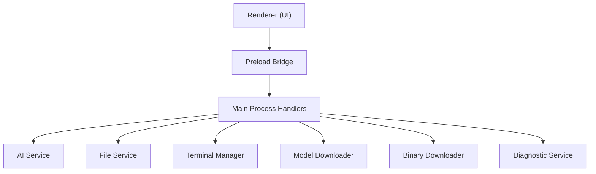
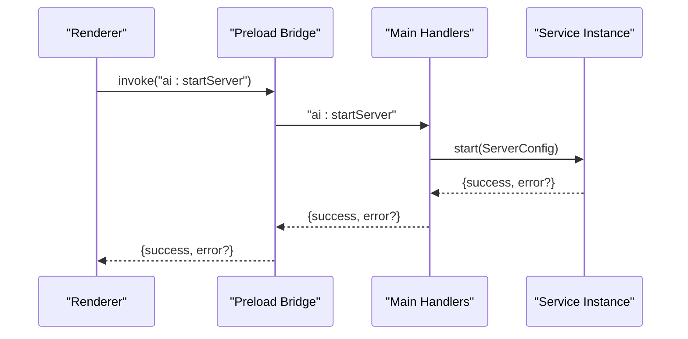
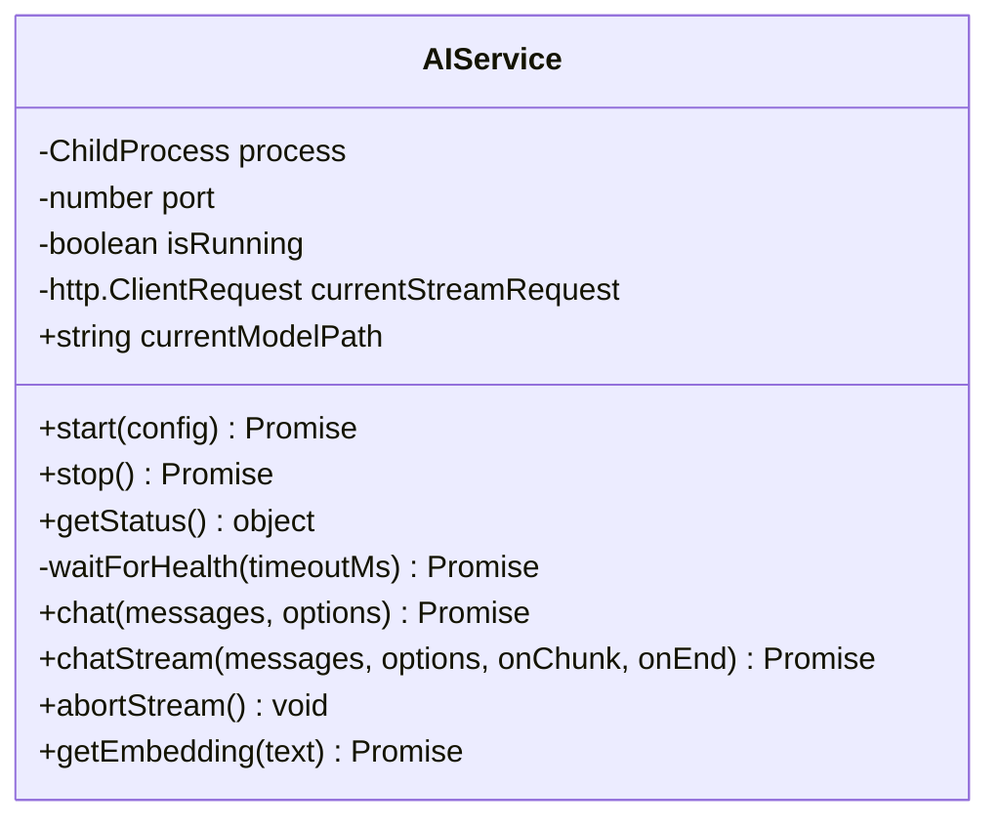
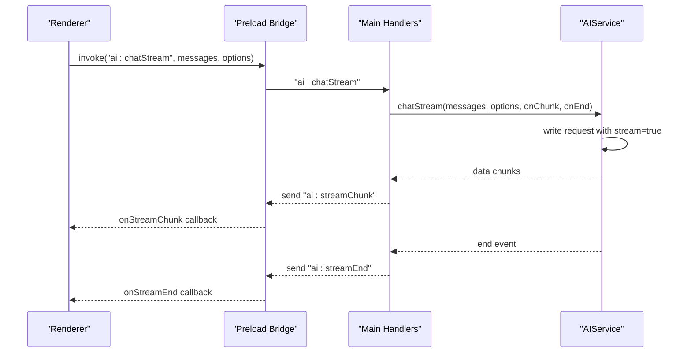
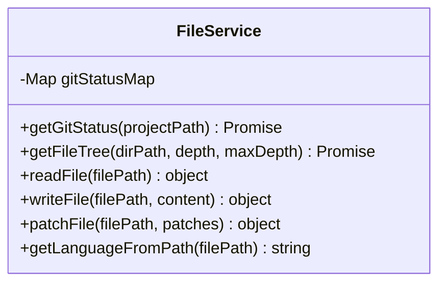
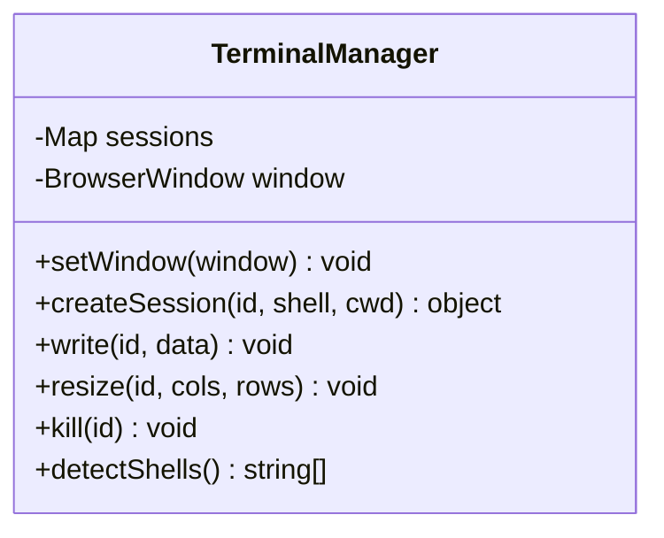
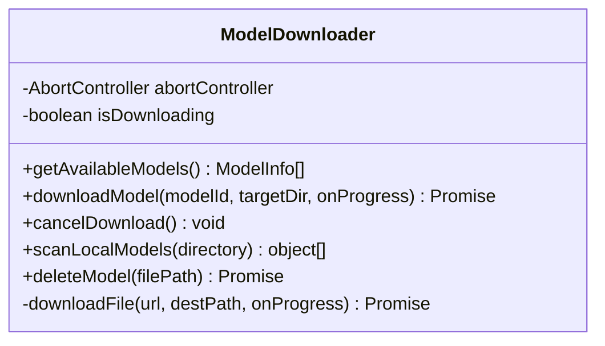
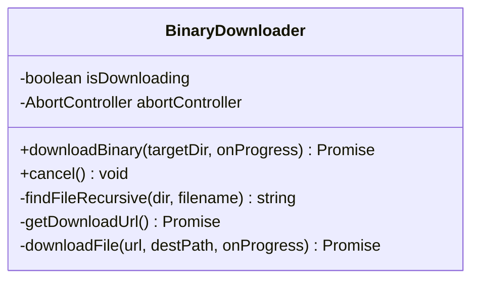
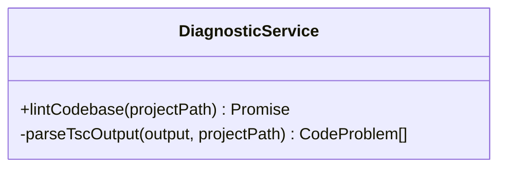
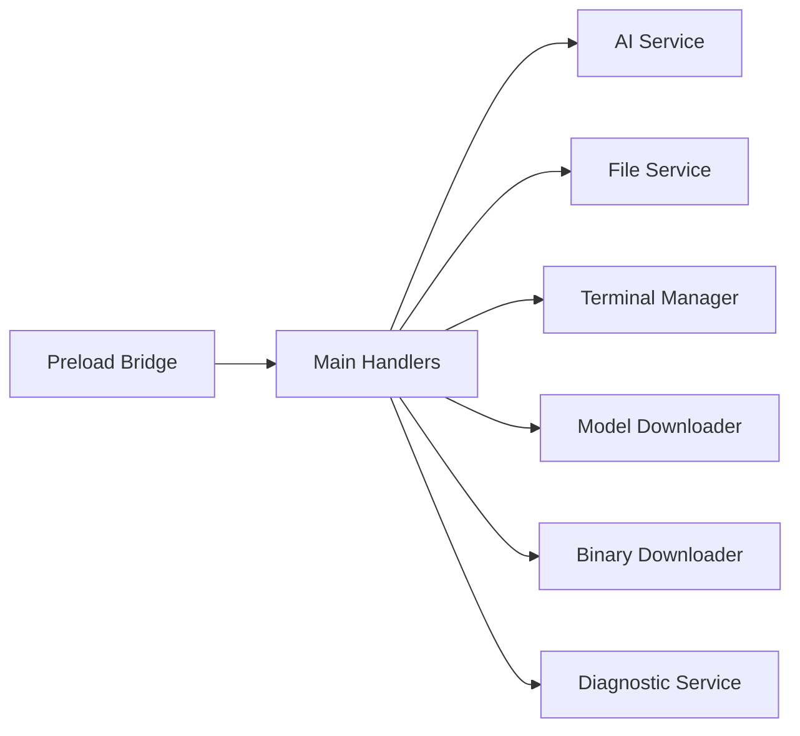

# Service Methods

<cite>
**Referenced Files in This Document**
- [ai-service.ts](file://src/main/ai-service.ts)
- [file-service.ts](file://src/main/file-service.ts)
- [terminal-manager.ts](file://src/main/terminal-manager.ts)
- [model-downloader.ts](file://src/main/model-downloader.ts)
- [binary-downloader.ts](file://src/main/binary-downloader.ts)
- [diagnostic-service.ts](file://src/main/diagnostic-service.ts)
- [index.ts](file://src/main/index.ts)
- [index.ts](file://src/preload/index.ts)
</cite>

## Table of Contents
1. [Introduction](#introduction)
2. [Project Structure](#project-structure)
3. [Core Components](#core-components)
4. [Architecture Overview](#architecture-overview)
5. [Detailed Component Analysis](#detailed-component-analysis)
6. [Dependency Analysis](#dependency-analysis)
7. [Performance Considerations](#performance-considerations)
8. [Troubleshooting Guide](#troubleshooting-guide)
9. [Conclusion](#conclusion)

## Introduction
This document describes the internal service methods powering BitNet IDE’s core functionality without direct IPC exposure. It covers:
- AI service methods for server lifecycle, chat operations, streaming responses, and embeddings
- File service methods for file operations, directory traversal, search, and Git integration
- Terminal manager methods for shell session creation, input/output handling, resize, and process management
- Model downloader methods for Hugging Face integration, progress tracking, cancellation, and local model scanning
It includes method signatures, parameter validation, return value specifications, error propagation patterns, usage examples, and performance/cleanup guidance.

## Project Structure
The services are implemented in the main process and exposed to the renderer via IPC handlers. The preload bridge exposes typed APIs to the renderer.

**Diagram sources**
- [index.ts](file://src/main/index.ts#L117-L520)
- [index.ts](file://src/preload/index.ts#L1-L120)

**Section sources**
- [index.ts](file://src/main/index.ts#L1-L543)
- [index.ts](file://src/preload/index.ts#L1-L120)

## Core Components
- AI Service: Manages an embedded server process, health checks, chat completions, streaming, and embeddings.
- File Service: Provides filesystem operations, directory tree traversal with Git status, file read/write/patch, and language detection.
- Terminal Manager: Creates and manages shell sessions, handles output/error streams, and process lifecycle.
- Model Downloader: Downloads GGUF models from Hugging Face, tracks progress, supports cancellation, and scans local models.
- Binary Downloader: Fetches and extracts llama.cpp server binaries, with progress and cancellation.
- Diagnostic Service: Runs TypeScript compiler diagnostics on a project.

**Section sources**
- [ai-service.ts](file://src/main/ai-service.ts#L12-L323)
- [file-service.ts](file://src/main/file-service.ts#L27-L162)
- [terminal-manager.ts](file://src/main/terminal-manager.ts#L12-L111)
- [model-downloader.ts](file://src/main/model-downloader.ts#L267-L483)
- [binary-downloader.ts](file://src/main/binary-downloader.ts#L7-L162)
- [diagnostic-service.ts](file://src/main/diagnostic-service.ts#L16-L65)

## Architecture Overview
The main process initializes services and registers IPC handlers. The preload bridge exposes typed methods to the renderer. Services are designed to be reusable and self-contained, with clear error propagation and resource management.

**Diagram sources**
- [index.ts](file://src/main/index.ts#L274-L287)
- [ai-service.ts](file://src/main/ai-service.ts#L19-L89)

**Section sources**
- [index.ts](file://src/main/index.ts#L117-L520)

## Detailed Component Analysis

### AI Service
Manages a local server process, health checks, chat, streaming, and embeddings.

- Lifecycle
  - start(config): Starts the server with provided binary, model, context size, threads, and port. Enables embedding endpoint. Returns a structured result with success flag and optional error. Validates running state and captures stderr for crash diagnostics.
  - stop(): Gracefully terminates the process with SIGTERM and fallback SIGKILL after timeout. Clears state and resolves when process exits.
  - getStatus(): Returns running status and port.
  - Private waitForHealth(timeoutMs): Polls /health until success or timeout.

- Chat Operations
  - chat(messages, options): Sends a non-streaming chat request to /v1/chat/completions. Options include maxTokens and temperature. Returns success flag and content or error.
  - chatStream(messages, options, onChunk, onEnd): Streams SSE-like chunks from /v1/chat/completions. Parses data lines, extracts delta content, and invokes callbacks. Supports abort via abortStream.
  - abortStream(): Destroys the current HTTP request to stop streaming.

- Embeddings
  - getEmbedding(text): Posts to /embedding endpoint and parses standardized embedding arrays from various server formats.

- Method Signatures and Validation
  - start(config): Validates running state; spawns process with configured args; waits for health; returns structured result.
  - chat(...): Validates inputs; constructs JSON payload; handles parse errors; returns structured result.
  - chatStream(...): Validates inputs; writes streaming payload; handles malformed chunks; ensures onEnd is invoked; returns structured result.
  - getEmbedding(text): Validates running state; posts JSON; parses response; returns numeric array or null.

- Error Propagation
  - Process errors captured via stderr and exit events; health timeout yields descriptive error; HTTP errors propagate via callbacks or structured results.

- Usage Examples
  - Starting server and chatting:
    - Renderer calls preload methods to start server and chat; main handlers delegate to AIService; renderer listens for stream chunks and ends.
  - Streaming with cancellation:
    - Renderer starts streaming, receives chunks, and calls stopStream to abort.

- Performance and Resource Management
  - Health polling interval and timeouts prevent busy loops.
  - Streaming buffers and line parsing handle SSE-like payloads efficiently.
  - Embedding requests are lightweight HTTP calls; ensure server is healthy before use.

**Section sources**
- [ai-service.ts](file://src/main/ai-service.ts#L12-L323)
- [index.ts](file://src/main/index.ts#L274-L324)

#### AI Service Class Diagram

**Diagram sources**
- [ai-service.ts](file://src/main/ai-service.ts#L12-L323)

#### AI Chat Streaming Flow

**Diagram sources**
- [index.ts](file://src/main/index.ts#L305-L320)
- [ai-service.ts](file://src/main/ai-service.ts#L240-L314)

### File Service
Provides filesystem operations and Git integration for directory trees.

- Directory Traversal
  - getFileTree(dirPath, depth, maxDepth): Recursively builds a tree of files and folders, respecting ignored directories and files. On initial depth 0, computes Git status for all items. Sorts directories first, then files, alphabetically. Returns nodes with optional gitStatus.

- Git Integration
  - getGitStatus(projectPath): Executes git status --porcelain=v1 --ignored and maps statuses to staged, untracked, ignored, modified, deleted. Stores a map keyed by absolute file paths.

- File Operations
  - readFile(filePath): Reads UTF-8 content; returns success and content or error.
  - writeFile(filePath, content): Writes UTF-8 content; returns success or error.
  - patchFile(filePath, patches): Validates existence, checks presence of each search term, replaces first occurrence, writes back; returns success or error.

- Utilities
  - getLanguageFromPath(filePath): Maps file extensions to language identifiers.

- Method Signatures and Validation
  - getFileTree(...): Validates depth limits; ignores configured sets; returns empty array on error.
  - getGitStatus(...): Captures stdout, parses porcelain format; stores map; resets on failure.
  - readFile(...): Returns structured result with error on exception.
  - writeFile(...): Returns structured result with error on exception.
  - patchFile(...): Validates file existence and search presence; returns structured result.

- Error Propagation
  - Directory reads and Git commands are wrapped; failures return empty trees or reset status maps.

- Usage Examples
  - Opening a folder in the UI triggers getFileTree; renderer displays tree with Git indicators.
  - Patching a file applies ordered replacements safely.

- Performance and Resource Management
  - Sorting and recursion are bounded by maxDepth; ignored sets reduce IO overhead.
  - Git status computed once per root traversal.

**Section sources**
- [file-service.ts](file://src/main/file-service.ts#L27-L162)
- [index.ts](file://src/main/index.ts#L145-L272)

#### File Service Class Diagram

**Diagram sources**
- [file-service.ts](file://src/main/file-service.ts#L27-L162)

### Terminal Manager
Creates and manages shell sessions, handles output/error streams, and process lifecycle.

- Session Management
  - createSession(id, shell, cwd): Spawns a child process for the detected shell on the platform. Normalizes output for xterm.js, sends data and exit events to renderer, and stores session state. Returns success or error.
  - write(id, data): Writes to the session stdin if present.
  - resize(id, cols, rows): No-op for spawn; PTY resizing not supported.
  - kill(id): Terminates the session and removes it from storage.
  - detectShells(): Returns platform-appropriate shells.

- Method Signatures and Validation
  - createSession(...): Validates platform, spawns process, wires listeners; returns structured result.
  - write(...): No-op if session missing.
  - resize(...): Intentionally no-op.
  - kill(...): Removes session if present.

- Error Propagation
  - Spawn failures return structured error; process exit emits code and cleans up.

- Usage Examples
  - Renderer creates a terminal session, writes commands, receives output, and handles exit.

- Performance and Resource Management
  - Sessions stored in-memory; ensure cleanup on exit to prevent leaks.

**Section sources**
- [terminal-manager.ts](file://src/main/terminal-manager.ts#L12-L111)
- [index.ts](file://src/main/index.ts#L463-L497)

#### Terminal Manager Class Diagram

**Diagram sources**
- [terminal-manager.ts](file://src/main/terminal-manager.ts#L12-L111)

### Model Downloader
Downloads GGUF models from Hugging Face, tracks progress, supports cancellation, and scans local models.

- Model Catalog
  - getAvailableModels(): Returns a curated list of available models with metadata.

- Download Workflow
  - downloadModel(modelId, targetDir, onProgress): Validates model, ensures target directory, downloads with resume support, emits progress updates, renames .part to final filename, and returns success with path or error.
  - cancelDownload(): Aborts current download via AbortController.
  - scanLocalModels(directory): Enumerates .gguf files, collects sizes, and returns metadata list.
  - deleteModel(filePath): Deletes model file; logs outcomes; returns success or error.

- Internal Download Logic
  - downloadFile(url, destPath, onProgress): Resumes partial downloads using Range headers; handles redirects; computes speed and progress; renames part file on completion.

- Method Signatures and Validation
  - downloadModel(...): Validates model existence and directory; returns structured result.
  - cancelDownload(): Idempotent; clears controller and state.
  - scanLocalModels(...): Returns empty list on errors; ignores exceptions.
  - deleteModel(...): Checks existence; returns structured result.

- Error Propagation
  - HTTP errors, too many redirects, rename failures, and cancellation propagate as errors.

- Usage Examples
  - Renderer lists available models, selects a directory, starts download, subscribes to progress, and handles completion/error events.

- Performance and Resource Management
  - Resume support reduces bandwidth; periodic progress updates avoid UI stalls; cleanup of partial files handled automatically.

**Section sources**
- [model-downloader.ts](file://src/main/model-downloader.ts#L267-L483)
- [index.ts](file://src/main/index.ts#L393-L440)

#### Model Downloader Class Diagram

**Diagram sources**
- [model-downloader.ts](file://src/main/model-downloader.ts#L267-L483)

### Binary Downloader
Fetches and extracts llama.cpp server binaries with progress and cancellation.

- Workflow
  - downloadBinary(targetDir, onProgress): Fetches latest release info, downloads zip, extracts to bin subdirectory, verifies presence of binary, and returns success with path or error.
  - cancel(): Aborts ongoing download via AbortController.
  - findFileRecursive(dir, filename): Recursively locates the binary after extraction.

- Method Signatures and Validation
  - downloadBinary(...): Guards against concurrent downloads; returns structured result.
  - cancel(): Clears controller and state.

- Error Propagation
  - Release fetch failures, missing binary after extraction, and download errors propagate as errors.

- Usage Examples
  - Renderer triggers binary download, subscribes to progress, and receives completion with path.

- Performance and Resource Management
  - Uses streaming download and targeted extraction; cleans up temporary zip file.

**Section sources**
- [binary-downloader.ts](file://src/main/binary-downloader.ts#L7-L162)
- [index.ts](file://src/main/index.ts#L442-L456)

#### Binary Downloader Class Diagram

**Diagram sources**
- [binary-downloader.ts](file://src/main/binary-downloader.ts#L7-L162)

### Diagnostic Service
Runs TypeScript compiler diagnostics on a project.

- Workflow
  - lintCodebase(projectPath): Executes tsc with flags to emit diagnostics without compilation; parses output into structured problems; returns success with problems or error.

- Method Signatures and Validation
  - lintCodebase(...): Validates path existence; returns structured result.

- Error Propagation
  - Exceptions and non-zero exit codes are captured and returned as errors.

- Usage Examples
  - Renderer triggers linting on a project; receives problems for display.

**Section sources**
- [diagnostic-service.ts](file://src/main/diagnostic-service.ts#L16-L65)
- [index.ts](file://src/main/index.ts#L180-L182)

#### Diagnostic Service Class Diagram

**Diagram sources**
- [diagnostic-service.ts](file://src/main/diagnostic-service.ts#L16-L65)

## Dependency Analysis
- Main process orchestrates services and exposes IPC handlers.
- Preload bridge defines renderer-facing APIs and event subscriptions.
- Services are cohesive and have minimal coupling; AIService depends on HTTP and child_process; FileService depends on fs and child_process; TerminalManager depends on child_process and Electron BrowserWindow; Model/Binary Downloaders depend on fs, http/https, and external libraries; DiagnosticService depends on child_process.

**Diagram sources**
- [index.ts](file://src/main/index.ts#L117-L520)
- [index.ts](file://src/preload/index.ts#L1-L120)

**Section sources**
- [index.ts](file://src/main/index.ts#L1-L543)
- [index.ts](file://src/preload/index.ts#L1-L120)

## Performance Considerations
- AI Service
  - Health polling uses short intervals with timeouts to avoid blocking.
  - Streaming uses buffered line parsing to handle SSE-like payloads robustly.
  - Embedding requests are lightweight; ensure server readiness before use.

- File Service
  - Ignored directories/files reduce traversal cost.
  - Sorting and recursion are bounded; consider increasing maxDepth cautiously.

- Terminal Manager
  - Output normalization avoids rendering issues; ensure sessions are cleaned up to prevent leaks.

- Model Downloader
  - Resume support minimizes re-downloads; progress updates occur periodically to keep UI responsive.
  - Partial files are renamed atomically on completion.

- Binary Downloader
  - Streaming download and targeted extraction reduce disk usage; temporary zip is removed post-extraction.

[No sources needed since this section provides general guidance]

## Troubleshooting Guide
- AI Service
  - Server fails to start: Check binary path, model path, and port availability; review stderr output for crash details.
  - Streaming stops unexpectedly: Verify network stability and call abortStream if needed.
  - Embedding returns null: Confirm server is healthy and embedding endpoint is enabled.

- File Service
  - Directory tree empty: Verify path permissions and ignored sets; check for exceptions during traversal.
  - Git status missing: Ensure git is installed and repository is valid.

- Terminal Manager
  - Session fails to create: Verify shell availability and working directory; check spawn errors.
  - No output: Ensure output normalization and renderer listeners are attached.

- Model Downloader
  - Download stuck: Cancel and retry; check network connectivity and redirects.
  - Model not found locally: Confirm .gguf files exist and are readable.

- Binary Downloader
  - Binary not found after extraction: Verify extraction directory and platform-specific binary name.

**Section sources**
- [ai-service.ts](file://src/main/ai-service.ts#L19-L89)
- [file-service.ts](file://src/main/file-service.ts#L27-L99)
- [terminal-manager.ts](file://src/main/terminal-manager.ts#L24-L75)
- [model-downloader.ts](file://src/main/model-downloader.ts#L275-L303)
- [binary-downloader.ts](file://src/main/binary-downloader.ts#L17-L76)

## Conclusion
BitNet IDE’s internal services encapsulate core functionality with clear contracts, robust error handling, and efficient resource management. The AI service provides chat and embeddings, the file service offers filesystem and Git integration, the terminal manager manages shell sessions, and the model/binary downloaders streamline model acquisition. The preload bridge and main handlers expose these capabilities to the renderer while maintaining separation of concerns and performance.