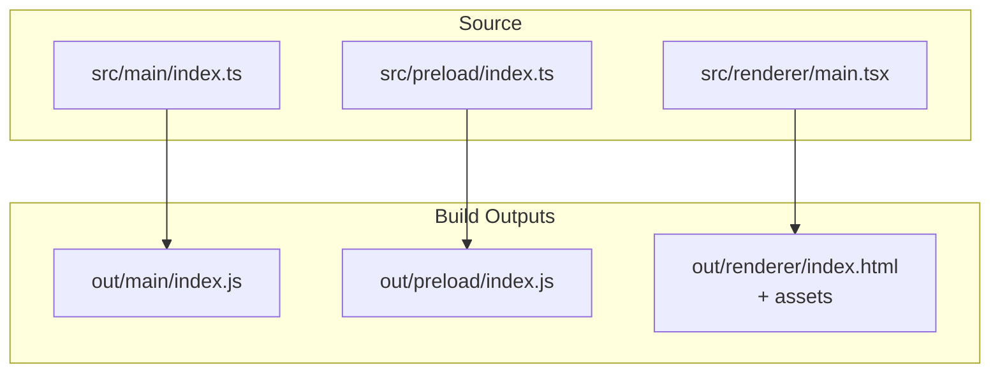
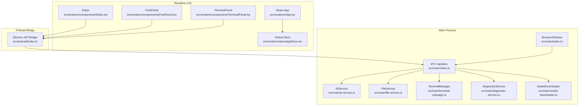
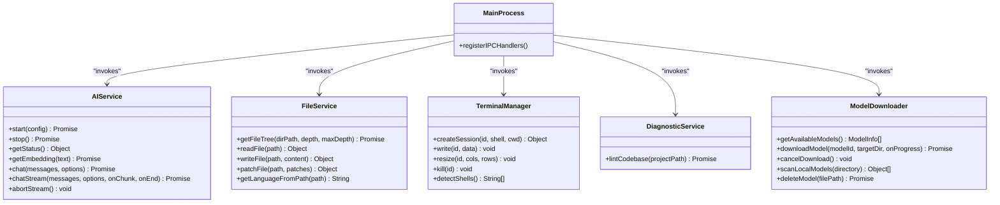
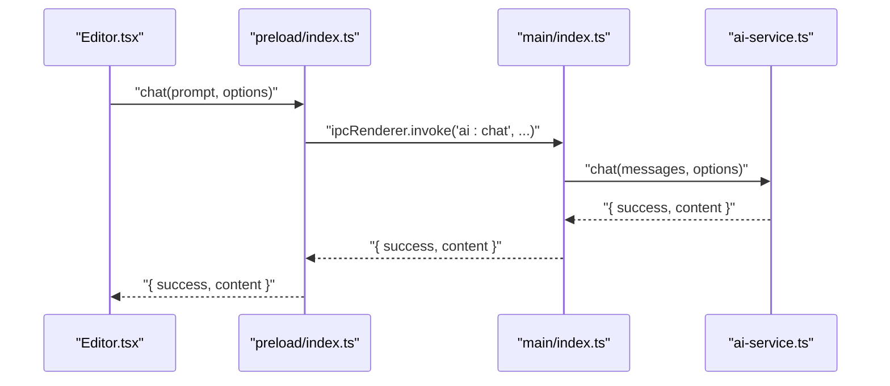
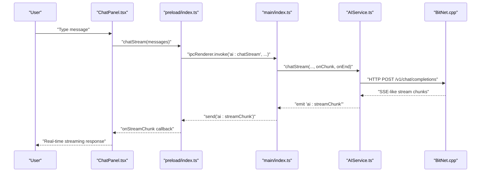
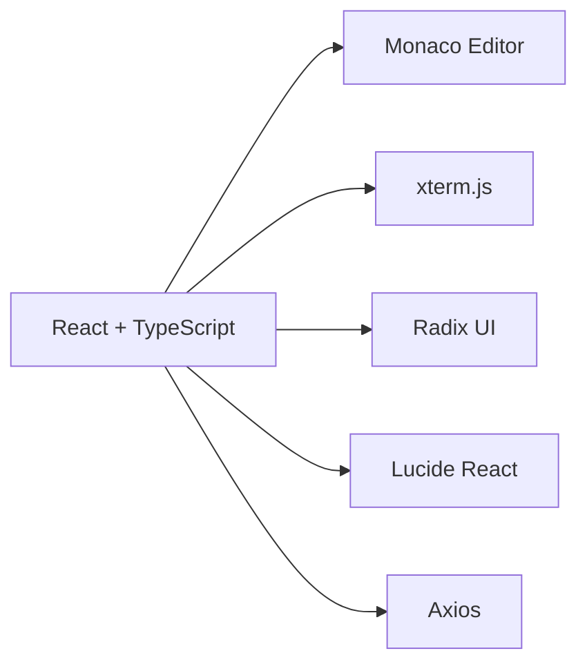

# Architecture Overview

<cite>
**Referenced Files in This Document**
- [src/main/index.ts](file://src/main/index.ts)
- [src/preload/index.ts](file://src/preload/index.ts)
- [src/renderer/main.tsx](file://src/renderer/main.tsx)
- [src/renderer/App.tsx](file://src/renderer/App.tsx)
- [src/renderer/store/appStore.tsx](file://src/renderer/store/appStore.tsx)
- [src/renderer/components/Editor.tsx](file://src/renderer/components/Editor.tsx)
- [src/renderer/components/TerminalPanel.tsx](file://src/renderer/components/TerminalPanel.tsx)
- [src/renderer/components/ChatPanel.tsx](file://src/renderer/components/ChatPanel.tsx)
- [src/main/ai-service.ts](file://src/main/ai-service.ts)
- [src/main/file-service.ts](file://src/main/file-service.ts)
- [src/main/terminal-manager.ts](file://src/main/terminal-manager.ts)
- [src/main/diagnostic-service.ts](file://src/main/diagnostic-service.ts)
- [src/main/model-downloader.ts](file://src/main/model-downloader.ts)
- [package.json](file://package.json)
- [electron.vite.config.ts](file://electron.vite.config.ts)
</cite>

## Table of Contents
1. [Introduction](#introduction)
2. [Project Structure](#project-structure)
3. [Core Components](#core-components)
4. [Architecture Overview](#architecture-overview)
5. [Detailed Component Analysis](#detailed-component-analysis)
6. [Dependency Analysis](#dependency-analysis)
7. [Performance Considerations](#performance-considerations)
8. [Troubleshooting Guide](#troubleshooting-guide)
9. [Conclusion](#conclusion)

## Introduction
This document describes the architecture of BitNet IDE, an Electron-based integrated development environment focused on local AI assistance. The system follows a strict main process, preload, and renderer separation, with IPC handlers mediating between UI components and native services. It integrates React with TypeScript, Monaco Editor for code editing, and xterm.js for terminal emulation. The architecture emphasizes offline-first operation, security via contextBridge, and maintainable service-oriented design.

## Project Structure
The repository is organized into three primary build artifacts produced by Electron-Vite:
- Main process: TypeScript entrypoint and services
- Preload script: Secure IPC bridge exposed to renderer
- Renderer: React application bundle

**Diagram sources**
- [electron.vite.config.ts](file://electron.vite.config.ts#L5-L39)
- [src/main/index.ts](file://src/main/index.ts#L1-L542)
- [src/preload/index.ts](file://src/preload/index.ts#L1-L120)
- [src/renderer/main.tsx](file://src/renderer/main.tsx#L1-L19)

**Section sources**
- [electron.vite.config.ts](file://electron.vite.config.ts#L1-L41)
- [package.json](file://package.json#L1-L35)

## Core Components
- Main process orchestrator and IPC hub
- Preload script exposing a typed Electron API surface
- Renderer React application with a centralized store
- Service layer: AI, file system, terminal, diagnostics, models, and RAG

Key responsibilities:
- Main process: window lifecycle, IPC registration, spawning BitNet.cpp server, managing child processes, and coordinating services
- Preload: safe exposure of IPC APIs via contextBridge
- Renderer: UI composition, user interactions, state management, and IPC-driven workflows
- Services: encapsulate domain logic (file operations, AI chat/embeddings, terminal sessions, diagnostics, model downloads)

**Section sources**
- [src/main/index.ts](file://src/main/index.ts#L116-L519)
- [src/preload/index.ts](file://src/preload/index.ts#L1-L120)
- [src/renderer/App.tsx](file://src/renderer/App.tsx#L1-L293)
- [src/renderer/store/appStore.tsx](file://src/renderer/store/appStore.tsx#L1-L351)

## Architecture Overview
High-level Electron architecture with clear process boundaries and IPC patterns.

**Diagram sources**
- [src/renderer/App.tsx](file://src/renderer/App.tsx#L1-L293)
- [src/renderer/store/appStore.tsx](file://src/renderer/store/appStore.tsx#L1-L351)
- [src/renderer/components/Editor.tsx](file://src/renderer/components/Editor.tsx#L1-L372)
- [src/renderer/components/ChatPanel.tsx](file://src/renderer/components/ChatPanel.tsx#L1-L1021)
- [src/renderer/components/TerminalPanel.tsx](file://src/renderer/components/TerminalPanel.tsx#L1-L312)
- [src/preload/index.ts](file://src/preload/index.ts#L1-L120)
- [src/main/index.ts](file://src/main/index.ts#L116-L519)
- [src/main/ai-service.ts](file://src/main/ai-service.ts#L1-L323)
- [src/main/file-service.ts](file://src/main/file-service.ts#L1-L162)
- [src/main/terminal-manager.ts](file://src/main/terminal-manager.ts#L1-L111)
- [src/main/diagnostic-service.ts](file://src/main/diagnostic-service.ts#L1-L65)
- [src/main/model-downloader.ts](file://src/main/model-downloader.ts#L1-L483)

## Detailed Component Analysis

### Electron Process Model and Security
- Main process creates the BrowserWindow with context isolation enabled and a preload script
- Preload exposes a typed API surface via contextBridge; renderer code interacts exclusively through window.electronAPI
- Renderer remains sandboxed; no direct Node/Electron APIs are available

Security highlights:
- contextBridge restricts exposed API to declared methods
- All IPC uses explicit channel names and typed arguments
- Renderer cannot access Node.js APIs directly

**Section sources**
- [src/main/index.ts](file://src/main/index.ts#L76-L114)
- [src/preload/index.ts](file://src/preload/index.ts#L1-L120)

### IPC Communication Patterns
- Request/response via ipcRenderer.invoke/ipcMain.handle for synchronous operations
- Event-based updates via ipcRenderer.on/ipcMain.send for streaming and progress
- Channels grouped by domain: window, settings, fs, ai, models, binary, terminal, shell, rag

Example flows:
- Renderer requests settings → Main responds with current settings
- Renderer starts AI server → Main spawns BitNet.cpp and reports health
- Renderer subscribes to stream chunks → Main emits events during streaming

**Section sources**
- [src/main/index.ts](file://src/main/index.ts#L116-L519)
- [src/preload/index.ts](file://src/preload/index.ts#L1-L120)

### Service-Oriented Architecture
Services encapsulate domain logic and are invoked via IPC handlers.

**Diagram sources**
- [src/main/ai-service.ts](file://src/main/ai-service.ts#L1-L323)
- [src/main/file-service.ts](file://src/main/file-service.ts#L1-L162)
- [src/main/terminal-manager.ts](file://src/main/terminal-manager.ts#L1-L111)
- [src/main/diagnostic-service.ts](file://src/main/diagnostic-service.ts#L1-L65)
- [src/main/model-downloader.ts](file://src/main/model-downloader.ts#L1-L483)
- [src/main/index.ts](file://src/main/index.ts#L116-L519)

**Section sources**
- [src/main/ai-service.ts](file://src/main/ai-service.ts#L1-L323)
- [src/main/file-service.ts](file://src/main/file-service.ts#L1-L162)
- [src/main/terminal-manager.ts](file://src/main/terminal-manager.ts#L1-L111)
- [src/main/diagnostic-service.ts](file://src/main/diagnostic-service.ts#L1-L65)
- [src/main/model-downloader.ts](file://src/main/model-downloader.ts#L1-L483)

### UI Component Interaction with Services via IPC
React components interact with services through the preload bridge:
- Editor integrates Monaco Editor and triggers AI autocomplete and inline edits via IPC
- ChatPanel manages conversation lifecycle, retrieves file mentions, performs RAG retrieval, and applies file actions
- TerminalPanel drives persistent terminal sessions via IPC to TerminalManager

**Diagram sources**
- [src/renderer/components/Editor.tsx](file://src/renderer/components/Editor.tsx#L208-L257)
- [src/preload/index.ts](file://src/preload/index.ts#L34-L40)
- [src/main/index.ts](file://src/main/index.ts#L296-L302)
- [src/main/ai-service.ts](file://src/main/ai-service.ts#L190-L238)

**Section sources**
- [src/renderer/components/Editor.tsx](file://src/renderer/components/Editor.tsx#L1-L372)
- [src/renderer/components/ChatPanel.tsx](file://src/renderer/components/ChatPanel.tsx#L196-L295)
- [src/renderer/components/TerminalPanel.tsx](file://src/renderer/components/TerminalPanel.tsx#L165-L216)

### System Context and Data Flows
End-to-end flow from user input to BitNet.cpp server:

**Diagram sources**
- [src/renderer/components/ChatPanel.tsx](file://src/renderer/components/ChatPanel.tsx#L286-L295)
- [src/preload/index.ts](file://src/preload/index.ts#L41-L50)
- [src/main/index.ts](file://src/main/index.ts#L304-L319)
- [src/main/ai-service.ts](file://src/main/ai-service.ts#L240-L314)

## Dependency Analysis
Technology stack and module relationships:
- Electron runtime and Vite-based build pipeline
- React + TypeScript for UI
- Monaco Editor for code editing
- xterm.js for terminal emulation
- Axios for HTTP operations
- Radix UI and Lucide icons for UI primitives

**Diagram sources**
- [package.json](file://package.json#L12-L32)

**Section sources**
- [package.json](file://package.json#L1-L35)

## Performance Considerations
- Streaming responses: AIService streams chunks to reduce latency; ChatPanel renders incremental updates
- Debounced autocomplete: Editor limits AI calls while typing to avoid excessive requests
- Window and terminal resize handling: TerminalPanel fits xterm instances and notifies backend of new dimensions
- File tree traversal: FileService ignores common directories and sorts entries for predictable UX
- Diagnostics: DiagnosticService runs tsc with reduced output for faster parsing

[No sources needed since this section provides general guidance]

## Troubleshooting Guide
Common issues and remedies:
- AI server startup failures: Verify modelPath and serverBinaryPath; check health endpoint and stderr logs
- Streaming interruptions: Call stopStream to abort current request; ensure onStreamEnd cleanup
- Terminal session exits: Confirm shell availability and working directory; check process exit codes
- Model downloads stuck: Resume partial downloads; cancel and retry; monitor progress events
- File operations errors: Validate paths and permissions; confirm directory creation and write operations

**Section sources**
- [src/main/ai-service.ts](file://src/main/ai-service.ts#L19-L89)
- [src/main/ai-service.ts](file://src/main/ai-service.ts#L316-L321)
- [src/main/terminal-manager.ts](file://src/main/terminal-manager.ts#L59-L62)
- [src/main/model-downloader.ts](file://src/main/model-downloader.ts#L275-L303)

## Conclusion
BitNet IDE employs a robust Electron architecture with strong process separation, secure IPC via contextBridge, and a service-oriented design. The React-based UI communicates with native services through well-defined channels, enabling offline-first operation with local AI inference via BitNet.cpp. The architecture balances performance, security, and maintainability, supporting a rich developer experience with Monaco Editor, xterm.js, and integrated AI assistance.