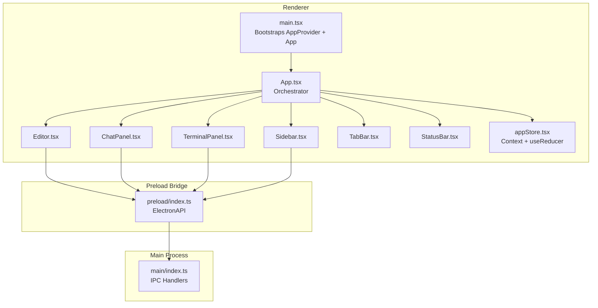
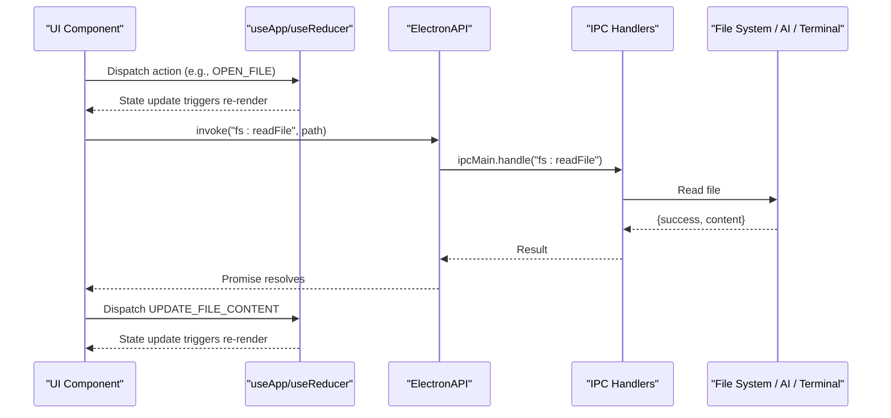
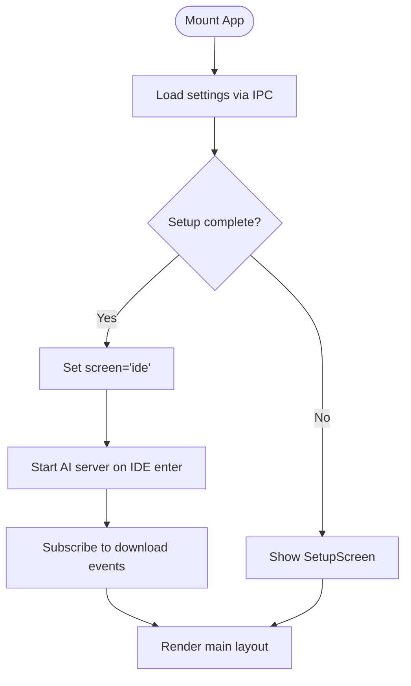
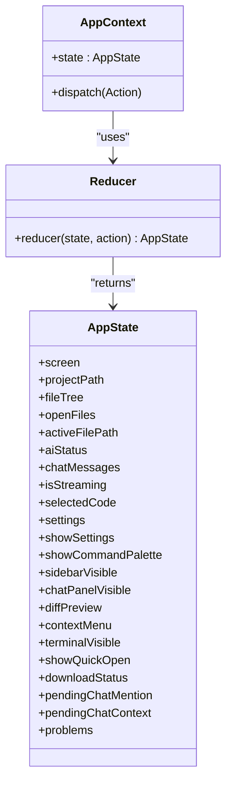
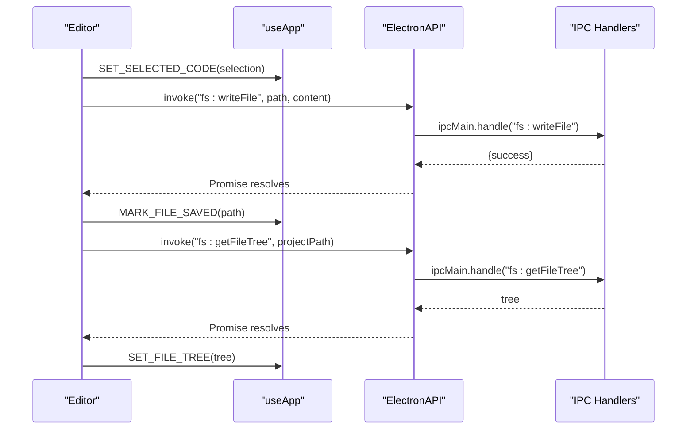
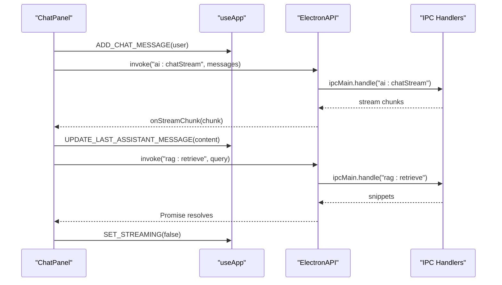
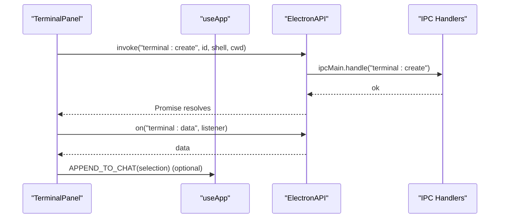
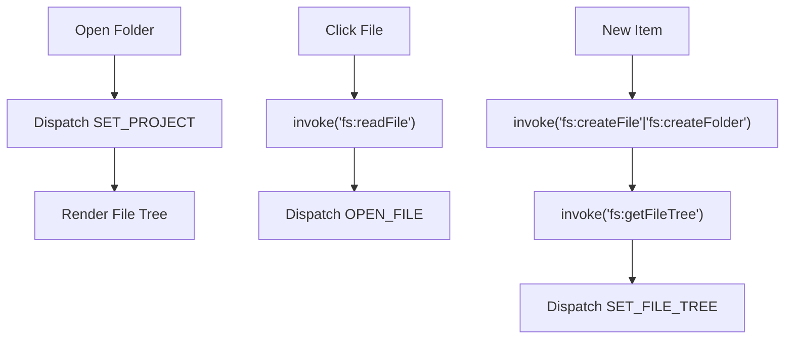
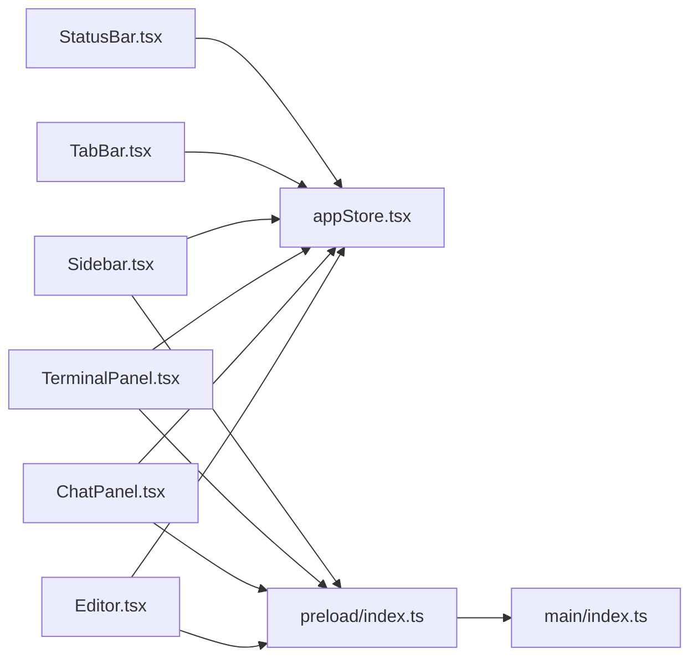

# Component Interactions and Data Flow

<cite>
**Referenced Files in This Document**
- [App.tsx](file://src/renderer/App.tsx)
- [appStore.tsx](file://src/renderer/store/appStore.tsx)
- [main.tsx](file://src/renderer/main.tsx)
- [index.ts](file://src/main/index.ts)
- [index.ts](file://src/preload/index.ts)
- [Editor.tsx](file://src/renderer/components/Editor.tsx)
- [ChatPanel.tsx](file://src/renderer/components/ChatPanel.tsx)
- [TerminalPanel.tsx](file://src/renderer/components/TerminalPanel.tsx)
- [Sidebar.tsx](file://src/renderer/components/Sidebar.tsx)
- [TabBar.tsx](file://src/renderer/components/TabBar.tsx)
- [StatusBar.tsx](file://src/renderer/components/StatusBar.tsx)
- [index.ts](file://src/renderer/prompts/index.ts)
</cite>

## Table of Contents
1. [Introduction](#introduction)
2. [Project Structure](#project-structure)
3. [Core Components](#core-components)
4. [Architecture Overview](#architecture-overview)
5. [Detailed Component Analysis](#detailed-component-analysis)
6. [Dependency Analysis](#dependency-analysis)
7. [Performance Considerations](#performance-considerations)
8. [Troubleshooting Guide](#troubleshooting-guide)
9. [Conclusion](#conclusion)

## Introduction
This document explains how BitNet IDE’s React application orchestrates UI components and manages state using a centralized store built on React Context API with useReducer. It details how components communicate with the Electron main process through IPC handlers, covering state synchronization, event propagation, and reactive UI updates. The focus is on the component hierarchy starting from App.tsx, relationships among Editor, ChatPanel, TerminalPanel, and Sidebar, and the data flow from user interactions to IPC calls and back to UI updates. Observer-like patterns are implemented via React hooks and IPC event listeners to keep the UI synchronized with underlying data changes.

## Project Structure
The renderer application is structured around a central orchestrator (App.tsx) that composes UI panels and integrates with a shared Redux-like store (appStore.tsx). Electron’s main process exposes IPC handlers for file operations, AI services, terminal management, and RAG indexing. The preload bridge exposes a typed ElectronAPI surface to renderer components.

**Diagram sources**
- [main.tsx](file://src/renderer/main.tsx#L12-L18)
- [App.tsx](file://src/renderer/App.tsx#L18-L300)
- [appStore.tsx](file://src/renderer/store/appStore.tsx#L337-L356)
- [Editor.tsx](file://src/renderer/components/Editor.tsx#L10-L379)
- [ChatPanel.tsx](file://src/renderer/components/ChatPanel.tsx#L39-L738)
- [TerminalPanel.tsx](file://src/renderer/components/TerminalPanel.tsx#L22-L312)
- [Sidebar.tsx](file://src/renderer/components/Sidebar.tsx#L11-L441)
- [index.ts](file://src/preload/index.ts#L1-L128)
- [index.ts](file://src/main/index.ts#L118-L535)

**Section sources**
- [main.tsx](file://src/renderer/main.tsx#L12-L18)
- [App.tsx](file://src/renderer/App.tsx#L18-L300)
- [appStore.tsx](file://src/renderer/store/appStore.tsx#L337-L356)
- [index.ts](file://src/preload/index.ts#L1-L128)
- [index.ts](file://src/main/index.ts#L118-L535)

## Core Components
- App.tsx: Central orchestrator that initializes settings, restores sessions, manages global keyboard shortcuts, toggles UI panels, and coordinates AI server startup and download events.
- appStore.tsx: Provides a centralized state container using React Context and useReducer. Defines state shape, actions, and reducers for file system, AI chat, UI toggles, and terminal visibility.
- Electron Bridge: Preload exposes ElectronAPI with typed methods for settings, file operations, AI chat/streaming, model downloads, terminal sessions, and RAG indexing.
- Main Process: Implements IPC handlers for all renderer requests and emits events back to renderer for streaming, download progress, and indexing progress.

Key patterns:
- Centralized state via Context + useReducer avoids prop drilling and enables predictable state transitions.
- IPC handlers encapsulate platform-specific operations and return promises for async flows.
- Observer-like behavior via useEffect subscriptions to IPC events keeps UI synchronized with external state.

**Section sources**
- [App.tsx](file://src/renderer/App.tsx#L18-L300)
- [appStore.tsx](file://src/renderer/store/appStore.tsx#L52-L174)
- [appStore.tsx](file://src/renderer/store/appStore.tsx#L176-L335)
- [index.ts](file://src/preload/index.ts#L3-L124)
- [index.ts](file://src/main/index.ts#L118-L535)

## Architecture Overview
The application follows a layered architecture:
- Renderer Layer: React components and a centralized store.
- Preload Bridge: Exposes ElectronAPI to renderer with typed IPC invocations and event listeners.
- Main Process: Implements IPC handlers and emits events back to renderer.

**Diagram sources**
- [Editor.tsx](file://src/renderer/components/Editor.tsx#L266-L270)
- [index.ts](file://src/preload/index.ts#L22-L25)
- [index.ts](file://src/main/index.ts#L170-L176)
- [appStore.tsx](file://src/renderer/store/appStore.tsx#L211-L225)

**Section sources**
- [Editor.tsx](file://src/renderer/components/Editor.tsx#L266-L270)
- [index.ts](file://src/preload/index.ts#L22-L25)
- [index.ts](file://src/main/index.ts#L170-L176)
- [appStore.tsx](file://src/renderer/store/appStore.tsx#L211-L225)

## Detailed Component Analysis

### App.tsx Orchestrator
Responsibilities:
- Initializes settings and restores session on mount.
- Manages global keyboard shortcuts and UI toggles.
- Coordinates AI server lifecycle and download progress events.
- Runs project-wide linting and refreshes file tree after saves.
- Applies theme changes and persists session settings.

Data flow highlights:
- Uses window.electronAPI for settings, file tree, and file operations.
- Subscribes to download progress/error events and updates state accordingly.
- Debounces linting runs to avoid excessive CPU usage.

**Diagram sources**
- [App.tsx](file://src/renderer/App.tsx#L44-L96)
- [App.tsx](file://src/renderer/App.tsx#L120-L137)
- [App.tsx](file://src/renderer/App.tsx#L139-L156)

**Section sources**
- [App.tsx](file://src/renderer/App.tsx#L44-L113)
- [App.tsx](file://src/renderer/App.tsx#L120-L156)

### Centralized State Management (Context + useReducer)
State shape and actions:
- AppState includes screens, file system state, AI chat, UI toggles, download status, and problems.
- Actions cover opening/closing files, updating content, marking saved, toggling UI panels, and managing AI chat.

Reducer patterns:
- Pure reducers compute next state deterministically from previous state and action.
- Efficient updates via immutable spread and targeted field updates.

**Diagram sources**
- [appStore.tsx](file://src/renderer/store/appStore.tsx#L52-L89)
- [appStore.tsx](file://src/renderer/store/appStore.tsx#L98-L129)
- [appStore.tsx](file://src/renderer/store/appStore.tsx#L176-L335)

**Section sources**
- [appStore.tsx](file://src/renderer/store/appStore.tsx#L52-L174)
- [appStore.tsx](file://src/renderer/store/appStore.tsx#L176-L335)

### Editor Component
Interactions:
- Integrates Monaco Editor and registers actions for AI explain/refactor/edit.
- Tracks selection changes and updates selected code in state.
- Saves active file via IPC and refreshes file tree and linting results.

AI integration:
- Inline autocomplete provider sends prompts to local AI and inserts completions.
- Edit palette triggers AI to generate code edits and previews diffs.

**Diagram sources**
- [Editor.tsx](file://src/renderer/components/Editor.tsx#L28-L32)
- [Editor.tsx](file://src/renderer/components/Editor.tsx#L117-L131)
- [Editor.tsx](file://src/renderer/components/Editor.tsx#L124-L127)
- [index.ts](file://src/preload/index.ts#L23-L27)
- [index.ts](file://src/main/index.ts#L174-L188)

**Section sources**
- [Editor.tsx](file://src/renderer/components/Editor.tsx#L28-L32)
- [Editor.tsx](file://src/renderer/components/Editor.tsx#L117-L131)
- [Editor.tsx](file://src/renderer/components/Editor.tsx#L124-L127)

### ChatPanel Component
Interactions:
- Streams AI responses via IPC events and updates the last assistant message incrementally.
- Retrieves file mentions and RAG snippets to enrich context.
- Supports model switching, codebase indexing, and applying file actions.

**Diagram sources**
- [ChatPanel.tsx](file://src/renderer/components/ChatPanel.tsx#L196-L295)
- [ChatPanel.tsx](file://src/renderer/components/ChatPanel.tsx#L90-L105)
- [index.ts](file://src/preload/index.ts#L41-L50)
- [index.ts](file://src/main/index.ts#L307-L322)

**Section sources**
- [ChatPanel.tsx](file://src/renderer/components/ChatPanel.tsx#L90-L105)
- [ChatPanel.tsx](file://src/renderer/components/ChatPanel.tsx#L196-L295)

### TerminalPanel Component
Interactions:
- Creates and manages xterm instances with FitAddon.
- Handles terminal data and exit events via IPC.
- Supports multiple sessions, split mode, and resizing.

**Diagram sources**
- [TerminalPanel.tsx](file://src/renderer/components/TerminalPanel.tsx#L212-L216)
- [TerminalPanel.tsx](file://src/renderer/components/TerminalPanel.tsx#L48-L72)
- [index.ts](file://src/preload/index.ts#L89-L103)
- [index.ts](file://src/main/index.ts#L468-L487)

**Section sources**
- [TerminalPanel.tsx](file://src/renderer/components/TerminalPanel.tsx#L48-L72)
- [TerminalPanel.tsx](file://src/renderer/components/TerminalPanel.tsx#L212-L216)

### Sidebar Component
Interactions:
- Opens folders, reads files, and opens them in the editor.
- Supports creating/deleting/rename operations and inline creation.
- Provides search across files and context menus for file actions.

**Diagram sources**
- [Sidebar.tsx](file://src/renderer/components/Sidebar.tsx#L25-L31)
- [Sidebar.tsx](file://src/renderer/components/Sidebar.tsx#L42-L68)
- [Sidebar.tsx](file://src/renderer/components/Sidebar.tsx#L78-L97)
- [Sidebar.tsx](file://src/renderer/components/Sidebar.tsx#L109-L120)

**Section sources**
- [Sidebar.tsx](file://src/renderer/components/Sidebar.tsx#L25-L31)
- [Sidebar.tsx](file://src/renderer/components/Sidebar.tsx#L42-L68)
- [Sidebar.tsx](file://src/renderer/components/Sidebar.tsx#L78-L97)
- [Sidebar.tsx](file://src/renderer/components/Sidebar.tsx#L109-L120)

### Supporting Components
- TabBar: Renders open files as tabs and dispatches SET_ACTIVE_FILE/CLOSE_FILE.
- StatusBar: Displays AI status, active file language, and project name.

**Section sources**
- [TabBar.tsx](file://src/renderer/components/TabBar.tsx#L5-L33)
- [StatusBar.tsx](file://src/renderer/components/StatusBar.tsx#L4-L46)

## Dependency Analysis
The renderer depends on:
- appStore.tsx for state and dispatch.
- ElectronAPI for IPC invocations and event subscriptions.
- Monaco Editor for code editing and inline autocomplete.
- xterm for terminal sessions.

**Diagram sources**
- [Editor.tsx](file://src/renderer/components/Editor.tsx#L1-L10)
- [ChatPanel.tsx](file://src/renderer/components/ChatPanel.tsx#L1-L10)
- [TerminalPanel.tsx](file://src/renderer/components/TerminalPanel.tsx#L1-L8)
- [Sidebar.tsx](file://src/renderer/components/Sidebar.tsx#L1-L10)
- [TabBar.tsx](file://src/renderer/components/TabBar.tsx#L1-L3)
- [StatusBar.tsx](file://src/renderer/components/StatusBar.tsx#L1-L3)
- [index.ts](file://src/preload/index.ts#L1-L128)
- [index.ts](file://src/main/index.ts#L1-L558)

**Section sources**
- [Editor.tsx](file://src/renderer/components/Editor.tsx#L1-L10)
- [ChatPanel.tsx](file://src/renderer/components/ChatPanel.tsx#L1-L10)
- [TerminalPanel.tsx](file://src/renderer/components/TerminalPanel.tsx#L1-L8)
- [Sidebar.tsx](file://src/renderer/components/Sidebar.tsx#L1-L10)
- [TabBar.tsx](file://src/renderer/components/TabBar.tsx#L1-L3)
- [StatusBar.tsx](file://src/renderer/components/StatusBar.tsx#L1-L3)
- [index.ts](file://src/preload/index.ts#L1-L128)
- [index.ts](file://src/main/index.ts#L1-L558)

## Performance Considerations
- Debounced operations: Project-wide linting is debounced to reduce CPU usage.
- Selective re-renders: Components use shallow comparisons and memoization-friendly patterns (e.g., stable callbacks).
- Efficient state updates: useReducer ensures immutable updates and predictable state transitions.
- IPC batching: Multiple file operations are grouped (e.g., refresh tree after save) to minimize redundant IPC calls.
- Streaming UI: Incremental updates for AI responses prevent large re-renders.

[No sources needed since this section provides general guidance]

## Troubleshooting Guide
Common issues and resolutions:
- AI server not connecting: Verify model and binary paths in settings; App.tsx attempts to start the server when entering IDE and updates aiStatus accordingly.
- File operations failing: Check permissions and paths; IPC handlers return success/error payloads that propagate to UI alerts.
- Terminal not responding: Ensure shell detection succeeds and sessions are created; TerminalPanel subscribes to terminal data and exit events.
- Chat streaming not updating: Confirm onStreamChunk and onStreamEnd listeners are registered; ChatPanel resets streaming state on end.

**Section sources**
- [App.tsx](file://src/renderer/App.tsx#L120-L137)
- [index.ts](file://src/main/index.ts#L276-L327)
- [TerminalPanel.tsx](file://src/renderer/components/TerminalPanel.tsx#L48-L72)
- [ChatPanel.tsx](file://src/renderer/components/ChatPanel.tsx#L90-L105)

## Conclusion
BitNet IDE employs a robust, centralized state management approach with React Context and useReducer, enabling predictable UI updates and scalable component interactions. IPC bridges provide a clean separation between renderer and main process concerns, while observer-like patterns via useEffect subscriptions keep the UI responsive to external changes. The orchestrator App.tsx coordinates complex workflows such as AI chat, file operations, and terminal sessions, ensuring a cohesive development experience.