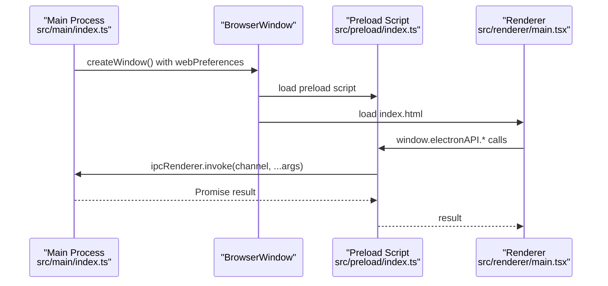
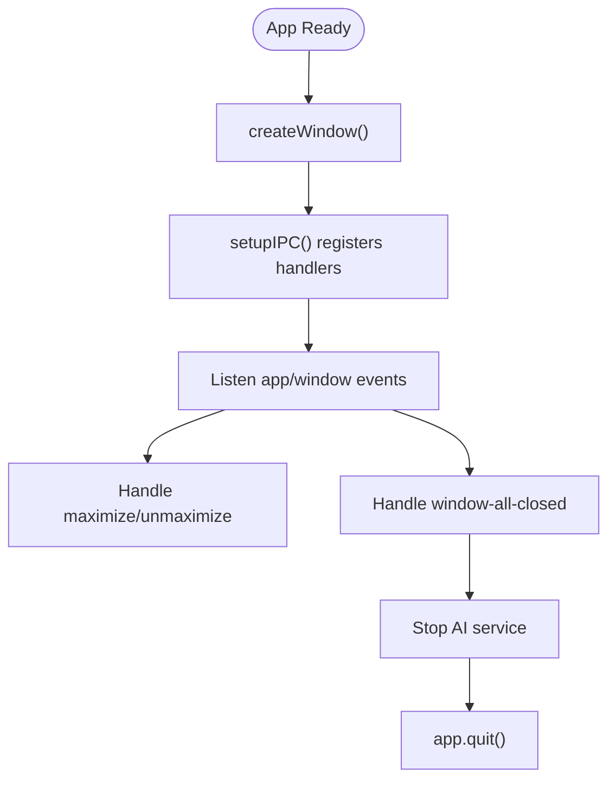
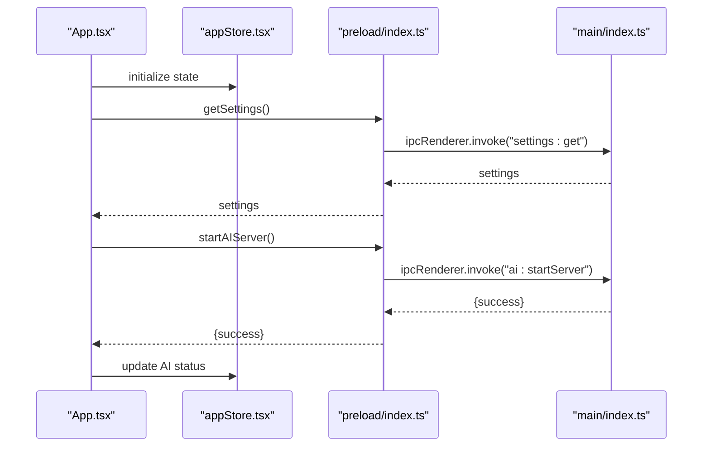
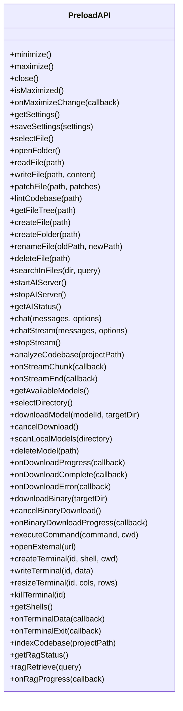
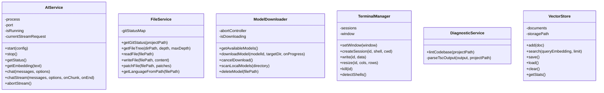
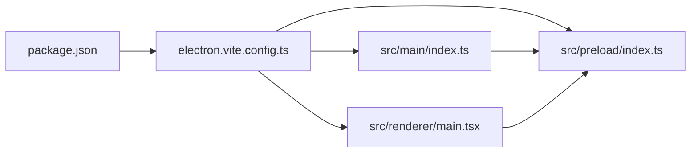
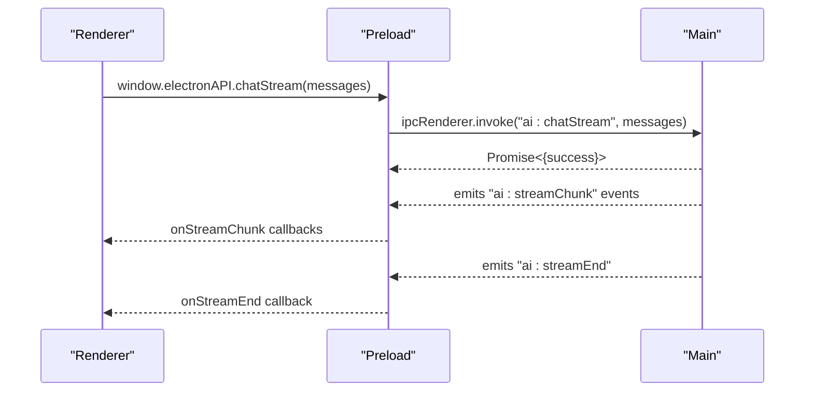
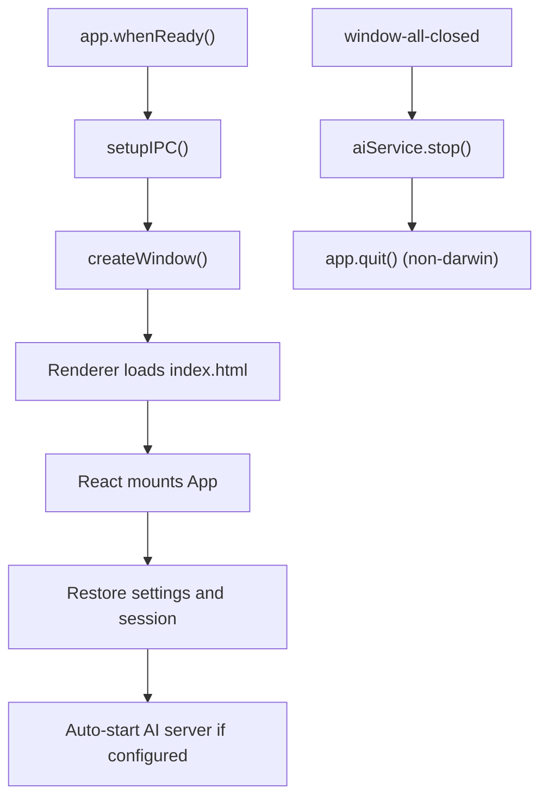

# Electron Process Architecture

<cite>
**Referenced Files in This Document**
- [src/main/index.ts](file://src/main/index.ts)
- [src/preload/index.ts](file://src/preload/index.ts)
- [src/renderer/main.tsx](file://src/renderer/main.tsx)
- [src/renderer/App.tsx](file://src/renderer/App.tsx)
- [src/renderer/index.html](file://src/renderer/index.html)
- [src/renderer/store/appStore.tsx](file://src/renderer/store/appStore.tsx)
- [src/renderer/types/global.d.ts](file://src/renderer/types/global.d.ts)
- [src/renderer/components/Editor.tsx](file://src/renderer/components/Editor.tsx)
- [src/main/ai-service.ts](file://src/main/ai-service.ts)
- [src/main/file-service.ts](file://src/main/file-service.ts)
- [src/main/model-downloader.ts](file://src/main/model-downloader.ts)
- [src/main/terminal-manager.ts](file://src/main/terminal-manager.ts)
- [src/main/diagnostic-service.ts](file://src/main/diagnostic-service.ts)
- [src/main/rag/vector-store.ts](file://src/main/rag/vector-store.ts)
- [electron.vite.config.ts](file://electron.vite.config.ts)
- [package.json](file://package.json)
</cite>

## Table of Contents
1. [Introduction](#introduction)
2. [Project Structure](#project-structure)
3. [Core Components](#core-components)
4. [Architecture Overview](#architecture-overview)
5. [Detailed Component Analysis](#detailed-component-analysis)
6. [Dependency Analysis](#dependency-analysis)
7. [Performance Considerations](#performance-considerations)
8. [Security Considerations](#security-considerations)
9. [Process Communication Patterns](#process-communication-patterns)
10. [Startup and Shutdown Procedures](#startup-and-shutdown-procedures)
11. [Troubleshooting Guide](#troubleshooting-guide)
12. [Conclusion](#conclusion)

## Introduction
This document explains BitNet IDE's Electron process architecture with a focus on the three-process model: main process (Node.js environment), renderer process (React application), and preload script (security bridge). It details responsibilities, security boundaries, initialization, lifecycle management, UI rendering, IPC patterns, and security hardening measures.

## Project Structure
The project follows a clear separation of concerns across three Electron processes:
- Main process: Initializes the BrowserWindow, sets up IPC handlers, manages system-level operations, and runs backend services (AI server, file operations, terminals).
- Preload script: Exposes a controlled API surface to the renderer via contextBridge, enabling safe IPC calls.
- Renderer process: React application bootstrapped from main.tsx, renders UI, manages user interactions, and orchestrates UI state.

```mermaid
graph TB
subgraph "Main Process"
MainIdx["src/main/index.ts"]
AISvc["src/main/ai-service.ts"]
FSvc["src/main/file-service.ts"]
MdlDl["src/main/model-downloader.ts"]
TermMgr["src/main/terminal-manager.ts"]
DiagSvc["src/main/diagnostic-service.ts"]
VecStore["src/main/rag/vector-store.ts"]
end
subgraph "Preload Script"
PreloadIdx["src/preload/index.ts"]
end
subgraph "Renderer Process"
RMain["src/renderer/main.tsx"]
RApp["src/renderer/App.tsx"]
RStore["src/renderer/store/appStore.tsx"]
REditor["src/renderer/components/Editor.tsx"]
RHTML["src/renderer/index.html"]
RGlobal["src/renderer/types/global.d.ts"]
end
MainIdx --> PreloadIdx
PreloadIdx --> RMain
RMain --> RApp
RApp --> RStore
RApp --> REditor
MainIdx --> AISvc
MainIdx --> FSvc
MainIdx --> MdlDl
MainIdx --> TermMgr
MainIdx --> DiagSvc
MainIdx --> VecStore
RApp <- --> PreloadIdx
```

**Diagram sources**
- [src/main/index.ts](file://src/main/index.ts#L76-L114)
- [src/preload/index.ts](file://src/preload/index.ts#L1-L120)
- [src/renderer/main.tsx](file://src/renderer/main.tsx#L1-L19)
- [src/renderer/App.tsx](file://src/renderer/App.tsx#L1-L302)
- [src/renderer/store/appStore.tsx](file://src/renderer/store/appStore.tsx#L1-L357)
- [src/renderer/components/Editor.tsx](file://src/renderer/components/Editor.tsx#L1-L374)
- [src/renderer/index.html](file://src/renderer/index.html#L1-L14)

**Section sources**
- [electron.vite.config.ts](file://electron.vite.config.ts#L1-L41)
- [package.json](file://package.json#L1-L35)

## Core Components
- Main process bootstrap and BrowserWindow creation with secure webPreferences.
- IPC handler registration for window controls, settings, filesystem operations, AI services, model downloads, binaries, shell commands, persistent terminals, and RAG indexing.
- Renderer entrypoint initializing React and the application provider.
- Preload script exposing a typed electronAPI surface via contextBridge.
- Renderer App orchestrating UI state, session restoration, AI server lifecycle, and event subscriptions.

**Section sources**
- [src/main/index.ts](file://src/main/index.ts#L76-L114)
- [src/main/index.ts](file://src/main/index.ts#L116-L519)
- [src/renderer/main.tsx](file://src/renderer/main.tsx#L1-L19)
- [src/preload/index.ts](file://src/preload/index.ts#L1-L120)
- [src/renderer/App.tsx](file://src/renderer/App.tsx#L1-L302)

## Architecture Overview
The architecture enforces strict isolation between processes:
- Main process runs with Node.js capabilities and system access.
- Preload script isolates renderer from raw Node/Electron APIs, exposing only whitelisted methods.
- Renderer is a pure UI layer with no direct system access.



**Diagram sources**
- [src/main/index.ts](file://src/main/index.ts#L76-L114)
- [src/preload/index.ts](file://src/preload/index.ts#L1-L120)
- [src/renderer/main.tsx](file://src/renderer/main.tsx#L1-L19)

## Detailed Component Analysis

### Main Process Responsibilities
- Creates the main BrowserWindow with contextIsolation enabled and nodeIntegration disabled.
- Registers IPC handlers for:
  - Window controls (minimize, maximize, close, isMaximized).
  - Settings persistence (load/save).
  - File system operations (read/write/patch, create/delete/rename, search, tree).
  - AI service lifecycle (start/stop/status, chat, streaming, embeddings).
  - Model downloader (list/download/cancel/scan/delete).
  - Binary downloader (download/cancel).
  - Shell operations (open external links).
  - Persistent terminal sessions (create/write/resize/kill, shell detection).
  - RAG indexing (index, status, retrieval).
- Manages application lifecycle events (ready, activate, window-all-closed).



**Diagram sources**
- [src/main/index.ts](file://src/main/index.ts#L521-L541)

**Section sources**
- [src/main/index.ts](file://src/main/index.ts#L76-L114)
- [src/main/index.ts](file://src/main/index.ts#L116-L519)

### Renderer Process Responsibilities
- Bootstraps React and the application provider.
- Implements UI composition, keyboard shortcuts, and overlay management.
- Orchestrates session restoration, settings synchronization, and AI server auto-start.
- Subscribes to download progress and error events from preload.
- Integrates Monaco Editor with inline autocomplete and AI-powered editing.



**Diagram sources**
- [src/renderer/App.tsx](file://src/renderer/App.tsx#L44-L137)
- [src/renderer/store/appStore.tsx](file://src/renderer/store/appStore.tsx#L176-L335)
- [src/preload/index.ts](file://src/preload/index.ts#L33-L50)
- [src/main/index.ts](file://src/main/index.ts#L274-L294)

**Section sources**
- [src/renderer/main.tsx](file://src/renderer/main.tsx#L1-L19)
- [src/renderer/App.tsx](file://src/renderer/App.tsx#L1-L302)
- [src/renderer/store/appStore.tsx](file://src/renderer/store/appStore.tsx#L1-L357)
- [src/renderer/components/Editor.tsx](file://src/renderer/components/Editor.tsx#L1-L374)

### Preload Script as Security Bridge
- Uses contextBridge to expose electronAPI to the renderer.
- Wraps all IPC invocations and event listeners with typed signatures.
- Provides convenience wrappers for window controls, settings, filesystem, AI, model downloads, binary downloads, terminal, and RAG operations.



**Diagram sources**
- [src/preload/index.ts](file://src/preload/index.ts#L3-L116)

**Section sources**
- [src/preload/index.ts](file://src/preload/index.ts#L1-L120)
- [src/renderer/types/global.d.ts](file://src/renderer/types/global.d.ts#L3-L78)

### Supporting Services in Main Process
- AIService: Manages local AI server lifecycle, health checks, chat completions, streaming, and embeddings.
- FileService: Builds file trees, reads/writes files, applies patches, and integrates Git status.
- ModelDownloader: Manages model discovery, downloading with resume/cancel, scanning local models, and deletion.
- TerminalManager: Spawns OS shells, streams output to renderer, emits exit events.
- DiagnosticService: Runs TypeScript compiler diagnostics for codebases.
- VectorStore: Stores indexed documents and performs similarity search for RAG.



**Diagram sources**
- [src/main/ai-service.ts](file://src/main/ai-service.ts#L12-L322)
- [src/main/file-service.ts](file://src/main/file-service.ts#L27-L161)
- [src/main/model-downloader.ts](file://src/main/model-downloader.ts#L267-L482)
- [src/main/terminal-manager.ts](file://src/main/terminal-manager.ts#L12-L110)
- [src/main/diagnostic-service.ts](file://src/main/diagnostic-service.ts#L16-L64)
- [src/main/rag/vector-store.ts](file://src/main/rag/vector-store.ts#L13-L83)

**Section sources**
- [src/main/ai-service.ts](file://src/main/ai-service.ts#L1-L323)
- [src/main/file-service.ts](file://src/main/file-service.ts#L1-L162)
- [src/main/model-downloader.ts](file://src/main/model-downloader.ts#L1-L483)
- [src/main/terminal-manager.ts](file://src/main/terminal-manager.ts#L1-L111)
- [src/main/diagnostic-service.ts](file://src/main/diagnostic-service.ts#L1-L65)
- [src/main/rag/vector-store.ts](file://src/main/rag/vector-store.ts#L1-L84)

## Dependency Analysis
- Build configuration defines separate outputs for main, preload, and renderer.
- Main process depends on service modules for AI, file operations, downloads, terminals, diagnostics, and RAG.
- Renderer depends on React, Monaco Editor, and the application store/provider.
- Preload bridges renderer and main via IPC channels.



**Diagram sources**
- [package.json](file://package.json#L1-L35)
- [electron.vite.config.ts](file://electron.vite.config.ts#L1-L41)

**Section sources**
- [package.json](file://package.json#L1-L35)
- [electron.vite.config.ts](file://electron.vite.config.ts#L1-L41)

## Performance Considerations
- Streaming AI responses: The main process streams tokens to the renderer, avoiding large payloads and enabling responsive UI updates.
- Background indexing: RAG indexing runs asynchronously and reports progress events.
- Debounced autocomplete: Inline suggestions throttle requests to prevent excessive AI calls.
- Efficient file tree traversal: Ignores common directories and files to reduce IO overhead.

[No sources needed since this section provides general guidance]

## Security Considerations
- Context Isolation: Enabled in BrowserWindow webPreferences to isolate renderer from Node.js APIs.
- Node Integration: Disabled to prevent arbitrary Node/Electron usage from the renderer.
- Sandboxing: Explicitly set to false; rely on contextIsolation and restricted preload API surface.
- Content Security Policy: Restricts script/style sources and allows connections to localhost for the AI server.
- IPC Exposure: Preload exposes only necessary methods via contextBridge, preventing direct access to Electron APIs.

**Section sources**
- [src/main/index.ts](file://src/main/index.ts#L85-L90)
- [src/renderer/index.html](file://src/renderer/index.html#L6-L6)

## Process Communication Patterns
- Request/Response: Renderer invokes preload methods; preload sends IPC requests to main; main resolves promises.
- Event-driven Updates: Main emits events (stream chunks, download progress, terminal data) to renderer via IPC listeners.
- Typed Contracts: Renderer types electronAPI to ensure compile-time safety.



**Diagram sources**
- [src/preload/index.ts](file://src/preload/index.ts#L38-L50)
- [src/main/index.ts](file://src/main/index.ts#L304-L319)

**Section sources**
- [src/preload/index.ts](file://src/preload/index.ts#L1-L120)
- [src/main/index.ts](file://src/main/index.ts#L116-L519)

## Startup and Shutdown Procedures
- Startup:
  - App ready triggers window creation and IPC setup.
  - Renderer loads index.html and mounts React application.
  - App restores session settings and optionally starts AI server.
- Shutdown:
  - Closing the last window triggers AI service stop and app quit (except macOS).



**Diagram sources**
- [src/main/index.ts](file://src/main/index.ts#L521-L541)
- [src/renderer/App.tsx](file://src/renderer/App.tsx#L44-L137)

**Section sources**
- [src/main/index.ts](file://src/main/index.ts#L521-L541)
- [src/renderer/App.tsx](file://src/renderer/App.tsx#L44-L137)

## Troubleshooting Guide
- AI server fails to start:
  - Verify binary path and model path in settings.
  - Check health endpoint and stderr logs during startup.
- Streaming issues:
  - Ensure renderer subscribes to stream chunk/end events.
  - Cancel ongoing streams before stopping the server.
- File operations failing:
  - Confirm paths exist and permissions are sufficient.
  - Use getFileTree to refresh directory state after writes.
- Terminal session errors:
  - Validate shell availability and working directory.
  - Subscribe to terminal exit events to detect failures.

**Section sources**
- [src/main/ai-service.ts](file://src/main/ai-service.ts#L19-L89)
- [src/main/ai-service.ts](file://src/main/ai-service.ts#L240-L321)
- [src/main/file-service.ts](file://src/main/file-service.ts#L101-L141)
- [src/main/terminal-manager.ts](file://src/main/terminal-manager.ts#L24-L75)

## Conclusion
BitNet IDE employs a robust Electron architecture with strong isolation between processes. The main process centralizes system operations and services, the preload script acts as a security bridge, and the renderer focuses exclusively on UI and user interaction. Secure defaults, typed IPC contracts, and event-driven updates provide a reliable foundation for an offline-first AI IDE.