# IPC Communication Patterns

<cite>
**Referenced Files in This Document**
- [src/main/index.ts](file://src/main/index.ts)
- [src/preload/index.ts](file://src/preload/index.ts)
- [src/renderer/App.tsx](file://src/renderer/App.tsx)
- [src/renderer/store/appStore.tsx](file://src/renderer/store/appStore.tsx)
- [src/renderer/components/ChatPanel.tsx](file://src/renderer/components/ChatPanel.tsx)
- [src/renderer/components/TerminalPanel.tsx](file://src/renderer/components/TerminalPanel.tsx)
- [src/renderer/components/SettingsPanel.tsx](file://src/renderer/components/SettingsPanel.tsx)
- [src/renderer/types/global.d.ts](file://src/renderer/types/global.d.ts)
- [src/main/file-service.ts](file://src/main/file-service.ts)
- [src/main/ai-service.ts](file://src/main/ai-service.ts)
- [src/main/model-downloader.ts](file://src/main/model-downloader.ts)
- [src/main/binary-downloader.ts](file://src/main/binary-downloader.ts)
- [src/main/terminal-manager.ts](file://src/main/terminal-manager.ts)
</cite>

## Table of Contents
1. [Introduction](#introduction)
2. [Project Structure](#project-structure)
3. [Core Components](#core-components)
4. [Architecture Overview](#architecture-overview)
5. [Detailed Component Analysis](#detailed-component-analysis)
6. [Dependency Analysis](#dependency-analysis)
7. [Performance Considerations](#performance-considerations)
8. [Troubleshooting Guide](#troubleshooting-guide)
9. [Conclusion](#conclusion)

## Introduction
This document explains the Inter-Process Communication (IPC) patterns used in BitNet IDE. It focuses on the bidirectional communication between the renderer and main processes using Electron’s ipcRenderer and ipcMain APIs, the security model enforced by contextBridge in preload scripts, and the common IPC patterns for file operations, AI service requests, terminal commands, and settings management. It also covers request-response cycles, streaming data patterns for AI responses, event-driven updates, error handling, timeouts, graceful degradation, and debugging techniques.

## Project Structure
BitNet IDE follows a layered architecture:
- Main process: orchestrates long-running services (AI server, file system, downloads, terminals), exposes handlers via ipcMain, and emits events to the renderer.
- Preload script: securely exposes a controlled subset of main-process functionality to the renderer via contextBridge.
- Renderer: React components trigger IPC calls, listen to events, and update application state.

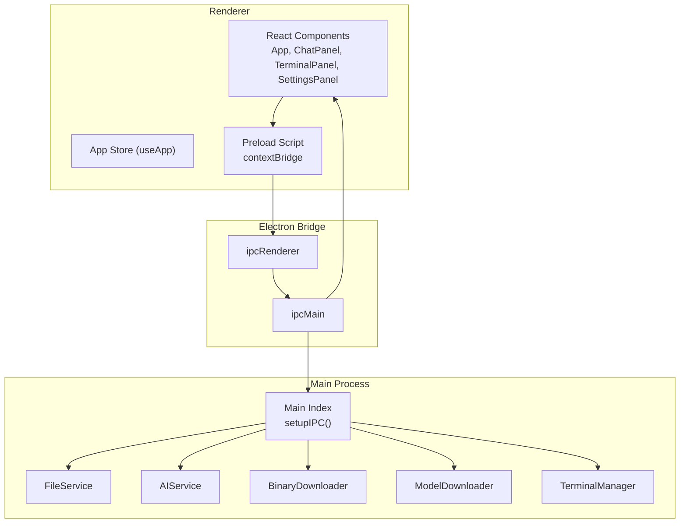

**Diagram sources**
- [src/main/index.ts](file://src/main/index.ts#L116-L519)
- [src/preload/index.ts](file://src/preload/index.ts#L1-L120)
- [src/renderer/App.tsx](file://src/renderer/App.tsx#L1-L302)
- [src/main/file-service.ts](file://src/main/file-service.ts#L27-L162)
- [src/main/ai-service.ts](file://src/main/ai-service.ts#L12-L323)
- [src/main/model-downloader.ts](file://src/main/model-downloader.ts#L267-L483)
- [src/main/binary-downloader.ts](file://src/main/binary-downloader.ts#L7-L162)
- [src/main/terminal-manager.ts](file://src/main/terminal-manager.ts#L12-L111)

**Section sources**
- [src/main/index.ts](file://src/main/index.ts#L116-L519)
- [src/preload/index.ts](file://src/preload/index.ts#L1-L120)

## Core Components
- Main process handlers: Centralized in setupIPC() with categories for window controls, settings, file system, AI service, model downloads, binary downloads, shell/terminal, and RAG.
- Preload exposed API: contextBridge exposes a typed electronAPI surface to renderer, wrapping ipcRenderer.invoke and ipcRenderer.on.
- Renderer-side orchestration: App.tsx initializes settings/session, registers event listeners, and coordinates UI updates. Components like ChatPanel, TerminalPanel, and SettingsPanel issue IPC calls and subscribe to events.

Key IPC surfaces:
- Synchronous invocation: ipcRenderer.invoke(...) mapped to ipcMain.handle(...).
- Asynchronous events: ipcRenderer.on(...) mapped to mainWindow.webContents.send(...).

**Section sources**
- [src/main/index.ts](file://src/main/index.ts#L116-L519)
- [src/preload/index.ts](file://src/preload/index.ts#L1-L120)
- [src/renderer/types/global.d.ts](file://src/renderer/types/global.d.ts#L3-L79)

## Architecture Overview
The IPC architecture enforces a strict security boundary:
- Preload script defines a whitelist of main-process capabilities exposed to renderer.
- Renderer components call electronAPI methods, which translate to ipcRenderer.invoke or ipcRenderer.on.
- Main process handlers encapsulate business logic and emit events back to renderer.

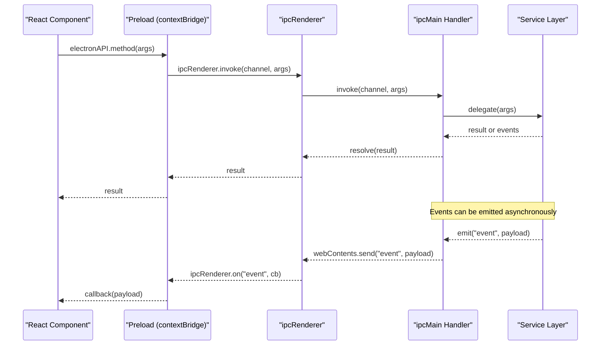

**Diagram sources**
- [src/preload/index.ts](file://src/preload/index.ts#L1-L120)
- [src/main/index.ts](file://src/main/index.ts#L116-L519)

## Detailed Component Analysis

### Security Model: contextBridge and Preload
- The preload script constructs a safe electronAPI object and exposes it via contextBridge.exposeInMainWorld.
- All renderer interactions with main-process capabilities must go through electronAPI, preventing direct access to Node/Electron APIs from renderer code.
- The global.d.ts file declares the shape of window.electronAPI for TypeScript safety.

Security highlights:
- Only explicit methods are exposed.
- Event subscriptions return unsubscription functions to prevent leaks.
- Renderer receives structured payloads rather than raw Node APIs.

**Section sources**
- [src/preload/index.ts](file://src/preload/index.ts#L1-L120)
- [src/renderer/types/global.d.ts](file://src/renderer/types/global.d.ts#L3-L79)

### Settings Management IPC
Patterns:
- Synchronous: getSettings/saveSettings via ipcRenderer.invoke.
- Event-driven: window maximize change events emitted from main to renderer.

Common flows:
- App initialization loads settings and restores session.
- Settings changes are persisted and can trigger model/server restarts.

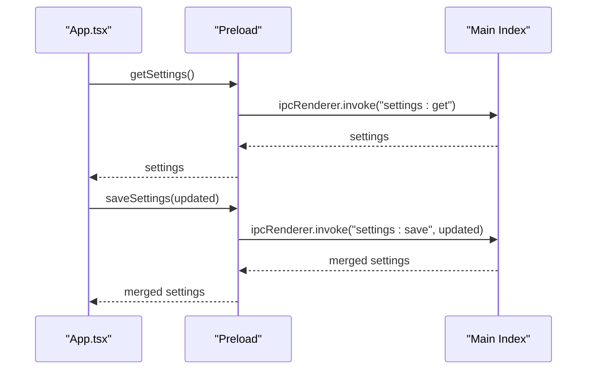

**Diagram sources**
- [src/renderer/App.tsx](file://src/renderer/App.tsx#L44-L96)
- [src/main/index.ts](file://src/main/index.ts#L135-L142)
- [src/preload/index.ts](file://src/preload/index.ts#L15-L18)

**Section sources**
- [src/renderer/App.tsx](file://src/renderer/App.tsx#L44-L113)
- [src/main/index.ts](file://src/main/index.ts#L135-L142)
- [src/preload/index.ts](file://src/preload/index.ts#L15-L18)

### File Operations IPC
Patterns:
- Synchronous: openFolder/readFile/writeFile/patchFile/createFile/createFolder/rename/delete/searchInFiles.
- Event-driven: file tree updates and diagnostics.

Representative flows:
- Opening a folder returns a tree; opening a file reads content; writing triggers refresh and optional linting.

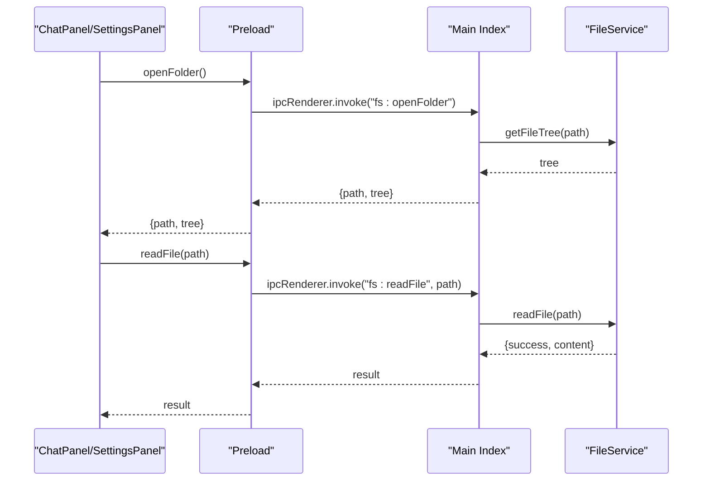

**Diagram sources**
- [src/main/index.ts](file://src/main/index.ts#L157-L185)
- [src/main/file-service.ts](file://src/main/file-service.ts#L59-L108)
- [src/preload/index.ts](file://src/preload/index.ts#L19-L31)

**Section sources**
- [src/main/index.ts](file://src/main/index.ts#L144-L271)
- [src/main/file-service.ts](file://src/main/file-service.ts#L27-L162)
- [src/preload/index.ts](file://src/preload/index.ts#L19-L31)

### AI Service IPC (Chat and Streaming)
Patterns:
- Synchronous: start/stop/getStatus/chat.
- Streaming: chatStream emits incremental chunks and completion events.

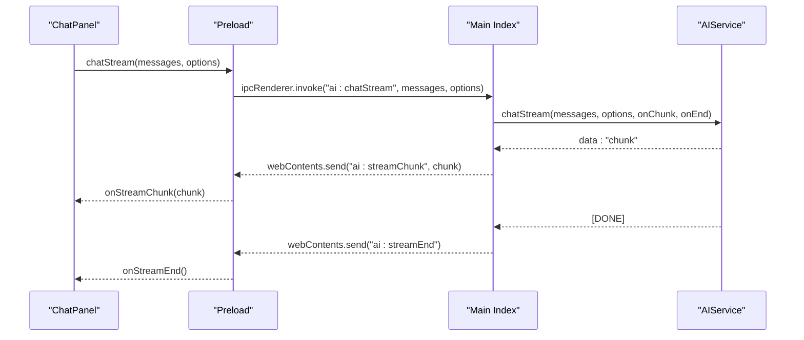

**Diagram sources**
- [src/renderer/components/ChatPanel.tsx](file://src/renderer/components/ChatPanel.tsx#L89-L105)
- [src/main/index.ts](file://src/main/index.ts#L304-L319)
- [src/main/ai-service.ts](file://src/main/ai-service.ts#L240-L321)
- [src/preload/index.ts](file://src/preload/index.ts#L41-L50)

**Section sources**
- [src/renderer/components/ChatPanel.tsx](file://src/renderer/components/ChatPanel.tsx#L196-L295)
- [src/main/index.ts](file://src/main/index.ts#L273-L323)
- [src/main/ai-service.ts](file://src/main/ai-service.ts#L12-L323)
- [src/preload/index.ts](file://src/preload/index.ts#L33-L50)

### Model Downloads IPC
Patterns:
- Synchronous: getAvailableModels/selectDirectory/download/cancel/scanLocal/delete.
- Event-driven: download progress, completion, and error events.

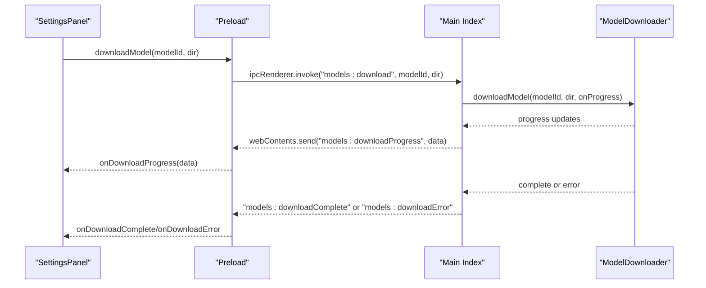

**Diagram sources**
- [src/renderer/components/SettingsPanel.tsx](file://src/renderer/components/SettingsPanel.tsx#L82-L100)
- [src/main/index.ts](file://src/main/index.ts#L406-L422)
- [src/main/model-downloader.ts](file://src/main/model-downloader.ts#L275-L303)
- [src/preload/index.ts](file://src/preload/index.ts#L59-L73)

**Section sources**
- [src/renderer/components/SettingsPanel.tsx](file://src/renderer/components/SettingsPanel.tsx#L82-L134)
- [src/main/index.ts](file://src/main/index.ts#L392-L430)
- [src/main/model-downloader.ts](file://src/main/model-downloader.ts#L267-L483)
- [src/preload/index.ts](file://src/preload/index.ts#L52-L73)

### Binary Downloads IPC
Patterns:
- Synchronous: downloadBinary/cancel.
- Event-driven: progress events.

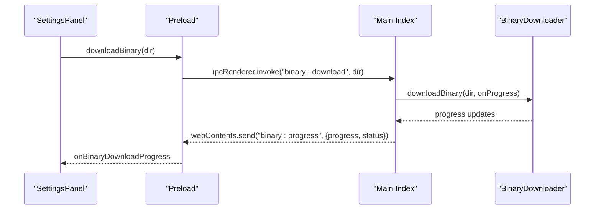

**Diagram sources**
- [src/renderer/components/SettingsPanel.tsx](file://src/renderer/components/SettingsPanel.tsx#L31-L44)
- [src/main/index.ts](file://src/main/index.ts#L442-L455)
- [src/main/binary-downloader.ts](file://src/main/binary-downloader.ts#L17-L83)
- [src/preload/index.ts](file://src/preload/index.ts#L75-L82)

**Section sources**
- [src/main/index.ts](file://src/main/index.ts#L441-L455)
- [src/main/binary-downloader.ts](file://src/main/binary-downloader.ts#L7-L162)
- [src/preload/index.ts](file://src/preload/index.ts#L75-L82)

### Terminal IPC (Persistent Sessions)
Patterns:
- Synchronous: create/write/resize/kill/getShells.
- Event-driven: terminal data and exit events.

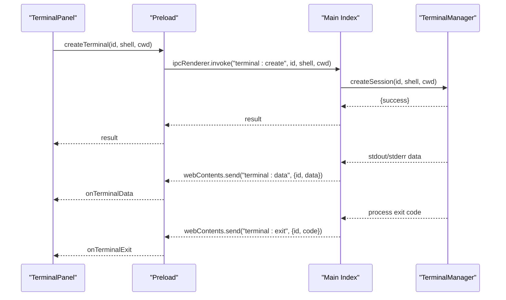

**Diagram sources**
- [src/renderer/components/TerminalPanel.tsx](file://src/renderer/components/TerminalPanel.tsx#L47-L72)
- [src/main/index.ts](file://src/main/index.ts#L462-L496)
- [src/main/terminal-manager.ts](file://src/main/terminal-manager.ts#L24-L96)
- [src/preload/index.ts](file://src/preload/index.ts#L88-L103)

**Section sources**
- [src/renderer/components/TerminalPanel.tsx](file://src/renderer/components/TerminalPanel.tsx#L47-L97)
- [src/main/index.ts](file://src/main/index.ts#L462-L496)
- [src/main/terminal-manager.ts](file://src/main/terminal-manager.ts#L12-L111)
- [src/preload/index.ts](file://src/preload/index.ts#L88-L103)

### RAG Indexing and Retrieval IPC
Patterns:
- Synchronous: indexCodebase/status/retrieve.
- Event-driven: progress events.

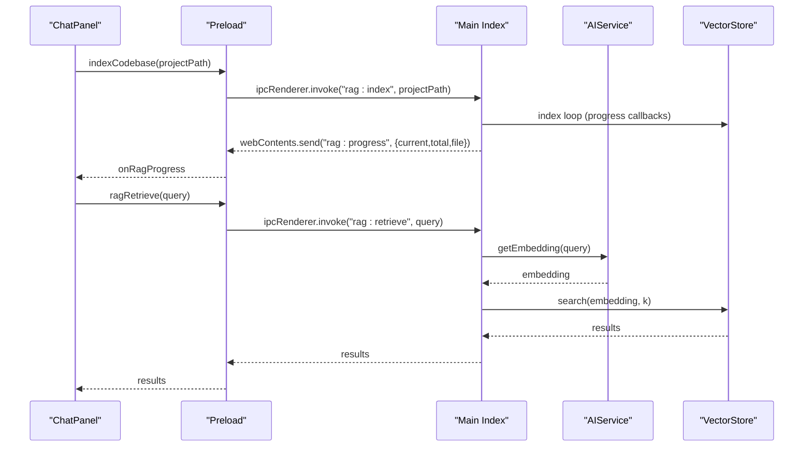

**Diagram sources**
- [src/renderer/components/ChatPanel.tsx](file://src/renderer/components/ChatPanel.tsx#L174-L179)
- [src/main/index.ts](file://src/main/index.ts#L497-L518)
- [src/main/ai-service.ts](file://src/main/ai-service.ts#L147-L188)
- [src/preload/index.ts](file://src/preload/index.ts#L105-L113)

**Section sources**
- [src/main/index.ts](file://src/main/index.ts#L497-L518)
- [src/main/ai-service.ts](file://src/main/ai-service.ts#L12-L323)
- [src/preload/index.ts](file://src/preload/index.ts#L105-L113)

### React Components, Hooks, and State Management
- AppProvider wraps the app with a Redux-like reducer and dispatch.
- Components use useApp() to access state and dispatch actions.
- IPC event listeners are registered in effects and returned unsubscription functions to avoid leaks.
- UI state reflects IPC outcomes (e.g., download progress, AI streaming, terminal output).

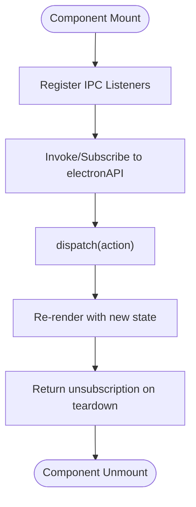

**Diagram sources**
- [src/renderer/store/appStore.tsx](file://src/renderer/store/appStore.tsx#L337-L356)
- [src/renderer/App.tsx](file://src/renderer/App.tsx#L139-L156)
- [src/renderer/components/ChatPanel.tsx](file://src/renderer/components/ChatPanel.tsx#L89-L105)
- [src/renderer/components/TerminalPanel.tsx](file://src/renderer/components/TerminalPanel.tsx#L47-L72)
- [src/renderer/components/SettingsPanel.tsx](file://src/renderer/components/SettingsPanel.tsx#L38-L45)

**Section sources**
- [src/renderer/store/appStore.tsx](file://src/renderer/store/appStore.tsx#L1-L357)
- [src/renderer/App.tsx](file://src/renderer/App.tsx#L139-L156)
- [src/renderer/components/ChatPanel.tsx](file://src/renderer/components/ChatPanel.tsx#L89-L105)
- [src/renderer/components/TerminalPanel.tsx](file://src/renderer/components/TerminalPanel.tsx#L47-L72)
- [src/renderer/components/SettingsPanel.tsx](file://src/renderer/components/SettingsPanel.tsx#L38-L45)

## Dependency Analysis
High-level dependencies:
- Renderer depends on preload for IPC abstractions.
- Preload depends on Electron APIs (contextBridge, ipcRenderer).
- Main process handlers depend on service classes (FileService, AIService, ModelDownloader, BinaryDownloader, TerminalManager).
- Services encapsulate domain logic and filesystem/network operations.

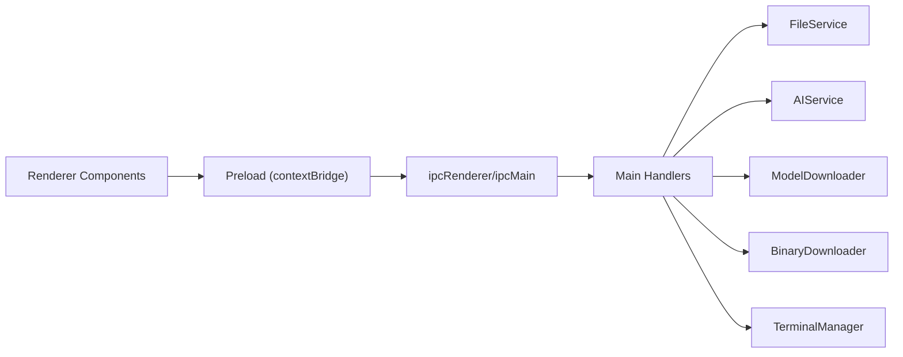

**Diagram sources**
- [src/main/index.ts](file://src/main/index.ts#L116-L519)
- [src/preload/index.ts](file://src/preload/index.ts#L1-L120)
- [src/main/file-service.ts](file://src/main/file-service.ts#L27-L162)
- [src/main/ai-service.ts](file://src/main/ai-service.ts#L12-L323)
- [src/main/model-downloader.ts](file://src/main/model-downloader.ts#L267-L483)
- [src/main/binary-downloader.ts](file://src/main/binary-downloader.ts#L7-L162)
- [src/main/terminal-manager.ts](file://src/main/terminal-manager.ts#L12-L111)

**Section sources**
- [src/main/index.ts](file://src/main/index.ts#L116-L519)
- [src/main/file-service.ts](file://src/main/file-service.ts#L27-L162)
- [src/main/ai-service.ts](file://src/main/ai-service.ts#L12-L323)
- [src/main/model-downloader.ts](file://src/main/model-downloader.ts#L267-L483)
- [src/main/binary-downloader.ts](file://src/main/binary-downloader.ts#L7-L162)
- [src/main/terminal-manager.ts](file://src/main/terminal-manager.ts#L12-L111)

## Performance Considerations
- Prefer streaming for long-running AI responses to reduce perceived latency and memory pressure.
- Debounce or batch UI updates when reacting to frequent events (e.g., terminal data).
- Use event-driven progress updates for downloads to keep UI responsive without polling.
- Avoid blocking the main thread with heavy filesystem operations; leverage existing services and background indexing.
- For terminal sessions, normalize output efficiently and avoid excessive reflows.

## Troubleshooting Guide
Common issues and remedies:
- IPC channel mismatch: Ensure channel names in preload match those handled in main.
- Missing contextBridge exposure: Verify electronAPI is exposed and typed globally.
- Event listener leaks: Always return and call unsubscription functions from useEffect.
- AI server startup failures: Check model path, binary path, and port availability; inspect health checks and stderr logs.
- Streaming interruptions: Call stopStream or abortStream when needed; handle onEnd reliably.
- Terminal session issues: Confirm shell detection and process lifecycle; watch for exit codes.
- Download failures: Inspect HTTP status, redirects, resume logic, and disk permissions.

Debugging tips:
- Log main-to-renderer events and payloads.
- Use minimal reproducible examples for IPC channels.
- Test event unsubscriptions by toggling panels/components.
- Validate settings persistence and restoration after restarts.

**Section sources**
- [src/main/ai-service.ts](file://src/main/ai-service.ts#L117-L145)
- [src/main/index.ts](file://src/main/index.ts#L316-L323)
- [src/main/terminal-manager.ts](file://src/main/terminal-manager.ts#L59-L62)
- [src/main/model-downloader.ts](file://src/main/model-downloader.ts#L356-L472)

## Conclusion
BitNet IDE’s IPC design cleanly separates concerns: preload scripts enforce a secure API surface, main-process handlers encapsulate business logic, and renderer components coordinate user interactions and state. The architecture supports synchronous request-response and asynchronous event-driven flows, with robust patterns for streaming AI responses, managing downloads, and operating persistent terminals. Following the outlined practices ensures maintainability, security, and reliability across the application.