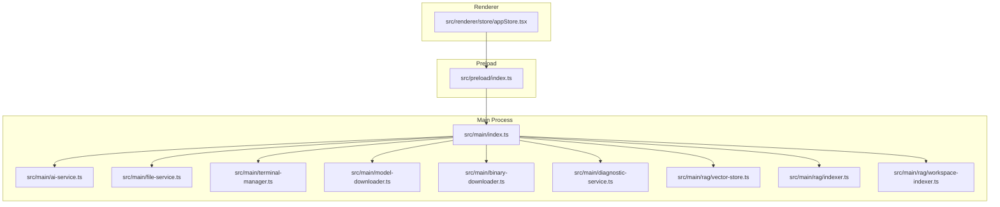
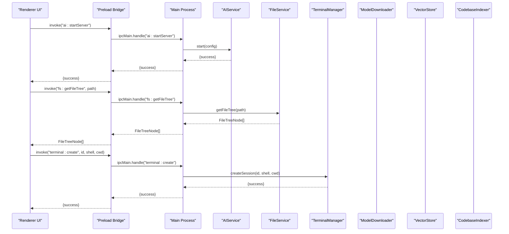
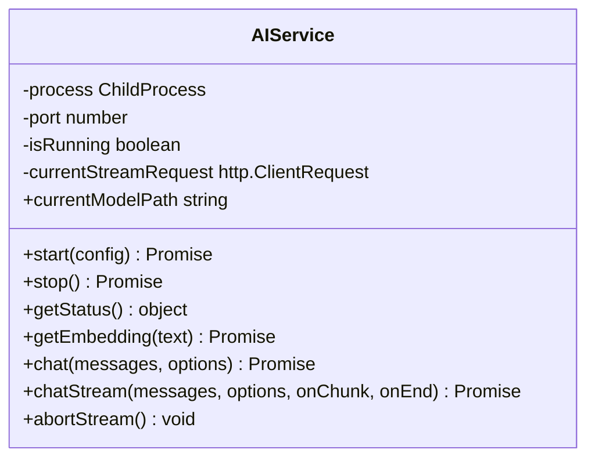
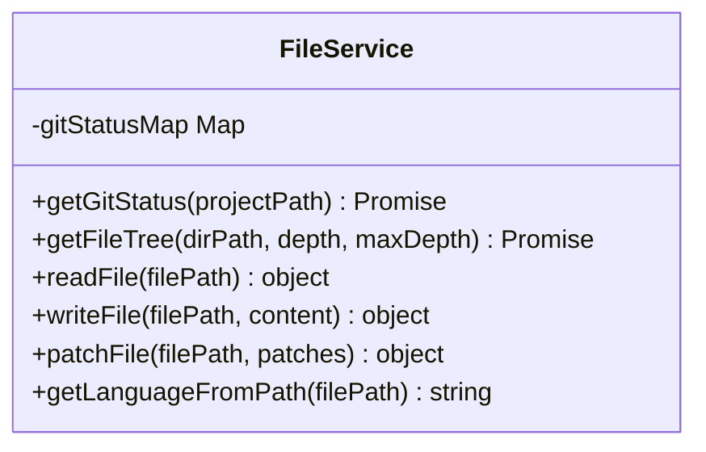
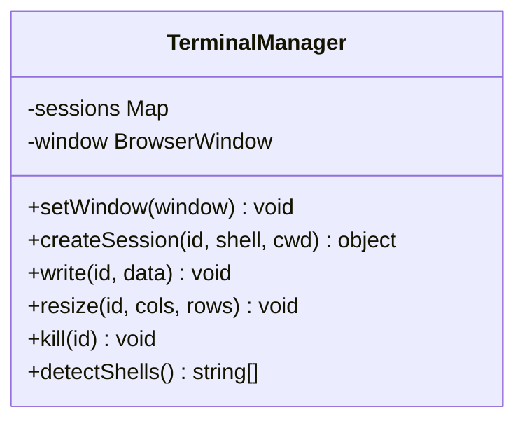
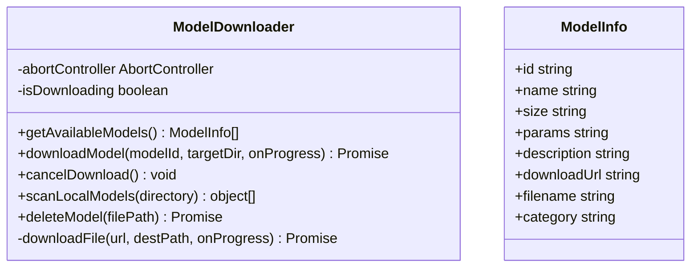
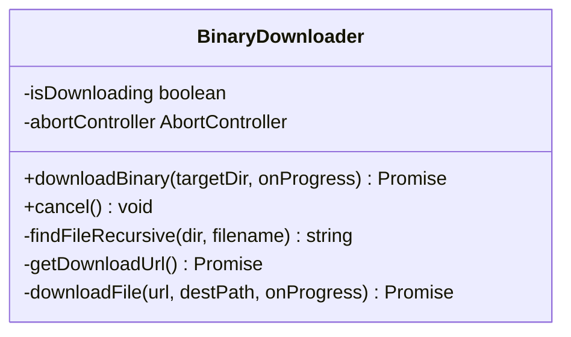
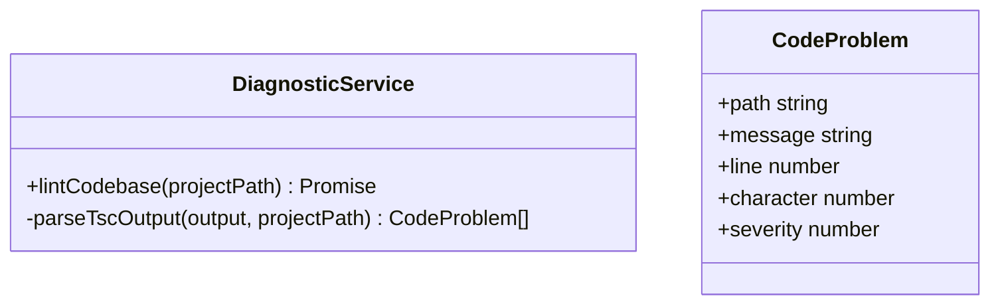
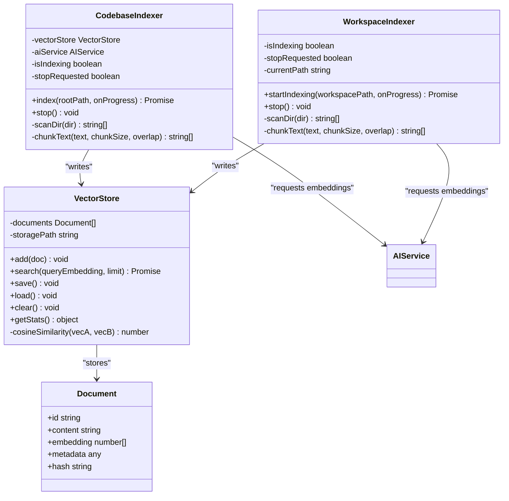
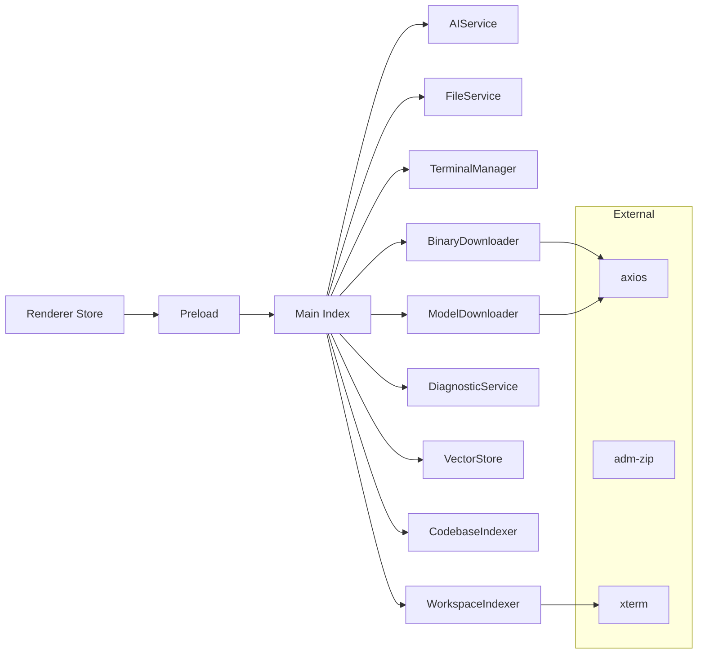

# Service Layer Organization

<cite>
**Referenced Files in This Document**
- [src/main/index.ts](file://src/main/index.ts)
- [src/main/ai-service.ts](file://src/main/ai-service.ts)
- [src/main/file-service.ts](file://src/main/file-service.ts)
- [src/main/terminal-manager.ts](file://src/main/terminal-manager.ts)
- [src/main/model-downloader.ts](file://src/main/model-downloader.ts)
- [src/main/binary-downloader.ts](file://src/main/binary-downloader.ts)
- [src/main/diagnostic-service.ts](file://src/main/diagnostic-service.ts)
- [src/main/rag/vector-store.ts](file://src/main/rag/vector-store.ts)
- [src/main/rag/indexer.ts](file://src/main/rag/indexer.ts)
- [src/main/rag/workspace-indexer.ts](file://src/main/rag/workspace-indexer.ts)
- [src/preload/index.ts](file://src/preload/index.ts)
- [src/renderer/store/appStore.tsx](file://src/renderer/store/appStore.tsx)
- [package.json](file://package.json)
</cite>

## Table of Contents
1. [Introduction](#introduction)
2. [Project Structure](#project-structure)
3. [Core Components](#core-components)
4. [Architecture Overview](#architecture-overview)
5. [Detailed Component Analysis](#detailed-component-analysis)
6. [Dependency Analysis](#dependency-analysis)
7. [Performance Considerations](#performance-considerations)
8. [Troubleshooting Guide](#troubleshooting-guide)
9. [Conclusion](#conclusion)

## Introduction
This document explains BitNet IDE’s service layer architecture with a service-oriented design pattern. It covers the separation of concerns across:
- AI services (central hub for BitNet.cpp integration)
- File system operations (with Git integration and hierarchical file trees)
- Terminal management (xterm.js integration, shell sessions)
- Model downloading (Hugging Face integration, progress tracking, validation)
- RAG functionality (modular indexer and vector store)
- Diagnostics and binary downloads

It documents responsibilities, interfaces, dependencies, initialization order, lifecycle management, error handling, logging, and monitoring strategies.

## Project Structure
The service layer is primarily implemented in the main process under src/main, with IPC bridges exposed via preload and consumed by the renderer store.

**Diagram sources**
- [src/main/index.ts](file://src/main/index.ts#L1-L543)
- [src/main/ai-service.ts](file://src/main/ai-service.ts#L1-L323)
- [src/main/file-service.ts](file://src/main/file-service.ts#L1-L162)
- [src/main/terminal-manager.ts](file://src/main/terminal-manager.ts#L1-L111)
- [src/main/model-downloader.ts](file://src/main/model-downloader.ts#L1-L483)
- [src/main/binary-downloader.ts](file://src/main/binary-downloader.ts#L1-L162)
- [src/main/diagnostic-service.ts](file://src/main/diagnostic-service.ts#L1-L65)
- [src/main/rag/vector-store.ts](file://src/main/rag/vector-store.ts#L1-L84)
- [src/main/rag/indexer.ts](file://src/main/rag/indexer.ts#L1-L127)
- [src/main/rag/workspace-indexer.ts](file://src/main/rag/workspace-indexer.ts#L1-L149)
- [src/preload/index.ts](file://src/preload/index.ts#L1-L120)
- [src/renderer/store/appStore.tsx](file://src/renderer/store/appStore.tsx#L1-L357)

**Section sources**
- [src/main/index.ts](file://src/main/index.ts#L1-L543)
- [src/preload/index.ts](file://src/preload/index.ts#L1-L120)
- [src/renderer/store/appStore.tsx](file://src/renderer/store/appStore.tsx#L1-L357)

## Core Components
- AIService: Manages BitNet.cpp server lifecycle, exposes chat and embedding APIs, handles streaming responses, and tracks health.
- FileService: Provides file tree traversal, Git status integration, read/write/patch operations, and language detection.
- TerminalManager: Creates and manages shell sessions, streams output to renderer, and detects shells per platform.
- ModelDownloader: Fetches available models, downloads GGUF files with resume/cancel, validates, and scans local models.
- BinaryDownloader: Downloads llama.cpp binaries from GitHub releases, extracts, verifies, and cancels downloads.
- DiagnosticService: Runs TypeScript compiler diagnostics on projects and parses structured errors.
- VectorStore: Stores document embeddings and metadata, persists to disk, computes cosine similarity, and exposes stats.
- CodebaseIndexer: Scans codebase, chunks content, requests embeddings, and writes to VectorStore.
- WorkspaceIndexer: Alternative indexing pipeline with configurable chunking and progress callbacks.

**Section sources**
- [src/main/ai-service.ts](file://src/main/ai-service.ts#L12-L323)
- [src/main/file-service.ts](file://src/main/file-service.ts#L27-L162)
- [src/main/terminal-manager.ts](file://src/main/terminal-manager.ts#L12-L111)
- [src/main/model-downloader.ts](file://src/main/model-downloader.ts#L267-L483)
- [src/main/binary-downloader.ts](file://src/main/binary-downloader.ts#L7-L162)
- [src/main/diagnostic-service.ts](file://src/main/diagnostic-service.ts#L16-L65)
- [src/main/rag/vector-store.ts](file://src/main/rag/vector-store.ts#L13-L84)
- [src/main/rag/indexer.ts](file://src/main/rag/indexer.ts#L7-L127)
- [src/main/rag/workspace-indexer.ts](file://src/main/rag/workspace-indexer.ts#L12-L149)

## Architecture Overview
The main process initializes services and exposes IPC handlers. The preload layer translates renderer actions into IPC calls. The renderer maintains UI state and reacts to service events.

**Diagram sources**
- [src/main/index.ts](file://src/main/index.ts#L117-L520)
- [src/main/ai-service.ts](file://src/main/ai-service.ts#L19-L89)
- [src/main/file-service.ts](file://src/main/file-service.ts#L59-L99)
- [src/main/terminal-manager.ts](file://src/main/terminal-manager.ts#L24-L75)
- [src/preload/index.ts](file://src/preload/index.ts#L33-L103)

**Section sources**
- [src/main/index.ts](file://src/main/index.ts#L117-L520)
- [src/preload/index.ts](file://src/preload/index.ts#L1-L120)

## Detailed Component Analysis

### AI Service
Responsibilities:
- Spawn and manage BitNet.cpp server process with configurable arguments.
- Health checks via HTTP GET to /health.
- Expose chat completions and embeddings via HTTP endpoints.
- Stream chat responses and support cancellation.
- Lifecycle management: start, stop, status.

Interfaces and dependencies:
- Uses child_process to spawn llama-server.
- Uses http client to communicate with local server.
- Depends on settings loaded from userData for model path, context size, threads, and port.

Lifecycle and initialization:
- Created during IPC setup and reused across chat and embedding calls.
- On shutdown, main process ensures server termination.

Error handling and logging:
- Captures stderr for crash diagnostics.
- Returns structured errors for startup failures and timeouts.
- Streams chunked SSE-like responses and handles malformed chunks.

**Diagram sources**
- [src/main/ai-service.ts](file://src/main/ai-service.ts#L12-L323)

**Section sources**
- [src/main/ai-service.ts](file://src/main/ai-service.ts#L12-L323)
- [src/main/index.ts](file://src/main/index.ts#L274-L324)

### File Service
Responsibilities:
- Build hierarchical file tree with Git status integration.
- Read/write files, apply patches, and detect language from file extension.
- Provide search across text files with configurable exclusions.

Git integration:
- Executes git status --porcelain=v1 --ignored and maps statuses to UI indicators.

Error handling:
- Gracefully handles unreadable directories and files.
- Returns structured results for all operations.

**Diagram sources**
- [src/main/file-service.ts](file://src/main/file-service.ts#L27-L162)

**Section sources**
- [src/main/file-service.ts](file://src/main/file-service.ts#L27-L162)
- [src/main/index.ts](file://src/main/index.ts#L145-L272)

### Terminal Manager
Responsibilities:
- Create shell sessions per platform (Windows PowerShell/CMD, Unix bash/zsh).
- Stream stdout/stderr to renderer with xterm-friendly normalization.
- Manage session lifecycle: write, resize, kill, detect shells.

Cross-platform compatibility:
- Detects platform and selects default shells accordingly.
- Normalizes line endings for xterm.js compatibility.

**Diagram sources**
- [src/main/terminal-manager.ts](file://src/main/terminal-manager.ts#L12-L111)

**Section sources**
- [src/main/terminal-manager.ts](file://src/main/terminal-manager.ts#L12-L111)
- [src/main/index.ts](file://src/main/index.ts#L463-L497)

### Model Downloader
Responsibilities:
- Maintain curated list of models with metadata.
- Download GGUF models from Hugging Face URLs with resume/cancel.
- Scan local directories for .gguf files and compute sizes.
- Delete models and handle partial downloads.

Hugging Face integration:
- Uses HTTPS GET with Range headers for resuming.
- Handles redirects and HTTP status codes.

Validation and progress:
- Emits progress updates and speed.
- Renames .part to final filename upon completion.

**Diagram sources**
- [src/main/model-downloader.ts](file://src/main/model-downloader.ts#L267-L483)

**Section sources**
- [src/main/model-downloader.ts](file://src/main/model-downloader.ts#L267-L483)
- [src/main/index.ts](file://src/main/index.ts#L393-L441)

### Binary Downloader
Responsibilities:
- Fetch latest llama.cpp release metadata from GitHub.
- Download platform-appropriate binary zip, extract to bin subdirectory.
- Verify presence of executable and cancel downloads.

**Diagram sources**
- [src/main/binary-downloader.ts](file://src/main/binary-downloader.ts#L7-L162)

**Section sources**
- [src/main/binary-downloader.ts](file://src/main/binary-downloader.ts#L7-L162)
- [src/main/index.ts](file://src/main/index.ts#L442-L456)

### Diagnostic Service
Responsibilities:
- Run TypeScript compiler diagnostics on a project path.
- Parse structured errors and return problem list with severity.

**Diagram sources**
- [src/main/diagnostic-service.ts](file://src/main/diagnostic-service.ts#L16-L65)

**Section sources**
- [src/main/diagnostic-service.ts](file://src/main/diagnostic-service.ts#L16-L65)
- [src/main/index.ts](file://src/main/index.ts#L180-L182)

### RAG System
Modular design:
- VectorStore: In-memory collection of documents with embeddings, persistence, and similarity search.
- CodebaseIndexer: Scans project, chunks content, requests embeddings from AIService, and stores in VectorStore.
- WorkspaceIndexer: Alternative pipeline with configurable chunking and progress callbacks.

**Diagram sources**
- [src/main/rag/vector-store.ts](file://src/main/rag/vector-store.ts#L13-L84)
- [src/main/rag/indexer.ts](file://src/main/rag/indexer.ts#L7-L127)
- [src/main/rag/workspace-indexer.ts](file://src/main/rag/workspace-indexer.ts#L12-L149)
- [src/main/ai-service.ts](file://src/main/ai-service.ts#L147-L188)

**Section sources**
- [src/main/rag/vector-store.ts](file://src/main/rag/vector-store.ts#L13-L84)
- [src/main/rag/indexer.ts](file://src/main/rag/indexer.ts#L7-L127)
- [src/main/rag/workspace-indexer.ts](file://src/main/rag/workspace-indexer.ts#L12-L149)
- [src/main/index.ts](file://src/main/index.ts#L498-L520)

## Dependency Analysis
- Main process orchestrates services and registers IPC handlers.
- Preload exposes typed IPC methods to renderer.
- Renderer state manages UI and service interactions.
- External dependencies include axios, adm-zip, xterm, and electron.

**Diagram sources**
- [src/main/index.ts](file://src/main/index.ts#L1-L14)
- [src/preload/index.ts](file://src/preload/index.ts#L1-L120)
- [src/renderer/store/appStore.tsx](file://src/renderer/store/appStore.tsx#L1-L357)
- [package.json](file://package.json#L12-L25)

**Section sources**
- [src/main/index.ts](file://src/main/index.ts#L1-L14)
- [package.json](file://package.json#L12-L25)

## Performance Considerations
- AIService streaming: Buffered SSE-like chunks with minimal parsing overhead; ensure UI throttles rendering updates.
- FileService: Directory traversal uses recursion with depth limits and ignores common directories to reduce IO.
- ModelDownloader: Resume downloads via Range headers; progress updates throttled to reduce IPC overhead.
- VectorStore: Periodic saves during indexing to avoid data loss; consider batching writes for large indexes.
- TerminalManager: Normalizes output to avoid excessive reflows; stderr is colorized for visibility.

[No sources needed since this section provides general guidance]

## Troubleshooting Guide
Common issues and resolutions:
- AI server fails to start:
  - Verify binary path and model path in settings.
  - Check stderr capture for immediate failure messages.
  - Confirm port availability and context size/threads are valid.
- Streaming chat stops unexpectedly:
  - Call stopStream to abort current request.
  - Inspect onEnd callbacks and malformed chunk handling.
- Model download stuck:
  - Cancel and retry; resume uses Range headers.
  - Ensure target directory exists and is writable.
- Terminal session exits immediately:
  - Confirm shell availability and working directory permissions.
  - Check platform defaults and environment variables.
- RAG indexing slow:
  - Reduce chunk size or adjust overlaps.
  - Ensure AI engine is running before requesting embeddings.

**Section sources**
- [src/main/ai-service.ts](file://src/main/ai-service.ts#L72-L88)
- [src/main/model-downloader.ts](file://src/main/model-downloader.ts#L292-L303)
- [src/main/terminal-manager.ts](file://src/main/terminal-manager.ts#L24-L75)
- [src/main/rag/indexer.ts](file://src/main/rag/indexer.ts#L18-L73)

## Conclusion
BitNet IDE’s service layer cleanly separates concerns across AI, file system, terminal, model/binary downloads, diagnostics, and RAG. The main process coordinates services via IPC, while the preload and renderer layers provide a reactive UI surface. Clear interfaces, lifecycle management, and robust error handling enable reliable offline-first AI development workflows.