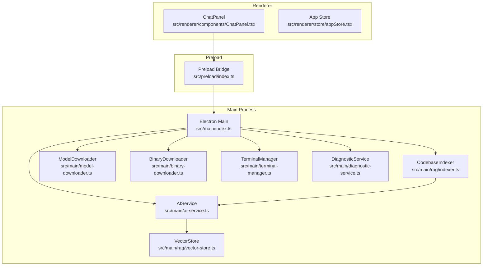
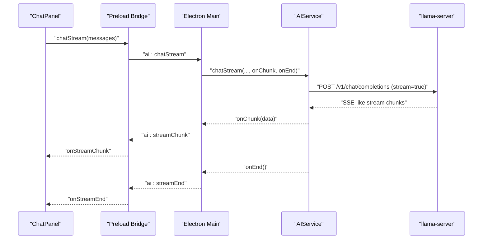
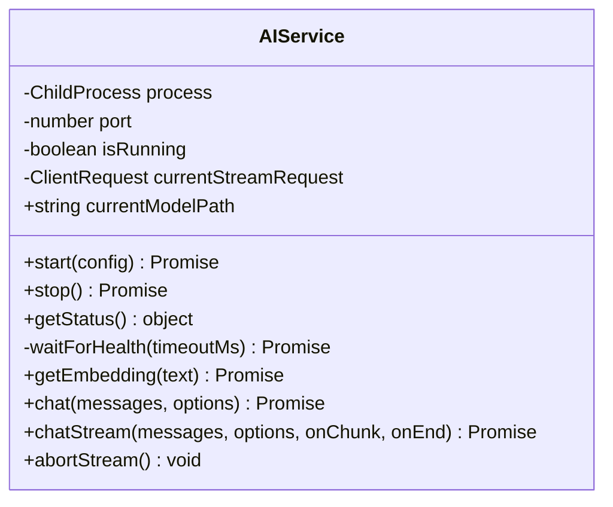
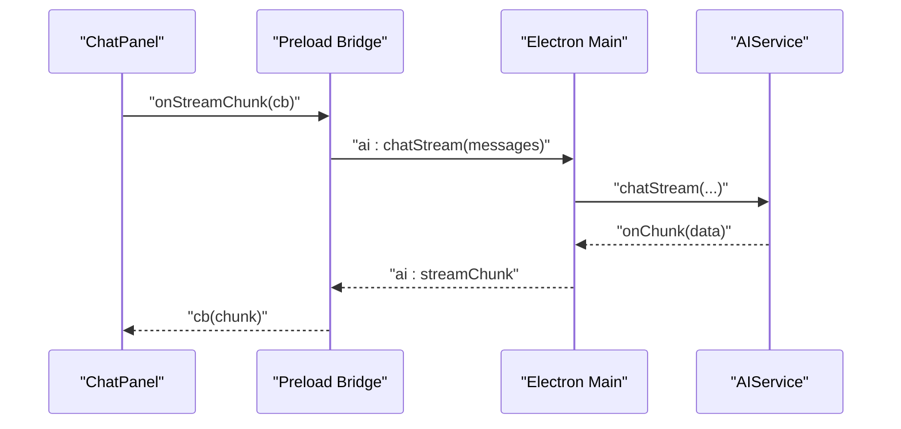
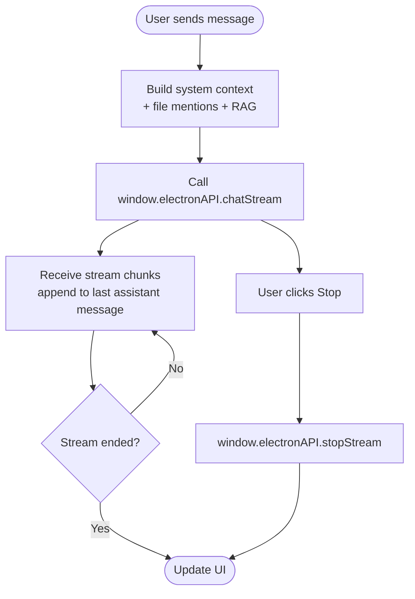
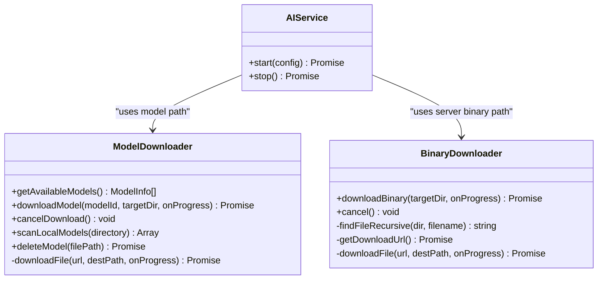
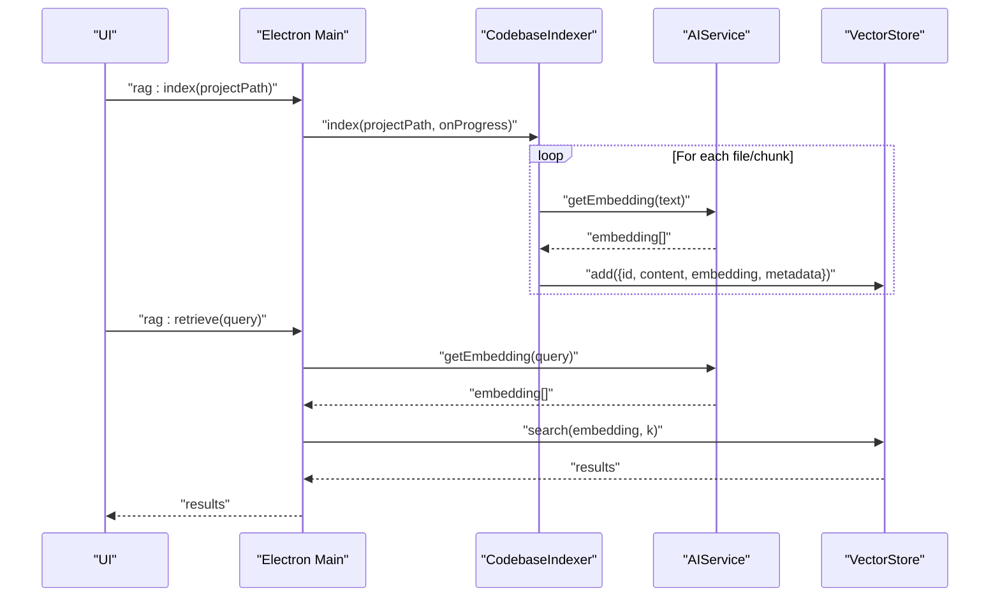
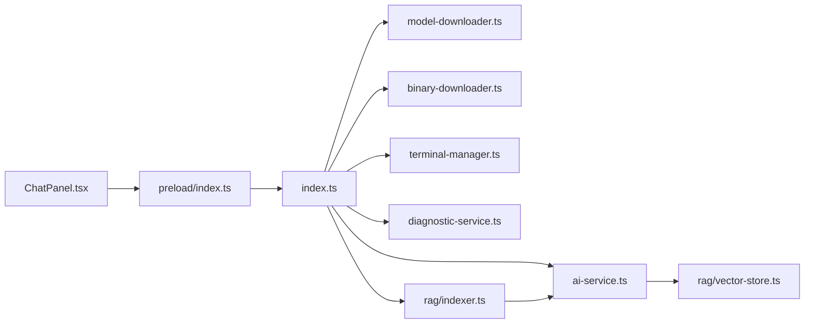

# AI Service

<cite>
**Referenced Files in This Document**
- [ai-service.ts](file://src/main/ai-service.ts)
- [index.ts](file://src/main/index.ts)
- [preload/index.ts](file://src/preload/index.ts)
- [ChatPanel.tsx](file://src/renderer/components/ChatPanel.tsx)
- [appStore.tsx](file://src/renderer/store/appStore.tsx)
- [model-downloader.ts](file://src/main/model-downloader.ts)
- [binary-downloader.ts](file://src/main/binary-downloader.ts)
- [terminal-manager.ts](file://src/main/terminal-manager.ts)
- [diagnostic-service.ts](file://src/main/diagnostic-service.ts)
- [vector-store.ts](file://src/main/rag/vector-store.ts)
- [indexer.ts](file://src/main/rag/indexer.ts)
- [README.md](file://README.md)
</cite>

## Table of Contents
1. [Introduction](#introduction)
2. [Project Structure](#project-structure)
3. [Core Components](#core-components)
4. [Architecture Overview](#architecture-overview)
5. [Detailed Component Analysis](#detailed-component-analysis)
6. [Dependency Analysis](#dependency-analysis)
7. [Performance Considerations](#performance-considerations)
8. [Troubleshooting Guide](#troubleshooting-guide)
9. [Conclusion](#conclusion)
10. [Appendices](#appendices)

## Introduction
This document describes the AI Service component that manages the BitNet.cpp server lifecycle and AI operations. It covers server startup/shutdown, HTTP API communication with BitNet.cpp, streaming response handling, model management, health monitoring, error recovery, and integration with the chat panel. It also explains configuration options, performance optimization, memory management, concurrent request handling, and troubleshooting guidance.

## Project Structure
The AI Service resides in the Electron main process alongside other services. It integrates with:
- Renderer UI components (e.g., ChatPanel)
- Preload bridge for IPC
- Model downloader and binary downloader
- Terminal manager
- RAG subsystem for embeddings and retrieval

**Diagram sources**
- [ai-service.ts](file://src/main/ai-service.ts#L1-L323)
- [index.ts](file://src/main/index.ts#L1-L542)
- [preload/index.ts](file://src/preload/index.ts#L1-L120)
- [ChatPanel.tsx](file://src/renderer/components/ChatPanel.tsx#L1-L1021)
- [appStore.tsx](file://src/renderer/store/appStore.tsx#L1-L357)
- [model-downloader.ts](file://src/main/model-downloader.ts#L1-L483)
- [binary-downloader.ts](file://src/main/binary-downloader.ts#L1-L162)
- [terminal-manager.ts](file://src/main/terminal-manager.ts#L1-L111)
- [diagnostic-service.ts](file://src/main/diagnostic-service.ts#L1-L65)
- [vector-store.ts](file://src/main/rag/vector-store.ts#L1-L84)
- [indexer.ts](file://src/main/rag/indexer.ts#L1-L127)

**Section sources**
- [README.md](file://README.md#L59-L87)
- [index.ts](file://src/main/index.ts#L116-L519)

## Core Components
- AIService: Manages the llama-server subprocess, health checks, HTTP endpoints, and streaming responses.
- IPC Handlers: Expose AIService APIs to the renderer via Electron IPC.
- Preload Bridge: Exposes a typed API surface to renderer components.
- ChatPanel: Orchestrates chat requests, streaming updates, and model switching.
- ModelDownloader and BinaryDownloader: Provide model and server binary management.
- RAG Subsystem: Embeddings and retrieval pipeline integrated with AIService.

**Section sources**
- [ai-service.ts](file://src/main/ai-service.ts#L12-L323)
- [index.ts](file://src/main/index.ts#L273-L323)
- [preload/index.ts](file://src/preload/index.ts#L33-L50)
- [ChatPanel.tsx](file://src/renderer/components/ChatPanel.tsx#L196-L295)

## Architecture Overview
The AI Service runs BitNet.cpp’s llama-server as a child process and exposes HTTP endpoints for:
- Health checks
- Embedding generation
- Chat completions (non-streaming and streaming)

The renderer communicates via IPC to start/stop the server, send chat messages, and receive streaming chunks. The RAG subsystem uses AIService to generate embeddings for codebase indexing and retrieval.

**Diagram sources**
- [ChatPanel.tsx](file://src/renderer/components/ChatPanel.tsx#L286-L295)
- [preload/index.ts](file://src/preload/index.ts#L38-L50)
- [index.ts](file://src/main/index.ts#L304-L319)
- [ai-service.ts](file://src/main/ai-service.ts#L240-L314)

## Detailed Component Analysis

### AIService
Responsibilities:
- Spawn and manage llama-server subprocess with configurable arguments.
- Health monitoring via periodic HTTP GET to /health.
- Non-streaming chat via POST to /v1/chat/completions.
- Streaming chat via POST to /v1/chat/completions with stream=true and SSE-like parsing.
- Embedding generation via POST to /embedding.
- Graceful shutdown with SIGTERM/SIGKILL fallback.
- Abort active streaming requests.

Key behaviors:
- Startup validates configuration, spawns process with host binding to localhost, enables embedding endpoint, and waits for health.
- Health polling retries until timeout or success.
- Streaming parses lines prefixed with data:, handles [DONE], and forwards chunks to callbacks.
- Embedding response parsing accommodates different server formats.

**Diagram sources**
- [ai-service.ts](file://src/main/ai-service.ts#L12-L323)

**Section sources**
- [ai-service.ts](file://src/main/ai-service.ts#L19-L89)
- [ai-service.ts](file://src/main/ai-service.ts#L117-L145)
- [ai-service.ts](file://src/main/ai-service.ts#L147-L188)
- [ai-service.ts](file://src/main/ai-service.ts#L190-L238)
- [ai-service.ts](file://src/main/ai-service.ts#L240-L314)
- [ai-service.ts](file://src/main/ai-service.ts#L316-L321)

### IPC Handlers and Preload Bridge
- Electron Main registers IPC handlers for AI operations and relays streaming events to the renderer.
- Preload exposes a typed API to renderer components, including streaming event subscriptions.

**Diagram sources**
- [ChatPanel.tsx](file://src/renderer/components/ChatPanel.tsx#L89-L105)
- [preload/index.ts](file://src/preload/index.ts#L41-L49)
- [index.ts](file://src/main/index.ts#L304-L319)

**Section sources**
- [index.ts](file://src/main/index.ts#L273-L323)
- [preload/index.ts](file://src/preload/index.ts#L33-L50)

### ChatPanel Integration
- Triggers AI chat on new user messages.
- Builds system context from project path, mentioned files, and RAG snippets.
- Streams assistant replies and stops generation via stopStream.
- Handles model switching by stopping and restarting the server.

**Diagram sources**
- [ChatPanel.tsx](file://src/renderer/components/ChatPanel.tsx#L196-L295)
- [ChatPanel.tsx](file://src/renderer/components/ChatPanel.tsx#L447-L451)

**Section sources**
- [ChatPanel.tsx](file://src/renderer/components/ChatPanel.tsx#L196-L295)
- [ChatPanel.tsx](file://src/renderer/components/ChatPanel.tsx#L447-L451)

### Model Management
- ModelDownloader provides model discovery, download, cancellation, scanning, and deletion.
- BinaryDownloader fetches the llama-server binary from GitHub releases and extracts it to a dedicated bin directory.
- Settings include modelPath, serverBinaryPath, contextSize, maxTokens, temperature, threads, and modelsDirectory.

**Diagram sources**
- [model-downloader.ts](file://src/main/model-downloader.ts#L267-L483)
- [binary-downloader.ts](file://src/main/binary-downloader.ts#L7-L162)
- [ai-service.ts](file://src/main/ai-service.ts#L19-L89)

**Section sources**
- [model-downloader.ts](file://src/main/model-downloader.ts#L17-L265)
- [binary-downloader.ts](file://src/main/binary-downloader.ts#L17-L76)
- [index.ts](file://src/main/index.ts#L22-L52)

### RAG Integration
- CodebaseIndexer chunks files, generates embeddings via AIService, and stores vectors in VectorStore.
- RAG retrieval uses AIService.getEmbedding(query) and VectorStore.search(embedding, k).

**Diagram sources**
- [index.ts](file://src/main/index.ts#L497-L518)
- [indexer.ts](file://src/main/rag/indexer.ts#L18-L73)
- [vector-store.ts](file://src/main/rag/vector-store.ts#L29-L38)
- [ai-service.ts](file://src/main/ai-service.ts#L147-L188)

**Section sources**
- [index.ts](file://src/main/index.ts#L497-L518)
- [indexer.ts](file://src/main/rag/indexer.ts#L18-L73)
- [vector-store.ts](file://src/main/rag/vector-store.ts#L13-L83)
- [ai-service.ts](file://src/main/ai-service.ts#L147-L188)

## Dependency Analysis
- AIService depends on:
  - Child process spawning and HTTP client for server communication.
  - Settings for model path, context size, threads, and port.
- IPC layer depends on:
  - Preload bridge exposing typed APIs to renderer.
  - Electron main registering handlers and forwarding events.
- RAG subsystem depends on:
  - AIService for embeddings.
  - VectorStore for persistence and similarity search.

**Diagram sources**
- [ChatPanel.tsx](file://src/renderer/components/ChatPanel.tsx#L1-L1021)
- [preload/index.ts](file://src/preload/index.ts#L1-L120)
- [index.ts](file://src/main/index.ts#L1-L542)
- [ai-service.ts](file://src/main/ai-service.ts#L1-L323)
- [model-downloader.ts](file://src/main/model-downloader.ts#L1-L483)
- [binary-downloader.ts](file://src/main/binary-downloader.ts#L1-L162)
- [terminal-manager.ts](file://src/main/terminal-manager.ts#L1-L111)
- [diagnostic-service.ts](file://src/main/diagnostic-service.ts#L1-L65)
- [indexer.ts](file://src/main/rag/indexer.ts#L1-L127)
- [vector-store.ts](file://src/main/rag/vector-store.ts#L1-L84)

**Section sources**
- [index.ts](file://src/main/index.ts#L116-L519)

## Performance Considerations
- Concurrency:
  - AIService streams one request at a time; abortStream cancels the current request.
  - Consider queueing or rate-limiting if multiple concurrent requests are needed.
- Memory:
  - Streaming buffers chunks; ensure UI consumes chunks promptly to avoid accumulation.
  - Embedding generation and RAG indexing can be memory-intensive; consider batching and periodic saves.
- Network and I/O:
  - Health polling interval balances responsiveness and overhead.
  - Model and binary downloads use resume and progress reporting; ensure adequate disk space and network stability.
- CPU and Threads:
  - Tune threads and context size according to hardware; larger context increases memory usage.
- Persistence:
  - VectorStore persists periodically during indexing; ensure storage path is reliable.

[No sources needed since this section provides general guidance]

## Troubleshooting Guide
Common issues and resolutions:
- Server fails to start:
  - Verify serverBinaryPath and modelPath are configured.
  - Check health timeout and logs captured from stderr.
  - Ensure the binary directory contains required DLLs.
- Streaming stalls or ends unexpectedly:
  - Confirm the server is healthy and reachable.
  - Use abortStream to cancel stuck requests.
- Embedding failures:
  - Ensure embedding endpoint is enabled and server is healthy.
  - Validate model supports embeddings.
- Model or binary download errors:
  - Retry with cancel and restart.
  - Check network connectivity and disk permissions.
- RAG retrieval returns empty:
  - Ensure codebase is indexed and embeddings were generated.
  - Verify VectorStore persistence and content length limits.

**Section sources**
- [ai-service.ts](file://src/main/ai-service.ts#L72-L84)
- [ai-service.ts](file://src/main/ai-service.ts#L316-L321)
- [index.ts](file://src/main/index.ts#L432-L439)
- [binary-downloader.ts](file://src/main/binary-downloader.ts#L78-L83)
- [model-downloader.ts](file://src/main/model-downloader.ts#L305-L311)

## Conclusion
The AI Service provides a robust foundation for local AI inference using BitNet.cpp. It manages server lifecycle, exposes streaming and non-streaming chat APIs, integrates with model and binary management, and powers advanced features like RAG. Proper configuration, health monitoring, and careful handling of streaming and embeddings enable a responsive and reliable AI experience.

[No sources needed since this section summarizes without analyzing specific files]

## Appendices

### Configuration Options
- AIService start config:
  - binaryPath: Path to llama-server binary.
  - modelPath: Path to GGUF model file.
  - contextSize: Context window size.
  - threads: Number of CPU threads.
  - port: Local port for server.
- Settings persisted in userData:
  - modelPath, serverBinaryPath, contextSize, maxTokens, temperature, threads, modelsDirectory, theme, setupComplete, lastProjectPath, lastOpenFiles, lastActiveFile.

**Section sources**
- [ai-service.ts](file://src/main/ai-service.ts#L4-L10)
- [index.ts](file://src/main/index.ts#L22-L52)

### AI API Usage Patterns
- Non-streaming chat:
  - Prepare messages array with roles and content.
  - Call window.electronAPI.chat(messages, options).
- Streaming chat:
  - Subscribe to onStreamChunk and onStreamEnd.
  - Call window.electronAPI.chatStream(messages, options).
  - Optionally call window.electronAPI.stopStream to abort.
- Model switching:
  - Save new modelPath to settings.
  - Stop AIServer, wait briefly, then start AIServer.

**Section sources**
- [ChatPanel.tsx](file://src/renderer/components/ChatPanel.tsx#L196-L295)
- [ChatPanel.tsx](file://src/renderer/components/ChatPanel.tsx#L147-L169)
- [preload/index.ts](file://src/preload/index.ts#L37-L50)
- [index.ts](file://src/main/index.ts#L273-L323)

### Response Streaming Implementation
- Server sends SSE-like stream chunks prefixed with data:.
- Parser accumulates lines, splits by newline, and forwards parsed choices deltas to onChunk.
- [DONE] signals completion and triggers onEnd.

**Section sources**
- [ai-service.ts](file://src/main/ai-service.ts#L240-L314)

### Integration with Chat Panel
- ChatPanel builds context from project path, file mentions, and RAG snippets.
- Uses AIService streaming to update the last assistant message incrementally.
- Supports stop generation and model switching with server restart.

**Section sources**
- [ChatPanel.tsx](file://src/renderer/components/ChatPanel.tsx#L211-L295)