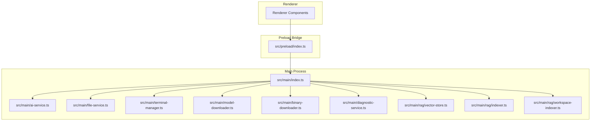
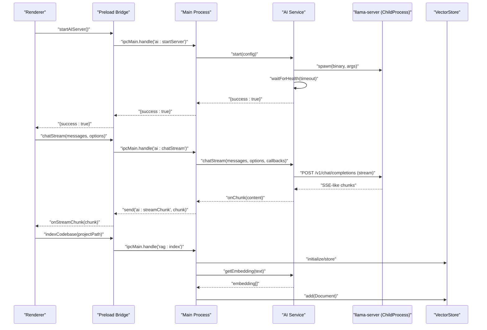
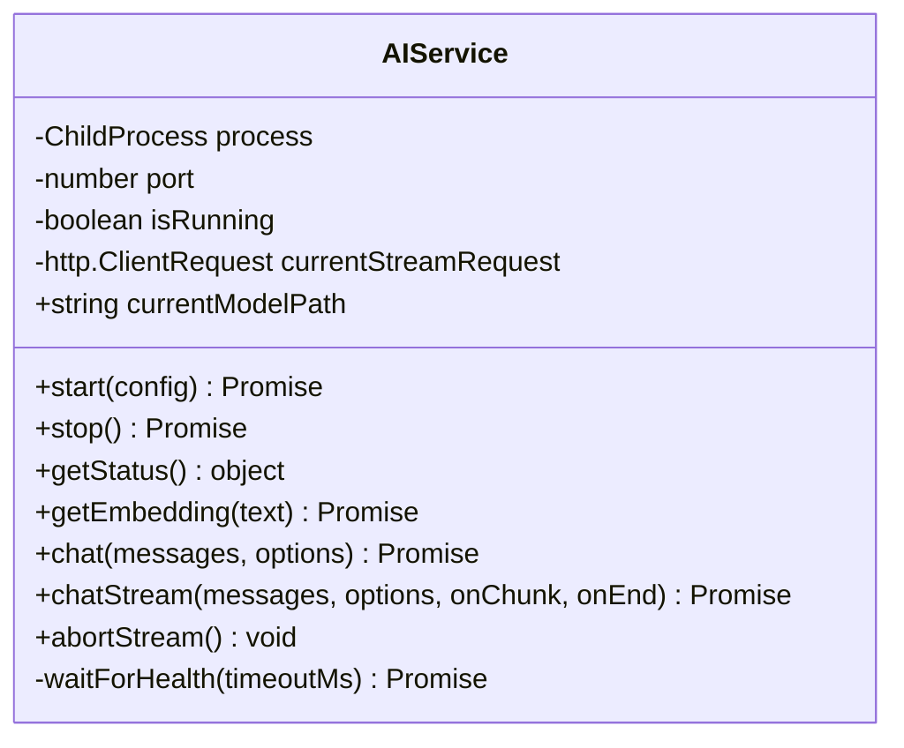
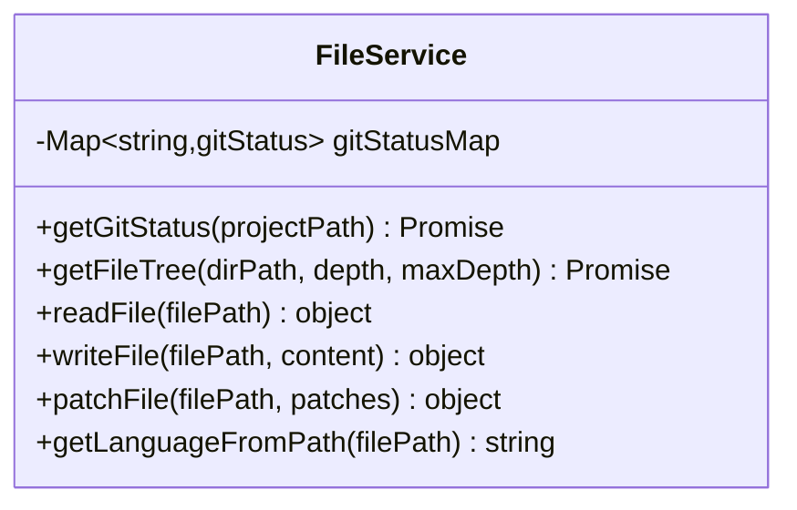
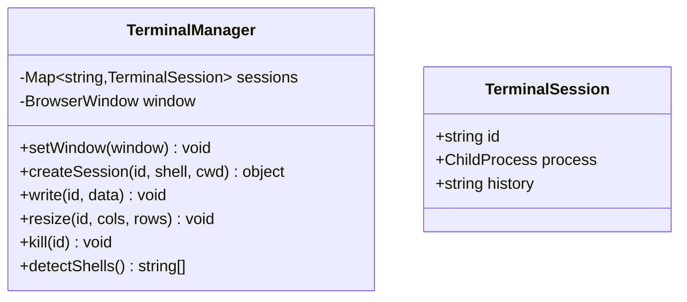
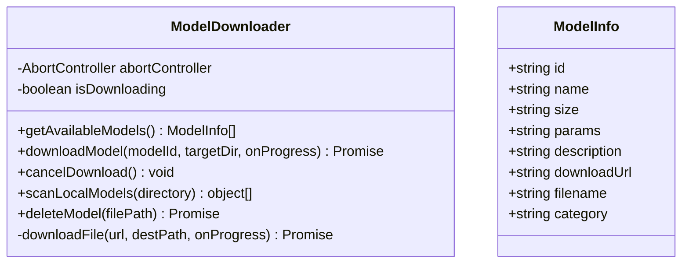
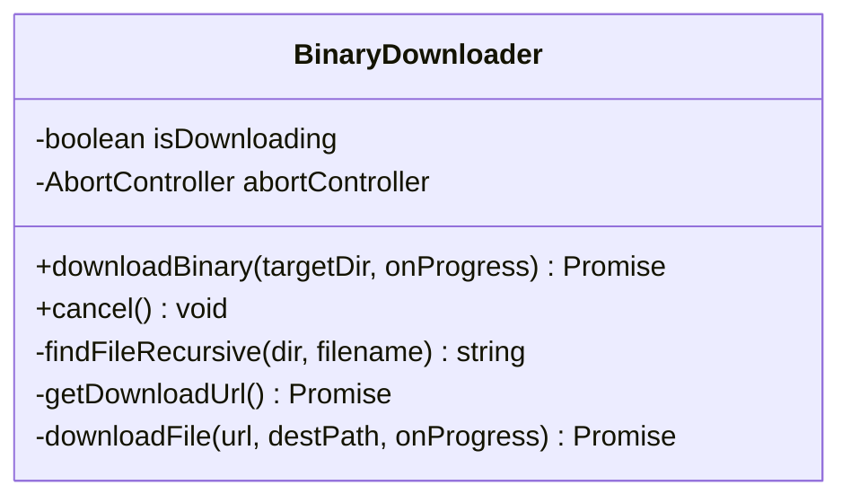
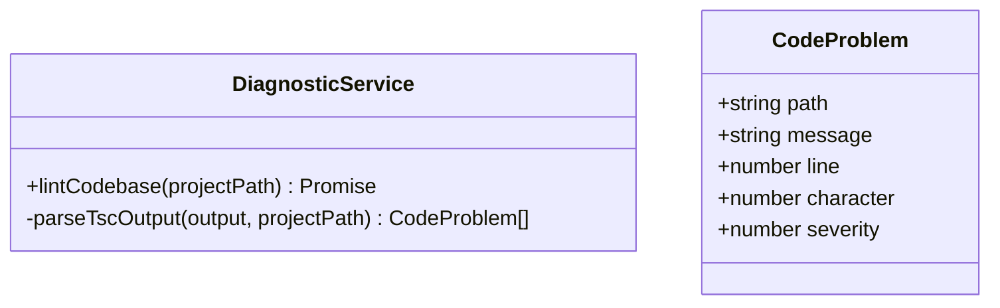
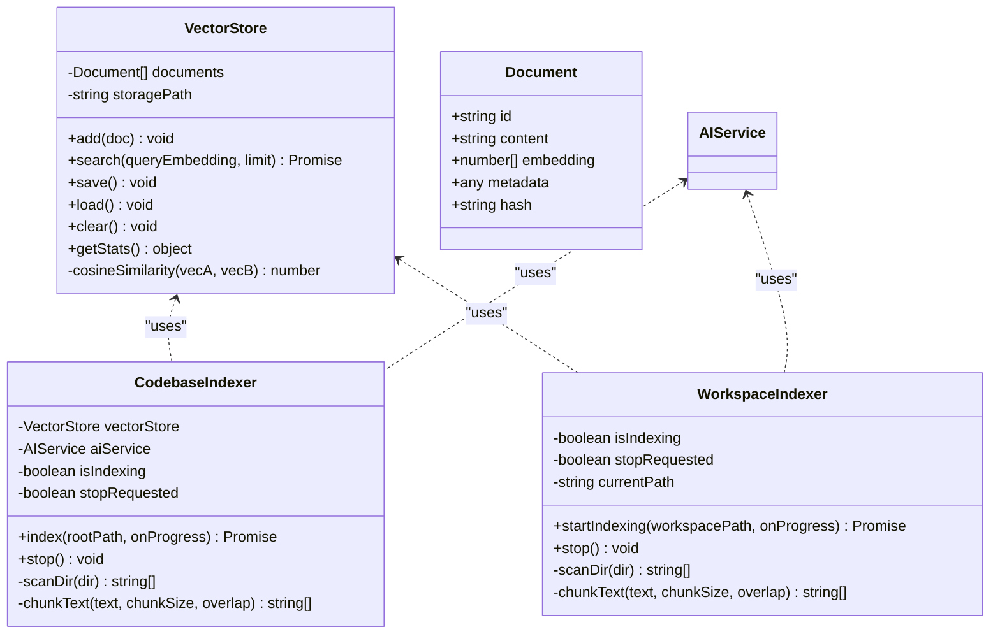
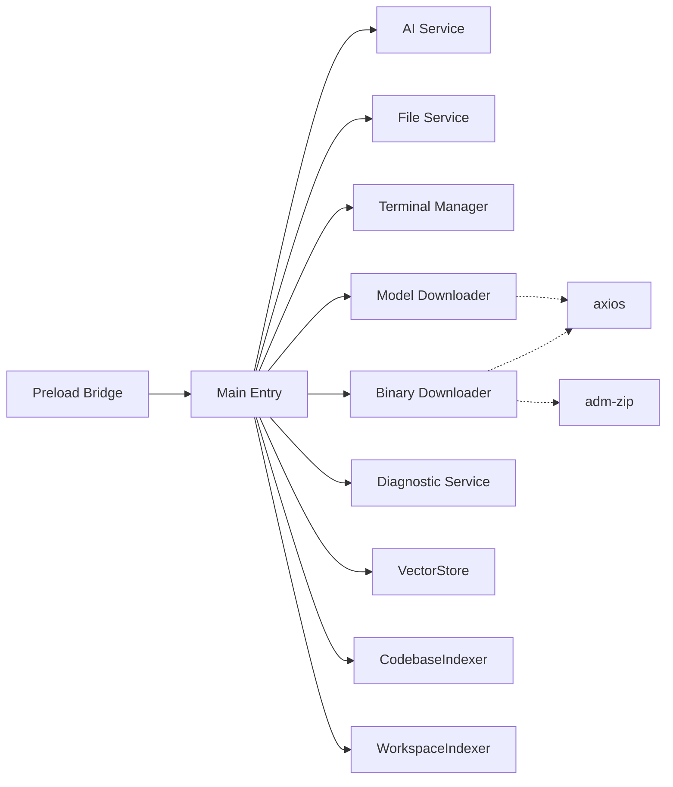

# Core Services

<cite>
**Referenced Files in This Document**
- [src/main/index.ts](file://src/main/index.ts)
- [src/main/ai-service.ts](file://src/main/ai-service.ts)
- [src/main/file-service.ts](file://src/main/file-service.ts)
- [src/main/terminal-manager.ts](file://src/main/terminal-manager.ts)
- [src/main/model-downloader.ts](file://src/main/model-downloader.ts)
- [src/main/binary-downloader.ts](file://src/main/binary-downloader.ts)
- [src/main/diagnostic-service.ts](file://src/main/diagnostic-service.ts)
- [src/main/rag/vector-store.ts](file://src/main/rag/vector-store.ts)
- [src/main/rag/indexer.ts](file://src/main/rag/indexer.ts)
- [src/main/rag/workspace-indexer.ts](file://src/main/rag/workspace-indexer.ts)
- [src/preload/index.ts](file://src/preload/index.ts)
- [package.json](file://package.json)
</cite>

## Table of Contents
1. [Introduction](#introduction)
2. [Project Structure](#project-structure)
3. [Core Components](#core-components)
4. [Architecture Overview](#architecture-overview)
5. [Detailed Component Analysis](#detailed-component-analysis)
6. [Dependency Analysis](#dependency-analysis)
7. [Performance Considerations](#performance-considerations)
8. [Troubleshooting Guide](#troubleshooting-guide)
9. [Conclusion](#conclusion)
10. [Appendices](#appendices)

## Introduction
This document describes BitNet IDE’s core service layer responsible for offline-first local AI development. It covers the main process services that manage:
- AI service for BitNet.cpp server lifecycle and inference
- File system service for project operations and diagnostics
- Terminal manager for shell integration
- Model downloader for GGUF model discovery, download, and management
- Binary downloader for BitNet.cpp server binaries
- RAG vector store and indexing pipeline for codebase embedding

It explains how services encapsulate responsibilities, communicate through well-defined IPC handlers, and integrate with the renderer via a preload bridge. It also documents lifecycle management, configuration, error handling, performance characteristics, and extensibility patterns for adding new services.

## Project Structure
The core services live in the main process under src/main, with IPC wiring in the main entry and a preload bridge exposing typed APIs to the renderer.

**Diagram sources**
- [src/main/index.ts](file://src/main/index.ts#L116-L519)
- [src/preload/index.ts](file://src/preload/index.ts#L1-L120)

**Section sources**
- [src/main/index.ts](file://src/main/index.ts#L1-L542)
- [src/preload/index.ts](file://src/preload/index.ts#L1-L120)

## Core Components
- AI Service: Manages BitNet.cpp server lifecycle, health checks, chat completions, streaming, and embeddings.
- File Service: Provides file tree traversal, read/write/patch operations, and Git status integration.
- Terminal Manager: Spawns and manages shell sessions, streams output to renderer, and handles lifecycle events.
- Model Downloader: Enumerates available GGUF models, downloads with resume/cancel, scans local models, and deletes models.
- Binary Downloader: Fetches latest llama.cpp release, downloads, extracts, and verifies the server binary.
- Diagnostic Service: Runs TypeScript compiler diagnostics on a project to surface problems.
- RAG Stack: Vector store persistence and two indexing strategies (codebase indexer and workspace indexer) that produce embeddings for retrieval.

**Section sources**
- [src/main/ai-service.ts](file://src/main/ai-service.ts#L12-L322)
- [src/main/file-service.ts](file://src/main/file-service.ts#L27-L161)
- [src/main/terminal-manager.ts](file://src/main/terminal-manager.ts#L12-L110)
- [src/main/model-downloader.ts](file://src/main/model-downloader.ts#L267-L482)
- [src/main/binary-downloader.ts](file://src/main/binary-downloader.ts#L7-L161)
- [src/main/diagnostic-service.ts](file://src/main/diagnostic-service.ts#L16-L64)
- [src/main/rag/vector-store.ts](file://src/main/rag/vector-store.ts#L13-L83)
- [src/main/rag/indexer.ts](file://src/main/rag/indexer.ts#L7-L126)
- [src/main/rag/workspace-indexer.ts](file://src/main/rag/workspace-indexer.ts#L12-L148)

## Architecture Overview
The main process initializes services and exposes them via ipcMain handlers. The preload bridge wraps ipcRenderer invocations into a typed API for the renderer. The AI service spawns a child process for the BitNet.cpp server and communicates via HTTP endpoints. The RAG stack integrates with the AI service to generate embeddings and persist them in a local vector store.

**Diagram sources**
- [src/main/index.ts](file://src/main/index.ts#L273-L319)
- [src/main/ai-service.ts](file://src/main/ai-service.ts#L19-L89)
- [src/main/rag/vector-store.ts](file://src/main/rag/vector-store.ts#L13-L83)
- [src/main/rag/indexer.ts](file://src/main/rag/indexer.ts#L18-L73)

**Section sources**
- [src/main/index.ts](file://src/main/index.ts#L116-L519)
- [src/main/ai-service.ts](file://src/main/ai-service.ts#L12-L322)

## Detailed Component Analysis

### AI Service
Responsibilities:
- Spawn and manage BitNet.cpp server process
- Health checks via HTTP /health
- Chat completions and streaming via HTTP /v1/chat/completions
- Embedding generation via HTTP /embedding
- Graceful shutdown with SIGTERM/SIGKILL fallback
- Stream abort support

Lifecycle and initialization:
- start(config) validates running state, sets port, spawns process with args, captures stderr, waits for health, and toggles running flag
- stop() attempts graceful termination with timeout and kills if needed
- getStatus() returns running state and port
- chat(chatStream) accept messages and options, send HTTP requests, parse responses
- getEmbedding() posts to embedding endpoint and parses response

Error handling:
- Early exit detection via process error/exit listeners
- Health timeout with descriptive error messages
- HTTP request error handling and fallbacks
- Stream abort cancels current request

Performance considerations:
- Streaming chunks are parsed line-by-line to handle SSE-like responses
- Embedding endpoint is used by RAG indexer and retrieval
- Configurable context size, threads, and port

Extensibility:
- New endpoints can be added by extending HTTP calls and adding new methods
- Stream abort can be extended to support multiple concurrent streams

**Section sources**
- [src/main/ai-service.ts](file://src/main/ai-service.ts#L12-L322)

#### AI Service Class Diagram

**Diagram sources**
- [src/main/ai-service.ts](file://src/main/ai-service.ts#L12-L322)

### File Service
Responsibilities:
- Build hierarchical file trees with Git status
- Read/write files
- Patch files via search-and-replace
- Detect language from file extension
- Diagnostics integration via DiagnosticService

Lifecycle and initialization:
- Uses child process to run git status and cache statuses per path
- getFileTree() traverses directories, sorts items, and recurses with depth limits
- readFile/writeFile/patchFile return structured results with success/error

Error handling:
- Catches filesystem errors and returns error messages
- Ignores hidden directories and files by default

Performance considerations:
- Depth-limited recursion to prevent heavy scans
- Sorting directories before files for predictable UI ordering
- Git status computed once per root scan

Extensibility:
- Add new ignored paths or file types by updating constants
- Extend language mapping for new file types

**Section sources**
- [src/main/file-service.ts](file://src/main/file-service.ts#L27-L161)

#### File Service Class Diagram

**Diagram sources**
- [src/main/file-service.ts](file://src/main/file-service.ts#L27-L161)

### Terminal Manager
Responsibilities:
- Spawn shell processes per session
- Stream stdout/stderr to renderer with normalization
- Handle session lifecycle (exit, kill)
- Detect available shells per platform

Lifecycle and initialization:
- createSession() selects shell based on platform, spawns process, wires listeners, and stores session
- write()/kill()/resize() operate on stored sessions
- detectShells() returns platform-appropriate shells

Error handling:
- Catches spawn failures and returns structured errors
- Normalizes output for xterm.js compatibility

Performance considerations:
- Streams output asynchronously; minimal overhead per write
- No PTY resize support in spawn; acceptable trade-off for simplicity

Extensibility:
- Add shell detection for additional shells
- Introduce PTY support for advanced features

**Section sources**
- [src/main/terminal-manager.ts](file://src/main/terminal-manager.ts#L12-L110)

#### Terminal Manager Class Diagram

**Diagram sources**
- [src/main/terminal-manager.ts](file://src/main/terminal-manager.ts#L5-L18)
- [src/main/terminal-manager.ts](file://src/main/terminal-manager.ts#L12-L110)

### Model Downloader
Responsibilities:
- Enumerate built-in GGUF models with metadata
- Download models with resume/cancel support
- Scan local directories for .gguf files
- Delete models and handle partial downloads

Lifecycle and initialization:
- Maintains AbortController for cancellation
- downloadModel() resolves URL, ensures target directory, and delegates to downloadFile()
- downloadFile() supports HTTP/HTTPS, redirects, resume via Range headers, and periodic progress updates
- scanLocalModels() enumerates .gguf files and sizes
- deleteModel() removes files safely

Error handling:
- Handles HTTP errors, too many redirects, 416 range failures, and rename failures
- Emits progress updates and completion/error events to renderer

Performance considerations:
- Resume support reduces bandwidth for interrupted downloads
- Speed calculation throttled to reduce event spam
- Progress mapped to overall percentage for unified UX

Extensibility:
- Add new models by extending AVAILABLE_MODELS
- Support additional mirrors or authentication by extending downloadFile()

**Section sources**
- [src/main/model-downloader.ts](file://src/main/model-downloader.ts#L267-L482)

#### Model Downloader Class Diagram

**Diagram sources**
- [src/main/model-downloader.ts](file://src/main/model-downloader.ts#L6-L266)
- [src/main/model-downloader.ts](file://src/main/model-downloader.ts#L267-L482)

### Binary Downloader
Responsibilities:
- Fetch latest llama.cpp release metadata
- Download and extract server binary to a dedicated bin directory
- Verify presence of the expected binary
- Cancel ongoing downloads

Lifecycle and initialization:
- downloadBinary() orchestrates fetching release info, downloading zip, extracting, and verification
- getDownloadUrl() tries multiple release API URLs and asset patterns
- downloadFile() streams zip with progress and cancellation support
- findFileRecursive() locates the server binary after extraction

Error handling:
- Fallback between ggml-org and ggerganov repositories
- Graceful failure when binary not found post-extraction
- Abort signal propagation to underlying streams

Performance considerations:
- Streams zip to disk to avoid memory pressure
- Progress mapped to overall stages for better UX

Extensibility:
- Add new platforms by extending patterns and release URLs
- Support authenticated releases by extending getDownloadUrl()

**Section sources**
- [src/main/binary-downloader.ts](file://src/main/binary-downloader.ts#L7-L161)

#### Binary Downloader Class Diagram

**Diagram sources**
- [src/main/binary-downloader.ts](file://src/main/binary-downloader.ts#L7-L161)

### Diagnostic Service
Responsibilities:
- Run TypeScript compiler diagnostics on a project
- Parse tsc output into structured problems
- Return errors and warnings with severity

Lifecycle and initialization:
- lintCodebase() executes tsc with flags and captures stdout/stderr
- parseTscOutput() extracts file path, line, column, and message

Error handling:
- Handles non-zero exit codes as normal for linting
- Returns structured errors on failures

Extensibility:
- Add other linters by introducing new commands and parsers

**Section sources**
- [src/main/diagnostic-service.ts](file://src/main/diagnostic-service.ts#L16-L64)

#### Diagnostic Service Class Diagram

**Diagram sources**
- [src/main/diagnostic-service.ts](file://src/main/diagnostic-service.ts#L8-L64)

### RAG Stack
Responsibilities:
- VectorStore: Persist and search embeddings with cosine similarity
- CodebaseIndexer: Traverse codebase, chunk content, generate embeddings, and store
- WorkspaceIndexer: Alternative indexing strategy for broader workspace scanning

Lifecycle and initialization:
- VectorStore loads persisted documents on construction and saves periodically
- CodebaseIndexer/index() walks files, chunks content, calls AI service for embeddings, and adds to store
- WorkspaceIndexer starts scanning, chunks, generates embeddings, and persists

Error handling:
- Indexers catch per-file errors and continue
- VectorStore persists on checkpoints and completion

Performance considerations:
- Chunking with overlap improves retrieval quality
- Periodic saves reduce risk of data loss
- File size limits prevent heavy reads

Extensibility:
- Add new chunking strategies or embedding providers
- Extend allowed file types and ignore lists

**Section sources**
- [src/main/rag/vector-store.ts](file://src/main/rag/vector-store.ts#L13-L83)
- [src/main/rag/indexer.ts](file://src/main/rag/indexer.ts#L7-L126)
- [src/main/rag/workspace-indexer.ts](file://src/main/rag/workspace-indexer.ts#L12-L148)

#### RAG Stack Class Diagram

**Diagram sources**
- [src/main/rag/vector-store.ts](file://src/main/rag/vector-store.ts#L5-L83)
- [src/main/rag/indexer.ts](file://src/main/rag/indexer.ts#L7-L126)
- [src/main/rag/workspace-indexer.ts](file://src/main/rag/workspace-indexer.ts#L12-L148)

## Dependency Analysis
The main process composes services and wires IPC handlers. The preload bridge exposes a typed API to the renderer. External dependencies include axios for HTTP downloads, adm-zip for archive extraction, and xterm for terminal rendering.

**Diagram sources**
- [src/main/index.ts](file://src/main/index.ts#L1-L12)
- [src/main/binary-downloader.ts](file://src/main/binary-downloader.ts#L1-L5)
- [src/main/model-downloader.ts](file://src/main/model-downloader.ts#L1-L4)
- [package.json](file://package.json#L12-L33)

**Section sources**
- [src/main/index.ts](file://src/main/index.ts#L1-L12)
- [package.json](file://package.json#L12-L33)

## Performance Considerations
- AI Service
  - Health checks poll until timeout; tune context size and threads for performance vs. latency
  - Streaming chunks are parsed incrementally to reduce memory footprint
- File Service
  - Depth-limited traversal prevents deep scans; sorting directories first improves UI predictability
- Terminal Manager
  - Streams output asynchronously; minimal overhead per write
- Model Downloader
  - Resume support and throttled progress reduce bandwidth and UI churn
- Binary Downloader
  - Streaming zip extraction avoids memory pressure
- RAG
  - Chunking with overlap improves recall; periodic saves mitigate data loss risk

[No sources needed since this section provides general guidance]

## Troubleshooting Guide
Common issues and resolutions:
- AI server fails to start
  - Verify binary path and model path are configured
  - Check health timeout and stderr capture for crash reasons
  - Ensure port is free and host binding is correct
- Streaming stops unexpectedly
  - Use abortStream() to cancel and restart
  - Inspect request error handling and network conditions
- Model download fails
  - Check network connectivity and redirects
  - Resume downloads if supported; delete partial .part files if corrupted
- Binary download missing server executable
  - Verify extraction path and recursive search for binary
  - Try alternate release API URLs
- Terminal output garbled
  - Ensure line ending normalization for xterm.js
- RAG indexing slow
  - Reduce chunk size or adjust overlap
  - Limit file sizes and allowed extensions

**Section sources**
- [src/main/ai-service.ts](file://src/main/ai-service.ts#L72-L88)
- [src/main/model-downloader.ts](file://src/main/model-downloader.ts#L356-L472)
- [src/main/binary-downloader.ts](file://src/main/binary-downloader.ts#L100-L129)
- [src/main/terminal-manager.ts](file://src/main/terminal-manager.ts#L43-L57)
- [src/main/rag/indexer.ts](file://src/main/rag/indexer.ts#L18-L73)

## Conclusion
BitNet IDE’s core services form a cohesive main-process architecture centered around a BitNet.cpp server, robust file operations, shell integration, model management, and RAG indexing. The IPC and preload bridge provide a clean separation between renderer and main, enabling safe and efficient interactions. The design emphasizes lifecycle management, error handling, and performance, with clear extension points for future enhancements.

[No sources needed since this section summarizes without analyzing specific files]

## Appendices

### IPC Handler Reference
Key handlers exposed by the main process include:
- Window controls: minimize, maximize, close, isMaximized
- Settings: get, save
- File system: selectFile, openFolder, readFile, writeFile, patchFile, lintCodebase, getFileTree, createFile, createFolder, rename, delete, searchInFiles
- AI service: startServer, stopServer, getStatus, chat, chatStream, stopStream, analyzeCodebase
- Models: getAvailable, selectDirectory, download, cancelDownload, scanLocal, delete
- Binary downloader: download, cancel
- Terminal: create, write, resize, kill, getShells, execute
- RAG: index, status, retrieve

These handlers are registered during setup and delegate to respective services.

**Section sources**
- [src/main/index.ts](file://src/main/index.ts#L116-L519)

### Preload API Reference
The preload bridge exposes typed methods for the renderer, including:
- Window controls, settings, file operations, AI service, model downloader, binary downloader, terminal, and RAG APIs
- Event subscriptions for streaming and progress notifications

**Section sources**
- [src/preload/index.ts](file://src/preload/index.ts#L3-L118)

### Service Configuration Options
- AI Service
  - Config keys: binaryPath, modelPath, contextSize, threads, port
  - Defaults and persistence handled via settings
- File Service
  - Git status caching and ignored paths
- Terminal Manager
  - Platform-specific shell detection and defaults
- Model Downloader
  - Built-in model catalog and download behavior
- Binary Downloader
  - Release API fallbacks and asset patterns
- RAG
  - Chunk sizes, overlaps, and allowed file types

**Section sources**
- [src/main/index.ts](file://src/main/index.ts#L22-L52)
- [src/main/ai-service.ts](file://src/main/ai-service.ts#L4-L10)
- [src/main/file-service.ts](file://src/main/file-service.ts#L12-L20)
- [src/main/terminal-manager.ts](file://src/main/terminal-manager.ts#L98-L109)
- [src/main/model-downloader.ts](file://src/main/model-downloader.ts#L17-L265)
- [src/main/binary-downloader.ts](file://src/main/binary-downloader.ts#L12-L15)
- [src/main/rag/indexer.ts](file://src/main/rag/indexer.ts#L81-L108)
- [src/main/rag/workspace-indexer.ts](file://src/main/rag/workspace-indexer.ts#L22-L45)

### Service Lifecycle Management
- Initialization
  - Services instantiated in setupIPC() and reused across handlers
- Shutdown
  - AI server stopped on window-all-closed
- Session management
  - Terminal sessions tracked per ID; cleaned up on exit
- Persistence
  - VectorStore saves and loads from user data directory

**Section sources**
- [src/main/index.ts](file://src/main/index.ts#L521-L541)
- [src/main/terminal-manager.ts](file://src/main/terminal-manager.ts#L59-L62)
- [src/main/rag/vector-store.ts](file://src/main/rag/vector-store.ts#L40-L58)

### Extensibility Patterns
- Adding a new service
  - Create a new class under src/main with clear responsibilities
  - Instantiate in setupIPC() and register ipcMain.handle() handlers
  - Expose typed methods in preload/index.ts
  - Emit renderer events where applicable (e.g., progress, completion)
- Example patterns
  - ModelDownloader and BinaryDownloader show consistent patterns for download orchestration, progress callbacks, and cancellation
  - AI Service demonstrates health checks, streaming, and graceful shutdown

**Section sources**
- [src/main/index.ts](file://src/main/index.ts#L116-L519)
- [src/main/model-downloader.ts](file://src/main/model-downloader.ts#L267-L482)
- [src/main/binary-downloader.ts](file://src/main/binary-downloader.ts#L7-L161)
- [src/preload/index.ts](file://src/preload/index.ts#L1-L120)