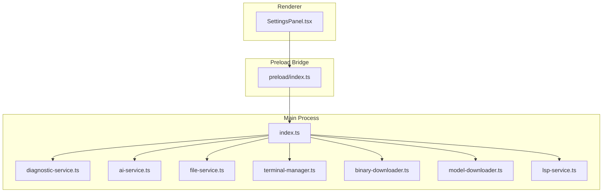
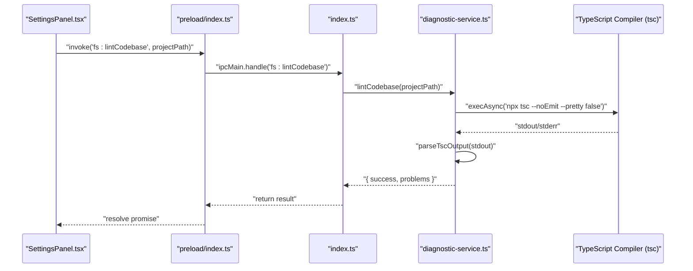
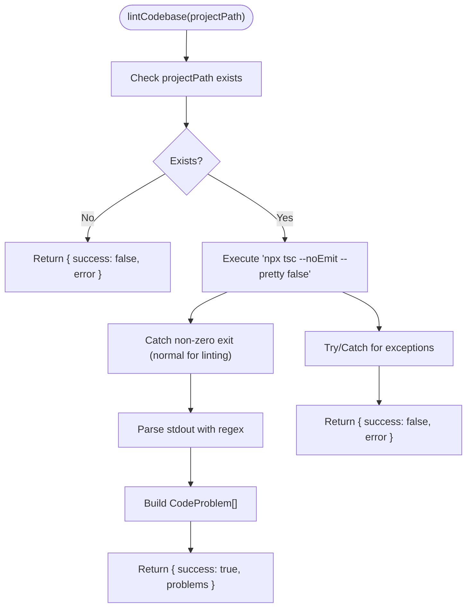
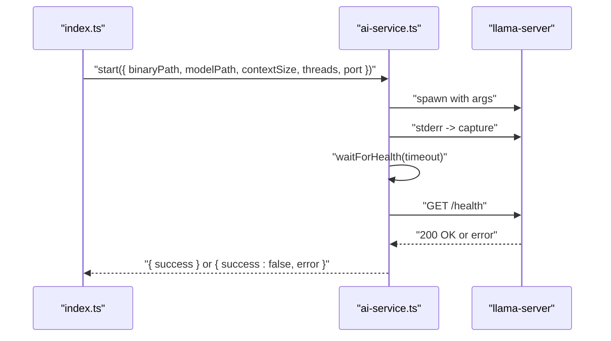
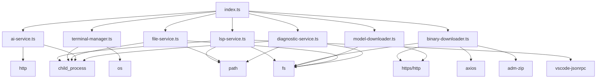

# Diagnostic Service

<cite>
**Referenced Files in This Document**
- [diagnostic-service.ts](file://src/main/diagnostic-service.ts)
- [index.ts](file://src/main/index.ts)
- [ai-service.ts](file://src/main/ai-service.ts)
- [file-service.ts](file://src/main/file-service.ts)
- [terminal-manager.ts](file://src/main/terminal-manager.ts)
- [binary-downloader.ts](file://src/main/binary-downloader.ts)
- [model-downloader.ts](file://src/main/model-downloader.ts)
- [lsp-service.ts](file://src/main/lsp-service.ts)
- [SettingsPanel.tsx](file://src/renderer/components/SettingsPanel.tsx)
- [index.ts](file://src/preload/index.ts)
- [README.md](file://README.md)
- [package.json](file://package.json)
</cite>

## Table of Contents
1. [Introduction](#introduction)
2. [Project Structure](#project-structure)
3. [Core Components](#core-components)
4. [Architecture Overview](#architecture-overview)
5. [Detailed Component Analysis](#detailed-component-analysis)
6. [Dependency Analysis](#dependency-analysis)
7. [Performance Considerations](#performance-considerations)
8. [Troubleshooting Guide](#troubleshooting-guide)
9. [Conclusion](#conclusion)
10. [Appendices](#appendices)

## Introduction
This document describes the Diagnostic Service that provides system health monitoring, performance metrics collection, and troubleshooting capabilities for the application. It focuses on:
- Monitoring application performance and resource utilization
- System compatibility checks
- Diagnostic data collection mechanisms (memory usage tracking, CPU profiling, disk I/O monitoring)
- Health checks for critical components (AI service connectivity, file system access, terminal functionality)
- Logging and error reporting systems (structured logging, error categorization, diagnostic information aggregation)
- Integration with the settings panel for diagnostic configuration
- Automated diagnostics and proactive issue prevention
- Guidance for interpreting diagnostic reports and identifying performance bottlenecks

The service is implemented primarily in the Electron main process and integrates with renderer-side components through IPC handlers exposed via a preload bridge.

## Project Structure
The diagnostic-related functionality spans the main process, preload bridge, and renderer components:
- Main process: diagnostic-service.ts, ai-service.ts, file-service.ts, terminal-manager.ts, binary-downloader.ts, model-downloader.ts, lsp-service.ts, and IPC setup in index.ts
- Preload bridge: exposes IPC APIs to the renderer
- Renderer: SettingsPanel.tsx for configuration and UI integration

**Diagram sources**
- [index.ts](file://src/main/index.ts#L118-L535)
- [diagnostic-service.ts](file://src/main/diagnostic-service.ts#L16-L64)
- [ai-service.ts](file://src/main/ai-service.ts#L12-L322)
- [file-service.ts](file://src/main/file-service.ts#L27-L161)
- [terminal-manager.ts](file://src/main/terminal-manager.ts#L12-L110)
- [binary-downloader.ts](file://src/main/binary-downloader.ts#L7-L161)
- [model-downloader.ts](file://src/main/model-downloader.ts#L267-L482)
- [lsp-service.ts](file://src/main/lsp-service.ts#L31-L422)
- [index.ts](file://src/preload/index.ts#L3-L124)

**Section sources**
- [README.md](file://README.md#L59-L87)
- [package.json](file://package.json#L1-L37)

## Core Components
- DiagnosticService: Provides codebase linting using TypeScript compiler (tsc) and parses diagnostics into structured problems.
- AI Service: Manages llama-server lifecycle, health checks, and inference endpoints.
- File Service: File system operations, directory traversal, and git status integration.
- Terminal Manager: Spawns and manages terminal sessions with cross-platform shell detection.
- Model Downloader: Downloads GGUF models from curated lists and handles partial downloads.
- Binary Downloader: Downloads llama-server binaries from GitHub releases.
- LSP Service: Starts language servers for TypeScript/JavaScript, Python, Rust, Go, and sends requests for definitions, hover, and document symbols.
- Settings Panel: Renderer component for configuring diagnostic-related settings and model paths.

**Section sources**
- [diagnostic-service.ts](file://src/main/diagnostic-service.ts#L16-L64)
- [ai-service.ts](file://src/main/ai-service.ts#L12-L322)
- [file-service.ts](file://src/main/file-service.ts#L27-L161)
- [terminal-manager.ts](file://src/main/terminal-manager.ts#L12-L110)
- [model-downloader.ts](file://src/main/model-downloader.ts#L267-L482)
- [binary-downloader.ts](file://src/main/binary-downloader.ts#L7-L161)
- [lsp-service.ts](file://src/main/lsp-service.ts#L31-L422)
- [SettingsPanel.tsx](file://src/renderer/components/SettingsPanel.tsx#L15-L426)

## Architecture Overview
The diagnostic system orchestrates health checks and diagnostics across subsystems:
- IPC handlers in the main process expose diagnostic capabilities to the renderer
- The DiagnosticService triggers tsc to collect TypeScript diagnostics
- AI Service health checks ensure llama-server availability
- File Service validates file system access and enumerates project trees
- Terminal Manager verifies terminal functionality
- Model and Binary Downloaders validate model and binary availability
- LSP Service validates language server readiness

**Diagram sources**
- [index.ts](file://src/main/index.ts#L182-L184)
- [diagnostic-service.ts](file://src/main/diagnostic-service.ts#L16-L64)
- [index.ts](file://src/preload/index.ts#L25-L25)

## Detailed Component Analysis

### DiagnosticService
Responsibilities:
- Validates project path existence
- Executes tsc with flags to capture diagnostics without emitting files
- Parses tsc output into structured problems with path, message, line, character, and severity
- Returns success/failure with either problems or error message

Key behaviors:
- Uses child_process and promisify to execute tsc
- Applies a regex to extract file path, line, column, and message
- Joins relative paths with project root to produce absolute paths
- Handles non-zero exit codes gracefully by catching and returning stdout/stderr

**Diagram sources**
- [diagnostic-service.ts](file://src/main/diagnostic-service.ts#L16-L64)

**Section sources**
- [diagnostic-service.ts](file://src/main/diagnostic-service.ts#L16-L64)

### AI Service Health Checks
Responsibilities:
- Spawns llama-server with configured arguments
- Captures stderr for crash diagnostics
- Waits for health endpoint (/health) with timeout
- Provides status, embeddings, and chat endpoints
- Streams chat completions and supports abort

Health check mechanism:
- Sends HTTP GET to http://127.0.0.1:{port}/health
- Retries every 500 ms until timeout (30 seconds)
- On failure, stops process and returns detailed error including last lines of stderr

**Diagram sources**
- [ai-service.ts](file://src/main/ai-service.ts#L19-L89)
- [ai-service.ts](file://src/main/ai-service.ts#L117-L145)

**Section sources**
- [ai-service.ts](file://src/main/ai-service.ts#L12-L322)

### File Service Diagnostics
Responsibilities:
- Enumerates directory trees with git status integration
- Reads and writes files
- Applies patches to files
- Detects language from file extension

Diagnostics relevance:
- Directory traversal validates file system access and permissions
- Git status integration helps identify untracked/staged/ignored files
- Language detection supports LSP-based diagnostics

**Section sources**
- [file-service.ts](file://src/main/file-service.ts#L27-L161)

### Terminal Manager Diagnostics
Responsibilities:
- Spawns terminal processes with platform-aware shells
- Normalizes output for xterm.js
- Emits terminal data and exit events
- Detects available shells per platform

Diagnostics relevance:
- Verifies terminal functionality and shell availability
- Ensures cross-platform compatibility for shell commands

**Section sources**
- [terminal-manager.ts](file://src/main/terminal-manager.ts#L12-L110)

### Model and Binary Downloaders
Responsibilities:
- ModelDownloader: Curated model catalog, partial download resume, progress reporting, deletion
- BinaryDownloader: Fetches latest release, downloads zip, extracts to isolated bin directory, verifies presence

Diagnostics relevance:
- Validates model and binary availability
- Reports progress and errors during downloads
- Ensures correct extraction and verification steps

**Section sources**
- [model-downloader.ts](file://src/main/model-downloader.ts#L267-L482)
- [binary-downloader.ts](file://src/main/binary-downloader.ts#L7-L161)

### LSP Service Diagnostics
Responsibilities:
- Starts language servers for supported languages
- Initializes connections and sends requests for definitions, hover, document symbols
- Detects project roots and language-specific markers

Diagnostics relevance:
- Validates language server readiness and capability
- Supports code navigation and hover information

**Section sources**
- [lsp-service.ts](file://src/main/lsp-service.ts#L31-L422)

### Settings Panel Integration
Responsibilities:
- Exposes configuration for model path, server binary path, models directory, and inference parameters
- Integrates with model and binary downloaders
- Provides UI for managing models and triggering downloads

Diagnostics relevance:
- Centralizes configuration affecting diagnostic behavior (paths, threads, context size)
- Enables user-driven configuration of diagnostic targets

**Section sources**
- [SettingsPanel.tsx](file://src/renderer/components/SettingsPanel.tsx#L15-L426)

## Dependency Analysis
The main process wires IPC handlers that expose diagnostic capabilities. The DiagnosticService depends on child_process and filesystem utilities. AI Service depends on HTTP and child_process. File Service depends on child_process for git status. Terminal Manager depends on child_process and OS platform detection. Model and Binary Downloaders depend on HTTP/HTTPS and filesystem operations. LSP Service depends on vscode-jsonrpc and child_process.

**Diagram sources**
- [diagnostic-service.ts](file://src/main/diagnostic-service.ts#L1-L6)
- [ai-service.ts](file://src/main/ai-service.ts#L1-L10)
- [file-service.ts](file://src/main/file-service.ts#L1-L2)
- [terminal-manager.ts](file://src/main/terminal-manager.ts#L1-L3)
- [model-downloader.ts](file://src/main/model-downloader.ts#L1-L4)
- [binary-downloader.ts](file://src/main/binary-downloader.ts#L1-L5)
- [lsp-service.ts](file://src/main/lsp-service.ts#L1-L5)
- [index.ts](file://src/main/index.ts#L1-L14)

**Section sources**
- [package.json](file://package.json#L12-L35)

## Performance Considerations
- DiagnosticService: tsc invocation with maxBuffer sized to accommodate larger projects; consider batching or limiting concurrency for large codebases.
- AI Service: Health checks use short timeouts; embedding and chat requests should be monitored for latency and throughput.
- File Service: Directory traversal uses recursion with ignored directories; consider depth limits and async iteration for very large trees.
- Terminal Manager: Output normalization and event emission should be throttled if heavy output occurs.
- Model/Binary Downloaders: Resume support reduces bandwidth; ensure progress updates are efficient and avoid excessive logging.
- LSP Service: Language server initialization overhead; cache initialized clients per root path.

[No sources needed since this section provides general guidance]

## Troubleshooting Guide
Common issues and resolutions:
- AI Service startup failures:
  - Symptoms: Server crashes shortly after start or health check timeout
  - Actions: Verify binary path and model path; check stderr output for last lines; confirm llama-server availability; adjust context size and threads
  - Related code: [ai-service.ts](file://src/main/ai-service.ts#L19-L89), [ai-service.ts](file://src/main/ai-service.ts#L117-L145)
- DiagnosticService linting errors:
  - Symptoms: Project path not found or tsc execution failures
  - Actions: Ensure project path exists; verify Node.js and tsc availability; check maxBuffer limits
  - Related code: [diagnostic-service.ts](file://src/main/diagnostic-service.ts#L16-L64)
- File Service permission errors:
  - Symptoms: Directory enumeration fails or file operations throw
  - Actions: Check read/write permissions; verify paths; ensure ignored directories are handled
  - Related code: [file-service.ts](file://src/main/file-service.ts#L59-L99)
- Terminal Manager shell issues:
  - Symptoms: Terminal fails to start or wrong shell detected
  - Actions: Confirm platform shell availability; verify shell arguments; check environment variables
  - Related code: [terminal-manager.ts](file://src/main/terminal-manager.ts#L24-L75)
- Model/Binary download failures:
  - Symptoms: Download stuck, corrupted files, missing binaries
  - Actions: Retry download; check network connectivity; verify extraction directory; cancel and restart if needed
  - Related code: [model-downloader.ts](file://src/main/model-downloader.ts#L275-L303), [binary-downloader.ts](file://src/main/binary-downloader.ts#L17-L76)
- LSP Service initialization failures:
  - Symptoms: Language server not found or initialization errors
  - Actions: Ensure language server executables are installed; verify project root detection; check capabilities
  - Related code: [lsp-service.ts](file://src/main/lsp-service.ts#L39-L163)

**Section sources**
- [ai-service.ts](file://src/main/ai-service.ts#L19-L89)
- [diagnostic-service.ts](file://src/main/diagnostic-service.ts#L16-L64)
- [file-service.ts](file://src/main/file-service.ts#L59-L99)
- [terminal-manager.ts](file://src/main/terminal-manager.ts#L24-L75)
- [model-downloader.ts](file://src/main/model-downloader.ts#L275-L303)
- [binary-downloader.ts](file://src/main/binary-downloader.ts#L17-L76)
- [lsp-service.ts](file://src/main/lsp-service.ts#L39-L163)

## Conclusion
The Diagnostic Service integrates tightly with the main process to provide comprehensive system health monitoring and troubleshooting capabilities. It leverages IPC to surface diagnostics to the renderer, enabling users to configure and monitor AI service connectivity, file system access, terminal functionality, and codebase diagnostics. The design emphasizes structured logging, error categorization, and actionable insights to prevent and resolve issues proactively.

[No sources needed since this section summarizes without analyzing specific files]

## Appendices

### Privacy and Consent Considerations
- The project emphasizes privacy-first design with offline-first operation and no telemetry.
- Diagnostic data remains local; no external calls are made beyond model and binary downloads.
- Users can manage model and binary paths via the settings panel, ensuring control over local resources.

**Section sources**
- [README.md](file://README.md#L89-L99)
- [SettingsPanel.tsx](file://src/renderer/components/SettingsPanel.tsx#L15-L426)

### Diagnostic Workflows and Patterns
- Codebase linting workflow:
  - Trigger lintCodebase from renderer via preload bridge
  - Main process invokes DiagnosticService
  - tsc executed with flags to capture diagnostics
  - Problems parsed and returned to renderer for display
  - Related code: [index.ts](file://src/main/index.ts#L182-L184), [diagnostic-service.ts](file://src/main/diagnostic-service.ts#L16-L64), [index.ts](file://src/preload/index.ts#L25-L25)

- AI service health check workflow:
  - Start server with configured parameters
  - Poll /health endpoint with timeout
  - Return success or detailed error with last stderr lines
  - Related code: [ai-service.ts](file://src/main/ai-service.ts#L19-L89), [ai-service.ts](file://src/main/ai-service.ts#L117-L145)

- File system diagnostics workflow:
  - Enumerate directory trees with git status
  - Validate read/write operations
  - Detect language for LSP integration
  - Related code: [file-service.ts](file://src/main/file-service.ts#L59-L99)

- Terminal diagnostics workflow:
  - Spawn terminal session with platform shell
  - Emit data and exit events
  - Detect available shells
  - Related code: [terminal-manager.ts](file://src/main/terminal-manager.ts#L24-L75)

- Model and binary download diagnostics workflow:
  - Fetch release metadata and download artifacts
  - Report progress and handle errors
  - Verify extracted binaries and models
  - Related code: [model-downloader.ts](file://src/main/model-downloader.ts#L275-L303), [binary-downloader.ts](file://src/main/binary-downloader.ts#L17-L76)

**Section sources**
- [index.ts](file://src/main/index.ts#L182-L184)
- [diagnostic-service.ts](file://src/main/diagnostic-service.ts#L16-L64)
- [ai-service.ts](file://src/main/ai-service.ts#L19-L89)
- [file-service.ts](file://src/main/file-service.ts#L59-L99)
- [terminal-manager.ts](file://src/main/terminal-manager.ts#L24-L75)
- [model-downloader.ts](file://src/main/model-downloader.ts#L275-L303)
- [binary-downloader.ts](file://src/main/binary-downloader.ts#L17-L76)