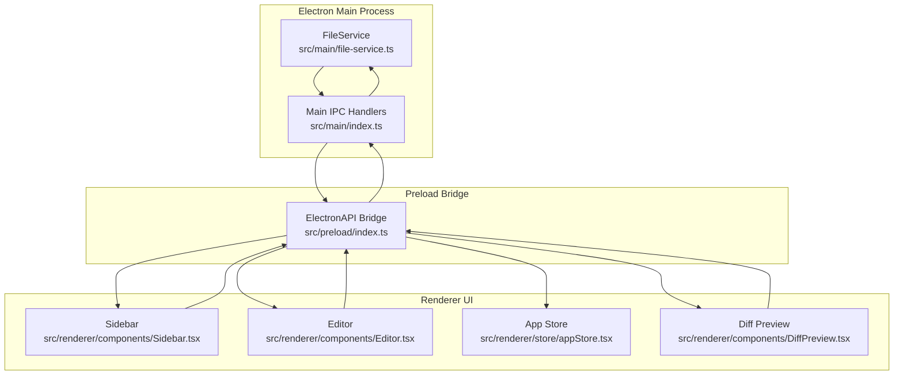
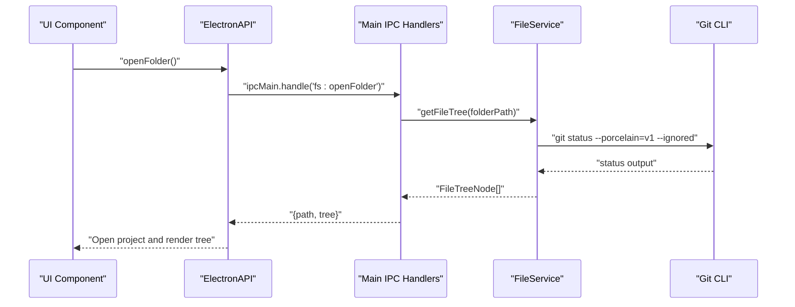
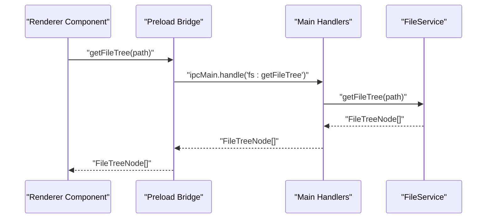
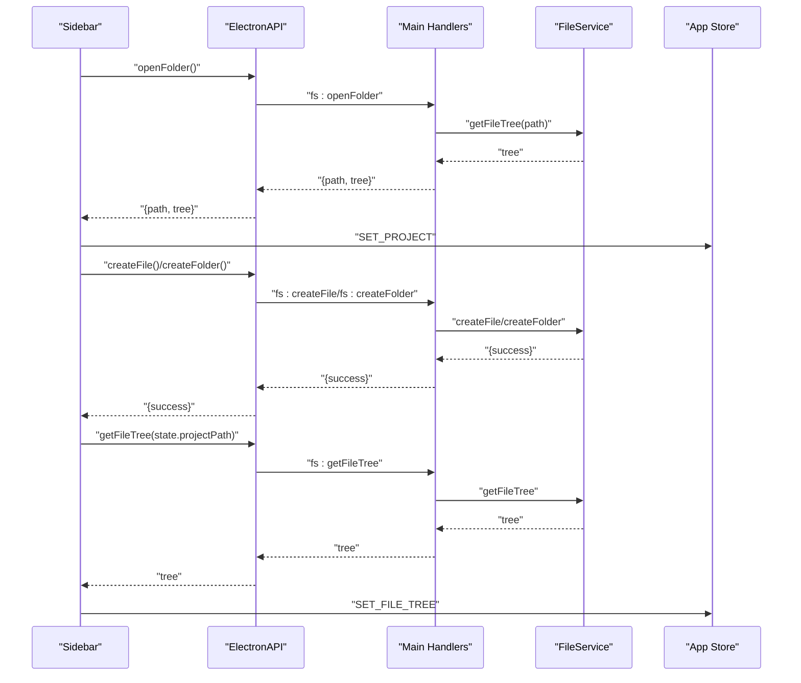
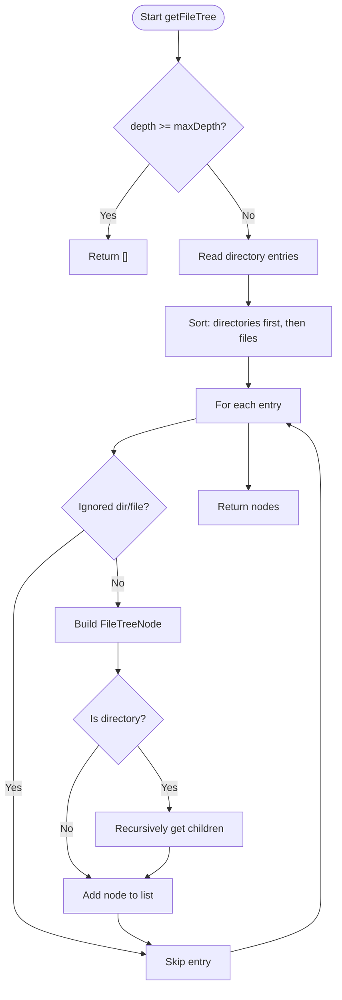
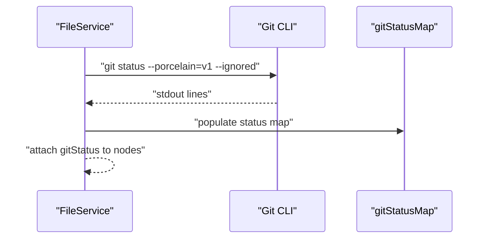
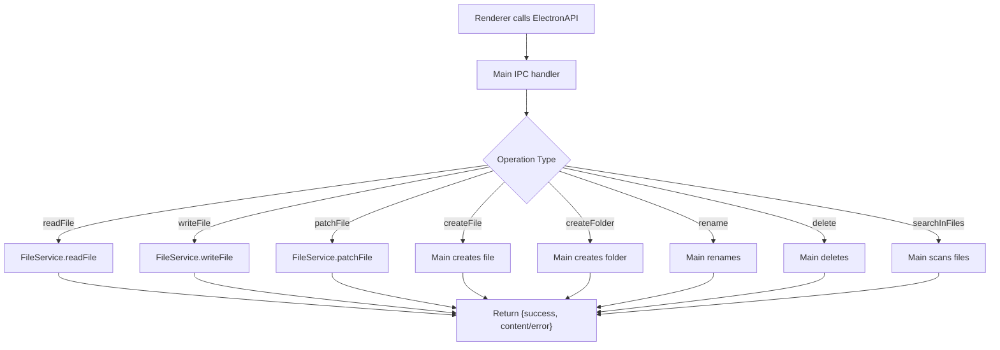
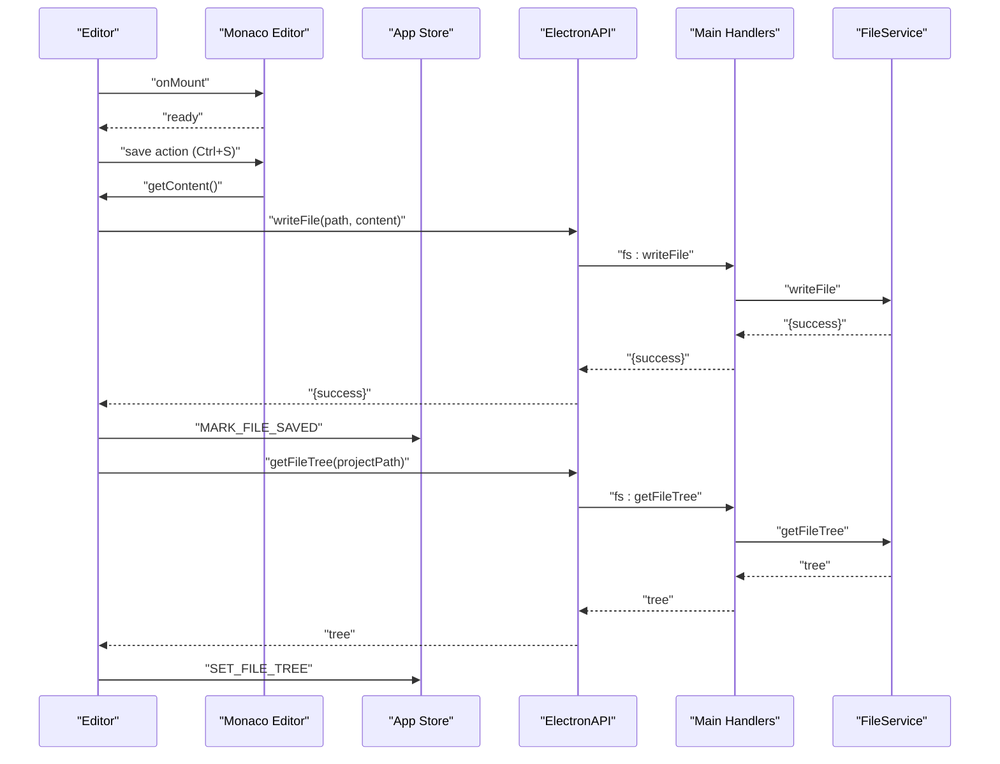
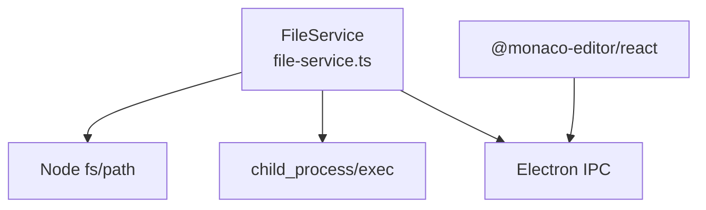

# File System Service

<cite>
**Referenced Files in This Document**
- [file-service.ts](file://src/main/file-service.ts)
- [index.ts](file://src/main/index.ts)
- [Sidebar.tsx](file://src/renderer/components/Sidebar.tsx)
- [Editor.tsx](file://src/renderer/components/Editor.tsx)
- [appStore.tsx](file://src/renderer/store/appStore.tsx)
- [DiffPreview.tsx](file://src/renderer/components/DiffPreview.tsx)
- [index.ts](file://src/preload/index.ts)
- [README.md](file://README.md)
</cite>

## Table of Contents
1. [Introduction](#introduction)
2. [Project Structure](#project-structure)
3. [Core Components](#core-components)
4. [Architecture Overview](#architecture-overview)
5. [Detailed Component Analysis](#detailed-component-analysis)
6. [Dependency Analysis](#dependency-analysis)
7. [Performance Considerations](#performance-considerations)
8. [Troubleshooting Guide](#troubleshooting-guide)
9. [Conclusion](#conclusion)

## Introduction
This document describes the File System Service responsible for all file operations and project management functionality in the application. It covers file tree navigation, CRUD operations, Git integration for status tracking, hierarchical file system representation, node management, change detection mechanisms, and integration with the Monaco Editor for file content display and editing. It also includes performance considerations, caching strategies, memory management, error handling for file system operations and network drive scenarios, and troubleshooting guidance for common file operation issues and permission problems.

## Project Structure
The File System Service is implemented in the Electron main process and exposed to the renderer via IPC. The renderer components integrate with the service to provide a seamless file management experience.



**Diagram sources**
- [file-service.ts](file://src/main/file-service.ts#L27-L161)
- [index.ts](file://src/main/index.ts#L116-L271)
- [index.ts](file://src/preload/index.ts#L3-L116)
- [Sidebar.tsx](file://src/renderer/components/Sidebar.tsx#L24-L120)
- [Editor.tsx](file://src/renderer/components/Editor.tsx#L9-L130)
- [appStore.tsx](file://src/renderer/store/appStore.tsx#L4-L89)
- [DiffPreview.tsx](file://src/renderer/components/DiffPreview.tsx#L1-L64)

**Section sources**
- [README.md](file://README.md#L59-L87)
- [file-service.ts](file://src/main/file-service.ts#L1-L162)
- [index.ts](file://src/main/index.ts#L116-L271)
- [index.ts](file://src/preload/index.ts#L1-L120)

## Core Components
- FileService: Provides file tree construction, Git status integration, read/write operations, patching, and language detection.
- Main IPC Handlers: Expose file operations to the renderer and orchestrate file tree updates.
- Preload Bridge: Defines the ElectronAPI contract for renderer-side calls.
- Renderer Components: Integrate with FileService for UI interactions (Sidebar, Editor, Diff Preview).

Key responsibilities:
- Hierarchical file system representation with FileTreeNode interface.
- Git status tracking via git porcelain output parsing.
- CRUD operations: create, read, update, delete, rename, and patch.
- Search within files for quick navigation.
- Integration with Monaco Editor for content display and editing.

**Section sources**
- [file-service.ts](file://src/main/file-service.ts#L4-L161)
- [index.ts](file://src/main/index.ts#L144-L271)
- [index.ts](file://src/preload/index.ts#L19-L31)
- [Sidebar.tsx](file://src/renderer/components/Sidebar.tsx#L24-L120)
- [Editor.tsx](file://src/renderer/components/Editor.tsx#L9-L130)
- [DiffPreview.tsx](file://src/renderer/components/DiffPreview.tsx#L1-L64)

## Architecture Overview
The File System Service follows a layered architecture:
- Renderer triggers operations via ElectronAPI.
- Preload validates and forwards IPC requests to main handlers.
- Main handlers delegate to FileService for file operations and Git status.
- Results are returned to the renderer and integrated into the UI state.



**Diagram sources**
- [index.ts](file://src/main/index.ts#L157-L165)
- [file-service.ts](file://src/main/file-service.ts#L30-L57)
- [file-service.ts](file://src/main/file-service.ts#L59-L99)
- [index.ts](file://src/preload/index.ts#L21-L26)

**Section sources**
- [index.ts](file://src/main/index.ts#L116-L271)
- [file-service.ts](file://src/main/file-service.ts#L27-L161)
- [index.ts](file://src/preload/index.ts#L1-L120)

## Detailed Component Analysis

### FileService
The FileService encapsulates all file system operations and Git integration.

```mermaid
classDiagram
class FileService {
-gitStatusMap : Map<string, FileTreeNode['gitStatus']>
+getGitStatus(projectPath) : Promise<void>
+getFileTree(dirPath, depth, maxDepth) : Promise<FileTreeNode[]>
+readFile(filePath) : {success, content?, error?}
+writeFile(filePath, content) : {success, error?}
+patchFile(filePath, patches) : {success, error?}
+getLanguageFromPath(filePath) : string
}
class FileTreeNode {
+string name
+string path
+boolean isDirectory
+FileTreeNode[] children?
+gitStatus
}
FileService --> FileTreeNode : "constructs"
```

**Diagram sources**
- [file-service.ts](file://src/main/file-service.ts#L4-L161)

Key behaviors:
- getGitStatus: Executes git status and maps output to node gitStatus values.
- getFileTree: Builds a hierarchical tree with sorting and ignored path filtering.
- CRUD: readFile, writeFile, patchFile, createFile, createFolder, rename, delete.
- Language detection: Maps file extensions to Monaco language identifiers.

**Section sources**
- [file-service.ts](file://src/main/file-service.ts#L27-L161)

### IPC Handlers and Preload Bridge
The main process exposes handlers for file operations, while the preload bridge defines the ElectronAPI surface.



**Diagram sources**
- [index.ts](file://src/main/index.ts#L183-L185)
- [index.ts](file://src/preload/index.ts#L26-L26)

**Section sources**
- [index.ts](file://src/main/index.ts#L144-L271)
- [index.ts](file://src/preload/index.ts#L19-L31)

### Renderer Integration
Renderer components consume the File System Service to manage the UI.

- Sidebar: Opens folders, renders file tree, handles file creation/rename/delete, and opens files.
- Editor: Integrates with Monaco Editor, saves files via FileService, and refreshes file tree.
- Diff Preview: Presents diffs generated by AI and allows applying or rejecting changes.



**Diagram sources**
- [Sidebar.tsx](file://src/renderer/components/Sidebar.tsx#L24-L120)
- [index.ts](file://src/main/index.ts#L157-L185)
- [index.ts](file://src/preload/index.ts#L21-L26)
- [appStore.tsx](file://src/renderer/store/appStore.tsx#L181-L185)

**Section sources**
- [Sidebar.tsx](file://src/renderer/components/Sidebar.tsx#L24-L120)
- [Editor.tsx](file://src/renderer/components/Editor.tsx#L112-L130)
- [DiffPreview.tsx](file://src/renderer/components/DiffPreview.tsx#L11-L41)
- [appStore.tsx](file://src/renderer/store/appStore.tsx#L4-L89)

### File Tree Navigation and Node Management
The file tree is represented by FileTreeNode with optional children and gitStatus. The service sorts directories first, then files, and applies ignored directories and files sets.



**Diagram sources**
- [file-service.ts](file://src/main/file-service.ts#L59-L99)

**Section sources**
- [file-service.ts](file://src/main/file-service.ts#L4-L161)

### Git Integration and Status Tracking
Git status is fetched once per project and mapped to node gitStatus values. The service parses git porcelain output to determine untracked, ignored, staged, modified, and deleted files.



**Diagram sources**
- [file-service.ts](file://src/main/file-service.ts#L30-L57)

**Section sources**
- [file-service.ts](file://src/main/file-service.ts#L28-L57)

### File Operation APIs
- Read/Write: readFile, writeFile, patchFile.
- CRUD: createFile, createFolder, rename, delete.
- Search: searchInFiles with result limit and text file filtering.
- Language Detection: getLanguageFromPath maps extensions to Monaco languages.



**Diagram sources**
- [index.ts](file://src/main/index.ts#L167-L271)
- [file-service.ts](file://src/main/file-service.ts#L101-L160)

**Section sources**
- [index.ts](file://src/main/index.ts#L167-L271)
- [file-service.ts](file://src/main/file-service.ts#L101-L160)

### Monaco Editor Integration
The Editor component integrates with the File System Service for saving and refreshing the file tree after edits. It also uses the language detection to set the Monaco language.



**Diagram sources**
- [Editor.tsx](file://src/renderer/components/Editor.tsx#L112-L130)
- [index.ts](file://src/main/index.ts#L183-L185)
- [file-service.ts](file://src/main/file-service.ts#L59-L99)
- [appStore.tsx](file://src/renderer/store/appStore.tsx#L219-L225)

**Section sources**
- [Editor.tsx](file://src/renderer/components/Editor.tsx#L9-L130)
- [file-service.ts](file://src/main/file-service.ts#L143-L160)
- [appStore.tsx](file://src/renderer/store/appStore.tsx#L219-L225)

## Dependency Analysis
The File System Service depends on Node.js fs, path, and child_process modules. It integrates with Electron’s IPC and Monaco Editor for rendering.



**Diagram sources**
- [file-service.ts](file://src/main/file-service.ts#L1-L25)
- [index.ts](file://src/main/index.ts#L1-L11)
- [Editor.tsx](file://src/renderer/components/Editor.tsx#L1-L6)

**Section sources**
- [file-service.ts](file://src/main/file-service.ts#L1-L25)
- [index.ts](file://src/main/index.ts#L1-L11)
- [Editor.tsx](file://src/renderer/components/Editor.tsx#L1-L6)

## Performance Considerations
- Directory traversal depth limit: getFileTree enforces a maximum depth to prevent excessive recursion on large projects.
- Ignored paths: Explicitly ignores common directories and files to reduce IO overhead.
- Git status caching: getGitStatus is called once per project to avoid repeated git invocations during tree building.
- Search limits: searchInFiles caps results to a fixed number to prevent long-running operations.
- Memory management: Large file reads are synchronous; consider streaming or chunked reads for very large files to reduce memory pressure.
- Throttling: Debounce autocomplete triggers in the Editor to avoid frequent AI calls.

[No sources needed since this section provides general guidance]

## Troubleshooting Guide
Common issues and resolutions:
- Permission errors when reading/writing files: Ensure the application has read/write permissions for the target directory. Check antivirus or OS restrictions blocking access.
- Network drive access: Some network drives may block directory traversal or file operations. Try accessing via a local path or adjust network drive settings.
- Git status failures: If git is not installed or not in PATH, getGitStatus will fail silently and return an empty map. Verify git installation and repository initialization.
- Large project slowness: Increase maxDepth or exclude unnecessary directories. Consider disabling Git status checks for very large projects.
- File not found errors: patchFile requires the file to exist; ensure the path is correct and the file exists before patching.
- Editor save failures: If save fails, verify file permissions and disk space. Retry after resolving permission issues.

**Section sources**
- [file-service.ts](file://src/main/file-service.ts#L95-L98)
- [file-service.ts](file://src/main/file-service.ts#L119-L141)
- [index.ts](file://src/main/index.ts#L216-L228)

## Conclusion
The File System Service provides a robust foundation for file operations, Git integration, and UI integration with the Monaco Editor. Its layered architecture ensures clear separation of concerns, while IPC bridges enable seamless renderer-main communication. By leveraging depth limits, ignored paths, and Git status caching, it balances performance and functionality. Proper error handling and troubleshooting practices help address common file operation and permission issues effectively.