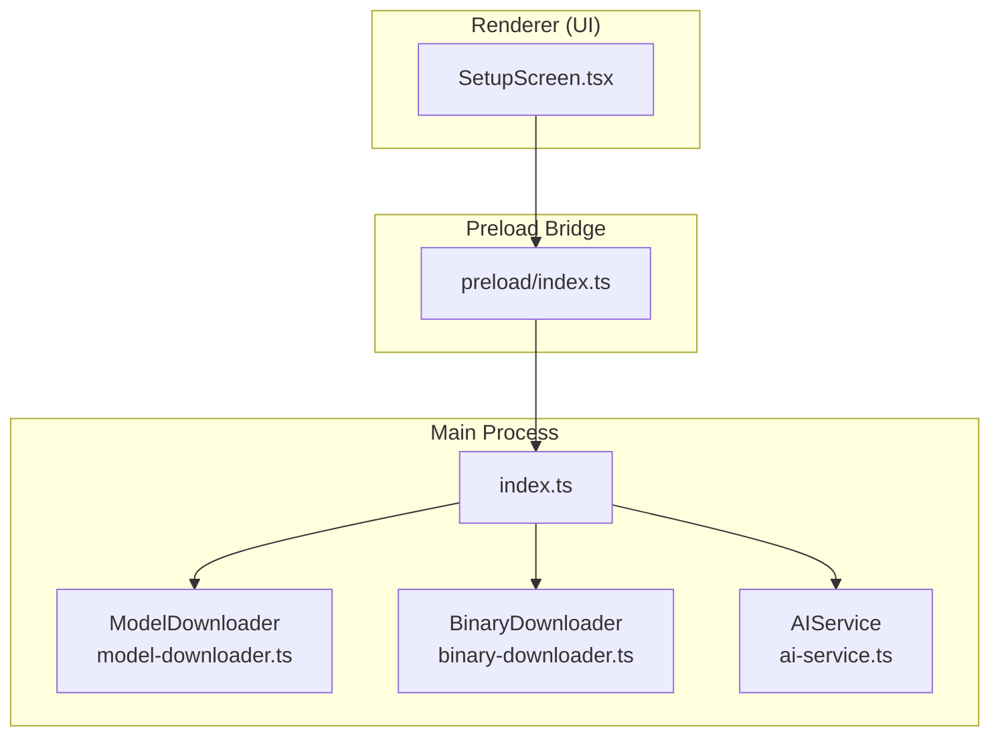
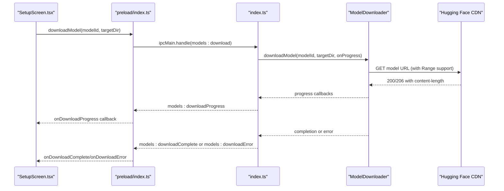
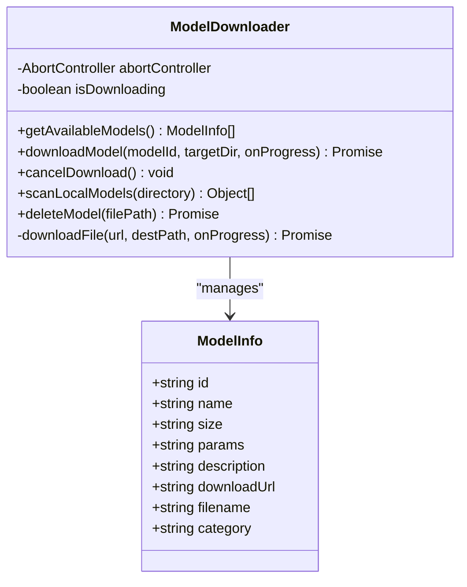
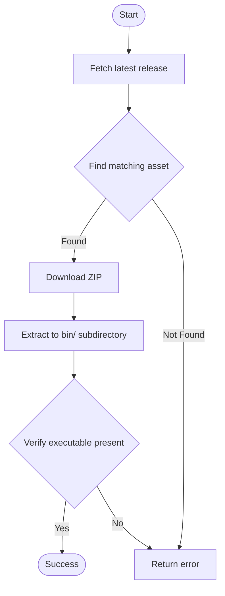
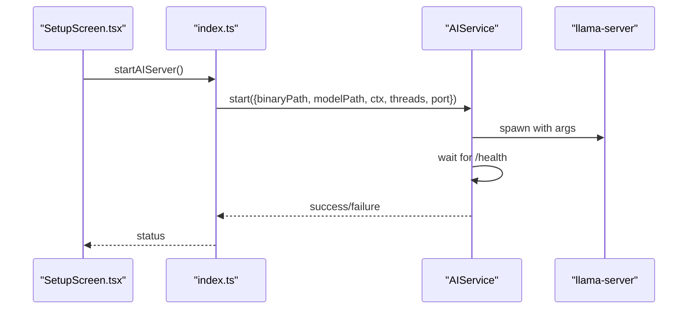
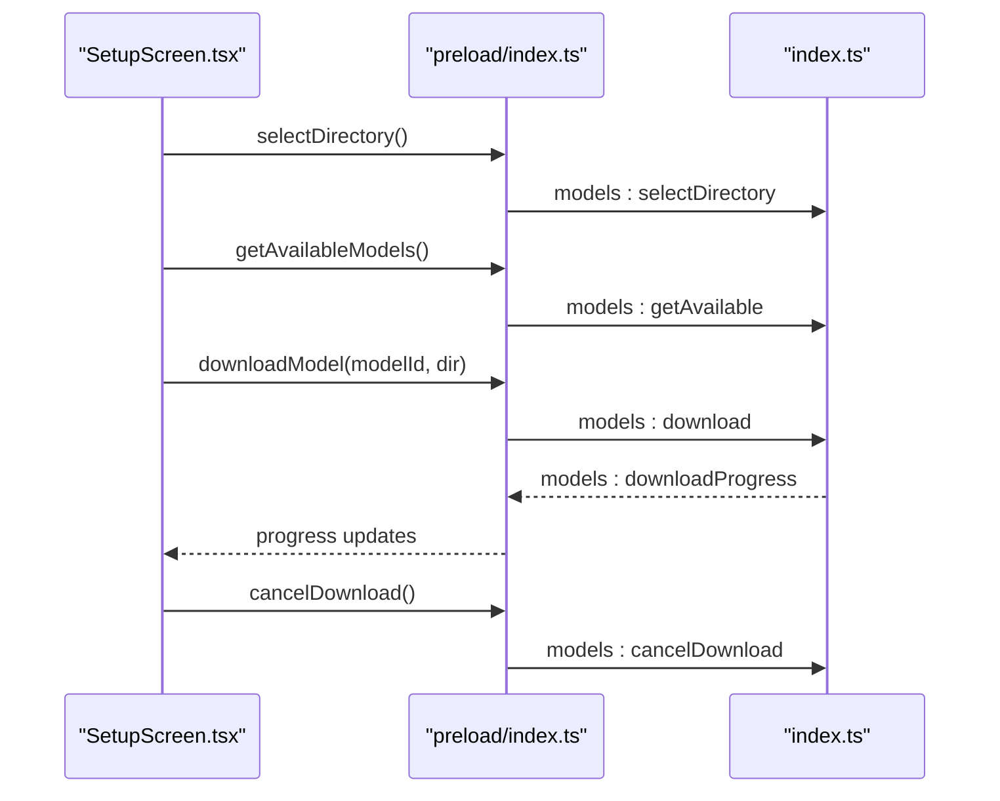
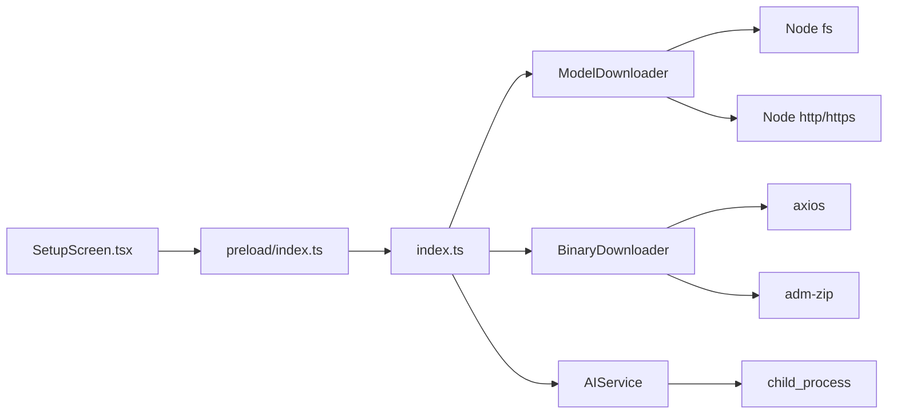

# Model Downloader

<cite>
**Referenced Files in This Document**
- [model-downloader.ts](file://src/main/model-downloader.ts)
- [binary-downloader.ts](file://src/main/binary-downloader.ts)
- [ai-service.ts](file://src/main/ai-service.ts)
- [index.ts](file://src/main/index.ts)
- [index.ts](file://src/preload/index.ts)
- [SetupScreen.tsx](file://src/renderer/components/SetupScreen.tsx)
- [package.json](file://package.json)
</cite>

## Table of Contents
1. [Introduction](#introduction)
2. [Project Structure](#project-structure)
3. [Core Components](#core-components)
4. [Architecture Overview](#architecture-overview)
5. [Detailed Component Analysis](#detailed-component-analysis)
6. [Dependency Analysis](#dependency-analysis)
7. [Performance Considerations](#performance-considerations)
8. [Troubleshooting Guide](#troubleshooting-guide)
9. [Conclusion](#conclusion)

## Introduction
This document describes the Model Downloader service that manages GGUF model downloads and local storage for the BitNet IDE. It covers:
- Hugging Face integration for model discovery and downloads
- Download progress tracking and cancellation
- Local storage management and cleanup
- Validation and integrity checks
- Integration with the AI service for model activation
- Setup screen integration for initial configuration
- Configuration options and troubleshooting guidance

## Project Structure
The Model Downloader is implemented in the main process and exposed to the renderer via IPC. The renderer integrates with a setup screen that orchestrates model selection, download initiation, and progress reporting.

**Diagram sources**
- [SetupScreen.tsx](file://src/renderer/components/SetupScreen.tsx#L1-L357)
- [index.ts](file://src/preload/index.ts#L1-L128)
- [index.ts](file://src/main/index.ts#L118-L535)
- [model-downloader.ts](file://src/main/model-downloader.ts#L267-L483)
- [binary-downloader.ts](file://src/main/binary-downloader.ts#L7-L162)
- [ai-service.ts](file://src/main/ai-service.ts#L12-L323)

**Section sources**
- [index.ts](file://src/main/index.ts#L118-L535)
- [index.ts](file://src/preload/index.ts#L1-L128)
- [SetupScreen.tsx](file://src/renderer/components/SetupScreen.tsx#L1-L357)

## Core Components
- ModelDownloader: Manages model discovery, download, progress tracking, cancellation, local scanning, and deletion.
- BinaryDownloader: Downloads the llama.cpp server binary from GitHub releases and extracts it to a dedicated subdirectory.
- AIService: Runs the llama.cpp server locally and exposes chat and streaming endpoints.
- Preload bridge: Exposes IPC APIs to the renderer for model and binary operations.
- SetupScreen: Orchestrates user-driven model selection and download flow.

Key responsibilities:
- Model discovery and selection from a curated list of GGUF models.
- Streaming download progress updates to the UI.
- Resumable downloads with partial file handling.
- Local model scanning and deletion with safety checks.
- Integration with the AI service for model activation.

**Section sources**
- [model-downloader.ts](file://src/main/model-downloader.ts#L6-L265)
- [binary-downloader.ts](file://src/main/binary-downloader.ts#L7-L162)
- [ai-service.ts](file://src/main/ai-service.ts#L12-L323)
- [index.ts](file://src/preload/index.ts#L52-L82)
- [SetupScreen.tsx](file://src/renderer/components/SetupScreen.tsx#L100-L132)

## Architecture Overview
The system follows a main-process-first architecture with IPC bridges to the renderer. The renderer triggers actions (e.g., download model), the main process executes them, and progress/status events are streamed back to the UI.

**Diagram sources**
- [SetupScreen.tsx](file://src/renderer/components/SetupScreen.tsx#L100-L116)
- [index.ts](file://src/preload/index.ts#L55-L68)
- [index.ts](file://src/main/index.ts#L409-L425)
- [model-downloader.ts](file://src/main/model-downloader.ts#L275-L303)
- [model-downloader.ts](file://src/main/model-downloader.ts#L356-L472)

## Detailed Component Analysis

### ModelDownloader
Responsibilities:
- Provides a curated list of GGUF models with metadata.
- Downloads models from Hugging Face URLs with resumable behavior.
- Emits progress updates and handles cancellation.
- Scans local directories for existing GGUF models.
- Deletes model files with safety checks against active usage.

Key behaviors:
- Uses a .part file during download and renames to final filename upon completion.
- Supports HTTP Range requests for resuming interrupted downloads.
- Handles redirects and HTTP status codes appropriately.
- Computes speed every 500ms and reports percentage progress.

**Diagram sources**
- [model-downloader.ts](file://src/main/model-downloader.ts#L6-L15)
- [model-downloader.ts](file://src/main/model-downloader.ts#L267-L483)

**Section sources**
- [model-downloader.ts](file://src/main/model-downloader.ts#L17-L265)
- [model-downloader.ts](file://src/main/model-downloader.ts#L275-L303)
- [model-downloader.ts](file://src/main/model-downloader.ts#L313-L354)
- [model-downloader.ts](file://src/main/model-downloader.ts#L356-L472)

### BinaryDownloader
Responsibilities:
- Fetches the latest llama.cpp release from GitHub.
- Selects a Windows-compatible binary asset.
- Downloads the ZIP archive and extracts to a dedicated bin subdirectory.
- Verifies presence of the expected executable.

**Diagram sources**
- [binary-downloader.ts](file://src/main/binary-downloader.ts#L100-L129)
- [binary-downloader.ts](file://src/main/binary-downloader.ts#L131-L160)

**Section sources**
- [binary-downloader.ts](file://src/main/binary-downloader.ts#L7-L162)

### AIService
Responsibilities:
- Spawns the llama.cpp server with model, context size, threads, and port.
- Health-checks the server and streams chat completions.
- Provides embedding endpoint access for RAG.

**Diagram sources**
- [ai-service.ts](file://src/main/ai-service.ts#L19-L89)
- [index.ts](file://src/main/index.ts#L277-L289)

**Section sources**
- [ai-service.ts](file://src/main/ai-service.ts#L12-L323)
- [index.ts](file://src/main/index.ts#L277-L289)

### Renderer Integration (SetupScreen)
Responsibilities:
- Guides users through selecting models directory and server binary.
- Displays available models and allows choosing one for download.
- Shows progress and speed during downloads.
- Handles cancellation and error reporting.

**Diagram sources**
- [SetupScreen.tsx](file://src/renderer/components/SetupScreen.tsx#L64-L116)
- [index.ts](file://src/preload/index.ts#L53-L68)
- [index.ts](file://src/main/index.ts#L409-L425)

**Section sources**
- [SetupScreen.tsx](file://src/renderer/components/SetupScreen.tsx#L1-L357)
- [index.ts](file://src/preload/index.ts#L52-L82)
- [index.ts](file://src/main/index.ts#L395-L442)

## Dependency Analysis
- ModelDownloader depends on Node built-ins for filesystem and HTTP(S) operations.
- BinaryDownloader depends on axios for HTTP and adm-zip for extraction.
- AIService depends on child_process to spawn the llama.cpp server.
- Preload bridge exposes IPC handlers to the renderer.
- SetupScreen consumes the preload bridge to orchestrate downloads.

**Diagram sources**
- [SetupScreen.tsx](file://src/renderer/components/SetupScreen.tsx#L1-L357)
- [index.ts](file://src/preload/index.ts#L1-L128)
- [index.ts](file://src/main/index.ts#L1-L558)
- [model-downloader.ts](file://src/main/model-downloader.ts#L1-L5)
- [binary-downloader.ts](file://src/main/binary-downloader.ts#L1-L5)
- [ai-service.ts](file://src/main/ai-service.ts#L1-L10)

**Section sources**
- [package.json](file://package.json#L12-L25)

## Performance Considerations
- Download throttling: The current implementation does not expose bandwidth limits or retries. Consider adding:
  - Configurable bandwidth caps using streams and timers.
  - Retry logic with exponential backoff for transient network errors.
  - Chunk size tuning for optimal throughput.
- Progress granularity: Emitting progress every 500ms is reasonable; adjust based on model sizes.
- Disk I/O: Writing to a .part file and renaming avoids corruption and reduces atomic writes.
- Memory usage: Streaming downloads prevent loading entire files into memory.

[No sources needed since this section provides general guidance]

## Troubleshooting Guide
Common issues and resolutions:
- Download fails with HTTP status:
  - The downloader validates status codes and rejects non-200/206 responses. Check network connectivity and URL validity.
- Too many redirects:
  - The downloader stops after 5 redirects. Verify the Hugging Face URL and consider using a direct download link.
- Resume fails (416):
  - The downloader deletes the invalid .part file and restarts. Ensure disk permissions allow file creation and deletion.
- Model not found:
  - Ensure the model ID exists in the curated list and the filename matches the expected GGUF file.
- Active model deletion:
  - The main process stops the AI server before deleting the active model to prevent runtime errors.
- Binary not found after extraction:
  - The BinaryDownloader searches recursively for the expected executable. Confirm the ZIP contains the correct asset and extraction succeeded.

**Section sources**
- [model-downloader.ts](file://src/main/model-downloader.ts#L374-L410)
- [model-downloader.ts](file://src/main/model-downloader.ts#L400-L406)
- [index.ts](file://src/main/index.ts#L436-L442)
- [binary-downloader.ts](file://src/main/binary-downloader.ts#L100-L129)

## Conclusion
The Model Downloader provides a robust, resumable, and user-friendly mechanism for acquiring GGUF models and managing local storage. Its integration with the setup screen and AI service ensures a smooth onboarding experience. Extending the service with configurable bandwidth limits, retry policies, and stronger integrity checks would further improve reliability and performance.