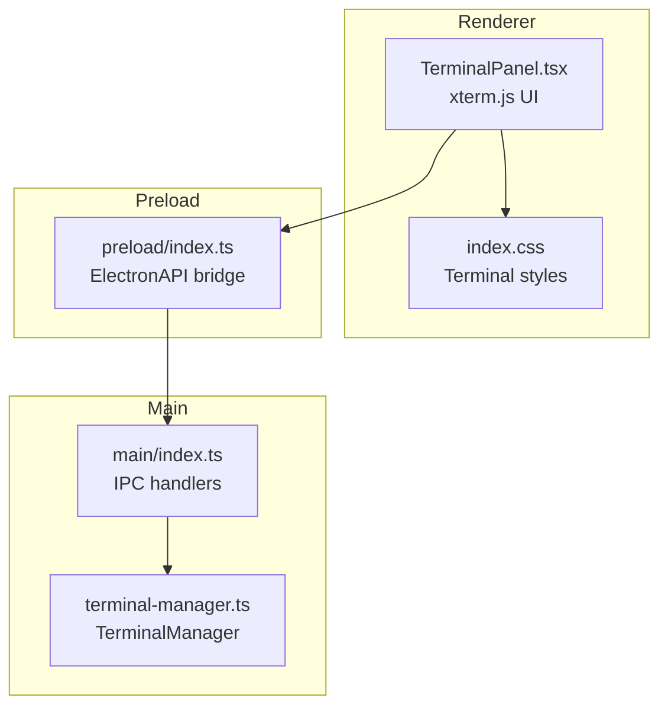
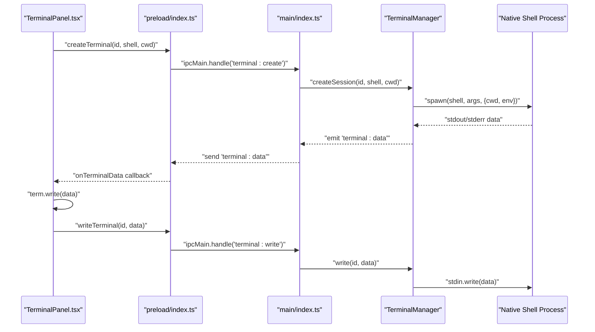
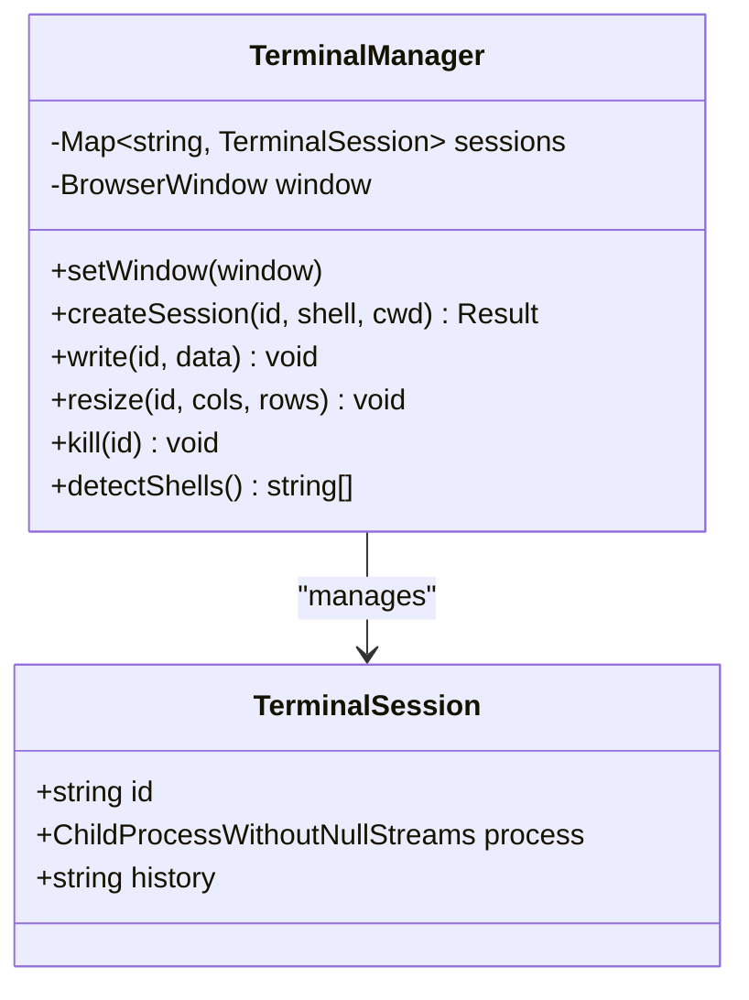
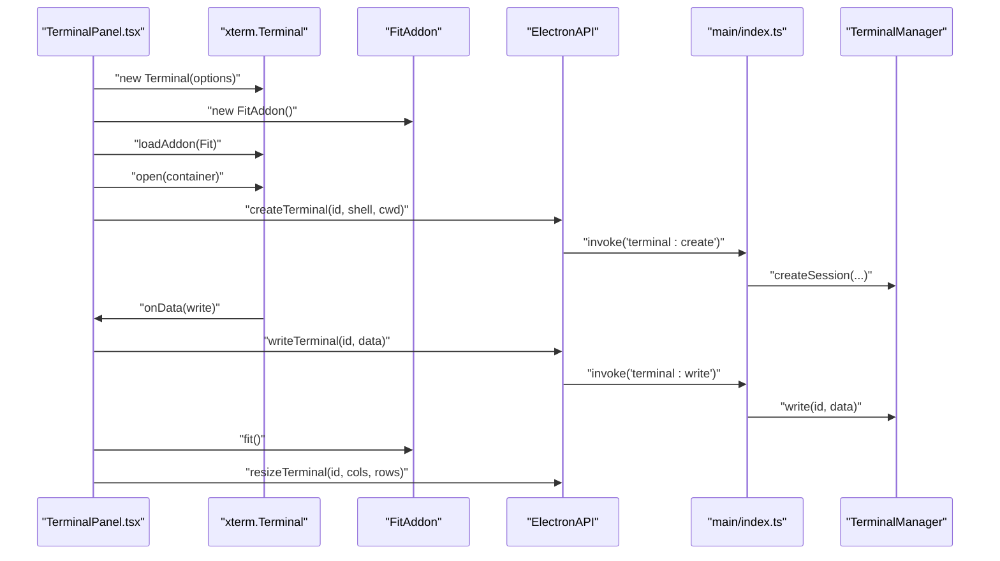
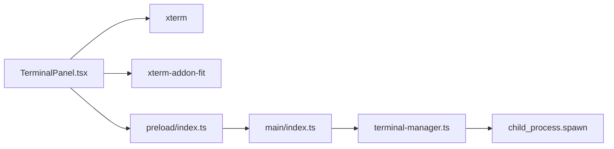

# Terminal Manager

<cite>
**Referenced Files in This Document**
- [terminal-manager.ts](file://src/main/terminal-manager.ts)
- [index.ts](file://src/main/index.ts)
- [index.ts](file://src/preload/index.ts)
- [TerminalPanel.tsx](file://src/renderer/components/TerminalPanel.tsx)
- [index.css](file://src/renderer/index.css)
- [package.json](file://package.json)
- [README.md](file://README.md)
</cite>

## Table of Contents
1. [Introduction](#introduction)
2. [Project Structure](#project-structure)
3. [Core Components](#core-components)
4. [Architecture Overview](#architecture-overview)
5. [Detailed Component Analysis](#detailed-component-analysis)
6. [Dependency Analysis](#dependency-analysis)
7. [Performance Considerations](#performance-considerations)
8. [Troubleshooting Guide](#troubleshooting-guide)
9. [Conclusion](#conclusion)

## Introduction
This document describes the Terminal Manager service that integrates xterm.js with native shell processes in an Electron application. It explains the terminal session lifecycle, cross-platform shell detection and configuration, session management patterns, output streaming mechanisms, and the integration with the terminal panel component. It also covers native process management, environment variable handling, signal propagation, and platform-specific considerations for Windows, macOS, and Linux.

## Project Structure
The Terminal Manager spans three layers:
- Main process: manages native child processes, IPC handlers, and session lifecycle.
- Preload bridge: exposes a typed Electron API to the renderer.
- Renderer: hosts the terminal panel UI, xterm.js instance, and user interactions.

**Diagram sources**
- [TerminalPanel.tsx](file://src/renderer/components/TerminalPanel.tsx#L1-L312)
- [index.ts](file://src/preload/index.ts#L1-L120)
- [index.ts](file://src/main/index.ts#L463-L497)
- [terminal-manager.ts](file://src/main/terminal-manager.ts#L1-L111)
- [index.css](file://src/renderer/index.css#L2865-L3266)

**Section sources**
- [README.md](file://README.md#L59-L87)
- [package.json](file://package.json#L12-L25)

## Core Components
- TerminalManager (Main): Manages shell sessions, spawns child processes, streams output, handles writes, resizes, and kills.
- ElectronAPI (Preload): Exposes IPC methods for terminal operations and event subscriptions.
- TerminalPanel (Renderer): Creates xterm.js instances, applies theme and options, handles input, selection, resize, and renders output.

Key responsibilities:
- Cross-platform shell detection and defaults.
- Output normalization for xterm.js compatibility.
- ANSI color wrapping for stderr.
- Session lifecycle: create, write, resize, kill, exit cleanup.
- Renderer-side xterm.js configuration and theme.

**Section sources**
- [terminal-manager.ts](file://src/main/terminal-manager.ts#L12-L111)
- [index.ts](file://src/preload/index.ts#L84-L103)
- [TerminalPanel.tsx](file://src/renderer/components/TerminalPanel.tsx#L116-L216)

## Architecture Overview
The Terminal Manager follows a clear separation of concerns:
- Renderer initializes xterm.js and emits user keystrokes via ElectronAPI.
- Preload translates renderer calls into IPC invocations.
- Main process routes IPC to TerminalManager, which spawns and manages the native shell.
- Output from the shell is streamed back to the renderer and written to the terminal.

**Diagram sources**
- [TerminalPanel.tsx](file://src/renderer/components/TerminalPanel.tsx#L212-L216)
- [index.ts](file://src/preload/index.ts#L88-L93)
- [index.ts](file://src/main/index.ts#L466-L473)
- [terminal-manager.ts](file://src/main/terminal-manager.ts#L24-L75)

## Detailed Component Analysis

### TerminalManager (Main)
Responsibilities:
- Detect platform and choose default shell.
- Spawn child processes with appropriate arguments and environment.
- Normalize output for xterm.js and wrap stderr in ANSI red.
- Stream data to renderer via IPC events.
- Manage session lifecycle and cleanup on exit.

Implementation highlights:
- Platform detection and default shell selection.
- Environment variable handling with TERM set to xterm-256color.
- Output normalization replacing line endings to CRLF for xterm.js.
- Separate stderr handling with ANSI red color prefix.
- Exit event cleanup of sessions.

**Diagram sources**
- [terminal-manager.ts](file://src/main/terminal-manager.ts#L5-L111)

**Section sources**
- [terminal-manager.ts](file://src/main/terminal-manager.ts#L24-L75)
- [terminal-manager.ts](file://src/main/terminal-manager.ts#L98-L109)

### ElectronAPI (Preload)
Responsibilities:
- Expose typed IPC methods for terminal operations.
- Subscribe to terminal data and exit events.
- Forward renderer actions to main process.

Key methods:
- createTerminal, writeTerminal, resizeTerminal, killTerminal, getShells.
- onTerminalData, onTerminalExit.

**Section sources**
- [index.ts](file://src/preload/index.ts#L84-L103)

### TerminalPanel (Renderer)
Responsibilities:
- Initialize xterm.js with theme and options.
- Apply FitAddon and handle resize observer.
- Translate user input to terminal writes.
- Render output and handle exit notifications.
- Manage multiple sessions and tabs.

Implementation highlights:
- Theme configuration with dark background and vibrant colors.
- FitAddon usage to match terminal size to container.
- Input handling for carriage return and backspace with remote erase sequences.
- Selection handling and “Add to Chat” integration.
- Event listeners for terminal data and exit.

**Diagram sources**
- [TerminalPanel.tsx](file://src/renderer/components/TerminalPanel.tsx#L116-L216)
- [index.ts](file://src/preload/index.ts#L88-L93)
- [index.ts](file://src/main/index.ts#L466-L473)

**Section sources**
- [TerminalPanel.tsx](file://src/renderer/components/TerminalPanel.tsx#L116-L216)
- [TerminalPanel.tsx](file://src/renderer/components/TerminalPanel.tsx#L48-L72)
- [TerminalPanel.tsx](file://src/renderer/components/TerminalPanel.tsx#L76-L97)

### IPC Handlers (Main)
Responsibilities:
- Register IPC handlers for terminal operations.
- Delegate to TerminalManager for session management.
- Provide shell detection and ad-hoc command execution.

Handlers:
- terminal:create, terminal:write, terminal:resize, terminal:kill, terminal:getShells.
- terminal:execute for one-off commands.

**Section sources**
- [index.ts](file://src/main/index.ts#L463-L497)

### Cross-Platform Shell Detection and Configuration
- Windows: default to PowerShell with profile bypass arguments.
- Unix-like: default to bash; zsh included in detected shells.
- Environment TERM is set to xterm-256color for compatibility.

**Section sources**
- [terminal-manager.ts](file://src/main/terminal-manager.ts#L26-L35)
- [terminal-manager.ts](file://src/main/terminal-manager.ts#L98-L109)

### Output Streaming Mechanisms
- stdout: streamed as-is after line ending normalization.
- stderr: streamed with ANSI red color prefix.
- Renderer writes received data to the active xterm.js instance.
- Exit events notify renderer to display exit code.

**Section sources**
- [terminal-manager.ts](file://src/main/terminal-manager.ts#L43-L62)
- [TerminalPanel.tsx](file://src/renderer/components/TerminalPanel.tsx#L48-L72)

### Integration with xterm.js
- Terminal options include font family, size, line height, cursor style, transparency, and EOL conversion.
- Theme defines background, foreground, cursor, selection, and 16-color palette.
- FitAddon is loaded and applied to match container size.
- Renderer sets font antialiasing for improved readability.

**Section sources**
- [TerminalPanel.tsx](file://src/renderer/components/TerminalPanel.tsx#L119-L149)
- [TerminalPanel.tsx](file://src/renderer/components/TerminalPanel.tsx#L151-L163)
- [index.css](file://src/renderer/index.css#L3205-L3212)

### Native Process Management
- Child process spawned with cwd and TERM environment.
- stdin writes forwarded from renderer.
- Exit event triggers cleanup and notifies renderer.
- Resize is a no-op for spawn; PTY-like resizing is not supported.

**Section sources**
- [terminal-manager.ts](file://src/main/terminal-manager.ts#L37-L41)
- [terminal-manager.ts](file://src/main/terminal-manager.ts#L77-L96)

## Dependency Analysis
External dependencies relevant to terminal functionality:
- xterm and xterm-addon-fit for terminal rendering and fitting.
- Electron for IPC and process management.

**Diagram sources**
- [package.json](file://package.json#L23-L24)
- [TerminalPanel.tsx](file://src/renderer/components/TerminalPanel.tsx#L4-L6)
- [index.ts](file://src/preload/index.ts#L88-L93)
- [index.ts](file://src/main/index.ts#L466-L473)
- [terminal-manager.ts](file://src/main/terminal-manager.ts#L1-L3)

**Section sources**
- [package.json](file://package.json#L23-L24)

## Performance Considerations
- Output normalization: Replace LF with CRLF to reduce rendering inconsistencies in xterm.js.
- Event-driven streaming: Emit data via IPC on each stdout/stderr chunk to avoid buffering overhead.
- Renderer-side fit: Use FitAddon and requestAnimationFrame to batch resize operations.
- Memory management: Delete sessions on exit to prevent leaks; avoid retaining large histories.
- Concurrency: Each terminal session is independent; manage multiple sessions with separate IDs and containers.

[No sources needed since this section provides general guidance]

## Troubleshooting Guide
Common issues and resolutions:
- Terminal initialization fails:
  - Verify shell path and availability on the platform.
  - Check environment variables and permissions.
  - Confirm IPC handlers are registered in main process.
- Shell detection problems:
  - Ensure detectShells returns expected shells for the platform.
  - Allow user to override shell selection in renderer.
- Output streaming failures:
  - Confirm onTerminalData subscription is active.
  - Ensure data normalization and ANSI color handling are applied.
  - Validate that the terminal instance is open and not disposed.
- Input not echoing or backspace issues:
  - Verify onData handler logic and remote erase sequences.
  - Ensure terminal is focused and container is visible.
- Resize not taking effect:
  - Resize is a no-op for spawn; consider PTY-based alternatives if resizing is required.
- Exit not handled:
  - Confirm exit event listener and session deletion logic.

**Section sources**
- [terminal-manager.ts](file://src/main/terminal-manager.ts#L77-L96)
- [TerminalPanel.tsx](file://src/renderer/components/TerminalPanel.tsx#L48-L72)
- [TerminalPanel.tsx](file://src/renderer/components/TerminalPanel.tsx#L165-L186)

## Conclusion
The Terminal Manager provides a robust integration between xterm.js and native shell processes, enabling cross-platform terminal sessions with streaming output, responsive input handling, and clean lifecycle management. By leveraging Electron’s IPC and a typed preload bridge, it offers a scalable foundation for terminal operations while maintaining performance and reliability across platforms.