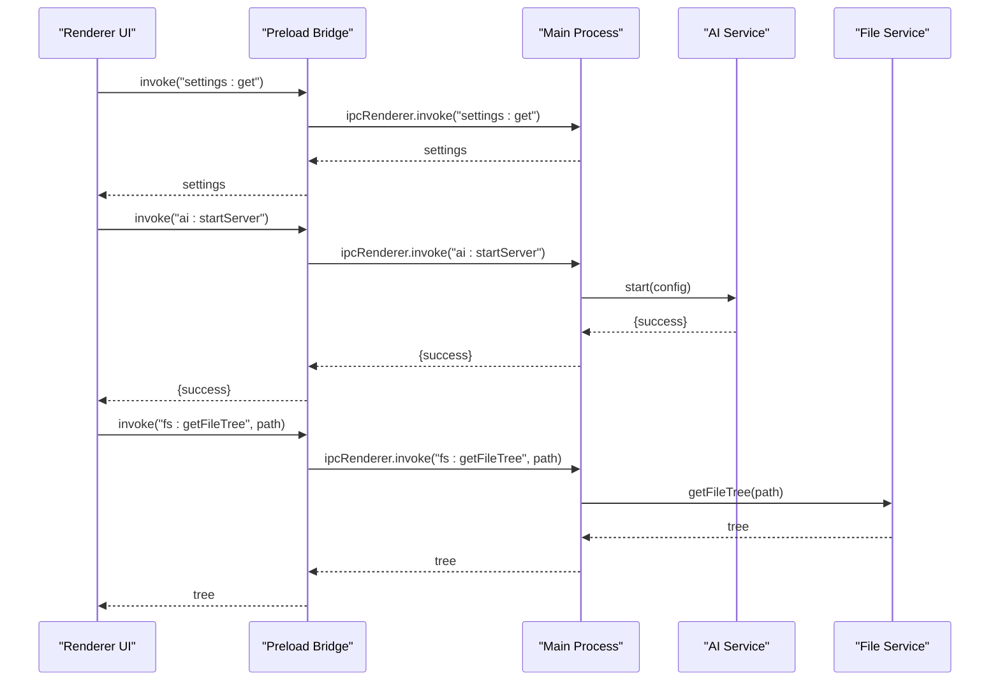
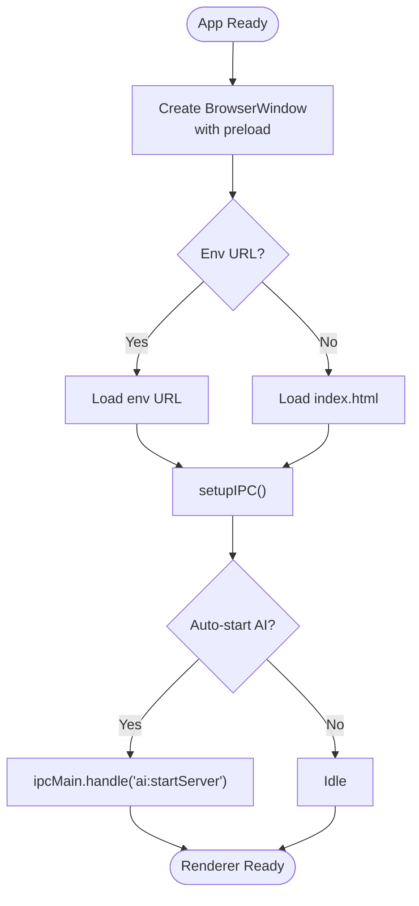
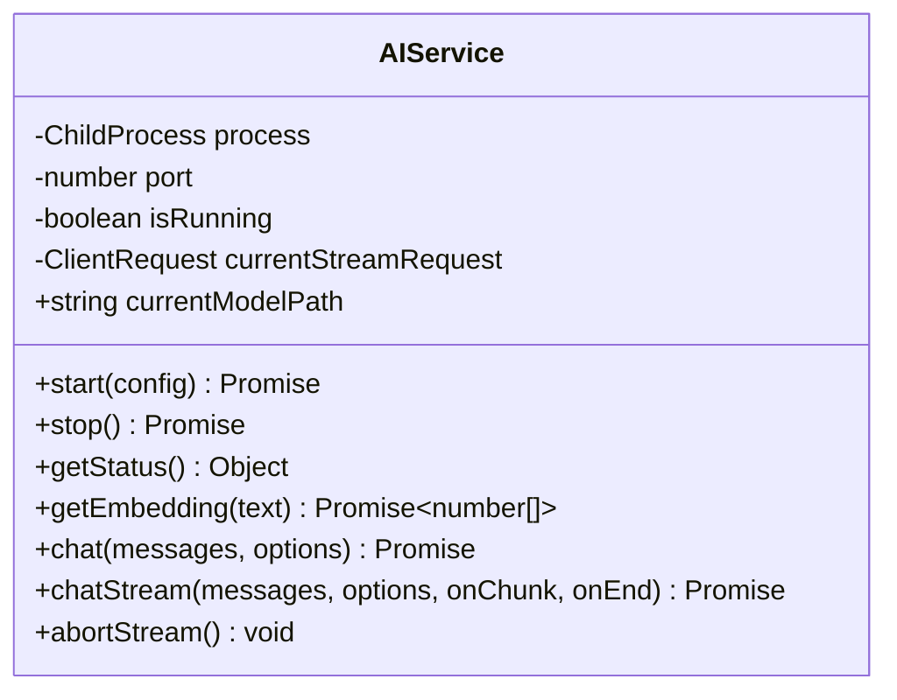
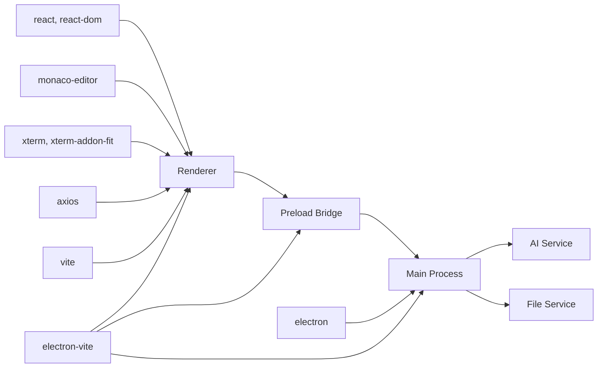

# Development Guide

<cite>
**Referenced Files in This Document**
- [package.json](file://package.json)
- [electron.vite.config.ts](file://electron.vite.config.ts)
- [tsconfig.json](file://tsconfig.json)
- [tsconfig.node.json](file://tsconfig.node.json)
- [README.md](file://README.md)
- [src/main/index.ts](file://src/main/index.ts)
- [src/preload/index.ts](file://src/preload/index.ts)
- [src/renderer/main.tsx](file://src/renderer/main.tsx)
- [src/renderer/App.tsx](file://src/renderer/App.tsx)
- [src/renderer/types/global.d.ts](file://src/renderer/types/global.d.ts)
- [src/renderer/store/appStore.tsx](file://src/renderer/store/appStore.tsx)
- [src/renderer/index.css](file://src/renderer/index.css)
- [src/main/ai-service.ts](file://src/main/ai-service.ts)
- [src/main/file-service.ts](file://src/main/file-service.ts)
</cite>

## Table of Contents
1. [Introduction](#introduction)
2. [Project Structure](#project-structure)
3. [Core Components](#core-components)
4. [Architecture Overview](#architecture-overview)
5. [Detailed Component Analysis](#detailed-component-analysis)
6. [Dependency Analysis](#dependency-analysis)
7. [Performance Considerations](#performance-considerations)
8. [Troubleshooting Guide](#troubleshooting-guide)
9. [Contribution Guidelines](#contribution-guidelines)
10. [Development Environment Setup](#development-environment-setup)
11. [Common Development Tasks](#common-development-tasks)
12. [Testing Approaches](#testing-approaches)
13. [Code Style and Formatting](#code-style-and-formatting)
14. [Debugging Tools and Techniques](#debugging-tools-and-techniques)
15. [Release Procedures](#release-procedures)
16. [Conclusion](#conclusion)

## Introduction
This document provides comprehensive development guidance for contributors and maintainers working on the BitNet IDE. It covers the build system using Vite with Electron integration, TypeScript configuration for main and renderer processes, development workflow, debugging, testing, code style, and contribution practices. The project emphasizes offline-first AI assistance powered by BitNet.cpp, with a focus on privacy, performance, and a distraction-free editing experience.

## Project Structure
The repository follows a clear separation of concerns:
- src/main: Electron main process, IPC handlers, AI service, file operations, and RAG indexing
- src/preload: Secure IPC bridge exposing typed APIs to the renderer
- src/renderer: React application, state management, UI components, and styles
- Build and type configurations: Vite/Electron integration, TypeScript compiler options

```mermaid
graph TB
subgraph "Build and Config"
Pkg["package.json"]
EVC["electron.vite.config.ts"]
TS["tsconfig.json"]
TSN["tsconfig.node.json"]
end
subgraph "Main Process"
MainIdx["src/main/index.ts"]
AISvc["src/main/ai-service.ts"]
FSvc["src/main/file-service.ts"]
end
subgraph "Preload Bridge"
Preload["src/preload/index.ts"]
end
subgraph "Renderer"
RMain["src/renderer/main.tsx"]
RApp["src/renderer/App.tsx"]
Store["src/renderer/store/appStore.tsx"]
Types["src/renderer/types/global.d.ts"]
CSS["src/renderer/index.css"]
end
Pkg --> EVC
EVC --> MainIdx
EVC --> Preload
EVC --> RMain
TS --> MainIdx
TS --> RMain
TSN --> EVC
MainIdx --> AISvc
MainIdx --> FSvc
MainIdx <- --> Preload
Preload --> RApp
RApp --> Store
RApp --> Types
RMain --> RApp
RApp --> CSS
```

**Diagram sources**
- [package.json](file://package.json#L1-L35)
- [electron.vite.config.ts](file://electron.vite.config.ts#L1-L41)
- [tsconfig.json](file://tsconfig.json#L1-L31)
- [tsconfig.node.json](file://tsconfig.node.json#L1-L14)
- [src/main/index.ts](file://src/main/index.ts#L1-L542)
- [src/preload/index.ts](file://src/preload/index.ts#L1-L120)
- [src/renderer/main.tsx](file://src/renderer/main.tsx#L1-L19)
- [src/renderer/App.tsx](file://src/renderer/App.tsx#L1-L302)
- [src/renderer/store/appStore.tsx](file://src/renderer/store/appStore.tsx#L1-L357)
- [src/renderer/types/global.d.ts](file://src/renderer/types/global.d.ts#L1-L79)
- [src/renderer/index.css](file://src/renderer/index.css#L1-L800)

**Section sources**
- [README.md](file://README.md#L59-L87)
- [package.json](file://package.json#L1-L35)
- [electron.vite.config.ts](file://electron.vite.config.ts#L1-L41)

## Core Components
- Electron main process orchestrates windows, IPC, AI server lifecycle, file operations, and RAG indexing
- Preload bridge exposes a strongly-typed API surface to renderer code
- Renderer is a React application with a centralized store, UI components, and theme-driven styles
- AI service manages the BitNet.cpp llama-server subprocess and provides chat and embeddings
- File service handles file tree traversal, Git status, and file read/write/patch operations

**Section sources**
- [src/main/index.ts](file://src/main/index.ts#L1-L542)
- [src/preload/index.ts](file://src/preload/index.ts#L1-L120)
- [src/renderer/App.tsx](file://src/renderer/App.tsx#L1-L302)
- [src/renderer/store/appStore.tsx](file://src/renderer/store/appStore.tsx#L1-L357)
- [src/main/ai-service.ts](file://src/main/ai-service.ts#L1-L323)
- [src/main/file-service.ts](file://src/main/file-service.ts#L1-L162)

## Architecture Overview
The application uses Electron with a main/preload/renderer architecture. The main process spawns and monitors the AI server, exposes IPC endpoints, and manages the application window. The preload script creates a secure contextBridge exposing a typed API. The renderer renders the UI, manages state, and communicates with the main process via IPC.



**Diagram sources**
- [src/renderer/App.tsx](file://src/renderer/App.tsx#L44-L96)
- [src/preload/index.ts](file://src/preload/index.ts#L15-L18)
- [src/main/index.ts](file://src/main/index.ts#L135-L142)
- [src/main/ai-service.ts](file://src/main/ai-service.ts#L19-L89)
- [src/main/file-service.ts](file://src/main/file-service.ts#L59-L99)

## Detailed Component Analysis

### Build System and Vite with Electron Integration
- Development vs production
  - Development: electron-vite dev serves renderer via Vite HMR and loads main/preload from src
  - Production: electron-vite build compiles main to out/main, preload to out/preload, and renderer to out/renderer
- Build outputs
  - Main: src/main/index.ts -> out/main/index.js
  - Preload: src/preload/index.ts -> out/preload/index.js
  - Renderer: src/renderer/index.html -> out/renderer/index.html plus assets
- Plugins and configuration
  - externalizeDepsPlugin for main/preload bundling
  - @vitejs/plugin-react for renderer JSX/TSX

**Section sources**
- [package.json](file://package.json#L6-L11)
- [electron.vite.config.ts](file://electron.vite.config.ts#L5-L39)

### TypeScript Configuration
- Shared compiler options
  - ESNext module system, bundler resolution, strict mode, JSX transform, source maps, declaration maps
  - Path aliases (@/* -> src/*)
- Main/preload (Node)
  - tsconfig.node.json targets ESNext with bundler module resolution for electron.vite config
- Renderer (ES2020)
  - tsconfig.json targets ES2020 for renderer bundle compatibility

**Section sources**
- [tsconfig.json](file://tsconfig.json#L1-L31)
- [tsconfig.node.json](file://tsconfig.node.json#L1-L14)

### Main Process and IPC
- Window creation with contextBridge preload, frameless title bar, and maximize on startup
- Extensive IPC handlers for window controls, settings persistence, file operations, AI server lifecycle, model downloads, binary downloads, terminal sessions, and RAG indexing
- Health checks for AI server readiness and graceful shutdown handling



**Diagram sources**
- [src/main/index.ts](file://src/main/index.ts#L76-L114)
- [src/main/index.ts](file://src/main/index.ts#L521-L541)
- [src/main/index.ts](file://src/main/index.ts#L273-L294)

**Section sources**
- [src/main/index.ts](file://src/main/index.ts#L1-L542)

### Preload Bridge and Typed API
- Exposes a consolidated ElectronAPI with window controls, settings, filesystem, AI, model/binary downloads, terminal, and RAG operations
- Uses contextBridge to expose a single API object to the renderer
- Provides event subscriptions for streaming and progress updates

**Section sources**
- [src/preload/index.ts](file://src/preload/index.ts#L1-L120)
- [src/renderer/types/global.d.ts](file://src/renderer/types/global.d.ts#L1-L79)

### Renderer Application and State Management
- React root initializes Monaco loader and wraps the App with AppProvider
- App component manages session restoration, theme application, AI server auto-start, and overlay toggles
- Centralized state via useReducer with actions for UI, file operations, AI chat, and downloads
- Theme system driven by CSS custom properties and data attributes

**Section sources**
- [src/renderer/main.tsx](file://src/renderer/main.tsx#L1-L19)
- [src/renderer/App.tsx](file://src/renderer/App.tsx#L1-L302)
- [src/renderer/store/appStore.tsx](file://src/renderer/store/appStore.tsx#L1-L357)
- [src/renderer/index.css](file://src/renderer/index.css#L297-L389)

### AI Service and BitNet Integration
- Manages llama-server subprocess with configurable arguments (model, context size, threads, port, host, embedding)
- Health checks via HTTP GET to /health endpoint
- Chat completions and streaming via HTTP POST to /v1/chat/completions
- Embedding retrieval via HTTP POST to /embedding
- Graceful shutdown with SIGTERM and fallback SIGKILL



**Diagram sources**
- [src/main/ai-service.ts](file://src/main/ai-service.ts#L12-L322)

**Section sources**
- [src/main/ai-service.ts](file://src/main/ai-service.ts#L1-L323)

### File Service and Git Integration
- Generates file tree with optional Git status using porcelain output
- Ignores common directories and files
- Provides read, write, and patch operations with error handling
- Maps file extensions to Monaco languages

**Section sources**
- [src/main/file-service.ts](file://src/main/file-service.ts#L1-L162)

## Dependency Analysis
- Runtime dependencies include React, Monaco Editor, xterm, axios, radix UI, and lucide-react
- Dev/build dependencies include Electron, Vite, electron-vite, @vitejs/plugin-react, and TypeScript
- Build-time coupling: main/preload depend on preload bridge; renderer depends on main via IPC; preload depends on main; AI service depends on external llama-server binary



**Diagram sources**
- [package.json](file://package.json#L12-L33)
- [electron.vite.config.ts](file://electron.vite.config.ts#L1-L41)

**Section sources**
- [package.json](file://package.json#L1-L35)
- [electron.vite.config.ts](file://electron.vite.config.ts#L1-L41)

## Performance Considerations
- Keep renderer UI responsive by offloading heavy work to main process IPC handlers
- Debounce project-wide linting and file tree refreshes to avoid excessive filesystem calls
- Use incremental updates for file trees and Git status to minimize re-renders
- Prefer streaming for AI responses to provide immediate feedback
- Monitor AI server health and avoid repeated restart attempts during failures
- Optimize CSS custom property usage and avoid deep DOM nesting for large file trees

[No sources needed since this section provides general guidance]

## Troubleshooting Guide
- AI server fails to start
  - Verify model path and server binary path in settings
  - Check health endpoint readiness and stderr logs
  - Confirm port availability and firewall settings
- File operations fail
  - Validate paths and permissions
  - Check ignored directories/files lists
  - Review error messages returned by IPC handlers
- Renderer not updating
  - Ensure state updates are dispatched correctly
  - Verify event subscriptions for streaming and progress
  - Confirm theme attribute propagation

**Section sources**
- [src/main/ai-service.ts](file://src/main/ai-service.ts#L72-L84)
- [src/main/file-service.ts](file://src/main/file-service.ts#L95-L98)
- [src/renderer/App.tsx](file://src/renderer/App.tsx#L139-L156)

## Contribution Guidelines
- Pull Request Process
  - Fork and branch from develop or main as instructed
  - Reference related issues in PR descriptions
  - Include screenshots or short videos for UI changes
  - Ensure builds pass locally before opening PR
- Code Review Standards
  - Focus on correctness, performance, and maintainability
  - Prefer small, focused PRs with clear commit messages
  - Add or update tests for new functionality
- Release Procedures
  - Update version in package.json according to semantic versioning
  - Tag commits and publish releases per project policy

[No sources needed since this section summarizes general practices]

## Development Environment Setup
- Prerequisites
  - Node.js 18+ and npm
  - BitNet.cpp compiled with llama-server binary
  - GGUF model file (downloadable via UI)
- Quick Start
  - Install dependencies: npm install
  - Run in development: npm run dev
  - First launch opens Setup Screen to configure model and binary paths

**Section sources**
- [README.md](file://README.md#L20-L38)

## Common Development Tasks
- Adding a new IPC handler
  - Define handler in main process (src/main/index.ts)
  - Expose typed method in preload bridge (src/preload/index.ts)
  - Update global.d.ts with the new method signature
- Modifying UI components
  - Place components under src/renderer/components
  - Use CSS custom properties from src/renderer/index.css
  - Dispatch actions via useApp() from src/renderer/store/appStore.tsx
- Extending the AI service
  - Add new endpoints or parameters in AIService
  - Update main process IPC handlers to route requests
  - Add renderer-side hooks to consume new features

**Section sources**
- [src/main/index.ts](file://src/main/index.ts#L116-L519)
- [src/preload/index.ts](file://src/preload/index.ts#L3-L118)
- [src/renderer/types/global.d.ts](file://src/renderer/types/global.d.ts#L3-L78)
- [src/main/ai-service.ts](file://src/main/ai-service.ts#L12-L322)

## Testing Approaches
- Unit testing
  - Test pure functions and services in isolation
  - Mock IPC interactions for renderer unit tests
- Integration testing
  - Verify IPC handler contracts between main and preload
  - Validate state transitions via actions in appStore
- Manual testing
  - Exercise AI server lifecycle and streaming
  - Validate file operations across platforms
  - Test terminal sessions and shell detection

[No sources needed since this section provides general guidance]

## Code Style and Formatting
- TypeScript
  - Strict compiler options enabled
  - Path aliases (@/*) for imports
  - Consistent casing and consistent file naming
- CSS
  - CSS custom properties for theming
  - Component-scoped selectors and minimal global styles
- JavaScript/TypeScript
  - Prefer functional components and hooks
  - Use useReducer for complex state management
  - Avoid blocking operations on the UI thread

**Section sources**
- [tsconfig.json](file://tsconfig.json#L16-L20)
- [src/renderer/index.css](file://src/renderer/index.css#L297-L389)
- [src/renderer/store/appStore.tsx](file://src/renderer/store/appStore.tsx#L1-L357)

## Debugging Tools and Techniques
- Electron DevTools
  - Enable devtools in development via environment variable or debug flags
- Renderer debugging
  - Use React DevTools and Redux DevTools if applicable
  - Inspect event subscriptions and state transitions
- Main process debugging
  - Log stderr from AI server subprocess
  - Use Node.js inspector for breakpoints
- Network and AI
  - Monitor /health and streaming endpoints
  - Validate HTTP request/response payloads

**Section sources**
- [src/main/index.ts](file://src/main/index.ts#L522-L524)
- [src/main/ai-service.ts](file://src/main/ai-service.ts#L48-L70)

## Release Procedures
- Build for production
  - Run npm run build to compile main, preload, and renderer
  - Verify out/ artifacts and renderer assets
- Distribution
  - Package binaries per platform as per project policy
  - Update releases.json with new versions and checksums

**Section sources**
- [README.md](file://README.md#L40-L44)
- [package.json](file://package.json#L6-L11)

## Conclusion
This guide outlined the BitNet IDE’s architecture, build system, TypeScript configuration, development workflow, and operational practices. By following these conventions—strong typing, IPC boundaries, modular services, and performance-conscious rendering—you can contribute effectively while maintaining a reliable, offline-first AI IDE.