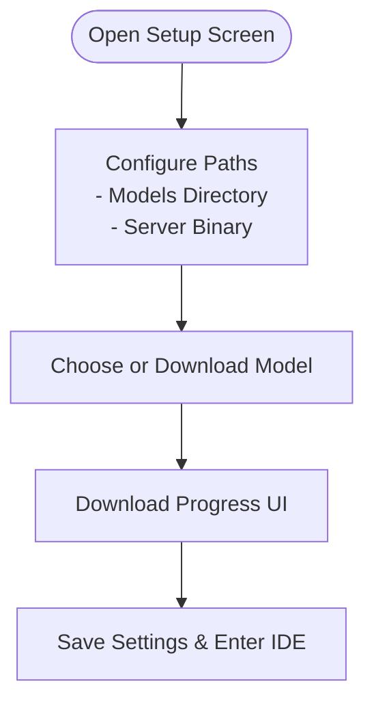
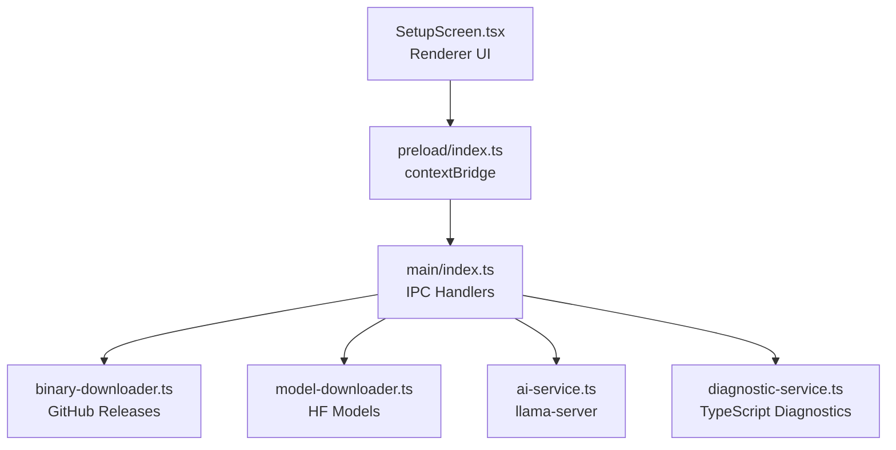

# Getting Started

<cite>
**Referenced Files in This Document**
- [README.md](file://README.md)
- [package.json](file://package.json)
- [electron.vite.config.ts](file://electron.vite.config.ts)
- [src/main/index.ts](file://src/main/index.ts)
- [src/main/ai-service.ts](file://src/main/ai-service.ts)
- [src/main/model-downloader.ts](file://src/main/model-downloader.ts)
- [src/main/binary-downloader.ts](file://src/main/binary-downloader.ts)
- [src/main/diagnostic-service.ts](file://src/main/diagnostic-service.ts)
- [src/preload/index.ts](file://src/preload/index.ts)
- [src/renderer/components/SetupScreen.tsx](file://src/renderer/components/SetupScreen.tsx)
- [src/renderer/store/appStore.tsx](file://src/renderer/store/appStore.tsx)
- [src/renderer/App.tsx](file://src/renderer/App.tsx)
</cite>

## Table of Contents
1. [Introduction](#introduction)
2. [System Requirements](#system-requirements)
3. [Installation](#installation)
4. [First-Time Setup](#first-time-setup)
5. [Development Environment](#development-environment)
6. [Quick Start Examples](#quick-start-examples)
7. [Architecture Overview](#architecture-overview)
8. [Troubleshooting](#troubleshooting)
9. [FAQ](#faq)
10. [Conclusion](#conclusion)

## Introduction
BitNet IDE is an offline-first, local AI coding companion powered by BitNet.cpp. It runs entirely on your machine, with no cloud uploads or telemetry. After initial setup, you can download a GGUF model, configure the llama-server binary, and immediately start pairing with the AI assistant in the IDE.

## System Requirements
- Operating system: Windows recommended (the binary downloader targets Windows archives)
- Node.js 18+ and npm
- Disk space: Several gigabytes for the llama-server binary and your chosen GGUF model
- CPU: Modern x64 CPU; threading and context size can be tuned in settings

**Section sources**
- [README.md](file://README.md#L20-L25)

## Installation
Follow these steps to prepare your environment and install BitNet IDE.

1. Install Node.js 18+
   - Download from the official Node.js website and verify installation.
2. Clone or obtain the BitNet IDE repository.
3. Install dependencies
   - From the project root, run: npm install
4. Build or run the app
   - Development: npm run dev
   - Production build: npm run build

Notes:
- The project uses Electron with Vite for development and build orchestration.
- The main process initializes the Electron window and exposes IPC handlers for file operations, AI server control, model downloads, and terminal integration.

**Section sources**
- [README.md](file://README.md#L26-L44)
- [package.json](file://package.json#L6-L11)
- [electron.vite.config.ts](file://electron.vite.config.ts#L1-L41)

## First-Time Setup
On first launch, BitNet IDE presents the Setup Screen to guide you through configuring your environment.

### Step 1: Choose storage locations
- Models directory: Select a folder where GGUF models will be stored.
- Server binary: Either auto-download the llama-server binary or browse to an existing local binary.

The Setup Screen supports:
- Scanning for existing GGUF models in your models directory
- Auto-downloading the llama-server binary into a dedicated subfolder
- Downloading a BitNet or other compatible GGUF model from Hugging Face

**Diagram sources**
- [src/renderer/components/SetupScreen.tsx](file://src/renderer/components/SetupScreen.tsx#L13-L132)

**Section sources**
- [src/renderer/components/SetupScreen.tsx](file://src/renderer/components/SetupScreen.tsx#L13-L132)

### Step 2: Configure llama-server binary
- Option A: Auto-download (recommended)
  - The app queries GitHub Releases for a compatible Windows binary and extracts it into a subfolder under your models directory.
- Option B: Browse local binary
  - Select an existing llama-server executable on disk.

The main process handles the binary download and verifies the presence of the expected executable.

**Section sources**
- [src/renderer/components/SetupScreen.tsx](file://src/renderer/components/SetupScreen.tsx#L78-L98)
- [src/main/binary-downloader.ts](file://src/main/binary-downloader.ts#L17-L76)

### Step 3: Select or download a GGUF model
- Choose from available BitNet or other models
- Or use an existing model already present in your models directory
- Models are downloaded directly from Hugging Face URLs configured in the backend

**Section sources**
- [src/renderer/components/SetupScreen.tsx](file://src/renderer/components/SetupScreen.tsx#L100-L120)
- [src/main/model-downloader.ts](file://src/main/model-downloader.ts#L275-L303)

### Step 4: Save settings and enter the IDE
- Once both paths and a model are configured, settings are persisted and the IDE screen is shown.

**Section sources**
- [src/renderer/components/SetupScreen.tsx](file://src/renderer/components/SetupScreen.tsx#L122-L132)
- [src/main/index.ts](file://src/main/index.ts#L66-L74)

## Development Environment
- Start the development server: npm run dev
- The Electron window loads the renderer built by Vite
- IPC bridges expose filesystem, AI, model, and terminal APIs to the renderer

Key behaviors:
- Settings are persisted to a JSON file under the user data directory
- The AI service spawns llama-server with configurable arguments and health checks
- The Setup Screen coordinates model and binary downloads with real-time progress

**Section sources**
- [README.md](file://README.md#L26-L44)
- [src/main/index.ts](file://src/main/index.ts#L54-L74)
- [src/main/ai-service.ts](file://src/main/ai-service.ts#L19-L89)
- [src/preload/index.ts](file://src/preload/index.ts#L3-L116)

## Quick Start Examples
- Open a project
  - Use the sidebar’s file explorer to open a folder containing your code.
- Use the AI assistant
  - Toggle the chat panel and send messages; the AI responds using the configured model.
- Perform basic coding tasks
  - Explain selected code
  - Refactor selections
  - Edit selections with AI suggestions

Note: These actions are integrated into the UI and rely on the AI server being started and healthy.

**Section sources**
- [src/renderer/App.tsx](file://src/renderer/App.tsx#L233-L235)
- [src/main/index.ts](file://src/main/index.ts#L274-L323)

## Architecture Overview
The setup and runtime architecture connects the renderer UI, preload bridge, main process, and AI server.

**Diagram sources**
- [src/renderer/components/SetupScreen.tsx](file://src/renderer/components/SetupScreen.tsx#L1-L357)
- [src/preload/index.ts](file://src/preload/index.ts#L1-L120)
- [src/main/index.ts](file://src/main/index.ts#L116-L519)
- [src/main/binary-downloader.ts](file://src/main/binary-downloader.ts#L1-L162)
- [src/main/model-downloader.ts](file://src/main/model-downloader.ts#L1-L483)
- [src/main/ai-service.ts](file://src/main/ai-service.ts#L1-L323)
- [src/main/diagnostic-service.ts](file://src/main/diagnostic-service.ts#L1-L65)

## Troubleshooting
Common issues and resolutions:

- Missing Node.js 18+
  - Cause: npm scripts fail or the app does not start.
  - Resolution: Install Node.js 18+ and retry npm install and npm run dev.

- Missing dependencies during install
  - Symptoms: npm install fails.
  - Resolution: Ensure a working internet connection and retry. Review package.json for required dependencies.

- llama-server binary not found
  - Symptoms: Setup fails to detect the server binary or AI server startup reports missing binary.
  - Resolutions:
    - Use the “Auto-Download” option in the Setup Screen to fetch a compatible Windows binary.
    - Manually select a valid llama-server executable if you have a prebuilt copy.

- Model download failures
  - Symptoms: Download progress appears, then an error occurs.
  - Resolutions:
    - Retry the download; the model downloader supports partial resumes.
    - Verify the models directory is writable.
    - Check network connectivity and firewall settings.

- AI server fails to start
  - Symptoms: Health check times out or the server exits quickly.
  - Resolutions:
    - Confirm the model path points to a valid GGUF file.
    - Adjust context size and threads in settings.
    - Ensure the binary is from a compatible release and located in a folder with required DLLs.

- Existing model deletion while in use
  - Behavior: Attempting to delete the active model triggers the AI server to stop first, then delete the file.

- TypeScript diagnostics not available
  - Cause: tsc not found or project path invalid.
  - Resolution: Ensure TypeScript is available in your environment or project; the diagnostic service uses npx tsc.

**Section sources**
- [src/main/binary-downloader.ts](file://src/main/binary-downloader.ts#L17-L76)
- [src/main/model-downloader.ts](file://src/main/model-downloader.ts#L275-L303)
- [src/main/ai-service.ts](file://src/main/ai-service.ts#L19-L89)
- [src/main/index.ts](file://src/main/index.ts#L433-L439)
- [src/main/diagnostic-service.ts](file://src/main/diagnostic-service.ts#L16-L39)

## FAQ
- Do I need an internet connection after setup?
  - No, all inference runs locally. Internet is only needed for the initial setup steps.

- Can I use my own llama-server binary?
  - Yes, you can browse to a local binary during setup.

- How do I change model or server settings later?
  - Use the Settings panel to adjust model path, context size, threads, and other parameters.

- What models are supported?
  - The app includes curated lists of BitNet and other GGUF models. You can also use models you place manually in your models directory.

- Why does the Setup Screen appear on first launch?
  - It ensures you configure the models directory, server binary, and a model before entering the IDE.

**Section sources**
- [README.md](file://README.md#L1-L99)
- [src/renderer/components/SetupScreen.tsx](file://src/renderer/components/SetupScreen.tsx#L13-L132)
- [src/renderer/store/appStore.tsx](file://src/renderer/store/appStore.tsx#L35-L48)

## Conclusion
You are now ready to use BitNet IDE. Complete the Setup Screen to configure your environment, then explore the AI assistant and coding features. For persistent issues, refer to the troubleshooting section or review the logs printed by the AI server and downloaders.