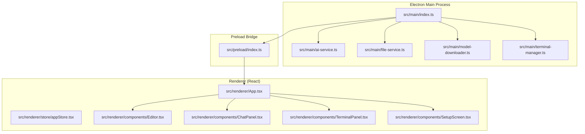
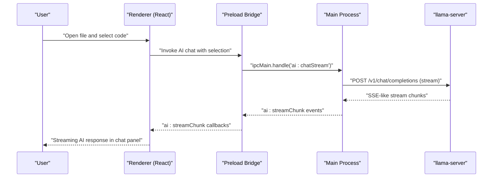
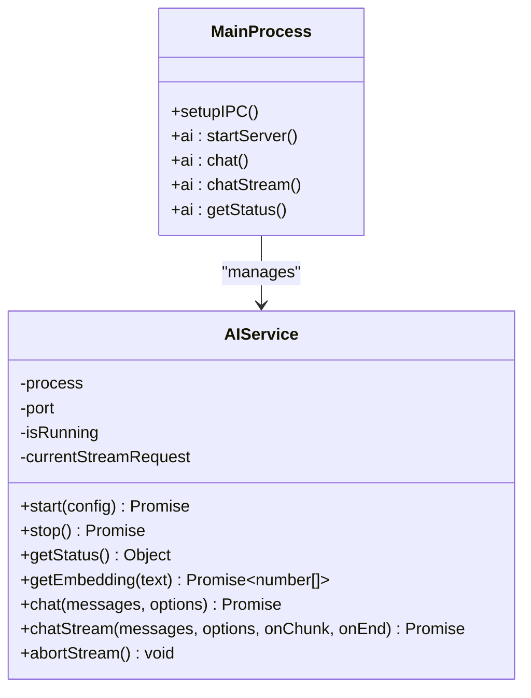
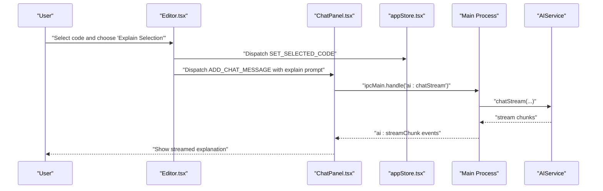
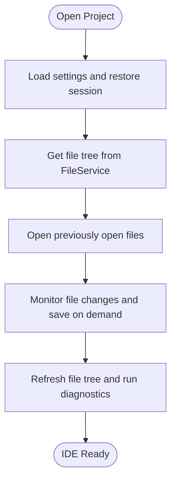
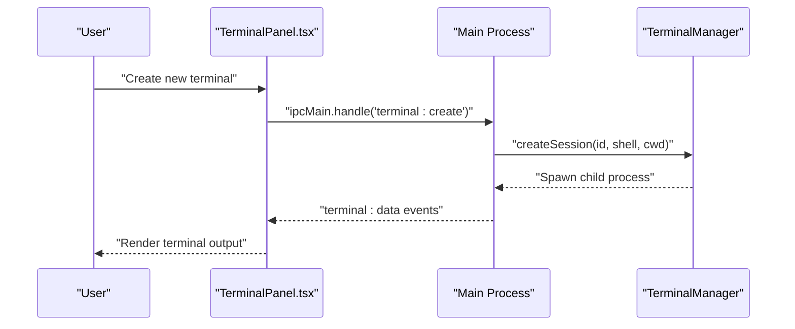
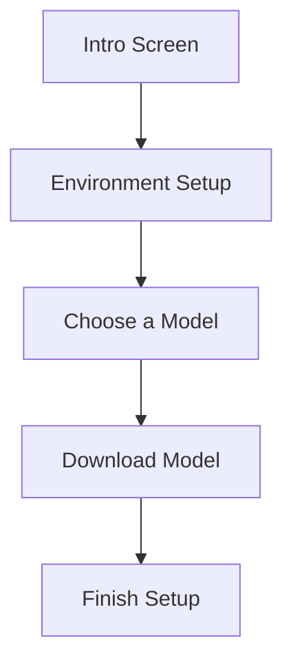
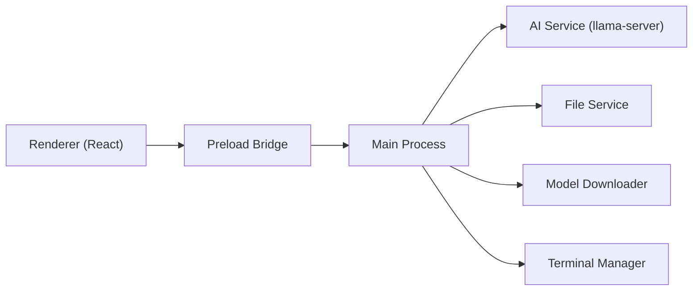

# Project Overview

<cite>
**Referenced Files in This Document**
- [README.md](file://README.md)
- [package.json](file://package.json)
- [src/main/index.ts](file://src/main/index.ts)
- [src/main/ai-service.ts](file://src/main/ai-service.ts)
- [src/main/file-service.ts](file://src/main/file-service.ts)
- [src/main/model-downloader.ts](file://src/main/model-downloader.ts)
- [src/main/terminal-manager.ts](file://src/main/terminal-manager.ts)
- [src/preload/index.ts](file://src/preload/index.ts)
- [src/renderer/App.tsx](file://src/renderer/App.tsx)
- [src/renderer/store/appStore.tsx](file://src/renderer/store/appStore.tsx)
- [src/renderer/components/Editor.tsx](file://src/renderer/components/Editor.tsx)
- [src/renderer/components/ChatPanel.tsx](file://src/renderer/components/ChatPanel.tsx)
- [src/renderer/components/TerminalPanel.tsx](file://src/renderer/components/TerminalPanel.tsx)
- [src/renderer/components/SetupScreen.tsx](file://src/renderer/components/SetupScreen.tsx)
</cite>

## Table of Contents
1. [Introduction](#introduction)
2. [Project Structure](#project-structure)
3. [Core Components](#core-components)
4. [Architecture Overview](#architecture-overview)
5. [Detailed Component Analysis](#detailed-component-analysis)
6. [Dependency Analysis](#dependency-analysis)
7. [Performance Considerations](#performance-considerations)
8. [Troubleshooting Guide](#troubleshooting-guide)
9. [Conclusion](#conclusion)

## Introduction
BitNet IDE is an offline-first local AI-powered Integrated Development Environment designed to keep your code private and your workflow distraction-free. It runs entirely on your machine using BitNet.cpp’s llama-server to deliver local 1-bit LLM inference, eliminating the need for cloud connectivity after initial setup. The project emphasizes privacy, CPU-friendliness, and a minimalist UI to help you focus on writing code.

Key differentiators from cloud-based alternatives:
- Fully offline-first: All inference runs locally via llama-server; no telemetry or external calls.
- Privacy-first: No data leaves your device; your code remains private.
- Minimal & distraction-free: Keyboard-first UI with a calm, professional design.
- CPU-friendly: Optimized for laptops and CPU-only environments.

Practical examples:
- AI-assisted coding: Select code in the editor, right-click, and use “Explain Selection” or “Refactor Selection.” Or use the AI chat panel to ask questions, generate code, or edit selections with inline diff previews.
- File editing: Open, edit, and save files with syntax highlighting and intelligent autocomplete powered by BitNet.cpp.
- Terminal integration: Launch and manage terminals with xterm.js, integrate terminal output into the AI chat, and run commands directly from the IDE.

Design principles:
- Privacy first: No telemetry, no external network calls.
- Minimal & calm: Professional UI without distractions.
- CPU-friendly: Lightweight configuration defaults for broad hardware compatibility.
- Keyboard-first: Extensive keyboard shortcuts for productivity.

**Section sources**
- [README.md](file://README.md#L1-L99)

## Project Structure
The project follows an Electron architecture with a clear separation between the main process and renderer process, plus a preload bridge for secure IPC. The renderer is a React application with a Redux-like state management pattern using React Context and useReducer.

High-level structure:
- Main process: Orchestrates windows, IPC handlers, AI server lifecycle, file operations, model downloads, and terminal sessions.
- Preload: Exposes a safe Electron API surface to the renderer.
- Renderer: React components for the UI, state management, and integration with the main process.

**Diagram sources**
- [src/main/index.ts](file://src/main/index.ts#L1-L542)
- [src/preload/index.ts](file://src/preload/index.ts#L1-L120)
- [src/renderer/App.tsx](file://src/renderer/App.tsx#L1-L293)
- [src/renderer/store/appStore.tsx](file://src/renderer/store/appStore.tsx#L1-L351)

**Section sources**
- [README.md](file://README.md#L59-L87)
- [src/main/index.ts](file://src/main/index.ts#L1-L542)
- [src/preload/index.ts](file://src/preload/index.ts#L1-L120)
- [src/renderer/App.tsx](file://src/renderer/App.tsx#L1-L293)

## Core Components
- Electron main process: Manages window creation, IPC handlers, AI server lifecycle, file operations, model downloads, and terminal sessions.
- Preload bridge: Provides a typed Electron API surface to the renderer while maintaining security via contextBridge.
- Renderer (React): Implements the UI, state management, and integrates with the main process for AI, file, and terminal operations.
- AI service: Spawns and manages the llama-server process, exposes chat and embedding endpoints, and handles streaming responses.
- File service: Reads/writes files, computes diffs, and builds project file trees with Git status.
- Model downloader: Lists, downloads, and manages GGUF models from Hugging Face with resumable downloads.
- Terminal manager: Spawns shell processes, streams output to the renderer, and integrates with xterm.js.

**Section sources**
- [src/main/index.ts](file://src/main/index.ts#L1-L542)
- [src/preload/index.ts](file://src/preload/index.ts#L1-L120)
- [src/renderer/App.tsx](file://src/renderer/App.tsx#L1-L293)
- [src/main/ai-service.ts](file://src/main/ai-service.ts#L1-L323)
- [src/main/file-service.ts](file://src/main/file-service.ts#L1-L162)
- [src/main/model-downloader.ts](file://src/main/model-downloader.ts#L1-L483)
- [src/main/terminal-manager.ts](file://src/main/terminal-manager.ts#L1-L111)

## Architecture Overview
BitNet IDE uses an Electron main-renderer architecture with a preload bridge. The renderer communicates with the main process exclusively through IPC handlers exposed in the preload module. The main process manages the AI server (llama-server), file system operations, model downloads, and terminal sessions. The renderer renders the UI and orchestrates user interactions.

**Diagram sources**
- [src/renderer/components/ChatPanel.tsx](file://src/renderer/components/ChatPanel.tsx#L196-L295)
- [src/main/ai-service.ts](file://src/main/ai-service.ts#L240-L314)
- [src/preload/index.ts](file://src/preload/index.ts#L33-L50)
- [src/main/index.ts](file://src/main/index.ts#L296-L319)

**Section sources**
- [src/main/index.ts](file://src/main/index.ts#L116-L519)
- [src/preload/index.ts](file://src/preload/index.ts#L1-L120)
- [src/main/ai-service.ts](file://src/main/ai-service.ts#L1-L323)

## Detailed Component Analysis

### AI Assistant Capabilities (Powered by BitNet.cpp and llama-server)
- Server lifecycle: The main process spawns llama-server with configurable model path, context size, threads, and port. Health checks ensure readiness before allowing chat requests.
- Chat and embeddings: The AI service exposes synchronous and streaming chat endpoints and an embedding endpoint used by the RAG system.
- Streaming: The renderer receives incremental chunks and updates the chat UI in real time.

**Diagram sources**
- [src/main/ai-service.ts](file://src/main/ai-service.ts#L12-L323)
- [src/main/index.ts](file://src/main/index.ts#L273-L324)

**Section sources**
- [src/main/ai-service.ts](file://src/main/ai-service.ts#L1-L323)
- [src/main/index.ts](file://src/main/index.ts#L273-L324)

### Integrated Development Environment Features
- File editing: The editor integrates Monaco Editor with syntax highlighting, themes, inline autocomplete, and file operations.
- AI-assisted editing: Right-click actions (“Explain Selection,” “Refactor Selection,” “Edit Selection”) trigger AI workflows with inline diff previews.
- Chat panel: Real-time chat with streaming responses, file mentions, and RAG-retrieved context.
- Terminal integration: xterm.js-backed terminals with shell detection, session management, and seamless integration with the chat panel.

**Diagram sources**
- [src/renderer/components/Editor.tsx](file://src/renderer/components/Editor.tsx#L30-L107)
- [src/renderer/components/ChatPanel.tsx](file://src/renderer/components/ChatPanel.tsx#L453-L476)
- [src/renderer/store/appStore.tsx](file://src/renderer/store/appStore.tsx#L97-L127)
- [src/main/index.ts](file://src/main/index.ts#L296-L319)
- [src/main/ai-service.ts](file://src/main/ai-service.ts#L240-L314)

**Section sources**
- [src/renderer/components/Editor.tsx](file://src/renderer/components/Editor.tsx#L1-L372)
- [src/renderer/components/ChatPanel.tsx](file://src/renderer/components/ChatPanel.tsx#L1-L800)
- [src/renderer/store/appStore.tsx](file://src/renderer/store/appStore.tsx#L1-L351)

### File Editing and Workspace Management
- File operations: Read, write, patch, create, rename, delete, and search within projects.
- Project tree: Builds a hierarchical file tree with Git status indicators and ignores common directories and files.
- Session persistence: Restores last project, open files, and active file on startup.

**Diagram sources**
- [src/main/file-service.ts](file://src/main/file-service.ts#L59-L99)
- [src/main/index.ts](file://src/main/index.ts#L144-L271)
- [src/renderer/App.tsx](file://src/renderer/App.tsx#L42-L112)

**Section sources**
- [src/main/file-service.ts](file://src/main/file-service.ts#L1-L162)
- [src/main/index.ts](file://src/main/index.ts#L144-L271)
- [src/renderer/App.tsx](file://src/renderer/App.tsx#L42-L112)

### Terminal Integration
- Sessions: Spawn shell processes per session, stream output to xterm.js terminals, and handle exits.
- UX: Tabs for multiple terminals, maximize/restore, and add selection to chat.

**Diagram sources**
- [src/renderer/components/TerminalPanel.tsx](file://src/renderer/components/TerminalPanel.tsx#L99-L216)
- [src/main/terminal-manager.ts](file://src/main/terminal-manager.ts#L24-L75)
- [src/main/index.ts](file://src/main/index.ts#L462-L484)

**Section sources**
- [src/renderer/components/TerminalPanel.tsx](file://src/renderer/components/TerminalPanel.tsx#L1-L312)
- [src/main/terminal-manager.ts](file://src/main/terminal-manager.ts#L1-L111)
- [src/main/index.ts](file://src/main/index.ts#L462-L496)

### Model Management and Setup
- Setup wizard: Guides users through selecting a models directory, locating or downloading the llama-server binary, choosing a GGUF model, and completing setup.
- Model downloader: Supports resumable downloads, scanning existing models, and deleting models.

**Diagram sources**
- [src/renderer/components/SetupScreen.tsx](file://src/renderer/components/SetupScreen.tsx#L13-L132)
- [src/main/model-downloader.ts](file://src/main/model-downloader.ts#L271-L354)

**Section sources**
- [src/renderer/components/SetupScreen.tsx](file://src/renderer/components/SetupScreen.tsx#L1-L357)
- [src/main/model-downloader.ts](file://src/main/model-downloader.ts#L1-L483)

## Dependency Analysis
- Electron main process depends on Node.js APIs and child processes to manage the AI server, file system, and terminals.
- Preload bridge exposes a typed API to the renderer, limiting exposure to only declared IPC channels.
- Renderer depends on React, Monaco Editor, xterm.js, and the preload bridge for IPC.

**Diagram sources**
- [src/preload/index.ts](file://src/preload/index.ts#L1-L120)
- [src/main/index.ts](file://src/main/index.ts#L1-L542)

**Section sources**
- [package.json](file://package.json#L1-L35)
- [src/main/index.ts](file://src/main/index.ts#L1-L542)
- [src/preload/index.ts](file://src/preload/index.ts#L1-L120)

## Performance Considerations
- CPU-friendliness: The project targets CPU-only inference and provides sensible defaults for context size, threads, and model selection to run smoothly on modest hardware.
- Streaming responses: The AI chat uses streaming to reduce perceived latency and improve responsiveness.
- Debounced autocomplete: Inline autocomplete triggers are debounced to avoid excessive local LLM calls during rapid typing.
- Terminal rendering: xterm.js is configured for smooth rendering and antialiasing.

[No sources needed since this section provides general guidance]

## Troubleshooting Guide
Common issues and resolutions:
- AI server not starting: Verify the llama-server binary path and model path are configured. Check health checks and logs for early exits.
- Streaming stops unexpectedly: Use the stop button to abort the stream and retry. Ensure the server is still running.
- File operations failing: Confirm the file exists and permissions are sufficient. Use the file service APIs to read/write/patch safely.
- Terminal not responding: Ensure the shell executable is available and the session was created successfully. Try restarting the terminal session.

**Section sources**
- [src/main/ai-service.ts](file://src/main/ai-service.ts#L19-L89)
- [src/main/index.ts](file://src/main/index.ts#L273-L324)
- [src/main/file-service.ts](file://src/main/file-service.ts#L101-L141)
- [src/main/terminal-manager.ts](file://src/main/terminal-manager.ts#L24-L75)

## Conclusion
BitNet IDE delivers a privacy-preserving, offline-first AI-powered development environment that runs entirely on your machine. Its Electron architecture cleanly separates concerns, while the AI assistant, file editing, and terminal integration provide a cohesive, distraction-free coding experience. By leveraging BitNet.cpp and llama-server, it achieves strong performance on CPU-only systems and maintains strict privacy boundaries.

[No sources needed since this section summarizes without analyzing specific files]