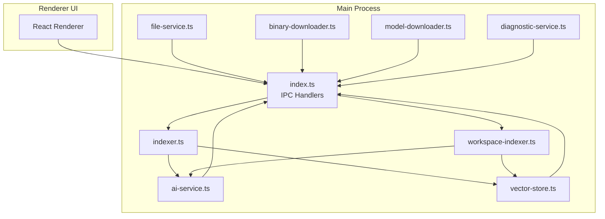
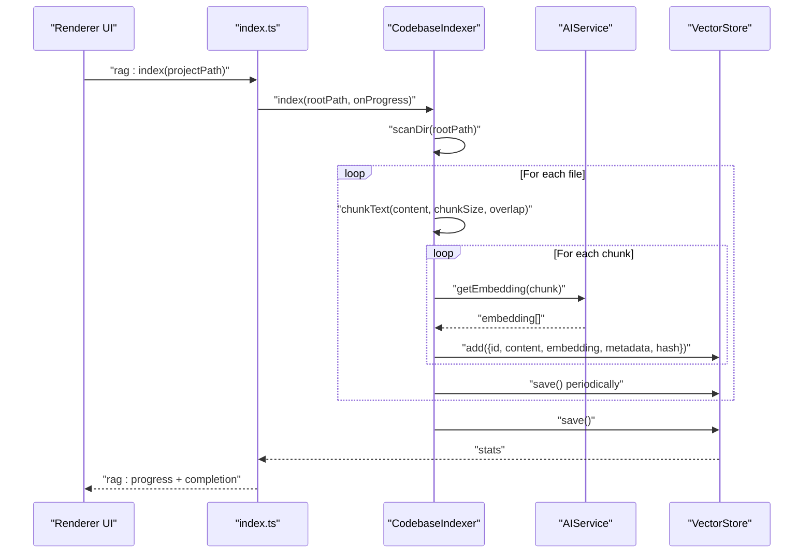
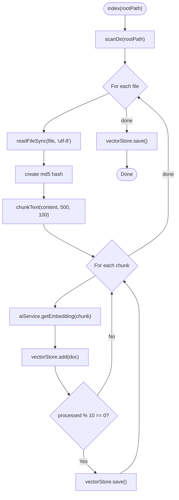
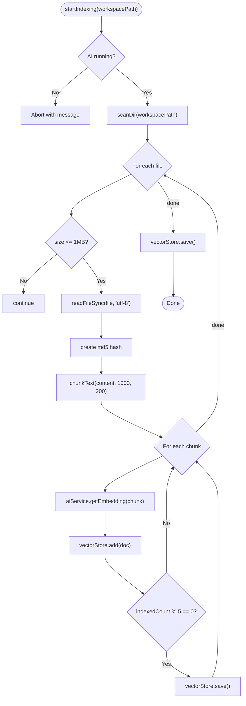
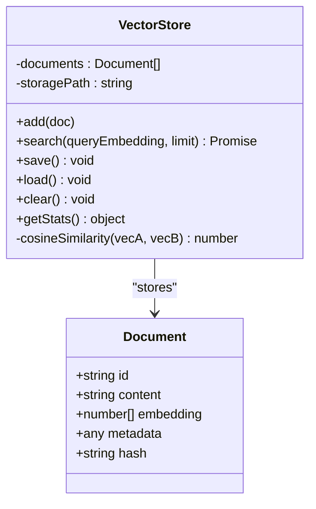
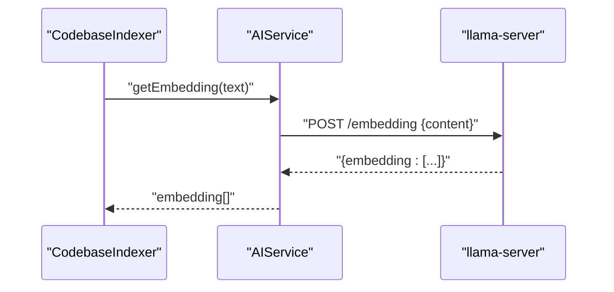
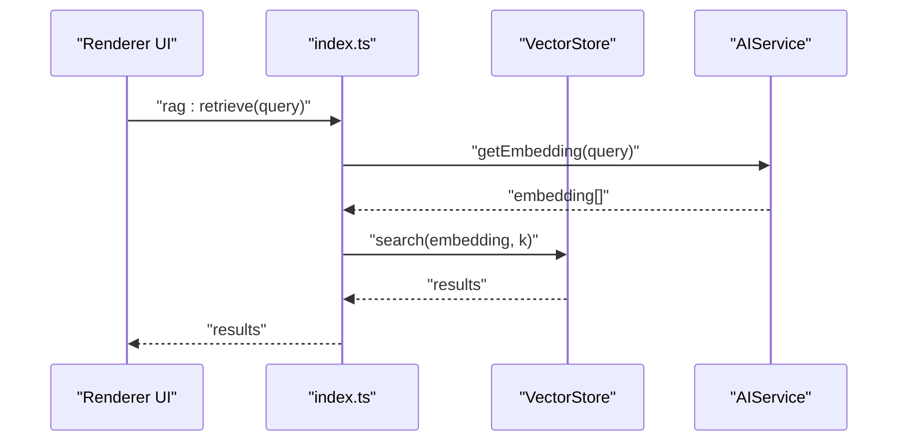
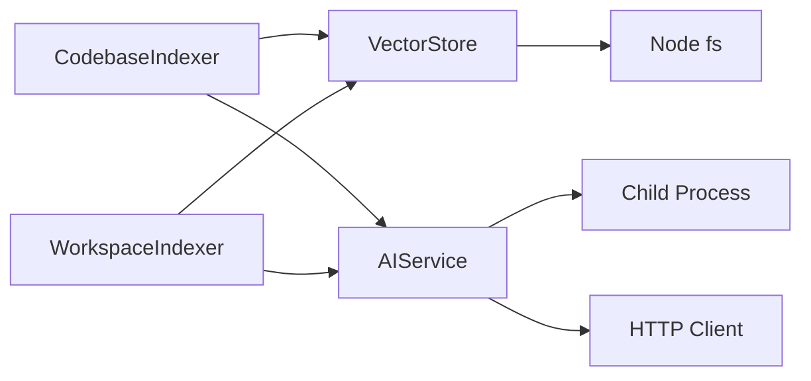

# Codebase Indexer

<cite>
**Referenced Files in This Document**
- [indexer.ts](file://src/main/rag/indexer.ts)
- [workspace-indexer.ts](file://src/main/rag/workspace-indexer.ts)
- [vector-store.ts](file://src/main/rag/vector-store.ts)
- [ai-service.ts](file://src/main/ai-service.ts)
- [index.ts](file://src/main/index.ts)
- [file-service.ts](file://src/main/file-service.ts)
- [binary-downloader.ts](file://src/main/binary-downloader.ts)
- [model-downloader.ts](file://src/main/model-downloader.ts)
- [diagnostic-service.ts](file://src/main/diagnostic-service.ts)
- [package.json](file://package.json)
- [README.md](file://README.md)
</cite>

## Table of Contents
1. [Introduction](#introduction)
2. [Project Structure](#project-structure)
3. [Core Components](#core-components)
4. [Architecture Overview](#architecture-overview)
5. [Detailed Component Analysis](#detailed-component-analysis)
6. [Dependency Analysis](#dependency-analysis)
7. [Performance Considerations](#performance-considerations)
8. [Troubleshooting Guide](#troubleshooting-guide)
9. [Conclusion](#conclusion)
10. [Appendices](#appendices)

## Introduction
This document explains the codebase indexing system that powers Retrieval-Augmented Generation (RAG) in the application. It covers how workspace files are discovered, filtered, chunked into semantically coherent segments, embedded using a local AI engine, and persisted in a vector store. It also documents the workspace indexer that monitors file changes and maintains an up-to-date index, the integration with the AI service for embedding generation, and the vector store’s role in persistent storage. Configuration options for performance tuning, file filtering, and chunk size optimization are included, along with practical workflows for index creation, incremental updates, and batch processing. Finally, performance considerations and troubleshooting guidance address common issues such as encoding problems, large file handling, and concurrent access conflicts.

## Project Structure
The RAG-related code resides under the main process module and integrates with the Electron main entry point and renderer UI. The key modules are:
- RAG modules: indexer, workspace-indexer, vector-store
- AI integration: ai-service
- Application entry and IPC: index.ts
- Supporting services: file-service, binary-downloader, model-downloader, diagnostic-service
- Package and documentation: package.json, README.md

**Diagram sources**
- [index.ts](file://src/main/index.ts#L1-L542)
- [indexer.ts](file://src/main/rag/indexer.ts#L1-L127)
- [workspace-indexer.ts](file://src/main/rag/workspace-indexer.ts#L1-L149)
- [vector-store.ts](file://src/main/rag/vector-store.ts#L1-L84)
- [ai-service.ts](file://src/main/ai-service.ts#L1-L323)
- [file-service.ts](file://src/main/file-service.ts#L1-L162)
- [binary-downloader.ts](file://src/main/binary-downloader.ts#L1-L162)
- [model-downloader.ts](file://src/main/model-downloader.ts#L1-L483)
- [diagnostic-service.ts](file://src/main/diagnostic-service.ts#L1-L65)

**Section sources**
- [README.md](file://README.md#L59-L87)
- [package.json](file://package.json#L1-L35)

## Core Components
- CodebaseIndexer: Scans a root path, filters files, chunks content into overlapping segments, generates embeddings via the AI service, and persists vectors to the vector store.
- WorkspaceIndexer: Scans the workspace for indexable files, applies stricter file size limits, chunks content, and embeds chunks to update the vector store.
- VectorStore: In-memory document collection with persistence to a JSON file in the application data directory, supports adding documents, saving/loading, and similarity search.
- AIService: Manages a local llama-server subprocess, exposes health checks, embedding generation, and chat endpoints, and streams chat completions.
- IPC Integration: The main process wires RAG operations through IPC handlers, enabling UI-driven index creation and retrieval.

Key responsibilities:
- File discovery and filtering: Both indexers define allowed extensions and ignore directories.
- Semantic chunking: Overlapping word-window chunking ensures continuity across boundaries.
- Embedding generation: Delegated to the AI service’s embedding endpoint.
- Persistence: VectorStore writes to a JSON file in the user data directory.
- Retrieval: VectorStore computes cosine similarity for nearest neighbors.

**Section sources**
- [indexer.ts](file://src/main/rag/indexer.ts#L7-L127)
- [workspace-indexer.ts](file://src/main/rag/workspace-indexer.ts#L12-L149)
- [vector-store.ts](file://src/main/rag/vector-store.ts#L13-L84)
- [ai-service.ts](file://src/main/ai-service.ts#L12-L323)
- [index.ts](file://src/main/index.ts#L497-L518)

## Architecture Overview
The indexing pipeline connects the file system, chunking logic, AI embedding service, and vector store. The main process exposes IPC endpoints for UI-triggered indexing and retrieval.

**Diagram sources**
- [index.ts](file://src/main/index.ts#L497-L518)
- [indexer.ts](file://src/main/rag/indexer.ts#L18-L73)
- [ai-service.ts](file://src/main/ai-service.ts#L147-L188)
- [vector-store.ts](file://src/main/rag/vector-store.ts#L23-L46)

## Detailed Component Analysis

### CodebaseIndexer
- Responsibilities:
  - Scan directory recursively, filtering by allowed extensions and size.
  - Chunk content using overlapping word windows.
  - Generate embeddings via AIService and persist to VectorStore.
  - Periodic saves and graceful stop signaling.
- Implementation highlights:
  - Allowed extensions include TypeScript, JavaScript, CSS, HTML, JSON, Markdown, Python, Rust, Go, C/C++, Java, XML, YAML, and shell scripts.
  - Maximum file size increased to 500 KB.
  - Chunking strategy: 500-word windows with 100-word overlap.
  - Hashing content to detect duplicates.
  - Progress callbacks send current file and totals to UI.

**Diagram sources**
- [indexer.ts](file://src/main/rag/indexer.ts#L18-L73)

**Section sources**
- [indexer.ts](file://src/main/rag/indexer.ts#L7-L127)

### WorkspaceIndexer
- Responsibilities:
  - Scan workspace for indexable files with stricter size limits.
  - Chunk content using overlapping windows.
  - Embed chunks and add to VectorStore.
  - Periodic saves and progress reporting.
- Implementation highlights:
  - Allowed extensions identical to CodebaseIndexer.
  - Maximum file size 1 MB.
  - Chunking strategy: 1000-word windows with 200-word overlap.
  - Uses file path as chunk identifier and tracks chunk index in metadata.

**Diagram sources**
- [workspace-indexer.ts](file://src/main/rag/workspace-indexer.ts#L47-L125)

**Section sources**
- [workspace-indexer.ts](file://src/main/rag/workspace-indexer.ts#L12-L149)

### VectorStore
- Responsibilities:
  - In-memory document storage with deduplication by ID.
  - Persistent storage to a JSON file in the application data directory.
  - Similarity search using cosine similarity.
  - Stats reporting and clearing.
- Implementation highlights:
  - Documents include id, content, embedding vector, metadata, and hash.
  - Saves and loads entire document set on demand.
  - Cosine similarity computed element-wise.

**Diagram sources**
- [vector-store.ts](file://src/main/rag/vector-store.ts#L5-L84)

**Section sources**
- [vector-store.ts](file://src/main/rag/vector-store.ts#L13-L84)

### AIService
- Responsibilities:
  - Spawn and manage a local llama-server subprocess.
  - Health checks and status reporting.
  - Embedding generation via HTTP POST to the embedding endpoint.
  - Chat completions and streaming chat completions.
- Implementation highlights:
  - Embedding endpoint path is “/embedding”.
  - Supports streaming chat completions with SSE-like parsing.
  - Robust error handling and process lifecycle management.

**Diagram sources**
- [ai-service.ts](file://src/main/ai-service.ts#L147-L188)

**Section sources**
- [ai-service.ts](file://src/main/ai-service.ts#L12-L323)

### IPC Integration and UI Workflows
- IPC handlers expose:
  - rag:index: Triggers CodebaseIndexer with progress events.
  - rag:status: Returns vector store statistics.
  - rag:retrieve: Generates query embedding and performs similarity search.
- UI workflows:
  - Index creation: UI triggers rag:index, receives progress updates, and displays completion.
  - Retrieval: UI sends a query, obtains embedding, and retrieves top-k results.

**Diagram sources**
- [index.ts](file://src/main/index.ts#L513-L518)
- [vector-store.ts](file://src/main/rag/vector-store.ts#L29-L38)
- [ai-service.ts](file://src/main/ai-service.ts#L147-L188)

**Section sources**
- [index.ts](file://src/main/index.ts#L497-L518)

## Dependency Analysis
- CodebaseIndexer depends on:
  - VectorStore for persistence and retrieval.
  - AIService for embedding generation.
  - Node.js fs/path/crypto for scanning, reading, hashing, and path manipulation.
- WorkspaceIndexer depends on:
  - VectorStore for persistence.
  - AIService for embedding generation.
  - Node.js fs/statSync/readdirSync for scanning and file stats.
- VectorStore depends on:
  - Electron app.getPath for user data directory.
  - Node.js fs for file I/O.
- AIService depends on:
  - Child process spawning and HTTP client for embedding and chat.
  - Health checks via HTTP GET to “/health”.

**Diagram sources**
- [indexer.ts](file://src/main/rag/indexer.ts#L1-L16)
- [workspace-indexer.ts](file://src/main/rag/workspace-indexer.ts#L1-L20)
- [vector-store.ts](file://src/main/rag/vector-store.ts#L1-L21)
- [ai-service.ts](file://src/main/ai-service.ts#L1-L10)

**Section sources**
- [indexer.ts](file://src/main/rag/indexer.ts#L1-L16)
- [workspace-indexer.ts](file://src/main/rag/workspace-indexer.ts#L1-L20)
- [vector-store.ts](file://src/main/rag/vector-store.ts#L1-L21)
- [ai-service.ts](file://src/main/ai-service.ts#L1-L10)

## Performance Considerations
- Chunking strategy:
  - Word-based overlapping windows improve semantic continuity and reduce boundary artifacts.
  - Adjust chunkSize and overlap to balance recall vs. embedding cost.
- File filtering:
  - Allowed extensions and ignore lists reduce I/O and embedding overhead.
  - File size caps prevent memory pressure and long processing times.
- Embedding throughput:
  - AIService manages a single llama-server instance; batching requests is handled by the caller.
  - Consider reducing chunk size or overlap for faster iteration during development.
- Persistence:
  - Periodic saves minimize data loss but increase disk I/O. Tune save cadence based on indexing volume.
  - VectorStore stores all embeddings in memory; very large indexes may require pagination or external vector databases.
- Concurrency:
  - Indexers guard against concurrent runs and support stop signals.
  - Avoid simultaneous indexing from multiple UI triggers to prevent resource contention.
- Disk I/O:
  - Persist to a fast SSD when possible.
  - Minimize frequent saves by batching writes.

[No sources needed since this section provides general guidance]

## Troubleshooting Guide
Common issues and resolutions:
- AI engine not running:
  - Ensure the AI server is started and healthy before indexing. The workspace indexer checks status and aborts if not running.
- Embedding failures:
  - Verify the embedding endpoint path and model availability. AIService parses both standard and alternative formats.
- File encoding problems:
  - Indexers read files as UTF-8. Non-UTF-8 files may fail to parse. Convert files to UTF-8 or exclude problematic encodings.
- Large file handling:
  - Files exceeding size limits are skipped. Increase limits cautiously to avoid memory issues.
- Concurrent access conflicts:
  - Indexers prevent overlapping runs and support stop signals. Avoid triggering multiple index operations simultaneously.
- Vector store corruption:
  - VectorStore persists to a JSON file. If corrupted, clear the store and rebuild the index.

**Section sources**
- [workspace-indexer.ts](file://src/main/rag/workspace-indexer.ts#L49-L52)
- [ai-service.ts](file://src/main/ai-service.ts#L147-L188)
- [vector-store.ts](file://src/main/rag/vector-store.ts#L40-L58)

## Conclusion
The codebase indexing system provides a robust pipeline for transforming workspace files into embeddings stored in a vector database. The overlapping chunking strategy balances semantic coherence with computational efficiency, while the AI service and vector store integrate seamlessly through IPC. By tuning chunk sizes, file filters, and save intervals, teams can optimize performance for large codebases. The system’s design supports both batch indexing and periodic updates, with safeguards against concurrency and data integrity issues.

[No sources needed since this section summarizes without analyzing specific files]

## Appendices

### Configuration Options and Tuning
- Chunking parameters:
  - CodebaseIndexer: chunkSize 500, overlap 100.
  - WorkspaceIndexer: chunkSize 1000, overlap 200.
- File filtering:
  - Allowed extensions: TypeScript, JavaScript, CSS, HTML, JSON, Markdown, Python, Rust, Go, C/C++, Java, XML, YAML, shell scripts.
  - Ignored directories: node_modules, .git, dist, build, out, .next, coverage, .gemini, .vscode, .idea, __pycache__.
  - Max file size: 500 KB (CodebaseIndexer), 1 MB (WorkspaceIndexer).
- Vector store persistence:
  - Storage path: application data directory under rag-store.json.
  - Save cadence: periodic saves during indexing and final save upon completion.
- AI service tuning:
  - Port, context size, threads, and model path are configurable via settings and passed to AIService.start.

**Section sources**
- [indexer.ts](file://src/main/rag/indexer.ts#L86-L101)
- [workspace-indexer.ts](file://src/main/rag/workspace-indexer.ts#L8-L10)
- [vector-store.ts](file://src/main/rag/vector-store.ts#L17-L21)
- [ai-service.ts](file://src/main/ai-service.ts#L19-L39)
- [index.ts](file://src/main/index.ts#L22-L52)

### Example Workflows
- Index creation:
  - Start AI server, trigger rag:index with project path, monitor progress events, and finalize with a save.
- Incremental updates:
  - Re-run workspace indexer to refresh embeddings for changed files; consider file hash comparisons to skip unchanged chunks.
- Batch processing:
  - Process files in batches with periodic saves; adjust chunk size and overlap to meet latency targets.

**Section sources**
- [index.ts](file://src/main/index.ts#L497-L518)
- [indexer.ts](file://src/main/rag/indexer.ts#L18-L73)
- [workspace-indexer.ts](file://src/main/rag/workspace-indexer.ts#L47-L125)