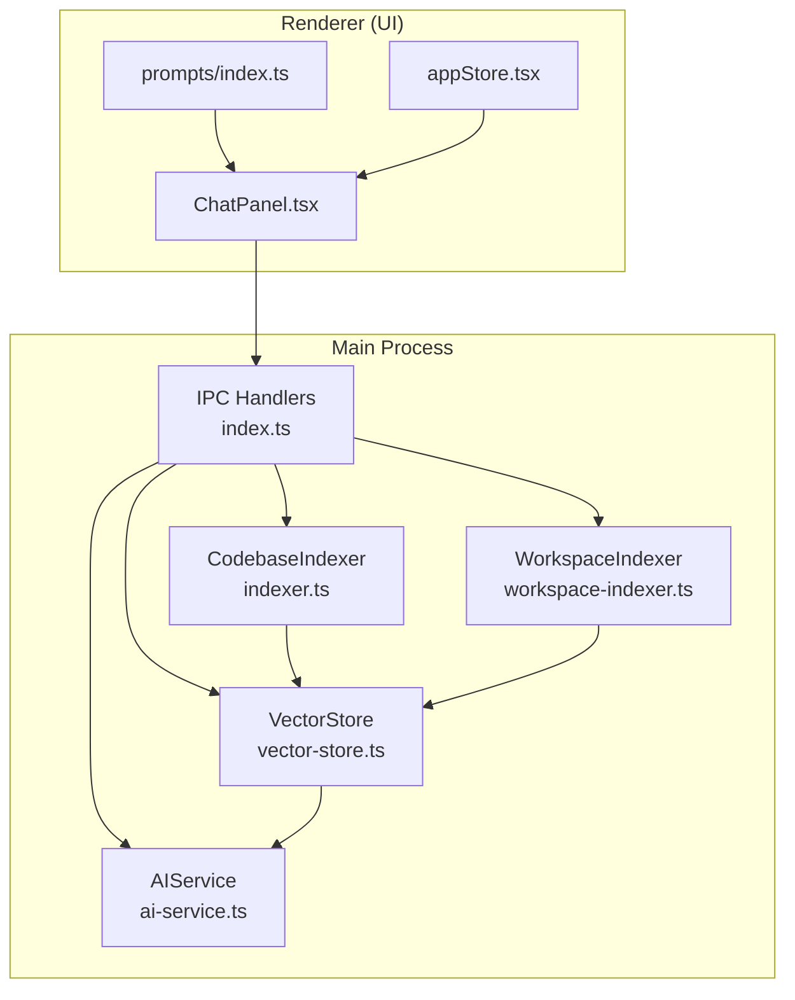
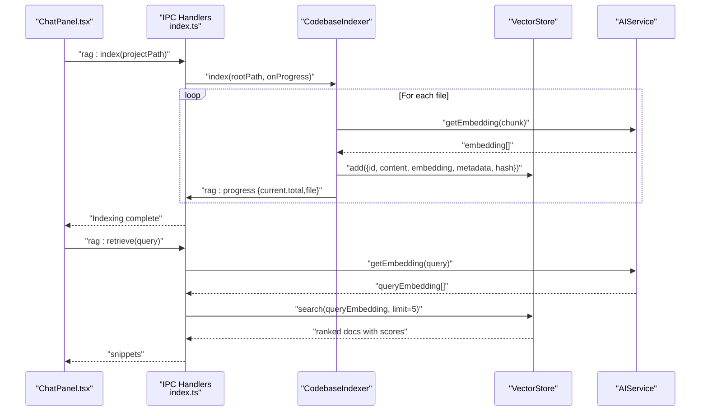
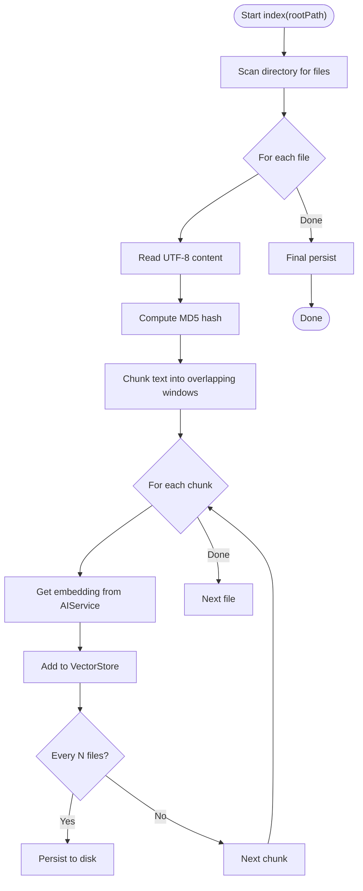
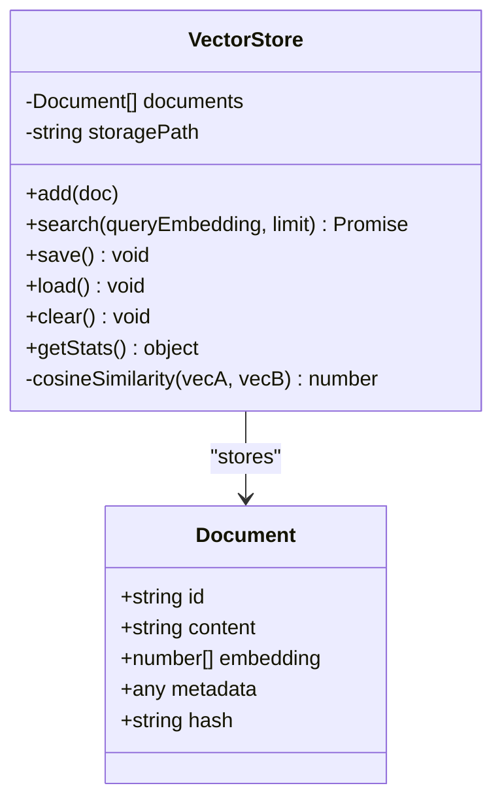
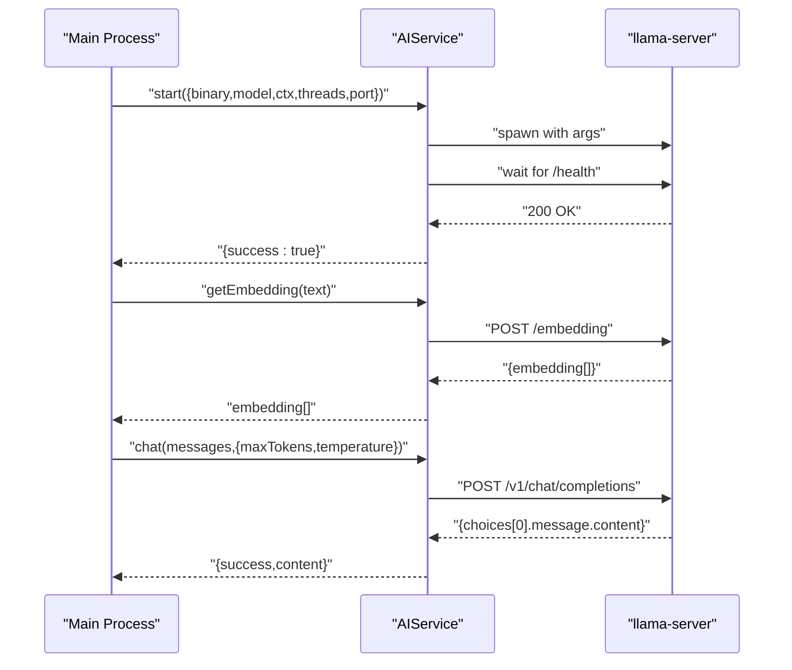
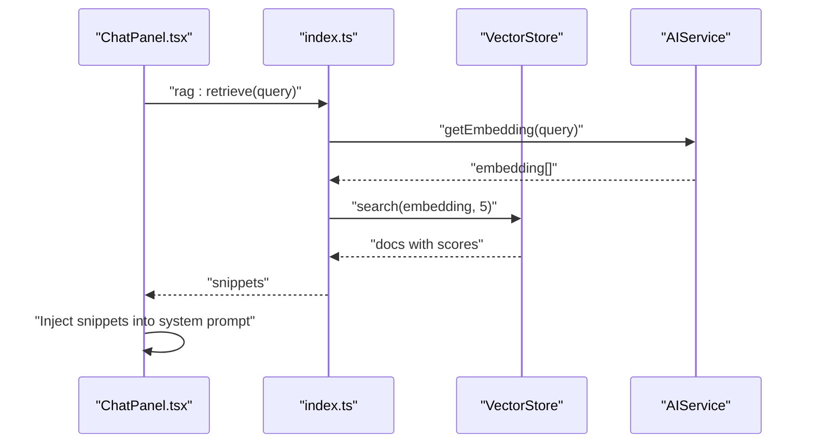
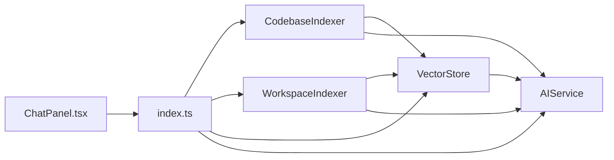

# RAG (Retrieval-Augmented Generation) System

<cite>
**Referenced Files in This Document**
- [indexer.ts](file://src/main/rag/indexer.ts)
- [vector-store.ts](file://src/main/rag/vector-store.ts)
- [workspace-indexer.ts](file://src/main/rag/workspace-indexer.ts)
- [ai-service.ts](file://src/main/ai-service.ts)
- [index.ts](file://src/main/index.ts)
- [ChatPanel.tsx](file://src/renderer/components/ChatPanel.tsx)
- [prompts/index.ts](file://src/renderer/prompts/index.ts)
- [appStore.tsx](file://src/renderer/store/appStore.tsx)
- [README.md](file://README.md)
</cite>

## Table of Contents
1. [Introduction](#introduction)
2. [Project Structure](#project-structure)
3. [Core Components](#core-components)
4. [Architecture Overview](#architecture-overview)
5. [Detailed Component Analysis](#detailed-component-analysis)
6. [Dependency Analysis](#dependency-analysis)
7. [Performance Considerations](#performance-considerations)
8. [Troubleshooting Guide](#troubleshooting-guide)
9. [Conclusion](#conclusion)
10. [Appendices](#appendices)

## Introduction
This document explains BitNet IDE’s Retrieval-Augmented Generation (RAG) system that powers contextual AI assistance. The system indexes your workspace into semantic chunks, generates embeddings using a local AI engine, stores vectors persistently, and retrieves relevant code snippets during chat to improve explanations and refactoring suggestions. It is designed for privacy-first, offline-first operation with a focus on CPU-friendly performance.

## Project Structure
The RAG system spans the Electron main process (indexers, vector store, AI service) and the renderer (UI triggers and integrates retrieved context into prompts).

**Diagram sources**
- [indexer.ts](file://src/main/rag/indexer.ts#L7-L16)
- [workspace-indexer.ts](file://src/main/rag/workspace-indexer.ts#L12-L20)
- [vector-store.ts](file://src/main/rag/vector-store.ts#L13-L21)
- [ai-service.ts](file://src/main/ai-service.ts#L12-L18)
- [index.ts](file://src/main/index.ts#L497-L518)

**Section sources**
- [README.md](file://README.md#L59-L87)
- [index.ts](file://src/main/index.ts#L497-L518)

## Core Components
- CodebaseIndexer: Scans a project root, chunks files, computes embeddings, and adds vectors to the store.
- WorkspaceIndexer: Scans the entire workspace, chunks content, computes embeddings, and updates the store.
- VectorStore: In-memory document collection with persistent JSON storage and cosine similarity search.
- AIService: Manages a local llama-server subprocess, exposes embedding and chat endpoints.
- IPC Handlers: Expose RAG APIs to the renderer and orchestrate indexing and retrieval.

Key responsibilities:
- Indexing: File discovery, chunking, hashing, embedding generation, and persistence.
- Retrieval: Embedding a query, computing similarities, and returning ranked snippets.
- UI Integration: Trigger indexing, display progress, and inject retrieved snippets into prompts.

**Section sources**
- [indexer.ts](file://src/main/rag/indexer.ts#L7-L16)
- [workspace-indexer.ts](file://src/main/rag/workspace-indexer.ts#L12-L20)
- [vector-store.ts](file://src/main/rag/vector-store.ts#L13-L21)
- [ai-service.ts](file://src/main/ai-service.ts#L12-L18)
- [index.ts](file://src/main/index.ts#L497-L518)

## Architecture Overview
The RAG pipeline connects UI actions to indexing and retrieval, then augments prompts with relevant code snippets.

**Diagram sources**
- [ChatPanel.tsx](file://src/renderer/components/ChatPanel.tsx#L181-L194)
- [index.ts](file://src/main/index.ts#L501-L518)
- [indexer.ts](file://src/main/rag/indexer.ts#L18-L73)
- [vector-store.ts](file://src/main/rag/vector-store.ts#L29-L38)
- [ai-service.ts](file://src/main/ai-service.ts#L147-L188)

## Detailed Component Analysis

### CodebaseIndexer
Purpose: Index a single project by scanning supported files, chunking content, generating embeddings, and storing vectors.

Key behaviors:
- Scans recursively, ignores common directories and limits by file extensions and size.
- Uses overlapping word-window chunking (e.g., 500 words with 100-word overlap).
- Computes MD5 hash per file to detect changes; deduplicates by id before insert.
- Periodically persists the vector store during long runs.

**Diagram sources**
- [indexer.ts](file://src/main/rag/indexer.ts#L18-L73)
- [vector-store.ts](file://src/main/rag/vector-store.ts#L23-L27)
- [ai-service.ts](file://src/main/ai-service.ts#L147-L188)

**Section sources**
- [indexer.ts](file://src/main/rag/indexer.ts#L7-L16)
- [indexer.ts](file://src/main/rag/indexer.ts#L81-L108)
- [indexer.ts](file://src/main/rag/indexer.ts#L110-L125)

### WorkspaceIndexer
Purpose: Continuously monitor and index the entire workspace with a slightly different chunking strategy and size threshold.

Highlights:
- Scans with stricter ignore lists and file size cap.
- Overlapping chunking with larger window and overlap.
- Emits progress events and persists periodically.

**Section sources**
- [workspace-indexer.ts](file://src/main/rag/workspace-indexer.ts#L12-L20)
- [workspace-indexer.ts](file://src/main/rag/workspace-indexer.ts#L22-L45)
- [workspace-indexer.ts](file://src/main/rag/workspace-indexer.ts#L133-L147)

### VectorStore
Purpose: Persistent in-memory vector store with cosine similarity search.

Implementation details:
- Stores documents with id, content, embedding, metadata, and hash.
- Loads from and saves to a JSON file under Electron’s userData path.
- Search computes cosine similarity across all stored embeddings and returns top-k results.
- Provides stats and clear operations.

**Diagram sources**
- [vector-store.ts](file://src/main/rag/vector-store.ts#L5-L11)
- [vector-store.ts](file://src/main/rag/vector-store.ts#L13-L21)
- [vector-store.ts](file://src/main/rag/vector-store.ts#L29-L38)
- [vector-store.ts](file://src/main/rag/vector-store.ts#L72-L82)

**Section sources**
- [vector-store.ts](file://src/main/rag/vector-store.ts#L13-L21)
- [vector-store.ts](file://src/main/rag/vector-store.ts#L29-L38)
- [vector-store.ts](file://src/main/rag/vector-store.ts#L40-L58)
- [vector-store.ts](file://src/main/rag/vector-store.ts#L65-L70)
- [vector-store.ts](file://src/main/rag/vector-store.ts#L72-L82)

### AIService
Purpose: Manage a local llama-server subprocess and expose embedding and chat endpoints.

Key capabilities:
- Starts/stops the server with configurable context size, threads, and port.
- Health checks to ensure readiness.
- Embedding endpoint for semantic search.
- Chat completions and streaming chat.

**Diagram sources**
- [ai-service.ts](file://src/main/ai-service.ts#L19-L89)
- [ai-service.ts](file://src/main/ai-service.ts#L117-L144)
- [ai-service.ts](file://src/main/ai-service.ts#L147-L188)
- [ai-service.ts](file://src/main/ai-service.ts#L190-L238)

**Section sources**
- [ai-service.ts](file://src/main/ai-service.ts#L12-L18)
- [ai-service.ts](file://src/main/ai-service.ts#L19-L89)
- [ai-service.ts](file://src/main/ai-service.ts#L147-L188)
- [ai-service.ts](file://src/main/ai-service.ts#L190-L238)

### IPC Handlers and UI Integration
Purpose: Expose RAG APIs to the renderer and integrate retrieved snippets into chat prompts.

Responsibilities:
- rag:index: Runs CodebaseIndexer and streams progress.
- rag:status: Returns vector store stats.
- rag:retrieve: Embeds the query and returns top-k snippets.
- ChatPanel integration: Parses user messages, optionally retrieves snippets, and injects them into system prompts.

**Diagram sources**
- [index.ts](file://src/main/index.ts#L501-L518)
- [vector-store.ts](file://src/main/rag/vector-store.ts#L29-L38)
- [ai-service.ts](file://src/main/ai-service.ts#L147-L188)
- [ChatPanel.tsx](file://src/renderer/components/ChatPanel.tsx#L251-L263)

**Section sources**
- [index.ts](file://src/main/index.ts#L497-L518)
- [ChatPanel.tsx](file://src/renderer/components/ChatPanel.tsx#L211-L263)
- [prompts/index.ts](file://src/renderer/prompts/index.ts#L57-L102)

## Dependency Analysis
- CodebaseIndexer depends on VectorStore and AIService.
- WorkspaceIndexer depends on VectorStore and AIService.
- VectorStore depends on Electron app paths for persistence.
- AIService depends on a local llama-server binary and exposes HTTP endpoints.
- IPC handlers orchestrate UI-triggered operations and delegate to indexers and store.

**Diagram sources**
- [index.ts](file://src/main/index.ts#L497-L518)
- [indexer.ts](file://src/main/rag/indexer.ts#L7-L16)
- [workspace-indexer.ts](file://src/main/rag/workspace-indexer.ts#L12-L20)
- [vector-store.ts](file://src/main/rag/vector-store.ts#L13-L21)
- [ai-service.ts](file://src/main/ai-service.ts#L12-L18)

**Section sources**
- [index.ts](file://src/main/index.ts#L497-L518)
- [indexer.ts](file://src/main/rag/indexer.ts#L7-L16)
- [workspace-indexer.ts](file://src/main/rag/workspace-indexer.ts#L12-L20)
- [vector-store.ts](file://src/main/rag/vector-store.ts#L13-L21)
- [ai-service.ts](file://src/main/ai-service.ts#L12-L18)

## Performance Considerations
- Embedding cost: Each chunk incurs an embedding request. Larger chunk sizes reduce calls but may decrease precision; overlaps help maintain context boundaries.
- Storage and search: VectorStore performs a linear scan across all documents. For large codebases, consider:
  - Increasing chunk size and overlap to reduce total embeddings.
  - Persisting more frequently (already implemented) to avoid rework on interruptions.
  - Limiting file sizes and ignored directories to keep the corpus manageable.
- Memory: Documents are held in memory; ensure adequate RAM for large workspaces.
- Concurrency: Indexing runs in the background and supports stop requests to avoid blocking the UI.

[No sources needed since this section provides general guidance]

## Troubleshooting Guide
Common issues and resolutions:
- AI server not running:
  - Symptom: Indexing fails with “AI Engine not running” or retrieval returns empty results.
  - Resolution: Start the AI server via the UI and ensure the binary and model paths are configured.
  - Section sources
    - [index.ts](file://src/main/index.ts#L49-L52)
    - [ai-service.ts](file://src/main/ai-service.ts#L19-L89)
- Indexing progress stalls:
  - Symptom: Progress stops or indexing halts unexpectedly.
  - Resolution: Stop the indexing process and restart; ensure the AI server remains healthy.
  - Section sources
    - [indexer.ts](file://src/main/rag/indexer.ts#L75-L79)
    - [workspace-indexer.ts](file://src/main/rag/workspace-indexer.ts#L127-L131)
- Large files skipped:
  - Symptom: Some files are not indexed.
  - Cause: Size thresholds (e.g., 500 KB vs 1 MB) filter out large files.
  - Section sources
    - [indexer.ts](file://src/main/rag/indexer.ts#L99)
    - [workspace-indexer.ts](file://src/main/rag/workspace-indexer.ts#L36)
- Retrieval accuracy:
  - Improve by adjusting chunk sizes and overlaps; ensure the AI model supports good semantic embeddings.
  - Section sources
    - [indexer.ts](file://src/main/rag/indexer.ts#L37-L38)
    - [workspace-indexer.ts](file://src/main/rag/workspace-indexer.ts#L80)
- Persistence failures:
  - Symptom: Vector store fails to save/load.
  - Resolution: Verify permissions for the Electron userData directory; check for corrupted JSON.
  - Section sources
    - [vector-store.ts](file://src/main/rag/vector-store.ts#L40-L58)

**Section sources**
- [ai-service.ts](file://src/main/ai-service.ts#L19-L89)
- [indexer.ts](file://src/main/rag/indexer.ts#L75-L79)
- [workspace-indexer.ts](file://src/main/rag/workspace-indexer.ts#L127-L131)
- [indexer.ts](file://src/main/rag/indexer.ts#L99)
- [workspace-indexer.ts](file://src/main/rag/workspace-indexer.ts#L36)
- [vector-store.ts](file://src/main/rag/vector-store.ts#L40-L58)

## Conclusion
BitNet IDE’s RAG system provides a practical, offline-first approach to contextual AI assistance. By combining efficient chunking, local embeddings, and a simple vector store, it enhances explanations and refactoring suggestions. The modular design allows incremental improvements, such as optimizing chunking strategies, adding caching layers, or introducing approximate nearest neighbor search for larger codebases.

[No sources needed since this section summarizes without analyzing specific files]

## Appendices

### Configuration Options
- AIService startup parameters:
  - modelPath: Path to the GGUF model.
  - contextSize: Maximum context length for the model.
  - threads: Number of CPU threads to use.
  - port: Port for the local AI server.
- UI settings (persisted):
  - modelPath, serverBinaryPath, contextSize, maxTokens, temperature, threads, theme, modelsDirectory, setupComplete, lastProjectPath, lastOpenFiles, lastActiveFile.
- Section sources
  - [ai-service.ts](file://src/main/ai-service.ts#L4-L10)
  - [index.ts](file://src/main/index.ts#L22-L52)

### Example Usage Scenarios
- Index a project:
  - Trigger from the UI to index the current project root; progress is streamed to the UI.
  - Section sources
    - [ChatPanel.tsx](file://src/renderer/components/ChatPanel.tsx#L181-L194)
    - [index.ts](file://src/main/index.ts#L501-L507)
- Retrieve relevant snippets for a query:
  - Embed the query and fetch top-k snippets; inject them into the system prompt for the AI.
  - Section sources
    - [index.ts](file://src/main/index.ts#L513-L518)
    - [ChatPanel.tsx](file://src/renderer/components/ChatPanel.tsx#L251-L263)
    - [prompts/index.ts](file://src/renderer/prompts/index.ts#L57-L102)