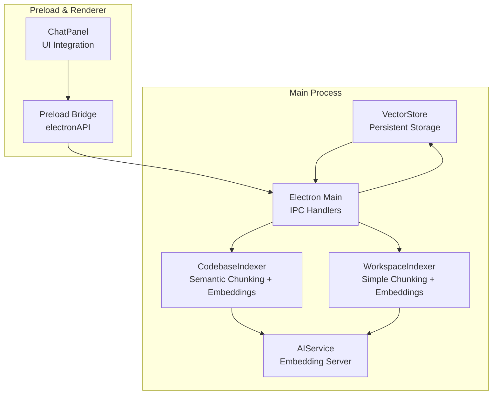
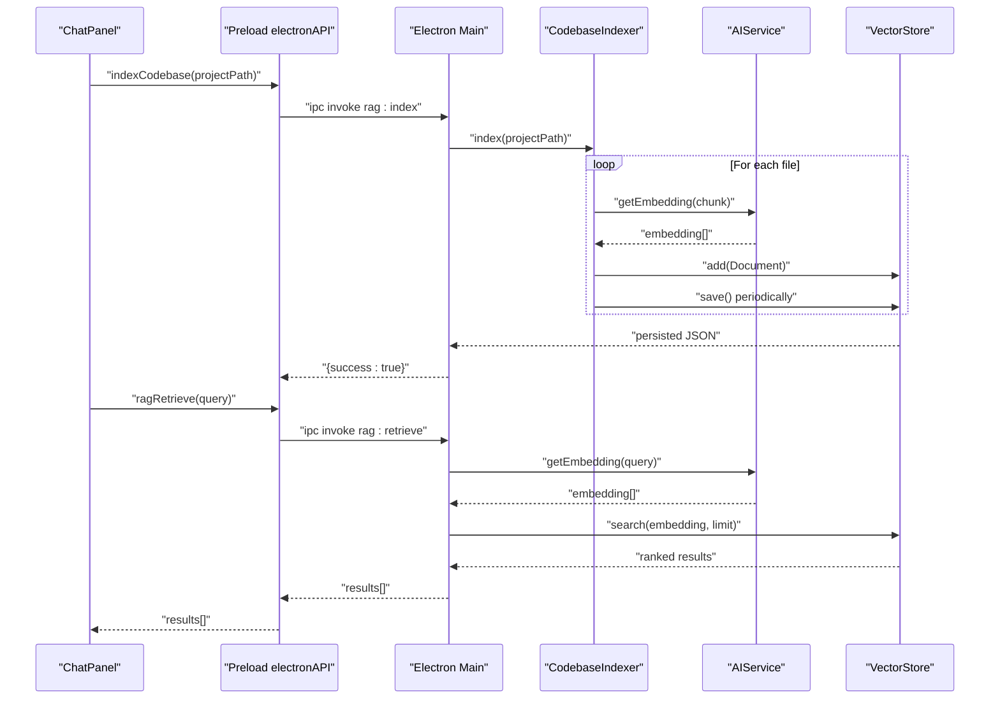
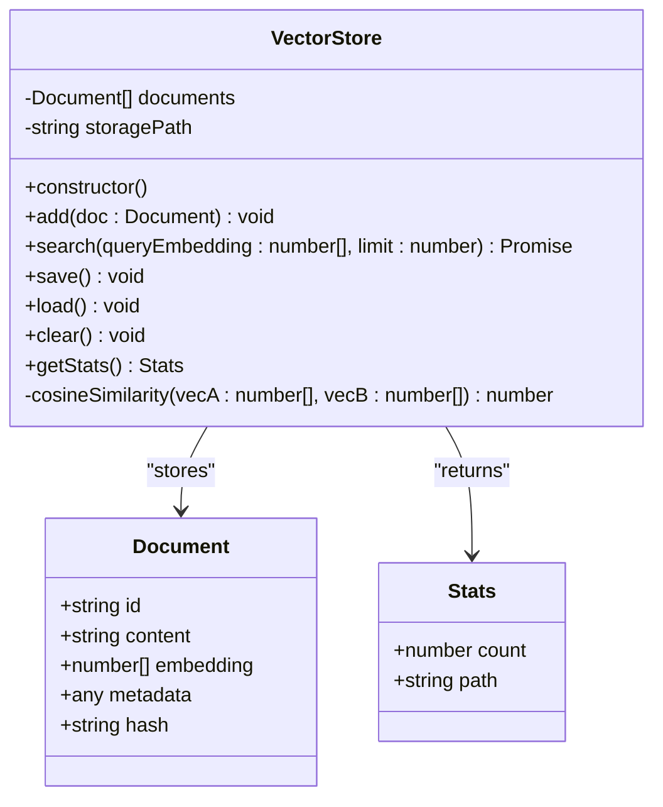
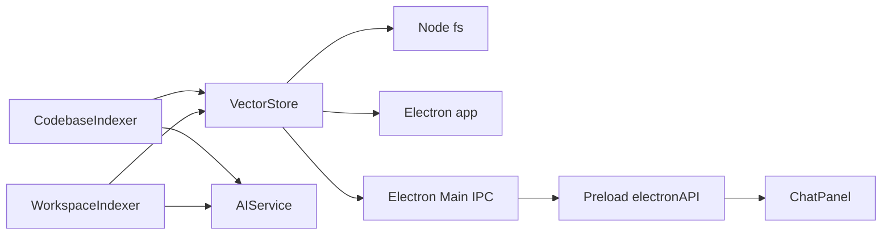

# Vector Store Implementation

<cite>
**Referenced Files in This Document**
- [vector-store.ts](file://src/main/rag/vector-store.ts)
- [indexer.ts](file://src/main/rag/indexer.ts)
- [workspace-indexer.ts](file://src/main/rag/workspace-indexer.ts)
- [ai-service.ts](file://src/main/ai-service.ts)
- [index.ts](file://src/main/index.ts)
- [index.ts](file://src/preload/index.ts)
- [ChatPanel.tsx](file://src/renderer/components/ChatPanel.tsx)
- [global.d.ts](file://src/renderer/types/global.d.ts)
</cite>

## Table of Contents
1. [Introduction](#introduction)
2. [Project Structure](#project-structure)
3. [Core Components](#core-components)
4. [Architecture Overview](#architecture-overview)
5. [Detailed Component Analysis](#detailed-component-analysis)
6. [Dependency Analysis](#dependency-analysis)
7. [Performance Considerations](#performance-considerations)
8. [Troubleshooting Guide](#troubleshooting-guide)
9. [Conclusion](#conclusion)
10. [Appendices](#appendices)

## Introduction
This document provides comprehensive documentation for the VectorStore class that powers persistent vector storage for the Retrieval-Augmented Generation (RAG) system. It explains the document structure, constructor initialization using Electron’s userData directory, insertion semantics, search mechanics with cosine similarity scoring, persistence via JSON storage, and utility methods for monitoring and maintenance. It also covers error handling, performance characteristics, configuration options, and practical examples for insertion, retrieval, and storage operations.

## Project Structure
The VectorStore resides in the RAG subsystem alongside indexing utilities and integrates with the AI service for embeddings. The main application initializes the VectorStore and exposes IPC endpoints for indexing and retrieval.

**Diagram sources**
- [vector-store.ts](file://src/main/rag/vector-store.ts#L1-L84)
- [indexer.ts](file://src/main/rag/indexer.ts#L1-L127)
- [workspace-indexer.ts](file://src/main/rag/workspace-indexer.ts#L1-L149)
- [ai-service.ts](file://src/main/ai-service.ts#L1-L323)
- [index.ts](file://src/main/index.ts#L498-L518)
- [index.ts](file://src/preload/index.ts#L105-L113)
- [ChatPanel.tsx](file://src/renderer/components/ChatPanel.tsx#L184-L252)

**Section sources**
- [vector-store.ts](file://src/main/rag/vector-store.ts#L1-L84)
- [index.ts](file://src/main/index.ts#L498-L518)

## Core Components
- VectorStore: In-memory document collection with JSON persistence, cosine similarity search, and utility methods.
- CodebaseIndexer: Scans a project, chunks content with semantic overlap, generates embeddings, and inserts documents.
- WorkspaceIndexer: Scans a workspace with simpler chunking, generates embeddings, and inserts documents.
- AIService: Provides embedding generation via a local server process.
- Electron Main IPC: Exposes indexing, retrieval, and status APIs to the renderer.

**Section sources**
- [vector-store.ts](file://src/main/rag/vector-store.ts#L13-L82)
- [indexer.ts](file://src/main/rag/indexer.ts#L7-L126)
- [workspace-indexer.ts](file://src/main/rag/workspace-indexer.ts#L12-L147)
- [ai-service.ts](file://src/main/ai-service.ts#L12-L322)
- [index.ts](file://src/main/index.ts#L498-L518)

## Architecture Overview
The RAG pipeline integrates file indexing, embedding generation, vector storage, and retrieval.

**Diagram sources**
- [ChatPanel.tsx](file://src/renderer/components/ChatPanel.tsx#L184-L252)
- [index.ts](file://src/main/index.ts#L501-L518)
- [indexer.ts](file://src/main/rag/indexer.ts#L18-L73)
- [ai-service.ts](file://src/main/ai-service.ts#L147-L188)
- [vector-store.ts](file://src/main/rag/vector-store.ts#L23-L38)

## Detailed Component Analysis

### VectorStore Class
The VectorStore manages an in-memory array of documents and persists them to a JSON file in the Electron userData directory. It supports adding documents (deduplicating by id), searching with cosine similarity, saving/loading, clearing, and statistics.

**Diagram sources**
- [vector-store.ts](file://src/main/rag/vector-store.ts#L5-L11)
- [vector-store.ts](file://src/main/rag/vector-store.ts#L13-L82)

Key behaviors:
- Constructor initializes storagePath under Electron’s userData and loads persisted data.
- add removes existing documents with the same id before pushing the new document.
- search computes cosine similarity for all stored embeddings, sorts by score descending, and slices to limit.
- save writes the entire documents array to JSON; load parses JSON and handles parse errors by resetting to empty.
- clear resets memory and persists an empty store.
- getStats returns document count and storage path.
- cosineSimilarity computes dot product and L2 norms across vectors.

**Section sources**
- [vector-store.ts](file://src/main/rag/vector-store.ts#L17-L21)
- [vector-store.ts](file://src/main/rag/vector-store.ts#L23-L27)
- [vector-store.ts](file://src/main/rag/vector-store.ts#L29-L38)
- [vector-store.ts](file://src/main/rag/vector-store.ts#L40-L58)
- [vector-store.ts](file://src/main/rag/vector-store.ts#L60-L70)
- [vector-store.ts](file://src/main/rag/vector-store.ts#L72-L82)

### Document Structure
Each stored document includes:
- id: Unique identifier (e.g., file path plus chunk index).
- content: Text chunk used for embedding and later display.
- embedding: Numeric vector produced by the AI service.
- metadata: Arbitrary structured data (e.g., path and chunk index).
- hash: Content hash for duplicate detection.

These fields enable efficient indexing, deduplication, and contextual retrieval.

**Section sources**
- [vector-store.ts](file://src/main/rag/vector-store.ts#L5-L11)
- [indexer.ts](file://src/main/rag/indexer.ts#L47-L53)
- [workspace-indexer.ts](file://src/main/rag/workspace-indexer.ts#L93-L99)

### Constructor Initialization and Persistence Location
- The storage path is derived from Electron’s userData directory and defaults to a rag-store.json filename.
- On construction, the store attempts to load persisted data; if the file does not exist, it starts with an empty store.

Storage location:
- Platform-specific userData directory ensures per-user persistence.

**Section sources**
- [vector-store.ts](file://src/main/rag/vector-store.ts#L17-L21)

### Add Method and Duplicate Handling
- The add method filters out any existing document with the same id before pushing the new document.
- This guarantees idempotent insertion and prevents duplication.

Practical impact:
- Re-indexing a previously indexed file updates the stored chunk if ids collide.

**Section sources**
- [vector-store.ts](file://src/main/rag/vector-store.ts#L23-L27)

### Search Method and Cosine Similarity
- search computes a score for each stored document by comparing its embedding with the query embedding.
- Results are sorted by score descending and sliced to the requested limit.

Cosine similarity algorithm:
- Computes dot product of vectors and divides by the product of their L2 norms.
- The implementation iterates across all dimensions, accumulating products and squared magnitudes.

Performance characteristics:
- O(n) per query where n is the number of stored documents.
- Suitable for small-to-medium corpora; consider indexing or approximate nearest neighbor strategies for large-scale deployments.

**Section sources**
- [vector-store.ts](file://src/main/rag/vector-store.ts#L29-L38)
- [vector-store.ts](file://src/main/rag/vector-store.ts#L72-L82)

### Persistence Mechanism (Save and Load)
- save writes the entire documents array to the JSON file synchronously.
- load checks for the existence of the file, reads and parses JSON, and logs errors by resetting to empty.

Error handling:
- File write/read failures are caught and logged; the store remains functional but may lose persistence until successful.

**Section sources**
- [vector-store.ts](file://src/main/rag/vector-store.ts#L40-L58)

### Utility Methods
- clear empties the in-memory store and persists immediately.
- getStats returns the current document count and storage path for monitoring.

**Section sources**
- [vector-store.ts](file://src/main/rag/vector-store.ts#L60-L70)

### Indexers and Embedding Integration
- CodebaseIndexer and WorkspaceIndexer generate embeddings for text chunks and insert them into VectorStore.
- They periodically save the store to avoid data loss during long indexing sessions.

Embedding generation:
- AIService provides an embedding endpoint; the indexers await embeddings and insert only when valid.

**Section sources**
- [indexer.ts](file://src/main/rag/indexer.ts#L18-L73)
- [workspace-indexer.ts](file://src/main/rag/workspace-indexer.ts#L47-L125)
- [ai-service.ts](file://src/main/ai-service.ts#L147-L188)

### Frontend Integration
- Preload exposes RAG IPC methods to the renderer.
- ChatPanel triggers indexing and retrieval, displaying results in the chat context.

**Section sources**
- [index.ts](file://src/preload/index.ts#L105-L113)
- [ChatPanel.tsx](file://src/renderer/components/ChatPanel.tsx#L184-L252)
- [global.d.ts](file://src/renderer/types/global.d.ts#L67-L71)

## Dependency Analysis
VectorStore depends on Electron’s app.getPath for storage location and uses Node.js fs for persistence. It integrates with AIService for embeddings and is orchestrated by Electron Main IPC handlers.

**Diagram sources**
- [vector-store.ts](file://src/main/rag/vector-store.ts#L1-L3)
- [index.ts](file://src/main/index.ts#L498-L518)
- [index.ts](file://src/preload/index.ts#L105-L113)
- [ChatPanel.tsx](file://src/renderer/components/ChatPanel.tsx#L184-L252)
- [indexer.ts](file://src/main/rag/indexer.ts#L4-L5)
- [workspace-indexer.ts](file://src/main/rag/workspace-indexer.ts#L3-L5)
- [ai-service.ts](file://src/main/ai-service.ts#L1-L10)

**Section sources**
- [vector-store.ts](file://src/main/rag/vector-store.ts#L1-L3)
- [index.ts](file://src/main/index.ts#L498-L518)
- [index.ts](file://src/preload/index.ts#L105-L113)
- [ChatPanel.tsx](file://src/renderer/components/ChatPanel.tsx#L184-L252)
- [indexer.ts](file://src/main/rag/indexer.ts#L4-L5)
- [workspace-indexer.ts](file://src/main/rag/workspace-indexer.ts#L3-L5)
- [ai-service.ts](file://src/main/ai-service.ts#L1-L10)

## Performance Considerations
- Search complexity: O(n) per query; consider batching or approximate nearest neighbor libraries for large corpora.
- Persistence frequency: Indexers save periodically to reduce risk of data loss; adjust save cadence based on indexing volume.
- Embedding cost: Generating embeddings is CPU-bound; ensure adequate threads and context size in AIService configuration.
- Memory footprint: Documents are held in memory; monitor with getStats and consider eviction policies for large datasets.

[No sources needed since this section provides general guidance]

## Troubleshooting Guide
Common issues and resolutions:
- Storage file corruption: If JSON parsing fails during load, the store resets to empty. Verify file integrity or remove the corrupted file to recover.
- Permission errors: Ensure the userData directory is writable; Electron app.getPath resolves to a valid path per platform.
- Missing embeddings: If AIService is not running, embedding requests fail; confirm server health and port availability.
- Slow search: For large stores, consider reducing stored documents or implementing indexing strategies.

**Section sources**
- [vector-store.ts](file://src/main/rag/vector-store.ts#L48-L58)
- [ai-service.ts](file://src/main/ai-service.ts#L117-L144)

## Conclusion
VectorStore provides a lightweight, persistent vector store suitable for local RAG applications. Its simple document model, deterministic persistence, and straightforward search make it easy to integrate with embedding pipelines. For production workloads, consider scaling strategies such as periodic compaction, approximate retrieval, and optimized embedding generation.

[No sources needed since this section summarizes without analyzing specific files]

## Appendices

### Examples

- Insertion
  - Use an indexer to generate embeddings and add documents to VectorStore.
  - Example paths:
    - [indexer.ts](file://src/main/rag/indexer.ts#L47-L54)
    - [workspace-indexer.ts](file://src/main/rag/workspace-indexer.ts#L93-L99)

- Search
  - Retrieve embeddings for a query, then call search with a limit.
  - Example paths:
    - [ai-service.ts](file://src/main/ai-service.ts#L147-L188)
    - [vector-store.ts](file://src/main/rag/vector-store.ts#L29-L38)
    - [index.ts](file://src/main/index.ts#L513-L518)

- Storage Operations
  - Save after batch insertions or periodically during indexing.
  - Clear to reset the store.
  - Get stats for monitoring.
  - Example paths:
    - [indexer.ts](file://src/main/rag/indexer.ts#L63-L65)
    - [workspace-indexer.ts](file://src/main/rag/workspace-indexer.ts#L106-L108)
    - [vector-store.ts](file://src/main/rag/vector-store.ts#L40-L46)
    - [vector-store.ts](file://src/main/rag/vector-store.ts#L60-L70)

### Configuration Options
- Storage location: Controlled by Electron’s userData directory; default filename is rag-store.json.
- Embedding server: Configured via AIService with parameters such as context size, threads, and port.
- Indexing behavior: Indexers chunk text differently (semantic vs. sliding window) and filter file sizes and extensions.

**Section sources**
- [vector-store.ts](file://src/main/rag/vector-store.ts#L17-L21)
- [ai-service.ts](file://src/main/ai-service.ts#L19-L89)
- [indexer.ts](file://src/main/rag/indexer.ts#L81-L108)
- [workspace-indexer.ts](file://src/main/rag/workspace-indexer.ts#L22-L45)