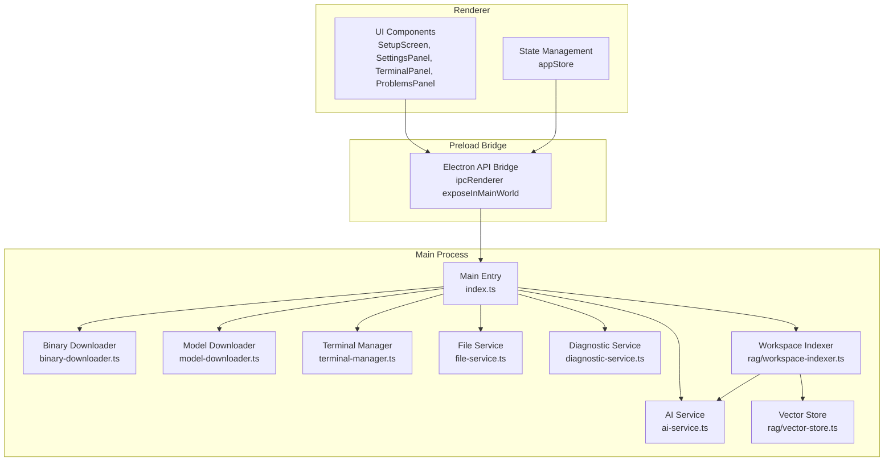
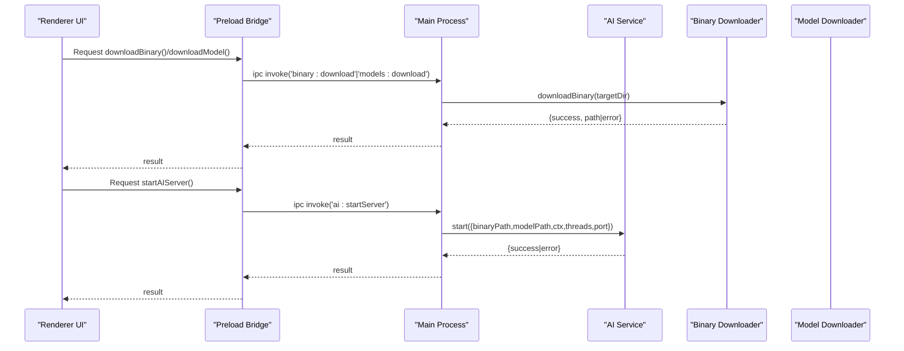
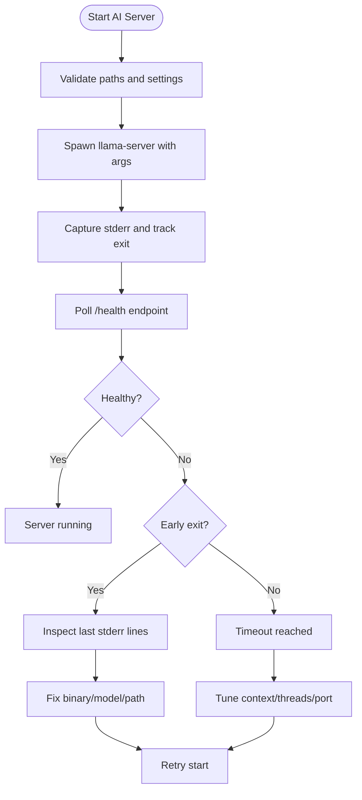
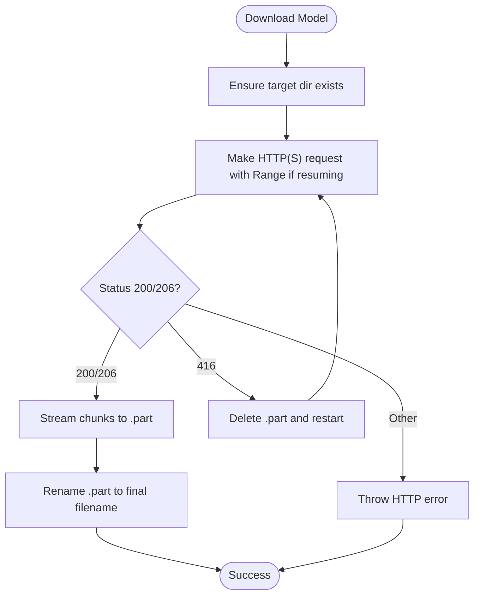
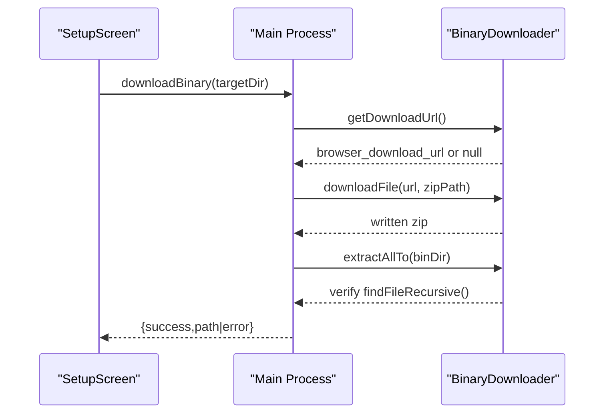
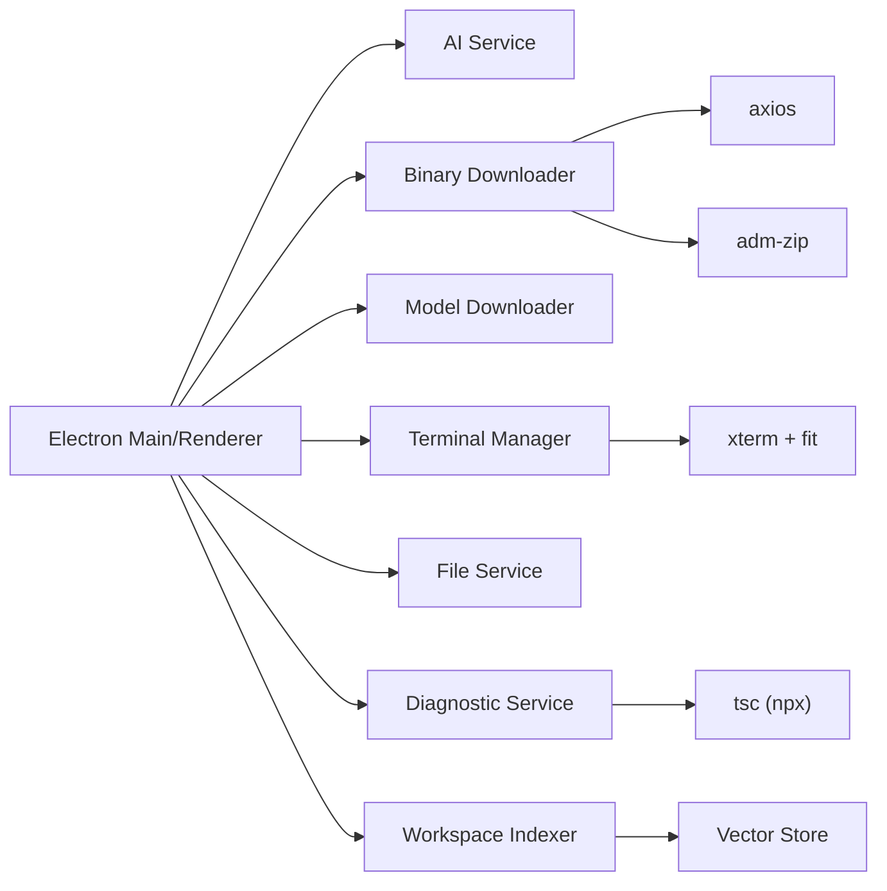

# Troubleshooting & FAQ

<cite>
**Referenced Files in This Document**
- [README.md](file://README.md)
- [src/main/index.ts](file://src/main/index.ts)
- [src/main/ai-service.ts](file://src/main/ai-service.ts)
- [src/main/model-downloader.ts](file://src/main/model-downloader.ts)
- [src/main/binary-downloader.ts](file://src/main/binary-downloader.ts)
- [src/main/diagnostic-service.ts](file://src/main/diagnostic-service.ts)
- [src/main/terminal-manager.ts](file://src/main/terminal-manager.ts)
- [src/main/file-service.ts](file://src/main/file-service.ts)
- [src/main/rag/workspace-indexer.ts](file://src/main/rag/workspace-indexer.ts)
- [src/main/rag/vector-store.ts](file://src/main/rag/vector-store.ts)
- [src/preload/index.ts](file://src/preload/index.ts)
- [src/renderer/components/SetupScreen.tsx](file://src/renderer/components/SetupScreen.tsx)
- [src/renderer/store/appStore.tsx](file://src/renderer/store/appStore.tsx)
- [package.json](file://package.json)
</cite>

## Table of Contents
1. [Introduction](#introduction)
2. [Project Structure](#project-structure)
3. [Core Components](#core-components)
4. [Architecture Overview](#architecture-overview)
5. [Detailed Component Analysis](#detailed-component-analysis)
6. [Dependency Analysis](#dependency-analysis)
7. [Performance Considerations](#performance-considerations)
8. [Troubleshooting Guide](#troubleshooting-guide)
9. [FAQ](#faq)
10. [Logging and Diagnostics](#logging-and-diagnostics)
11. [Escalation and Community Support](#escalation-and-community-support)
12. [Conclusion](#conclusion)

## Introduction
This document provides comprehensive troubleshooting guidance for BitNet IDE, focusing on setup, runtime, diagnostics, platform-specific issues, and performance tuning. It consolidates actionable steps, diagnostic procedures, and solutions derived from the application’s main process modules, preload bridge, renderer components, and configuration.

## Project Structure
BitNet IDE is an Electron application with a clear separation between main process (AI service, downloads, filesystem, terminal, RAG), preload bridge, and renderer UI. The renderer includes a guided Setup Screen and state management for settings, downloads, and UI panels.

**Diagram sources**
- [src/renderer/components/SetupScreen.tsx](file://src/renderer/components/SetupScreen.tsx#L1-L357)
- [src/renderer/store/appStore.tsx](file://src/renderer/store/appStore.tsx#L1-L357)
- [src/preload/index.ts](file://src/preload/index.ts#L1-L120)
- [src/main/index.ts](file://src/main/index.ts#L1-L542)
- [src/main/ai-service.ts](file://src/main/ai-service.ts#L1-L323)
- [src/main/binary-downloader.ts](file://src/main/binary-downloader.ts#L1-L162)
- [src/main/model-downloader.ts](file://src/main/model-downloader.ts#L1-L483)
- [src/main/terminal-manager.ts](file://src/main/terminal-manager.ts#L1-L111)
- [src/main/file-service.ts](file://src/main/file-service.ts#L1-L162)
- [src/main/diagnostic-service.ts](file://src/main/diagnostic-service.ts#L1-L65)
- [src/main/rag/workspace-indexer.ts](file://src/main/rag/workspace-indexer.ts#L1-L149)
- [src/main/rag/vector-store.ts](file://src/main/rag/vector-store.ts#L1-L84)

**Section sources**
- [README.md](file://README.md#L59-L87)
- [src/main/index.ts](file://src/main/index.ts#L1-L542)
- [src/preload/index.ts](file://src/preload/index.ts#L1-L120)

## Core Components
- AI Service: Manages llama-server lifecycle, health checks, embedding requests, and chat endpoints.
- Binary Downloader: Fetches and extracts llama-server binaries from GitHub releases.
- Model Downloader: Downloads GGUF models from curated lists and supports cancellation and scanning.
- Terminal Manager: Spawns OS-native shells, streams output, and handles exits.
- File Service: Reads/writes files, scans directories, and integrates with git status.
- Diagnostic Service: Runs TypeScript compiler diagnostics for codebases.
- RAG Indexer and Vector Store: Builds and persists embeddings for workspace search.

**Section sources**
- [src/main/ai-service.ts](file://src/main/ai-service.ts#L1-L323)
- [src/main/binary-downloader.ts](file://src/main/binary-downloader.ts#L1-L162)
- [src/main/model-downloader.ts](file://src/main/model-downloader.ts#L1-L483)
- [src/main/terminal-manager.ts](file://src/main/terminal-manager.ts#L1-L111)
- [src/main/file-service.ts](file://src/main/file-service.ts#L1-L162)
- [src/main/diagnostic-service.ts](file://src/main/diagnostic-service.ts#L1-L65)
- [src/main/rag/workspace-indexer.ts](file://src/main/rag/workspace-indexer.ts#L1-L149)
- [src/main/rag/vector-store.ts](file://src/main/rag/vector-store.ts#L1-L84)

## Architecture Overview
The renderer invokes preload APIs, which route to main-process handlers. These handlers coordinate services for AI, downloads, terminals, and RAG.

**Diagram sources**
- [src/preload/index.ts](file://src/preload/index.ts#L75-L82)
- [src/main/index.ts](file://src/main/index.ts#L444-L451)
- [src/main/binary-downloader.ts](file://src/main/binary-downloader.ts#L17-L76)
- [src/main/index.ts](file://src/main/index.ts#L274-L286)
- [src/main/ai-service.ts](file://src/main/ai-service.ts#L19-L89)

**Section sources**
- [src/preload/index.ts](file://src/preload/index.ts#L1-L120)
- [src/main/index.ts](file://src/main/index.ts#L116-L323)

## Detailed Component Analysis

### AI Service Troubleshooting
Common symptoms:
- Server fails to start within timeout
- Health check fails
- Embedding or chat endpoints return errors
- Early process exit with non-zero code

Diagnostic steps:
- Verify binary path and model path are set before starting.
- Confirm llama-server binary resides in the expected location and is executable.
- Check that the model file exists and is a valid GGUF file.
- Review stderr captured during startup for immediate failure reasons.
- Validate port availability and host binding to loopback address.

Resolution tips:
- Increase context size and thread counts gradually to fit hardware limits.
- Disable embedding endpoint if not needed to reduce startup overhead.
- Ensure antivirus or OS policies do not block binary execution.

**Diagram sources**
- [src/main/ai-service.ts](file://src/main/ai-service.ts#L19-L89)
- [src/main/ai-service.ts](file://src/main/ai-service.ts#L117-L145)

**Section sources**
- [src/main/ai-service.ts](file://src/main/ai-service.ts#L1-L323)
- [src/main/index.ts](file://src/main/index.ts#L274-L286)

### Model Download Troubleshooting
Common symptoms:
- Download stuck at 0%
- Interrupted or corrupted partial file
- Too many redirects or HTTP errors
- Range request failures

Diagnostic steps:
- Confirm target directory exists and is writable.
- Check network connectivity and proxy settings.
- Inspect progress events and speeds reported by the downloader.
- Validate that the model filename matches expectations.

Resolution tips:
- Cancel and restart download to rebuild partial file.
- Retry with a different mirror or model variant.
- Ensure sufficient disk space and remove stale .part files if present.

**Diagram sources**
- [src/main/model-downloader.ts](file://src/main/model-downloader.ts#L356-L472)

**Section sources**
- [src/main/model-downloader.ts](file://src/main/model-downloader.ts#L275-L303)
- [src/main/model-downloader.ts](file://src/main/model-downloader.ts#L356-L472)

### Binary Download Troubleshooting
Common symptoms:
- Release API unavailable or returns unexpected assets
- Binary not found after extraction
- Extraction fails or permissions denied

Diagnostic steps:
- Verify temp directory and target bin directory permissions.
- Check extracted contents for expected binary name.
- Confirm platform-specific binary selection (Windows vs Unix).

Resolution tips:
- Try alternate release URLs if primary fails.
- Manually place the correct binary under the bin subdirectory.
- Ensure no conflicting DLLs in the binary directory.

**Diagram sources**
- [src/renderer/components/SetupScreen.tsx](file://src/renderer/components/SetupScreen.tsx#L78-L98)
- [src/main/binary-downloader.ts](file://src/main/binary-downloader.ts#L17-L76)
- [src/main/binary-downloader.ts](file://src/main/binary-downloader.ts#L100-L129)

**Section sources**
- [src/main/binary-downloader.ts](file://src/main/binary-downloader.ts#L1-L162)
- [src/renderer/components/SetupScreen.tsx](file://src/renderer/components/SetupScreen.tsx#L1-L357)

### Terminal Session Failures
Common symptoms:
- Terminal fails to spawn
- No output or colored stderr
- Shell detection incorrect on platforms

Diagnostic steps:
- Confirm shell path or auto-detected shell is available.
- Check working directory existence and permissions.
- Validate environment variables (TERM) and normalization of line endings.

Resolution tips:
- Use detected shells for the platform (PowerShell on Windows, bash/zsh on Unix).
- Ensure execution policy allows script execution on Windows.
- Avoid resizing for spawn-based terminals; use PTY-capable terminals if needed.

**Section sources**
- [src/main/terminal-manager.ts](file://src/main/terminal-manager.ts#L24-L75)
- [src/main/terminal-manager.ts](file://src/main/terminal-manager.ts#L98-L110)

### File System Access Problems
Common symptoms:
- Directory scan returns empty or partial results
- File read/write fails with permission errors
- Git status not available

Diagnostic steps:
- Verify directory path exists and is readable.
- Check ignored directories and file filters.
- Confirm file encoding and line ending normalization.

Resolution tips:
- Adjust project path to a location with appropriate permissions.
- Exclude unnecessary directories in searches.
- Ensure git is installed and accessible in PATH.

**Section sources**
- [src/main/file-service.ts](file://src/main/file-service.ts#L59-L99)
- [src/main/file-service.ts](file://src/main/file-service.ts#L101-L117)
- [src/main/file-service.ts](file://src/main/file-service.ts#L30-L57)

### Diagnostic Service Issues
Common symptoms:
- Lint returns “Project path not found”
- Large project exceeds buffer limits

Diagnostic steps:
- Confirm project path exists and is passed correctly.
- Check tsc availability via npx and PATH resolution.

Resolution tips:
- Reduce project scope or exclude large directories.
- Ensure Node.js and TypeScript are installed.

**Section sources**
- [src/main/diagnostic-service.ts](file://src/main/diagnostic-service.ts#L17-L39)
- [src/main/diagnostic-service.ts](file://src/main/diagnostic-service.ts#L41-L63)

### RAG Indexing Problems
Common symptoms:
- Indexing fails silently
- No embeddings generated
- Large files skipped

Diagnostic steps:
- Ensure AI engine is running before indexing.
- Check file size thresholds and allowed extensions.
- Monitor progress events and save frequency.

Resolution tips:
- Start AI server before initiating index.
- Split large files or adjust thresholds.
- Clear and rebuild vector store if corrupted.

**Section sources**
- [src/main/rag/workspace-indexer.ts](file://src/main/rag/workspace-indexer.ts#L47-L52)
- [src/main/rag/workspace-indexer.ts](file://src/main/rag/workspace-indexer.ts#L72-L113)
- [src/main/rag/vector-store.ts](file://src/main/rag/vector-store.ts#L40-L58)

## Dependency Analysis
Key runtime dependencies and their roles:
- Electron main process orchestrates services and IPC.
- Axios and AdmZip handle binary downloads and extraction.
- TypeScript compiler (tsc) powers diagnostics.
- xterm and xterm addons power terminal UX.

**Diagram sources**
- [package.json](file://package.json#L12-L33)
- [src/main/binary-downloader.ts](file://src/main/binary-downloader.ts#L1-L6)
- [src/main/diagnostic-service.ts](file://src/main/diagnostic-service.ts#L26-L32)
- [src/main/terminal-manager.ts](file://src/main/terminal-manager.ts#L1-L3)

**Section sources**
- [package.json](file://package.json#L1-L34)

## Performance Considerations
- Context size and threads: Lower values reduce memory usage; increase gradually until responsiveness degrades.
- Max tokens: Larger outputs increase latency; tune for desired trade-off.
- Temperature: Lower values improve determinism; higher values increase creativity.
- Disk I/O: Prefer SSD for models and cache; ensure adequate free space.
- CPU scheduling: Avoid heavy background tasks while streaming chat.
- Network: Model downloads benefit from stable connections; use wired Ethernet when possible.

[No sources needed since this section provides general guidance]

## Troubleshooting Guide

### Setup Failures
- Symptom: “Server binary or model path not configured” on start.
  - Cause: Missing settings for binary or model.
  - Resolution: Complete Setup Screen to select or download binary and model.

- Symptom: Binary not found after extraction.
  - Cause: Incorrect platform binary or wrong extraction path.
  - Resolution: Manually place the correct binary under the bin subdirectory.

- Symptom: Model download stuck or fails.
  - Cause: Network issues, redirects, or insufficient disk space.
  - Resolution: Cancel, retry, and ensure target directory is writable.

**Section sources**
- [src/main/index.ts](file://src/main/index.ts#L274-L286)
- [src/main/binary-downloader.ts](file://src/main/binary-downloader.ts#L47-L70)
- [src/main/model-downloader.ts](file://src/main/model-downloader.ts#L356-L472)

### Runtime Failures
- Symptom: AI server crashes immediately.
  - Cause: Invalid binary, missing DLLs, or incompatible CPU flags.
  - Resolution: Re-download binary, verify AV exclusions, and confirm CPU compatibility.

- Symptom: Health check times out.
  - Cause: Port conflict or slow boot on constrained hardware.
  - Resolution: Change port, reduce context size/threads, or wait longer.

- Symptom: Chat or embedding requests fail.
  - Cause: Server not running or malformed responses.
  - Resolution: Restart server, verify endpoint paths, and inspect network logs.

**Section sources**
- [src/main/ai-service.ts](file://src/main/ai-service.ts#L19-L89)
- [src/main/ai-service.ts](file://src/main/ai-service.ts#L117-L145)

### Terminal Issues
- Symptom: Terminal does not start.
  - Cause: Unavailable shell or insufficient permissions.
  - Resolution: Choose an available shell, fix permissions, and retry.

- Symptom: No output or garbled output.
  - Cause: Line ending normalization or TERM mismatch.
  - Resolution: Ensure TERM is set and normalize line endings.

**Section sources**
- [src/main/terminal-manager.ts](file://src/main/terminal-manager.ts#L24-L75)

### File System and Search
- Symptom: Directory scan returns nothing.
  - Cause: Wrong path or permission denied.
  - Resolution: Use a valid, accessible path and check permissions.

- Symptom: File write fails.
  - Cause: Missing parent directory or locked file.
  - Resolution: Create parent directories and ensure file is not locked.

**Section sources**
- [src/main/file-service.ts](file://src/main/file-service.ts#L59-L99)
- [src/main/file-service.ts](file://src/main/file-service.ts#L101-L117)

### Diagnostics and Lint
- Symptom: Lint reports “Project path not found.”
  - Cause: Invalid project directory.
  - Resolution: Select a valid project path and ensure tsc is available.

**Section sources**
- [src/main/diagnostic-service.ts](file://src/main/diagnostic-service.ts#L17-L20)

### RAG Indexing
- Symptom: No results from retrieval.
  - Cause: AI engine not running or empty vector store.
  - Resolution: Start AI server, re-index, and verify embeddings were created.

**Section sources**
- [src/main/rag/workspace-indexer.ts](file://src/main/rag/workspace-indexer.ts#L47-L52)
- [src/main/rag/vector-store.ts](file://src/main/rag/vector-store.ts#L40-L58)

## FAQ

- Is BitNet IDE fully offline?
  - Yes, all inference runs locally via llama-server with zero internet required after initial setup.

- Can I use my own model?
  - Yes, choose an existing model file or download a compatible GGUF model.

- How do I change threads, context size, and tokens?
  - Use the Settings panel to adjust threads, context size, max tokens, and temperature.

- Why does the AI panel show disconnected?
  - Ensure the AI server is started and healthy; check logs for startup errors.

- How do I report issues?
  - Collect logs from the main process and renderer, reproduce steps, and open an issue with environment details.

**Section sources**
- [README.md](file://README.md#L9-L18)
- [src/renderer/components/SettingsPanel.tsx](file://src/renderer/components/SettingsPanel.tsx#L366-L426)

## Logging and Diagnostics
- Main process logs:
  - Console output from AI service, binary/model downloads, and terminal sessions.
  - Health check polling and error messages are logged during startup.

- Renderer logs:
  - UI actions and IPC invocations are visible in the developer console.
  - Progress events for downloads and terminal output are emitted to the UI.

- Where to find diagnostic information:
  - Application user data directory for vector store persistence and logs.
  - Console output from the main process window and developer tools.

**Section sources**
- [src/main/ai-service.ts](file://src/main/ai-service.ts#L46-L54)
- [src/main/binary-downloader.ts](file://src/main/binary-downloader.ts#L67-L69)
- [src/main/model-downloader.ts](file://src/main/model-downloader.ts#L447-L456)

## Escalation and Community Support
- Before filing an issue:
  - Reproduce with default settings and minimal project.
  - Collect logs and environment details (OS, CPU, RAM, disk).
  - Verify antivirus and firewall are not blocking the binary.

- Where to get help:
  - GitHub Issues for bug reports and feature requests.
  - Discussions for usage questions and troubleshooting tips.

**Section sources**
- [README.md](file://README.md#L59-L87)

## Conclusion
By following the structured troubleshooting steps, leveraging the diagnostic tools, and adjusting performance settings, most BitNet IDE issues can be resolved quickly. Use the provided logging and escalation procedures to efficiently gather evidence and engage with the community for further assistance.