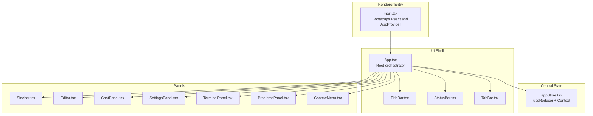
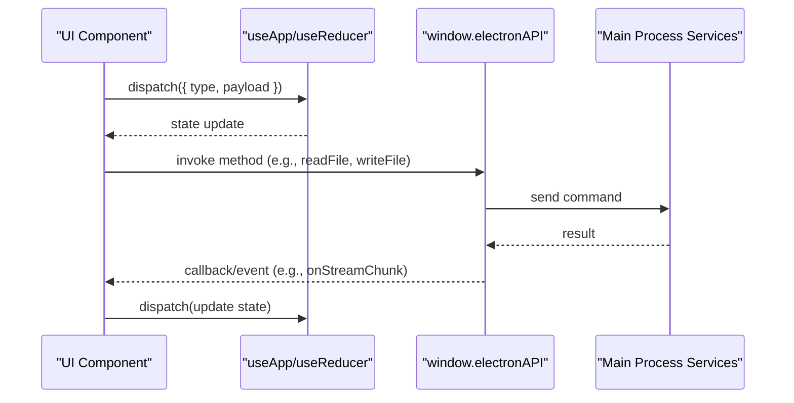
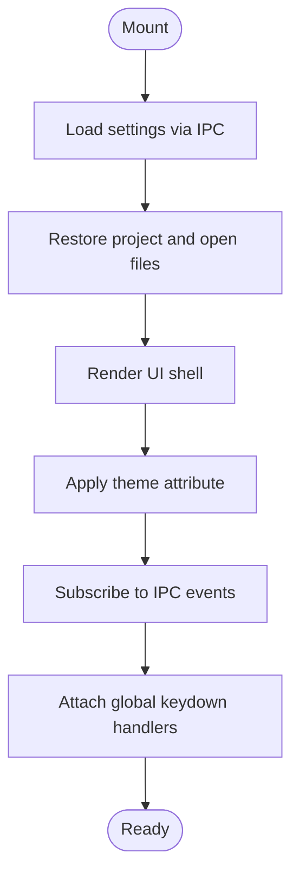
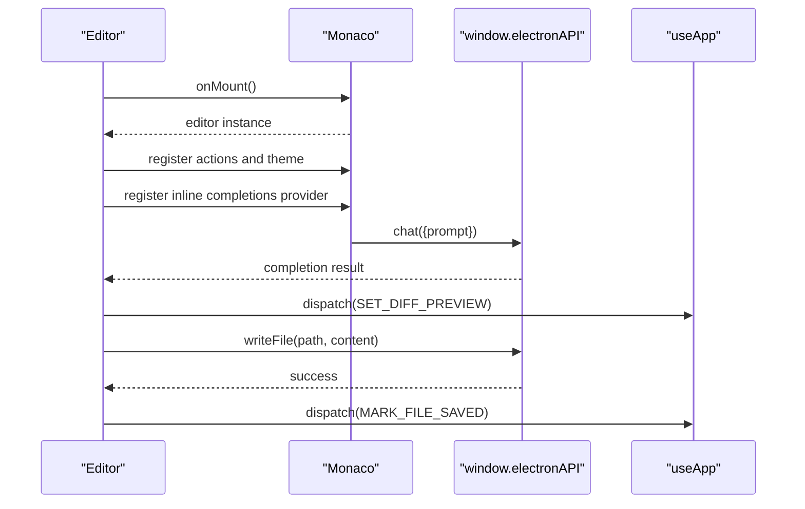
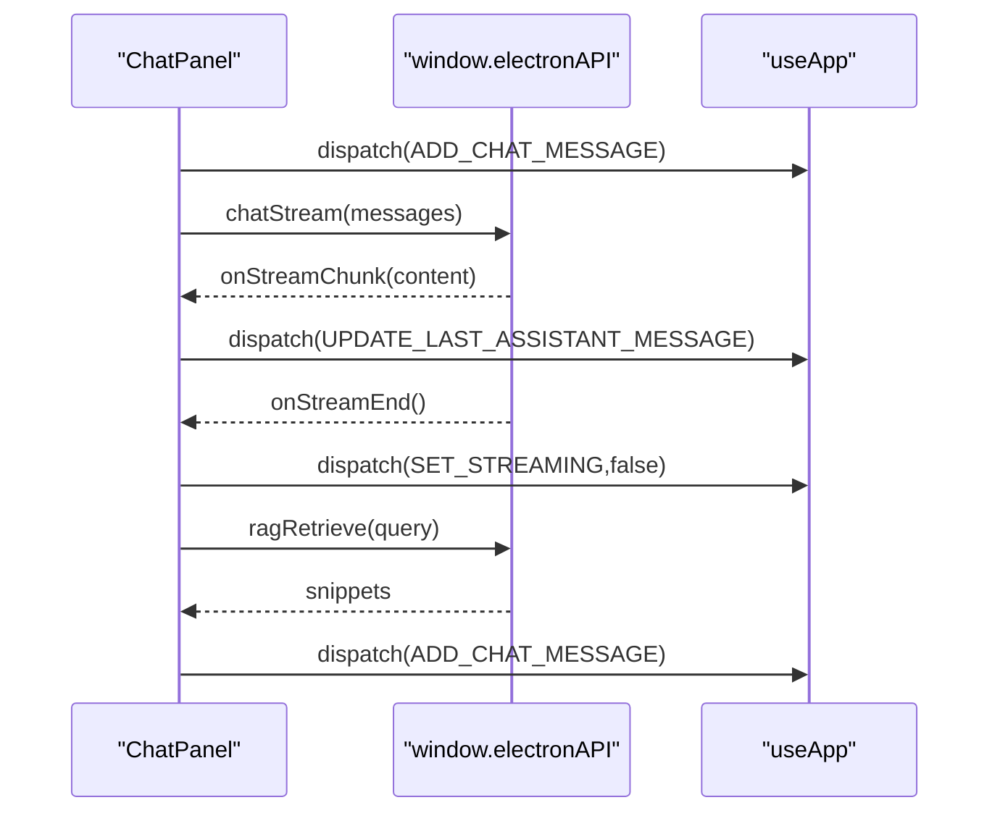
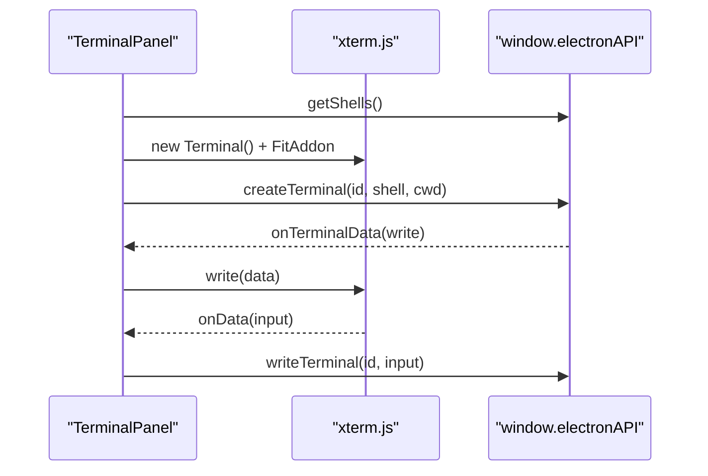
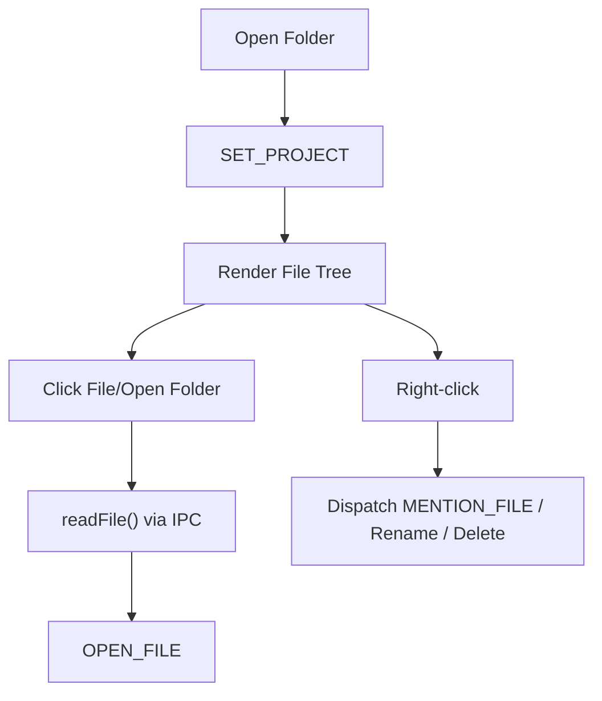
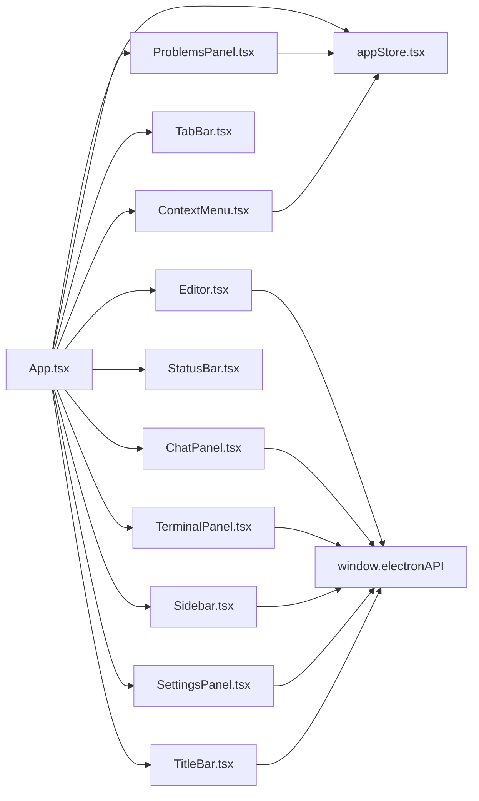
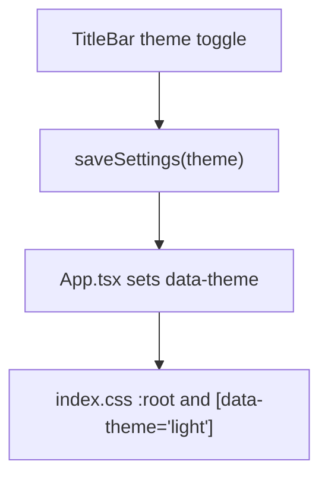

# User Interface Components

<cite>
**Referenced Files in This Document**
- [App.tsx](file://src/renderer/App.tsx)
- [main.tsx](file://src/renderer/main.tsx)
- [appStore.tsx](file://src/renderer/store/appStore.tsx)
- [index.css](file://src/renderer/index.css)
- [global.d.ts](file://src/renderer/types/global.d.ts)
- [Editor.tsx](file://src/renderer/components/Editor.tsx)
- [ChatPanel.tsx](file://src/renderer/components/ChatPanel.tsx)
- [TerminalPanel.tsx](file://src/renderer/components/TerminalPanel.tsx)
- [Sidebar.tsx](file://src/renderer/components/Sidebar.tsx)
- [TabBar.tsx](file://src/renderer/components/TabBar.tsx)
- [StatusBar.tsx](file://src/renderer/components/StatusBar.tsx)
- [SettingsPanel.tsx](file://src/renderer/components/SettingsPanel.tsx)
- [TitleBar.tsx](file://src/renderer/components/TitleBar.tsx)
- [ContextMenu.tsx](file://src/renderer/components/ContextMenu.tsx)
- [ProblemsPanel.tsx](file://src/renderer/components/ProblemsPanel.tsx)
</cite>

## Table of Contents
1. [Introduction](#introduction)
2. [Project Structure](#project-structure)
3. [Core Components](#core-components)
4. [Architecture Overview](#architecture-overview)
5. [Detailed Component Analysis](#detailed-component-analysis)
6. [Dependency Analysis](#dependency-analysis)
7. [Performance Considerations](#performance-considerations)
8. [Troubleshooting Guide](#troubleshooting-guide)
9. [Conclusion](#conclusion)
10. [Appendices](#appendices)

## Introduction
This document explains BitNet IDE’s React-based user interface component system. It covers the hierarchical component structure starting from the root App component, the state management approach using a Context API with useReducer pattern, and the integration with Electron main-process services via IPC. It also documents theming, accessibility, performance, and customization options.

## Project Structure
The renderer-side UI is organized around a single-page application with a central App component orchestrating panels and views. State is managed centrally via a Redux-like reducer pattern wrapped in a React Context. Styling leverages CSS custom properties for theme switching and consistent design tokens.



**Diagram sources**
- [main.tsx](file://src/renderer/main.tsx#L12-L18)
- [appStore.tsx](file://src/renderer/store/appStore.tsx#L343-L356)
- [App.tsx](file://src/renderer/App.tsx#L17-L291)
- [TitleBar.tsx](file://src/renderer/components/TitleBar.tsx#L1-L67)
- [StatusBar.tsx](file://src/renderer/components/StatusBar.tsx#L1-L47)
- [TabBar.tsx](file://src/renderer/components/TabBar.tsx#L1-L34)
- [Sidebar.tsx](file://src/renderer/components/Sidebar.tsx#L1-L441)
- [Editor.tsx](file://src/renderer/components/Editor.tsx#L1-L372)
- [ChatPanel.tsx](file://src/renderer/components/ChatPanel.tsx#L1-L1021)
- [SettingsPanel.tsx](file://src/renderer/components/SettingsPanel.tsx#L1-L427)
- [TerminalPanel.tsx](file://src/renderer/components/TerminalPanel.tsx#L1-L312)
- [ProblemsPanel.tsx](file://src/renderer/components/ProblemsPanel.tsx#L1-L74)
- [ContextMenu.tsx](file://src/renderer/components/ContextMenu.tsx#L1-L32)

**Section sources**
- [main.tsx](file://src/renderer/main.tsx#L1-L19)
- [App.tsx](file://src/renderer/App.tsx#L17-L291)
- [appStore.tsx](file://src/renderer/store/appStore.tsx#L343-L356)

## Core Components
- App: Orchestrates UI layout, lifecycle hooks, keyboard shortcuts, theme application, and IPC subscriptions. Renders the shell and overlays.
- Editor: Monaco-based editor with inline autocomplete, AI actions, and theme-aware rendering.
- ChatPanel: AI chat with streaming, file mention insertion, RAG retrieval, and file action application.
- TerminalPanel: xterm.js terminal with multiple sessions, split mode, and selection-to-chat integration.
- Sidebar: File explorer with search, create/rename/delete, and Git status indicators.
- TabBar: Open file tabs with dirty indicators and close actions.
- StatusBar: AI connection status, project info, and active file metadata.
- SettingsPanel: Model configuration, model manager, inference tuning, and theme selection.
- TitleBar: Window controls, theme toggle, and IDE menu.
- ContextMenu: Generic context menu overlay.
- ProblemsPanel: Workspace diagnostics grouped by file.

**Section sources**
- [App.tsx](file://src/renderer/App.tsx#L17-L291)
- [Editor.tsx](file://src/renderer/components/Editor.tsx#L1-L372)
- [ChatPanel.tsx](file://src/renderer/components/ChatPanel.tsx#L1-L1021)
- [TerminalPanel.tsx](file://src/renderer/components/TerminalPanel.tsx#L1-L312)
- [Sidebar.tsx](file://src/renderer/components/Sidebar.tsx#L1-L441)
- [TabBar.tsx](file://src/renderer/components/TabBar.tsx#L1-L34)
- [StatusBar.tsx](file://src/renderer/components/StatusBar.tsx#L1-L47)
- [SettingsPanel.tsx](file://src/renderer/components/SettingsPanel.tsx#L1-L427)
- [TitleBar.tsx](file://src/renderer/components/TitleBar.tsx#L1-L67)
- [ContextMenu.tsx](file://src/renderer/components/ContextMenu.tsx#L1-L32)
- [ProblemsPanel.tsx](file://src/renderer/components/ProblemsPanel.tsx#L1-L74)

## Architecture Overview
The UI follows a unidirectional data flow:
- Centralized state via useReducer in AppProvider
- Components subscribe via useApp and dispatch actions
- IPC bridges connect UI to main-process services
- Theming applied via CSS custom properties and runtime attribute



**Diagram sources**
- [appStore.tsx](file://src/renderer/store/appStore.tsx#L176-L335)
- [global.d.ts](file://src/renderer/types/global.d.ts#L4-L76)
- [App.tsx](file://src/renderer/App.tsx#L26-L155)
- [Editor.tsx](file://src/renderer/components/Editor.tsx#L113-L127)
- [ChatPanel.tsx](file://src/renderer/components/ChatPanel.tsx#L90-L105)

## Detailed Component Analysis

### App.tsx: Root Orchestrator
- Manages bottom panel tabs and maximization state
- Initializes settings/session, restores open files, and persists session
- Applies theme via data attribute on document element
- Subscribes to IPC events for downloads and AI streaming
- Implements global keyboard shortcuts
- Renders shell and overlays (Settings, Command Palette, Diff Preview, Context Menu)



**Diagram sources**
- [App.tsx](file://src/renderer/App.tsx#L42-L117)
- [App.tsx](file://src/renderer/App.tsx#L138-L155)
- [App.tsx](file://src/renderer/App.tsx#L184-L227)

**Section sources**
- [App.tsx](file://src/renderer/App.tsx#L17-L291)

### Editor.tsx: Code Editing Experience
- Integrates Monaco Editor with custom themes per OS theme
- Registers AI actions (Explain, Refactor, Edit) and keyboard shortcuts
- Implements inline autocomplete provider with debounced requests
- Saves edits via IPC and updates file tree and problems
- Provides EditPalette for targeted code edits



**Diagram sources**
- [Editor.tsx](file://src/renderer/components/Editor.tsx#L21-L260)
- [Editor.tsx](file://src/renderer/components/Editor.tsx#L268-L310)
- [Editor.tsx](file://src/renderer/components/Editor.tsx#L113-L127)

**Section sources**
- [Editor.tsx](file://src/renderer/components/Editor.tsx#L1-L372)

### ChatPanel.tsx: AI Assistant
- Streams assistant responses via IPC callbacks
- Supports file mention insertion and RAG retrieval
- Manages file actions (create/edit/delete/patch) and applies them via IPC
- Allows model switching and indexing
- Provides quick actions and project analysis



**Diagram sources**
- [ChatPanel.tsx](file://src/renderer/components/ChatPanel.tsx#L89-L105)
- [ChatPanel.tsx](file://src/renderer/components/ChatPanel.tsx#L196-L295)
- [ChatPanel.tsx](file://src/renderer/components/ChatPanel.tsx#L248-L263)

**Section sources**
- [ChatPanel.tsx](file://src/renderer/components/ChatPanel.tsx#L1-L1021)

### TerminalPanel.tsx: Integrated Terminal
- Creates and manages xterm.js instances with FitAddon
- Handles shell discovery, session creation, and resizing
- Synchronizes input/output with main-process PTY
- Exposes selection-to-chat integration



**Diagram sources**
- [TerminalPanel.tsx](file://src/renderer/components/TerminalPanel.tsx#L30-L97)
- [TerminalPanel.tsx](file://src/renderer/components/TerminalPanel.tsx#L116-L216)
- [TerminalPanel.tsx](file://src/renderer/components/TerminalPanel.tsx#L47-L72)

**Section sources**
- [TerminalPanel.tsx](file://src/renderer/components/TerminalPanel.tsx#L1-L312)

### Sidebar.tsx: File Explorer and Search
- Renders hierarchical file tree with expand/collapse and Git status
- Supports inline create/rename/delete operations
- Provides project-wide search with clickable results
- Emits context menu actions to the global context menu



**Diagram sources**
- [Sidebar.tsx](file://src/renderer/components/Sidebar.tsx#L25-L120)
- [Sidebar.tsx](file://src/renderer/components/Sidebar.tsx#L397-L436)

**Section sources**
- [Sidebar.tsx](file://src/renderer/components/Sidebar.tsx#L1-L441)

### TabBar.tsx, StatusBar.tsx, TitleBar.tsx, SettingsPanel.tsx, ProblemsPanel.tsx, ContextMenu.tsx
- TabBar: Displays open files, active state, dirty indicators, and close actions.
- StatusBar: Shows AI status, project name, active file language, and encoding.
- TitleBar: Window controls, theme toggle, and IDE menu.
- SettingsPanel: Model configuration, model manager, inference settings, and theme selection.
- ProblemsPanel: Groups diagnostics by file and navigates to source.
- ContextMenu: Generic overlay menu positioned at click location.

**Section sources**
- [TabBar.tsx](file://src/renderer/components/TabBar.tsx#L1-L34)
- [StatusBar.tsx](file://src/renderer/components/StatusBar.tsx#L1-L47)
- [TitleBar.tsx](file://src/renderer/components/TitleBar.tsx#L1-L67)
- [SettingsPanel.tsx](file://src/renderer/components/SettingsPanel.tsx#L1-L427)
- [ProblemsPanel.tsx](file://src/renderer/components/ProblemsPanel.tsx#L1-L74)
- [ContextMenu.tsx](file://src/renderer/components/ContextMenu.tsx#L1-L32)

## Dependency Analysis
- Component hierarchy: App → Panels → Sub-components
- State dependency: All components depend on useApp for state and dispatch
- IPC dependency: Editor, ChatPanel, TerminalPanel, Sidebar, SettingsPanel, TitleBar, ProblemsPanel, ContextMenu rely on window.electronAPI
- Theming dependency: App applies theme attribute; components consume CSS variables



**Diagram sources**
- [App.tsx](file://src/renderer/App.tsx#L17-L291)
- [appStore.tsx](file://src/renderer/store/appStore.tsx#L343-L356)
- [global.d.ts](file://src/renderer/types/global.d.ts#L4-L76)

**Section sources**
- [appStore.tsx](file://src/renderer/store/appStore.tsx#L343-L356)
- [global.d.ts](file://src/renderer/types/global.d.ts#L4-L76)

## Performance Considerations
- Debounce and cancellation: Editor’s inline autocomplete uses a debounce timer and respects cancellation tokens to avoid flooding the local LLM.
- Efficient re-renders: App uses memoization for derived data (e.g., flattened file tree) and avoids unnecessary renders by updating only affected slices of state.
- IPC event cleanup: Components remove IPC listeners on unmount to prevent leaks.
- Resize optimization: TerminalPanel uses ResizeObserver with requestAnimationFrame to batch layout recalculations.
- Lazy initialization: Terminal instances are initialized after DOM readiness to avoid blocking.

[No sources needed since this section provides general guidance]

## Troubleshooting Guide
- AI not connecting: Verify model path and server binary path in Settings. Check AI status in StatusBar and logs.
- Editor not saving: Ensure file permissions and that IPC write succeeds; confirm MARK_FILE_SAVED and file tree refresh.
- Terminal not responding: Confirm shell availability and that createTerminal succeeded; check onTerminalData and onTerminalExit events.
- Chat streaming issues: Inspect onStreamChunk and onStreamEnd subscriptions; ensure chatStream was invoked with proper messages.
- Theme not applying: Confirm data-theme attribute is set on document element and CSS variables are defined for both dark and light modes.

**Section sources**
- [App.tsx](file://src/renderer/App.tsx#L114-L136)
- [Editor.tsx](file://src/renderer/components/Editor.tsx#L113-L127)
- [TerminalPanel.tsx](file://src/renderer/components/TerminalPanel.tsx#L212-L216)
- [ChatPanel.tsx](file://src/renderer/components/ChatPanel.tsx#L90-L105)
- [index.css](file://src/renderer/index.css#L356-L389)

## Conclusion
BitNet IDE’s UI is a cohesive React application with centralized state, robust IPC integration, and a flexible theming system. The component hierarchy cleanly separates concerns, while shared patterns (useApp, IPC, CSS variables) enable maintainability and extensibility.

[No sources needed since this section summarizes without analyzing specific files]

## Appendices

### State Management with Context API and useReducer
- Provider: AppProvider wraps the app with a reducer-powered store.
- Hooks: useApp exposes state and dispatch to all components.
- Reducer: Centralized state transitions for UI, file system, AI, and IPC events.

```mermaid
classDiagram
class AppProvider {
+value : {state, dispatch}
}
class useApp {
+returns : {state, dispatch}
}
class Reducer {
+dispatch(action)
+state : AppState
}
AppProvider --> Reducer : "provides"
useApp --> AppProvider : "consumes"
```

**Diagram sources**
- [appStore.tsx](file://src/renderer/store/appStore.tsx#L343-L356)
- [appStore.tsx](file://src/renderer/store/appStore.tsx#L176-L335)

**Section sources**
- [appStore.tsx](file://src/renderer/store/appStore.tsx#L343-L356)

### Theming System and Custom CSS Variables
- Theme toggled via TitleBar and persisted via IPC.
- CSS variables define tokens for colors, shadows, radii, fonts, and layout sizes.
- App applies data-theme on document element to switch palettes.



**Diagram sources**
- [TitleBar.tsx](file://src/renderer/components/TitleBar.tsx#L20-L24)
- [App.tsx](file://src/renderer/App.tsx#L114-L117)
- [index.css](file://src/renderer/index.css#L297-L389)

**Section sources**
- [TitleBar.tsx](file://src/renderer/components/TitleBar.tsx#L20-L24)
- [App.tsx](file://src/renderer/App.tsx#L114-L117)
- [index.css](file://src/renderer/index.css#L297-L389)

### Accessibility Features
- Keyboard navigation: Global shortcuts for panels and actions; TabBar supports keyboard activation.
- Focus management: Proper focus restoration after modal interactions (e.g., inserting mentions).
- Selection and contrast: High-contrast themes and sufficient color differentiation for Git statuses and errors.

[No sources needed since this section provides general guidance]

### Responsive Design and Cross-Platform UI Consistency
- Fixed layout tokens (titlebar height, sidebar width, panel width, statusbar height, tabbar height) ensure consistent sizing across platforms.
- CSS variables adapt spacing and typography for readability.
- Terminal and editor scale with automatic layout and fit addons.

**Section sources**
- [index.css](file://src/renderer/index.css#L346-L351)
- [Editor.tsx](file://src/renderer/components/Editor.tsx#L334-L357)
- [TerminalPanel.tsx](file://src/renderer/components/TerminalPanel.tsx#L119-L153)

### Component Composition Patterns
- Overlay pattern: SettingsPanel, Command Palette, Diff Preview, and ContextMenu are rendered conditionally based on state.
- Panel switching: Bottom panel toggles between Terminal and Problems with shared toolbar actions.
- Event-driven updates: IPC subscriptions update state, which triggers re-renders and cascading UI changes.

**Section sources**
- [App.tsx](file://src/renderer/App.tsx#L230-L289)
- [ProblemsPanel.tsx](file://src/renderer/components/ProblemsPanel.tsx#L22-L33)

### Extension Points and Customization Options
- Add new actions to Editor via Monaco addAction and dispatch appropriate actions.
- Extend ChatPanel with new quick actions or context injection points.
- Introduce new panels by adding routes/state toggles and rendering within App shell.
- Customize themes by extending CSS variable definitions and adding new palette variants.

[No sources needed since this section provides general guidance]